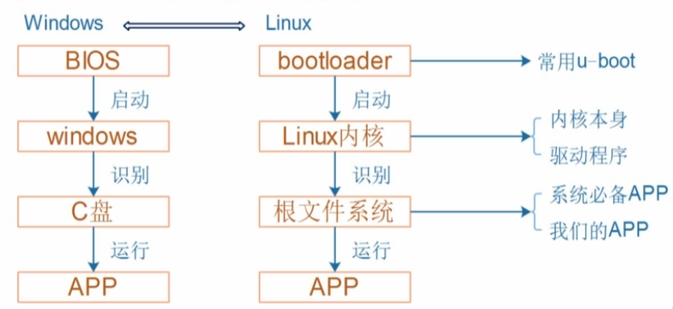
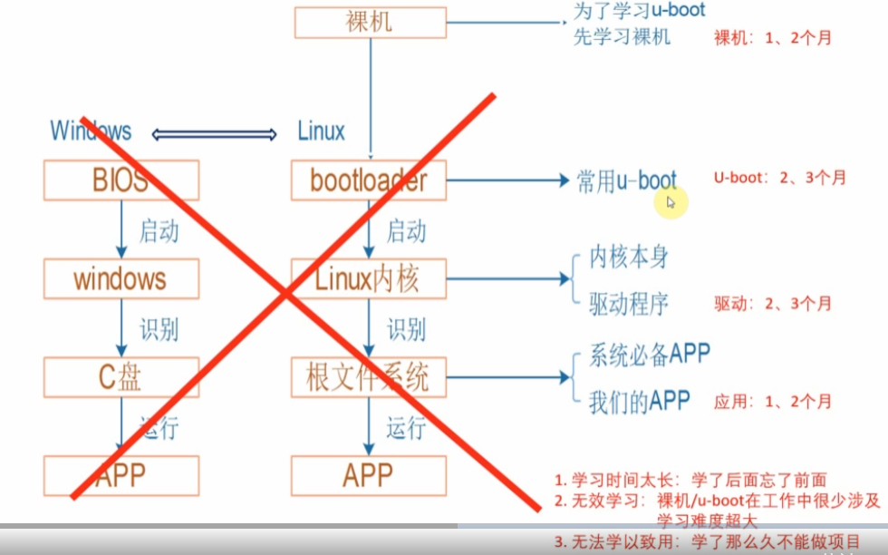

# 目錄

- [Note](#0)
- [1. 嵌入式Linux組成](#1)
- [2. 新的學習路線](#2)
- [3. 開發版體驗操作](#3)

<h1 id="0">Note</h1>

[Reference](https://www.100ask.net/detail/p_60fe8882e4b0cce271b680f7/6)

- STM32MP157

<h1 id="1">1. 嵌入式Linux組成</h1>

<h1 id="2">2. 新的學習路線</h1>

- 工作中很少改動U-boot，基本上會用就好

- 應用基礎 -> 驅動基礎 -> 項目開發

<h1 id="3">3. 開發版體驗操作</h1>
