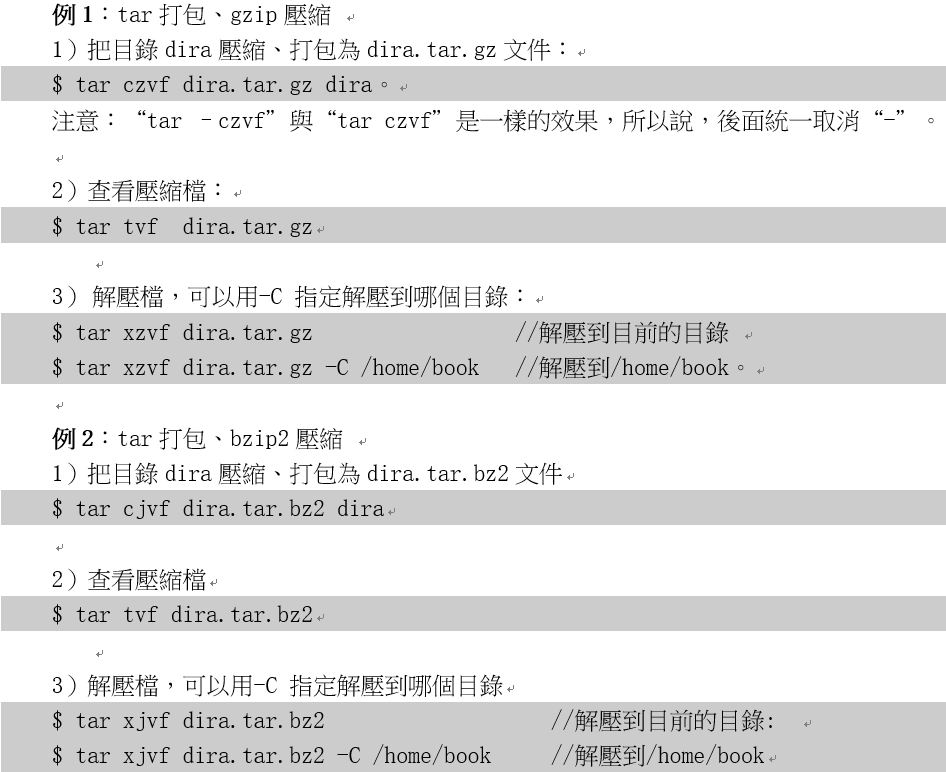

# 目錄

- [Note](#0)
- [01_安装VMware运行Ubuntu](#1)
- [02_Ubuntu和Windows的简单比较与使用](#2)
- [03_shell命令解析与PATH环境变量](#3)
- [04_目录与文件操作命令](#4)
- [05_权限与属性命令](#5)
- [06_find和grep命令](#6)
- [07_压缩和解压缩命令](#7)
- [08_网络命令](#8)
- [09_VI编辑器_新建_保存_浏览](#9)
- [10_VI编辑器_编辑](#10)
- [11_VI编辑器_复制粘贴查找替换](#11)

<h1 id="0">Note</h1>

[第2篇：安装虚拟机/Ubuntu基本操作](https://www.100ask.net/detail/p_63018801e4b050af23abff16/6?product_id=p_63018801e4b050af23abff16)

<h1 id="1">01_安装VMware运行Ubuntu</h1>

<h1 id="2">02_Ubuntu和Windows的简单比较与使用</h1>

- sd代表硬碟，a代表第一個，1代表第一個分區(partition)

    

    

- Linux各種文件介紹

    

    

<h1 id="3">03_shell命令解析与PATH环境变量</h1>

- Shell

    

    

- Linux命令格式

    

- 透過 `env` 可以查詢Linux目前的環境變量有什麼

- 一般執行應用程序時，會有三種情況可以執行
  - 直接輸入執行檔名稱: `hello`
  - 透過相對路徑來執行: `./hello`
  - 透過絕對路徑來執行: `/home/hello`

    

- 設置PATH的方式

    

    

    

<h1 id="4">04_目录与文件操作命令</h1>

<h1 id="5">05_权限与属性命令</h1>

- chmod

    

- chowm

    

    

<h1 id="6">06_find和grep命令</h1>

<h1 id="7">07_压缩和解压缩命令</h1>

- 比較沒在使用的 `gzip` & `bzip2`

    

- 常用的 `tar`

    

- 用 `tar` 壓縮(解壓)文件(目錄)

    

    

<h1 id="8">08_网络命令</h1>

<h1 id="9">09_VI编辑器_新建_保存_浏览</h1>

<h1 id="10">10_VI编辑器_编辑</h1>

<h1 id="11">11_VI编辑器_复制粘贴查找替换</h1>

