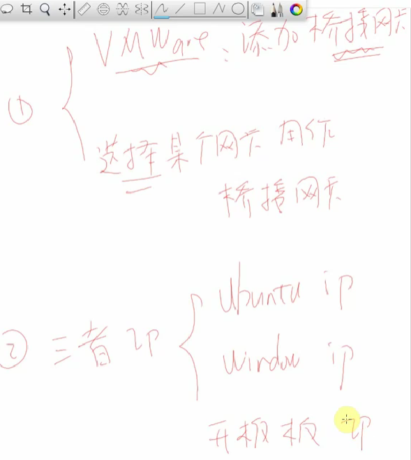

# 目錄

- [Note](#0)
- [01_嵌入式Linux开发环境介绍](#1)
- [02_配置VMware使用双网卡之NAT网卡](#2)
- [03_配置VMware使用双网之桥接网卡(USB网卡)_STM32MP157_Pro](#3)
- [04_配置VMware使用双网之桥接网卡(路由器)_STM32MP157_Pro](#4)
- [05_安装软件_远程登录_传文件](#5)
- [06_下载BSP_配置工具链_STM32MP157_Pro](#6)
- [07_传输源码并创建sourceinsight工程_STM32MP157_Pro](#7)


<h1 id="0">Note</h1>

[第3篇：环境搭建与开发板操作](https://www.100ask.net/detail/p_63018b58e4b0c942648a74d0/6)

<h1 id="1">01_嵌入式Linux开发环境介绍</h1>

- 單晶片

    

- 嵌入式Linux

    

    

    

<h1 id="2">02_配置VMware使用双网卡之NAT网卡</h1>


<h1 id="3">03_配置VMware使用双网之桥接网卡(USB网卡)_STM32MP157_Pro</h1>

- 設置VMware, Windows與開發版的網路配置

    

    

- 在VMware中新增`橋接網卡`，且以管理員身份運行虛擬網路編輯器(vmnet)，從中手動選擇要橋接的網卡為USB網卡

- 設置VMware與Windows USB IP

- 設置開發版IP
  - 進入console後，手動下指令配置IP

    ```Shell
    ifconfig eth0 192.168.5.9
    ```

    

  - 設置IP為固定IP，每次開機都不變

    ```Shell
    vi /etc/systemd/network/50-static.network

    [Match]
        Name=eth0
    [Network]
        Address=192.168.5.9/24
        Gateway=192.168.5.1
    ```

    

<h1 id="4">04_配置VMware使用双网之桥接网卡(路由器)_STM32MP157_Pro</h1>

- 配置橋接網卡，除了使用**USB網卡**之外，也可以使用**路由器**(透過有線或無線)

    

- 開發版透過路由器自動配置IP
  - 若有固定IP的文件，要刪除它

    ```Shell
    rm /etc/systemd/network/50-static.network
    ```

  - 若路由器沒有自動配置的話，可以執行下方指令

    ```Shell
    udhcpc -i eth0
    ```

    

<h1 id="5">05_安装软件_远程登录_传文件</h1>

- MobaXterm 遠程登錄串口程序

- Linux 安裝FTP

    https://codertw.com/%E7%A8%8B%E5%BC%8F%E8%AA%9E%E8%A8%80/722619/

<h1 id="6">06_下载BSP_配置工具链_STM32MP157_Pro</h1>

- BSP為開發版相關的配置檔案

- 配置編譯code的工具鏈

    

<h1 id="7">07_传输源码并创建sourceinsight工程_STM32MP157_Pro</h1>

- Source Insight 為閱讀與編輯源碼的軟體

<h1 id="8">08_启动方式与连接串口_STM32MP157_Pro</h1>

- 選擇開發版要啟動的模式

    

- 當開發版接USB至PC後，基本上Windows會自動安裝USB驅動程序，若沒有或是跳出警告讀不到USB驅動程序，則需要自行手動安裝

    

    

- 通常開發版串口的配置參數

    


