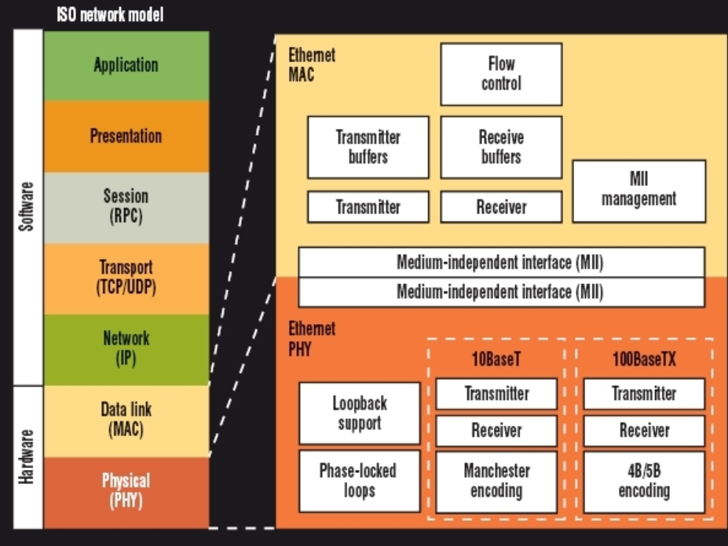
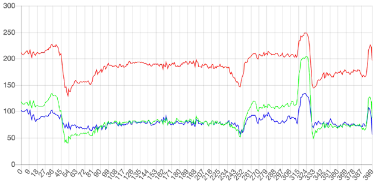
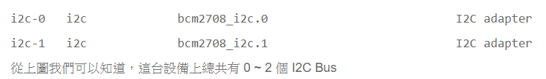
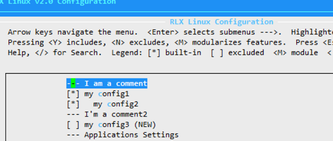

```Text
Author: Antony_Weng <weng851107@gmail.com>

This file is only used for the record of the learning process, only used by myself and the file has never been leaked out.
If there is related infringement or violation of related regulations, please contact me and the related files will be deleted immediately. Thank you!
```

# 目錄

- [Note](#0)
  - [學習資源](#0.1)
- [相關知識](#1)
  - [單片機 & 嵌入式系統](#1.1)
  - [嵌入式系統之作業系統](#1.2)
  - [簡介裸機與RTOS開發模式](#1.3)
    - [裸機開發模式](#1.3.1)
    - [RTOS的引入](#1.3.2)
  - [單片機常用調試的接口：JTAG、SWD、RDI接口與Jlink、Ulink、STlink仿真器](#1.4)
  - [AMBA(Advanced Microcontroller Bus Architecture) 總線協議](#1.5)
  - [分時多工（Time-Division Multiplexing，TDM）](#1.6)
  - [Ethernet（以太網）之 詳解 MAC、MII、PHY](#1.7)
  - [大端模式和小端模式](#1.8)
    - [什麼是大端和小端](#1.8.1)
    - [陣列在大端小端情況下的儲存](#1.8.2)
    - [為什麼會有大小端模式之分呢？](#1.8.3)
    - [如何判斷機器的位元組序](#1.8.4)
    - [如何進行轉換](#1.8.5)
    - [從軟體的角度理解端模式](#1.8.6)
    - [從系統的角度理解端模式](#1.8.7)
  - [x64 與 x86](#1.9)
  - [段錯誤(Segmentation Fault)](#1.10)
  - [操作硬體方式](#1.11)
  - [查詢Linux發行版本與核心版本](#1.12)
  - [Linux磁碟管理](#1.13)
    - [fdisk (狀態, 分割, 格式化, 掛載)](#1.13.1)
    - [使用操作(df, mount, du)](#1.13.2)
    - [linux掛載SD卡](#1.13.3)
    - [linux上把某資料夾掛在某partition](#1.13.4)
  - [Image Sensor](#1.14)
    - [Camera 工作原理介紹](#1.14.1)
    - [Camera 設備組成](#1.14.2)
    - [YCbCr 空間色彩模型](#1.14.3)
    - [攝像頭接口分類 (DVP、MIPI和usb)](#1.14.4)
  - [Audio](#1.15)
    - [關於pulseaudio和alsa](#1.15.1)
    - [linux下查看音频設備](#1.15.2)
    - [amixer修改與查看codec register](#1.15.3)
    - [聲卡接口Line in、Line out、Mic in和Speak out](#1.15.4)
    - [Output interfaces of MEMS microphones (Amic & Dmic)](#1.15.5)
      - [A-mic](#1.15.5.1)
      - [D-mic](#1.15.5.2)
    - [Noun Definition](#1.15.6)
  - [H264與H265](#1.16)
  - [查詢RAM容量 & RAMDisk](#1.17)
  - [MTD、MMC、eMMC](#1.18)
  - [linux framebuffer](#1.19)
    - [FrameBuffer在Linux中的實現和機制](#1.19.1)
    - [應用程序的操作](#1.19.2)
  - [簡單測試Uart通訊是否有通](#1.20)
  - [Framerate & Screen Hz](#1.21)
  - [TeraTerm - TimeStamp](#1.22)
  - [H264解析](#1.23)
    - [YUV、YCbCr與RGB](#1.23.1)
    - [視頻圖像分辨率(解析度)](#1.23.2)
    - [虛數的意義](#1.23.3)
    - [矩陣](#1.23.4)
    - [圖像與濾波](#1.23.5)
    - [傅里葉變換](#1.23.6)
  - [FFMPEG](#1.24)
- [Linux Kernel相關知識](#2)
  - [基本系統數據類型](#2.1)
  - [取得kernel log的方式](#2.2)
  - [User 跟 Kernel溝通有幾種](#2.3)
  - [Linux kernel coding style](#2.4)
  - [Linux內核開發工具](#2.5)
  - [rcS](#2.6)
  - [V4L2](#2.7)
  - [IAV](#2.8)
  - [TTY](#2.9)
    - [終端介紹](#2.9.1)
    - [TTY子系統](#2.9.2)
- [Linux-Device-Drivers-Development](#3)
  - [概念速記](#3.1)
    - [mknod用法以及主次設備號](#3.1.1)
    - [裝置讀寫操作 & copy_to_user & copy_from_user](#3.1.2)
    - [Linux 內核讀寫文件 kernel_read() & kernel_write()](#3.1.3)
      - [打開文件 - filp_open()](#3.1.3.1)
      - [讀寫文件 - kernel_read() & kernel_write()](#3.1.3.2)
      - [關閉文件 - filp_close()](#3.1.3.3)
      - [驅動讀寫範例](#3.1.3.4)
      - [Kernel_Read_txt_Test](#3.1.3.5)
  - [Char Device Driver](#3.2)
    - [Simple Example](#3.2.1)
  - [I2C](#3.3)
    - [i2c-tool](#3.3.1)
    - [i2c通過調用ioctl來讀寫設備](#3.3.2)
    - [Read & Write through i2c from the user-space](#3.3.3)
- [Linux下menuconfig與Kconfig基礎知識概要](#4)
  - [內核基礎](#4.1)
    - [內核和發行版的區別](#4.1.1)
    - [內核和驅動的關聯](#4.1.2)
    - [內核和應用程式、根檔案系統的關聯](#4.1.3)
    - [linux內核的模組化設計](#4.1.4)
    - [選擇合適版本的內核](#4.1.5)
  - [內核設定和編譯原理](#4.2)
    - [linux內核原始碼目錄結構](#4.2.1)
    - [內核設定和編譯體驗](#4.2.2)
    - [內核的設定原理](#4.2.3)
    - [menuconfig的使用](#4.2.4)
    - [menuconfig的工作原理](#4.2.5)
    - [Kconfig檔案詳解](#4.2.6)
    - [menuconfig的實驗學習思路](#4.2.7)
  - [常用的Kconfig語法](#4.3)
    - [簡介](#4.3.1)
    - [語法](#4.3.2)
- [Device-Tree](#5)
  - [(Blog)Linux DTS(Device Tree Source)設備樹詳解](#5.1)
    - [什麼是DTS?](#5.1.1)
    - [DTS基本知識](#5.1.2)
      - [1. DTS的加載過程](#5.1.2.1)
      - [2. DTS的描述信息](#5.1.2.2)
      - [3. DTS的組成結構](#5.1.2.3)
      - [4. dts引起BSP和driver的變更](#5.1.2.4)
      - [5. 常見的 DTS 函數](#5.1.2.5)
      - [6. DTC (device tree compiler)](#5.1.2.6)
    - [DTS中相關符號的含義](#5.1.3)
    - [DTS中(地址, 中斷)屬性解釋](#5.1.4)
- [快速入門](#6)
- [驅動大全](#7)


<h1 id="0">Note</h1>

[嵌入式Linux教程_韋東山手把手教你嵌入式Linux快速入門到精通](https://www.bilibili.com/video/BV1w4411B7a4?spm_id_from=333.999.0.0&vd_source=790c8244dbe879457094c8374beb04d3)

[韋東山老師, 快速入門 git repository](https://e.coding.net/weidongshan/01_all_series_quickstart.git)

[Linux 内核源码（kernel source）路径](https://blog.csdn.net/lanchunhui/article/details/72866103)

<h2 id="0.1">學習資源</h2>

[The Linux Kernel](https://linux-kernel-labs.github.io/refs/heads/master/index.html)

[[野火]i.MX Linux開發實戰指南](https://doc.embedfire.com/linux/imx6/base/zh/latest/index.html)

<h1 id="1">相關知識</h1>

<h2 id="1.1">單片機 & 嵌入式系統</h2>

[Reference](https://ppfocus.com/0/te3daf8fd.html)

### 單片機(Single Chip Microomputer), 微控制器(MicroController Unit)

- 在那個年代半導體工藝還在起步階段，集成能力很差，往往是CPU一個晶片，SRAM一個晶片，Flash一個晶片，需要中斷的話又得有個專門處理中斷的晶片，所以一個完整可用的計算機系統是很多個晶片(Chip)做在一個PCB板上構成的。

- 單片機就是在一個晶片(Chip)上集成了CPU、SRAM、Flash及其他需要模塊，在一個Chip上實現一個微型計算機系統，所以就叫Single Chip Microcomputer。

- 其實從這個角度來講，單片機這個詞現在已經沒意義了，因爲現在的半導體工藝早就很厲害了，現在你買到的所有都是「單片機」，根本不存在分離式的所謂「多片機」。

- 現代的單片機不但集成了CPU、SRAM、Flash等微型計算機不可少的部件，而且大多集成了很多內部外設，如Nand控制器、LCD控制器、串口通信、定時器、RTC等等，所以現在的單片機其實應該叫SoC(System on Chip)。

- 晶片中不帶MMU(memory management unit)從而不支持虛擬地址，只能跑裸機或RTOS(典型如ucos、華爲LiteOS、RT-Thread、freertos等)的system叫單片機(典型如STM32、NXP LPC系列、新的NXP imxRT1052系列等)

- 51單片機之所以出名並活到現在，是因爲Intel後來開放了51內核的版權，所以很多公司很多人可以毫無顧忌的使用它而不擔心付費或版權風險。

- ARM這些年風頭很強，在application級別的SoC中大勝Intel，現在手機行業的晶片都被ARM吃掉了，MIPS之類的更是被壓的生不如死。在單片機領域，ARM的Cortex-M系列(M0、M3、M4、M7)也是大獲全勝，很多半導體廠商都放棄了自己原來的架構轉而做ARM內核的單片機了。

- 單片機不是裸機就是RTOS

```
computer - 指的就是電腦，你可以理解爲就是電腦，譬如筆記本、台式機這些。當然很多年前的電腦很龐大很笨重，
           所以computer就是指的這種有機箱外殼，有鍵盤滑鼠，很龐大笨重，通用性強的電腦。

microcomputer - 指的就是單片機這類東西，它也是一個獨立的電腦系統，有CPU和內存和外設這些，能跑電腦程式。
                但是他相對於computer來說體積很小，而且不是通用的而是專用的，所以叫microcomputer。

microcontroller - 現在很多單片機廠商都把自己的單片機叫microcontroller(微控制器)，microcontroller的重點在於controller，
                  也就是說他們想強調這個chip中集成的system是一個controller，擅長控制。而不是一個DSP(擅長運算)。

system - 更傾向於整個系統，也就是說system=microcomputer+各種外設。簡單理解就是，當串口、LCD控制器等模塊進入了Chip內部時，
         整個microcomputer就成爲system，其實system才是更有意義，更適合現代單片機晶片的一個名字。
         所以現在我們都把晶片叫SoC，這個名字更有價值。
```

### 嵌入式系統(Embedded system)

- 嵌入指的是我們把這個system(硬體上表現爲一個Chip)嵌入到某個設備中去。譬如冰箱的板卡上的晶片就是一個嵌入到冰箱中的system，負責控制用戶按鍵、冰箱照明燈、製冷系統等。可以看出，嵌入式系統這個名字主要是從晶片在使用時的組織形態來命名的。所以從這個角度講，只要是被嵌入到設備中的晶片都可以被叫做嵌入式系統。

- 狹義上講，嵌入式是爲了區別於單片機。我們經常把晶片中不帶MMU(memory management unit)從而不支持虛擬地址，只能跑裸機或RTOS(典型如ucos、華爲LiteOS、RT-Thread、freertos等)的system叫單片機(典型如STM32、NXP LPC系列、新的NXP imxRT1052系列等)

- 晶片自帶MMU可以支持虛擬地址，能夠跑Linux、Vxworks、WinCE、Android這樣的作業系統的system叫嵌入式。

- 嵌入式領域目前最火的就是ARM+linux和ARM+android。晶片都是基於ARM的，低端的有ARM9、ARM11，高端的有Cortex-A7、Cortex-A8、Cortex-A9、Cortex-A53、Cortex-A57等。從單核心到雙核心、四核心、八核心都有。

- 嵌入式級別的ARM因爲有MMU所以可以很好的跑複雜OS，因此雖然晶片本身也可以裸機運行，但是基本沒有人用這類晶片來跑裸機或者RTOS的。都會上作業系統。
  - 產品不需要華麗美觀的人機界面就上linux(譬如路由器、網絡攝像機)
  - 需要人機界面但是界面簡單注重功能和穩定性，那就上linux+QT(譬如工控HMI、電動車充電樁、停車場顯示)
  - 產品很注重人機互動的用戶體驗，那就上Android(譬如智慧型手機、智能電視機、遊戲機等)

<h2 id="1.2">嵌入式系統之作業系統</h2>

嵌入式系統分為軟件和硬件兩部分：

- 硬件：主要包括核心處理器芯片、內存和存儲芯片等外圍芯片；
- 軟件：主要包括有嵌入式系統運行的引導程序如uboot、操作系統（如linux）、底層設備驅動及應用軟件等。

ARM（Advanced RISC Machines）架構：

- 指精簡指令集計算機設備
- 使用ARM 技術生產的各種型號芯片稱為ARM 處理器
- ARM公司使用RISC技術設計芯片，給其他公司授權芯片IP core
  - Cortex-A：針對高端領域的處理器，在移動互聯設備、數字電視等領域使用廣泛。
  - Cortex-R：在實時性方面有巨大優勢，應用領域例如智能汽車、消費電子等。
  - Cortex-M：主要優勢為低成本和低功耗，主要應用於微控制領域，如工業控制和家用電器等

作業系統有兩種：

- 用MMU： Windows, MacOS, Linux, Android  --> 非實時作業系統
- 不用MMU： FreeRTOS, VxWorks, ucOS       --> 實時作業系統

CPU有分帶MMU的和不帶MMU的：

- 帶MMU的有Cortex-A系列ARM9 ARM11系列
- 不帶MMU的有Cortex-M系列…

非實時作業系統的運行單位是進程, 實時作業系統的運行單位是線程，而要實現進程晶片必須要有MMU(存儲管理單元)

STM32是M系列，不可能運行Linux，但可以跑實時操作系統，如ucos、 FreeRTOS、 RT-Thread

<h2 id="1.3">簡介裸機與RTOS開發模式</h2>

<h3 id="1.3.1">裸機開發模式</h3>

- 裸機開發，指的就是沒有操作系統，就是單片機開發。

- 程序的運行，完全取决於代碼的邏輯設計，硬件設備的固定設定。

- 總結來說，裸機程序難以解决的問題就是，控制每個任務的運行時間。難以消除任務與任務之間的相互影響。

**輪詢方式**

```C
void main()
{
    
   while(1){
      eat();         //喂孩子吃飯函數
      message();     //回複同事消息
   }
}
```

**事件驅動方式**

- 事件是一個寬泛的概念，什麼是事件？可以是：按下了按鍵、串口接收到了數據、模塊產生了中斷、某個全局變量被設置了。

- 當某個事件發生時，才調用對應函數，這就叫事件驅動。

```C
void crying_isr(){
   //檢測孩子是否在哭的中斷函數
   eating();//哭了就執行喂孩子吃飯的函數
}
void message_isr(){
   //檢測同事是否發消息函數.
   message();//執行回消息函數
}
void main(){
    
   while(1){
      
   }
}
```

**改進的事件驅動方式**

- 當兩個中斷同時產生的時候，同一時間只能處理一個，如果一個中斷處理時間比較長，就會影響另一個中斷的處理。

- 通過設置標志比特來改進程序

   ```C
   void crying_isr(){

      is_crying=1;         //如果哭了就將標志比特置1
   }
   void message_isr(){

      is_message=1;        //將有消息標志比特置1。
   }
   void main(){

      while(1){
         if(is_crying==1)
            eating();
         if(is_message==1)
            message();
      }
   }
   ```

**常用時間驅動方式：定時器**

- 設置一個定時器，比如每1ms產生一次中斷

   ```
   對於函數A，可以設置它的執行周期，比如每1ms執行一次
   對於函數B，可以設置它的執行周期，比如每2ms執行一次
   對於函數C，可以設置它的執行周期，比如每3ms執行一次
   ```

    ```C
    typedef struct soft_timer{
        int remain;//錶示剩餘多少時間，就需要調用下面的函數
        int period;//錶示周期
        void (*function)(void);//處理函數
    }soft_timer,*p_soft_timer;

    static soft_timer timers[]={
        {1,1,A},
        {2,2,B},
        {3,3,C}
    };//符合題目要求

    void main()
    {  
        while(1){  }
    }
    void timer_isr()
    {
        int i;      
        //是每個timers數組成員的remain都减1.
        for(i=0;i<3;i++){   
            timers[i].remain--;
        }
        //當remain减到0，就錶示要調用對應結構體中的函數了
        for(i=0;i<3;i++){
            if(timers[i].remain==0){        
                timers[i].function();                     //調用函數
                timers[i].remain=timers[i].period;        //重置remain.
            }
        }
    }
    ```

**使用狀態機進行改進**

- 當任務處理函數執行時間都很長的時候，這裏我們可以使用狀態機的思想來解决這個問題，思路就是操作系統的時間片

    ```C
    void crying_isr(void)
    {
        static int state = 0;

        switch (state)
        {

            case 0: /* 開始 */
            {

                /* 盛飯 */
                state++;
                return;
            }

            case 1: /* 盛菜 */
            {

                /* 盛菜 */
                state++;
                return;
            }

            case 2: 
            {

                /* 拿勺子 */
                state++;
                return;
            } 
        }
    }

    void mesage_isr(void)
    {
        static int state = 0;

        switch (state)
        {

            case 0: /* 開始 */
            {

                /* 打開電腦 */
                state++;
                return;
            }

            case 1: 
            {

                /* 觀看信息 */
                state++;
                return;
            }

            case 2: 
            {

                /* 打字 */
                state++;
                return;
            }
        }
    }

    void main()
    { 
        while (1)
        {

            crying_isr();
            message_isr();
            //其實就是將這個執行時間很長的函數，拆分為短時間來處理。
        }
    }
    ```

<h3 id="1.3.2">RTOS的引入</h3>

- 假設要調用兩個函數AB，AB執行的時間都很長，使用裸機程序時可以把AB函數改造為"**狀態機**"，還可以使用**RTOS**。這兩種方法的核心都是"**分時複用**"：
  - 分時：函數A運行一小段時間，函數B再運行一小段時間
  - 複用：複用誰？就是CPU

- 寶媽一會兒喂孩子飯，一會兒回消息。當這個時間足够短的時候，從宏觀上來看就是兩個事件同時發生；從微觀上來看，這依舊是兩件事情。

- 關鍵在於RTOS讓多個任務輪流運行，不再需要我們手工在任務函數去使用狀態機拆分程序。

    ```C
    // RTOS程序 
    喂飯()
    {
        while (1)
        {
        
            喂一口飯();
        }
    }

    回信息()
    {
        while (1)
        {
        
            回一個信息();
        }
    }

    void main()
    {
        
        create_task(喂飯);//創建一個任務
        create_task(回信息);//創建一個任務
        start_scheduler();//執行任務列錶
        while (1)
        {

            sleep();
        }
    }
    ```

<h2 id="1.4">單片機常用調試的接口：JTAG、SWD、RDI接口與Jlink、Ulink、STlink仿真器</h2>

### JTAG協議

- JTAG（Joint Test Action Group，聯合測試行動小組）是一種國際標準測試協議（IEEE 1149.1兼容），主要用於晶片內部測試。現在多數的高級器件都支持JTAG協議，如ARM、DSP、FPGA器件等。

- 標準的JTAG接口是4線：TMS、 TCK、TDI、TDO，分別為模式選擇、時鐘、數據輸入和數據輸出線。
  - TMS：測試模式選擇，TMS用來設置JTAG接口處於某種特定的測試模式；
  - TCK：測試時鐘輸入；
  - TDI：測試數據輸入，數據通過TDI引腳輸入JTAG接口；
  - TDO：測試數據輸出，數據通過TDO引 腳從JTAG接口輸出；

- 目前市場上已經很少看到它的身影了。取而代之的是越來越多的USB接口。

### SWD接口

- 串行調試（Serial Wire Debug），應該可以算是一種和JTAG不同的調試模式，使用的調試協議也應該不一樣，所以最直接的體現在調試接口上，與JTAG的20個引腳相比，SWD只需要4個（或者5個）引腳，結構簡單，但是使用範圍沒有JTAG廣泛，主流調試器上也是後來才加的SWD調試模式。

    

- 板子的體積有限的時候推薦使用SWD模式，它需要的引腳少

### RDI接口

- 遠程調試接口（Remote Debug Interface），是ARM公司提出的標準調試接口，主要用於ARM晶片的仿真，由於各個IDE廠商使用的調試接口各自獨立，硬體無法進行跨平台的調試。

### JLink仿真器

- 基於JTAG的仿真器

- 給一個JTAG協議轉換盒，即一個小型USB到JTAG的轉換盒，其連接到計算機用的是USB接口，而到目標板內部用的還是jtag協議。它完成了一個從軟體到硬體轉換的工作。

### ULink仿真器

- ULINK是ARM/KEIL公司推出的仿真器

- ULINK/ULINK2可以配合Keil軟體實現仿真功能，並且僅可以在Keil軟體上使用，增加了串行調試（SWD）支持，返回時鐘支持和實時代理等功能。

### ST-Link仿真器

- 專門針對意法半導體STM8和STM32系列晶片的仿真器。

- 採用5V的USB2.0全速接口進行供電與數據傳輸，可以方便的對內部固件進行升級，同時支持以 **JTAG** 或 **SWD** 模式連接至 STM32 系列微控制器，或者以 **SWIM** 模式連接至 STM8 系列微控制器

<h2 id="1.5">AMBA(Advanced Microcontroller Bus Architecture) 總線協議</h2>

- AMBA (Advanced Microcontroller Bus Architecture) 高級處理器總線架構
  - AHB (Advanced High-performance Bus) 高級高性能總線
  - ASB (Advanced System Bus) 高級系統總線
  - APB (Advanced Peripheral Bus) 高級外圍總線
  - AXI (Advanced eXtensible Interface) 高級可拓展接口

   

<h2 id="1.6">分時多工（Time-Division Multiplexing，TDM）</h2>

- 分時多工（Time-Division Multiplexing，TDM）是一種數位或者類比（較罕見）的多工技術。

- 使用這種技術，兩個以上的訊號或資料流可以同時在一條通訊線路上傳輸，其表現為同一通訊頻道的子頻道。但在物理上來看，訊號還是輪流占用物理通道的。時間域被分成周期迴圈的一些小段，每段時間長度是固定的，每個時段用來傳輸一個子頻道。

<h2 id="1.7">Ethernet（以太網）之 詳解 MAC、MII、PHY</h2>

[mac地址真的是全球是唯一的嗎](https://blog.csdn.net/renlonggg/article/details/78435986)

[為什麼 MAC 地址不需要全球唯一](https://draveness.me/whys-the-design-non-unique-mac-address/)

- 修改mac地址

    ```Shell
    ifconfig ethX down

    ifconfig ethX hw ether aa:bb:cc:dd:ee:ff

    ifconfig ethX up
    ```

[Reference](https://www.twblogs.net/a/5b7a98562b7177392c9666f8)

- 從硬件的角度看，以太網接口電路主要由**MAC（Media Access Control）控制器**和**物理層接口PHY（Physical Layer，PHY）兩大部分構成**。PHY整合了大量模擬硬件，而MAC是典型的全數字器件。

    

  - CPU集成MAC與PHY。目前來說並不多見

    

  - CPU集成MAC，PHY採用獨立芯片。比較常見

    

  - CPU不集成MAC與PHY，MAC與PHY採用集成芯片。比較常見

    

  - MAC及PHY工作在OSI七層模型的數據鏈路層和物理層。具體如下

    

- **MAC（Media Access Control）**即**媒體訪問控制子層協議**。該部分有兩個概念：MAC可以是一個硬件控制器 及 MAC通信以協議。該協議位於OSI七層協議中數據鏈路層的下半部分，主要負責控制與連接物理層的物理介質。

    

- **MII（Media Independent Interface）**即**媒體獨立接口**，MII接口是MAC與PHY連接的標準接口。
  - GMII(Gigabit MII)
  - RMII(Reduced Media Independant Interface)

    

- **PHY（Physical Layer，PHY）**是**IEEE802.3中定義的一個標準模塊**，STA（station management entity，管理實體，一般爲MAC或CPU）通過SMI（Serial Manage Interface）對PHY的行爲、狀態進行管理和控制，而具體管理和控制動作是通過讀寫PHY內部的寄存器實現的。

    

<h2 id="1.8">大端模式和小端模式</h2>

<h3 id="1.8.1">什麼是大端和小端</h3>

數字0x12 34 56 78在記憶體中的表示形式為：

1. Little-Endian就是低位位元組排放在記憶體的低地址端，高位位元組排放在記憶體的高地址端。

   低地址 ——————> 高地址
   0x78  |  0x56  |  0x34  |  0x12

2. Big-Endian就是高位位元組排放在記憶體的低地址端，低位位元組排放在記憶體的高地址端。

   低地址 —————–> 高地址
   0x12  |  0x34  |  0x56  |  0x78

3. 例子：

   

<h3 id="1.8.2">陣列在大端小端情況下的儲存</h3>

以unsigned int value = 0x12345678為例，分別看看在兩種位元組序下其儲存情況，我們可以用unsigned char buf[4]來表示value：

1. Big-Endian: 低地址存放高位，如下：

   高地址
   —————
   buf[3] (0x78) — 低位
   buf[2] (0x56)
   buf[1] (0x34)
   buf[0] (0x12) — 高位
   —————
   低地址

2. Little-Endian: 低地址存放低位，如下：

   高地址
   —————
   buf[3] (0x12) — 高位
   buf[2] (0x34)
   buf[1] (0x56)
   buf[0] (0x78) — 低位
   ————–
   低地址

<h3 id="1.8.3">為什麼會有大小端模式之分呢？</h3>

- 這是因為在計算機系統中，我們是以`位元組`為單位的，每個地址單元都對應著一個位元組，一個位元組為8bit。

  - 位(bit)：計算機中的最小數據單位，計算機存儲的都是二進制0和1來表示的。
  - 字節(Byte)：字節是存儲空間的基本計量單位，也是內存的基本單位，也是編址單位。例如，一個計算機的內存是4GB，就是該計算機的內存中共有4×1024×1024×1024個字節，意味著它有4G的內存尋址空間。

- 但是在C語言中除了8bit的char之外，還有16bit的short型，32bit的long型（要看具體的編譯器），另外，對於位數大於8位的處理器，例如16位或者32位的處理器，由於暫存器寬度大於一個位元組，那麼必然存在著一個如果將`多個位元組安排的問題`。因此就導致了大端儲存模式和小端儲存模式。

  - 4個二進制位(bit)(不夠表示一個字節) = 1個十六進制(hex)
  - 8個二進制位(bit) = 一個字節(Byte) = 2個十六進制(hex)
  - 32個二進制位(bit) = 四個字節(Byte) = 8個十六進制(hex)

- 我們常用的X86結構是小端模式，而KEIL C51則為大端模式。很多的ARM，DSP都為小端模式。有些ARM處理器還可以由硬體來選擇是大端模式還是小端模式。

<h3 id="1.8.4">如何判斷機器的位元組序</h3>

1. 自行撰寫程式來判斷：

   ```C
   BOOL IsBigEndian()  
   {  
      int a = 0x1234;  
      //通過將int強制型別轉換成char單位元組，通過判斷起始儲存位置。即等於 取b等於a的低地址部分  
      char b =  *(char *)&a;  
      if( b == 0x12)  
      {  
         return TRUE;  
      }  
      return FALSE;  
   }
   ```

2. 聯合體union的存放順序是所有成員都從低地址開始存放，利用該特性可以輕鬆地獲得了CPU對記憶體採用Little-endian還是Big-endian模式讀寫：

   ```C
   BOOL IsBigEndian()  
   {  
      union NUM  
      {  
         int a;  
         char b;  
      }num;  
      num.a = 0x1234;  
      if( num.b == 0x12 )  
      {  
         return TRUE;  
      }  
      return FALSE;  
   }
   ```

<h3 id="1.8.5">如何進行轉換</h3>

1. 對於字資料（16位）：

   ```C
   #define BigtoLittle16(A)   (( ((uint16)(A) & 0xff00) >> 8) | (( (uint16)(A) & 0x00ff) << 8))  
   ```

2. 對於雙字資料（32位）：

   ```C
   #define BigtoLittle32(A)   ((( (uint32)(A) & 0xff000000) >> 24) | \
                              (( (uint32)(A) & 0x00ff0000) >> 8)  | \  
                              (( (uint32)(A) & 0x0000ff00) << 8)  | 
                              (( (uint32)(A) & 0x000000ff) << 24))  
   ```

<h3 id="1.8.6">從軟體的角度理解端模式</h3>

從軟體的角度上，不同端模式的處理器進行資料傳遞時必須要考慮端模式的不同。

1. 在Socket介面程式設計中，以下幾個函式用於大小端位元組序的轉換：

   ```C
   #define ntohs(n)     //16位資料型別網路位元組順序到主機位元組順序的轉換  
   #define htons(n)     //16位資料型別主機位元組順序到網路位元組順序的轉換  
   #define ntohl(n)     //32位資料型別網路位元組順序到主機位元組順序的轉換  
   #define htonl(n)     //32位資料型別主機位元組順序到網路位元組順序的轉換  
   ```

   - 其中網際網路使用的網路位元組順序採用大端模式進行編址，而主機位元組順序根據處理器的不同而不同

   - 大端模式處理器的位元組序到網路位元組序不需要轉換，此時`ntohs(n)=n`，`ntohl = n`；

   - 小端模式處理器的位元組序到網路位元組必須要進行轉換，此時`ntohs(n) = __swab16(n)`，`ntohl = __swab32(n)`。

   ```C
   #define ___swab16(x)  
   {  
      __u16 __x = (x);  
            
      ((__u16)((((__u16)(__x) & (__u16)0x00ffU) << 8) | (((__u16)(__x) & (__u16)0xff00U) >> 8) ));  
   }  
   ```

   ```C
   #define ___swab32(x)  
   {  
      __u32 __x = (x);  
      
      ((__u32)((((__u32)(__x) & (__u32)0x000000ffUL) << 24) |  
               (((__u32)(__x) & (__u32)0x0000ff00UL) << 8) |  
               (((__u32)(__x) & (__u32)0x00ff0000UL) >> 8) |  
               (((__u32)(__x) & (__u32)0xff000000UL) >> 24) ));  
   }  
   ```

- 真正的理解大小端模式的區別，必須要從系統的角度，從指令集，暫存器和資料匯流排上深入理解，大小端模式的區別。

<h3 id="1.8.7">從系統的角度理解端模式</h3>

1. 兩個關鍵字：

   - MSB:MoST Significant Bit —— 最高有效位
   - LSB:Least Significant Bit —— 最低有效位

2. 處理器在硬體上由於端模式問題在設計中有所不同。從系統的角度上看，端模式問題對軟體和硬體的設計帶來了不同的影響，當一個處理器系統中大小端模式同時存在時，必須要對這些不同端模式的訪問進行特殊的處理。

3. 本文提到的小端外設是指這種外設中的暫存器以小端方式進行儲存，如PCI裝置的配置空間，NOR FLASH中的暫存器等等。對於有些裝置，如DDR顆粒，沒有以小端方式儲存的暫存器，因此從邏輯上講並不需要對端模式進行轉換。在設計中，只需要將雙方資料匯流排進行一一對應的互連，而不需要進行資料匯流排的轉換。

4. 大端模式的32位處理器，如基於E500核心的MPC8541，將其暫存器的最高位msb（most significant bit）定義為0，最低位lsb（lease significant bit）定義為31；
   小端模式的32位處理器，將其暫存器的最高位定義為31，低位地址定義為0。與此向對應，採用大端模式的32位處理器資料匯流排的最高位為0，最高位為31；採用小端模式的32位處理器的資料匯流排的最高位為31，最低位為0。 

5. 根據所採用的資料匯流排是32位，16位和8位，大小端處理器外部匯流排的位序有所不同
   - 大端模式下32位資料匯流排的msb是第0位，MSB是資料匯流排的第0\~7的欄位；而lsb是第31位，LSB是第24\~31欄位。
   - 小端模式下32位匯流排的msb是第31位，MSB是資料匯流排的第31\~24位，lsb是第0位，LSB是7\~0欄位。
   - 大端模式下16位資料匯流排的msb是第0位，MSB是資料匯流排的第0\~7的欄位；而lsb是第15位，LSB是第8\~15欄位。
   - 小端模式下16位匯流排的msb是第15位，MSB是資料匯流排的第15\~7位，lsb是第0位，LSB是7\~0欄位。
   - 大端模式下8位資料匯流排的msb是第0位，MSB是資料匯流排的第0\~7的欄位；而lsb是第7位，LSB是第0\~7欄位。
   - 小端模式下8位匯流排的msb是第7位，MSB是資料匯流排的第7\~0位，lsb是第0位，LSB是7\~0欄位。

<h2 id="1.9">x64 與 x86</h2>

### [64 位元的 CPU](https://wanker742126.neocities.org/new/win64asm/w64asm_ch00.html)

- x64 架構的 CPU 是屬於 64 位元，包含了 16 個 64 位元的通用暫存器 ( general-purpose registers )，這 16 個暫存器名稱分別是 RAX、RBX、RCX、RDX、RBP、RSP、RSI、RDI、R8、R9、R10、R11、R12、R13、R14、R15。很明顯的，後面的八個暫存器，R8、R9、R10、R11、R12、R13、R14、R15，是新增的；
- 而前面的八個暫存器，RAX、RBX、RCX、RDX、RBP、RSP、RSI、RDI，是把原有的 32 位元加以擴充而成，RAX、RBX…等的「R」是暫存器 ( register ) 的意思。

   

### [32位元、64位元 - CPU 、作業系統、應用軟體](http://wangwangtc.blogspot.com/2017/07/3264-cpu.html)


### Linux 是64位元還是32位元

[如何檢查 Linux 作業系統是 32 位元還是 64 位元？](https://blog.gtwang.org/linux/how-to-check-linux-arch-32bits-64bits/)

1. `uname -m`

   - 32 位元的系統，就會顯示 i686 或 i386
   - 64 位元的系統就會顯示 x86_64

2. `uname -a`

   > Linux steteo1 3.11.0-19-generic #33-Ubuntu SMP Tue Mar 11 18:48:34 UTC 2014 x86_64 x86_64 x86_64 GNU/Linux

<h2 id="1.10">段錯誤(Segmentation Fault)</h2>

段錯誤是指訪問的記憶體超出了系統給這個程式所設定的記憶體空間

- 訪問了不存在的記憶體地址
- 訪問了系統保護的記憶體地址
- 訪問了只讀的記憶體地址等等

<h2 id="1.11">操作硬體方式</h2>

1. 讀/寫（read/write）/dev/xxx
2. 映射（map）操作
3. I/O控制(ioctl)

<h2 id="1.12">查詢Linux發行版本與核心版本</h2>

https://caloskao.org/linux-unix-get-distribution-and-kernel-version/

1. `uname -mrs` (Linux / BSD)：

   在 Linux 與 BSD 的發行版都可使用，在 BSD 系統底下可直接查看發行版本與核心版本，而在 Linux 系統底下僅能查看核心版本，發行版本需透過其它指令得知。

   ```Text
   Linux 4.15.0-23-generic x86_64
   FreeBSD 11.1-RELEASE amd64
   ```

2. `cat /etc/os-release` (Linux)：

   僅能在 Linux 發行版下使用，帶出的發行版資訊很完整，但不含核心版本資訊。

   ```Text
   NAME="Ubuntu"
   VERSION="18.04 LTS (Bionic Beaver)"
   ID=ubuntu
   ID_LIKE=debian
   PRETTY_NAME="Ubuntu 18.04 LTS"
   VERSION_ID="18.04"
   HOME_URL="https://www.ubuntu.com/"
   SUPPORT_URL="https://help.ubuntu.com/"
   BUG_REPORT_URL="https://bugs.launchpad.net/ubuntu/"
   PRIVACY_POLICY_URL="https://www.ubuntu.com/legal/terms-and-policies/privacy-policy"
   VERSION_CODENAME=bionic
   UBUNTU_CODENAME=bionic
   ```

<h2 id="1.13">Linux磁碟管理</h2>


- 由於 MBR 分割表不支援超過 2TB 的磁碟，如果您的硬碟大小超過 2TB，就無法使用 `fdisk` 分割硬碟，請改用 `parted` 以 GPT 的方式分割

    [Linux 的 Parted 指令教學](https://blog.gtwang.org/linux/parted-command-to-create-resize-rescue-linux-disk-partitions/)

<h3 id="1.13.1">fdisk (狀態, 分割, 格式化, 掛載)</h3>

#### 顯示出目前硬碟的掛載狀況

- 剛剛裝上去的新硬碟在這裡是看不到的，因為我們都還沒開始分割

    ```Shell
    $ df -h

    Filesystem            Size  Used Avail Use% Mounted on
    /dev/sda1             440G   46G  372G  12% /
    none                  5.9G  260K  5.9G   1% /dev
    none                  5.9G     0  5.9G   0% /dev/shm
    none                  5.9G   64K  5.9G   1% /var/run
    none                  5.9G     0  5.9G   0% /var/lock
    none                  5.9G     0  5.9G   0% /lib/init/rw
    /dev/sdb1             459G  198M  435G   1% /data1
    ```

- 接著在看看 /dev 下面所有的硬碟情況

    ```Shell
    $ ls /dev/[sh]d*

    /dev/sda  /dev/sda1  /dev/sda2  /dev/sda5  /dev/sdb  /dev/sdb1  /dev/sdc
    ```

- 這樣一比較就知道新的硬碟是 /dev/sdc 這顆，再用 fdisk 確認一下
    --> 看起來沒問題，沒有任何磁碟分割表的資訊

    ```Shell
    $ fdisk -l /dev/sdc

    Disk /dev/sdc: 2000.4 GB, 2000398934016 bytes
    255 heads, 63 sectors/track, 243201 cylinders
    Units = cylinders of 16065 * 512 = 8225280 bytes
    Sector size (logical/physical): 512 bytes / 512 bytes
    I/O size (minimum/optimal): 512 bytes / 512 bytes
    Disk identifier: 0x40bab849
    Device Boot      Start         End      Blocks   Id  System
    ```

#### 硬碟分割

- 接著開始分割，首先進入 fdisk，fdisk 是一個互動模式的分割工具，輸入 m 再按 Enter 可以顯示各種指令的說明：

    ```Shell
    $ fdisk /dev/sdc

    WARNING: DOS-compatible mode is deprecated. It’s strongly recommended to
            switch off the mode (command ‘c’) and change display units to
            sectors (command ‘u’).
    Command (m for help): m
    Command action
    a   toggle a bootable flag
    b   edit bsd disklabel
    c   toggle the dos compatibility flag
    d   delete a partition
    l   list known partition types
    m   print this menu
    n   add a new partition
    o   create a new empty DOS partition table
    p   print the partition table
    q   quit without saving changes
    s   create a new empty Sun disklabel
    t   change a partition’s system id
    u   change display/entry units
    v   verify the partition table
    w   write table to disk and exit
    x   extra functionality (experts only)
    Command (m for help): 
    ```

- 新增一個分割區，步驟如下

    ```Text
    1. 新增分割區，輸入 n 按 Enter。
    2. 選擇要建立 extended 還是 primary partition，因為我的硬碟全部只要一個分割區，所以我選 primary，輸入 p 按 Enter。
    3. 選擇 Partition number，primary 分割區最多可以有四個，隨便選都可以，不過建議選 1，免得以後看起來很奇怪，
    輸入 1 按 Enter。
    4. 輸入開始的 cylinder，用預設值就可以了，直接按 Enter。
    5. 輸入結束的 cylinder，若是要用最大的容量，就直接按 Enter，若是要指定分割區的大小，就用 +size{K,M,G} 的形式指定，
    例如指定為 100G 的大小就輸入 +100G 再按 Enter。
    6. 最後將分割表寫入硬碟，輸入 w 再按 Enter。
    ```

    ```Shell
    Command (m for help): n
    Command action
    e   extended
    p   primary partition (1-4)
    p
    Partition number (1-4): 1
    First cylinder (1-243201, default 1):
    Using default value 1
    Last cylinder, +cylinders or +size{K,M,G} (1-243201, default 243201):
    Using default value 243201
    Command (m for help): w
    The partition table has been altered!
    Calling ioctl() to re-read partition table.
    Syncing disks.
    ```

- 離開 fdisk 就輸入 q 按 Enter 就可以

- 再用 fdisk 確認分割區 --> 最下面一行就是新的分割資訊，看起來沒什麼問題

    ```Shell
    $ fdisk -l /dev/sdc

    Disk /dev/sdc: 2000.4 GB, 2000398934016 bytes
    255 heads, 63 sectors/track, 243201 cylinders
    Units = cylinders of 16065 * 512 = 8225280 bytes
    Sector size (logical/physical): 512 bytes / 512 bytes
    I/O size (minimum/optimal): 512 bytes / 512 bytes
    Disk identifier: 0x40bab849
    Device Boot      Start         End      Blocks   Id  System
    /dev/sdc1               1      243201  1953512001   83  Linux
    ```

#### 格式化（Format）硬碟

- Linux 下格式化就用 `mkfs` 這個指令就可以，`-t` 選項可以指定檔案系統

    ```Shell
    $ mkfs -t ext4 /dev/sdc1

    mke2fs 1.41.11 (14-Mar-2010)
    Filesystem label=
    OS type: Linux
    Block size=4096 (log=2)
    Fragment size=4096 (log=2)
    Stride=0 blocks, Stripe width=0 blocks
    122101760 inodes, 488378000 blocks
    24418900 blocks (5.00%) reserved for the super user
    First data block=0
    Maximum filesystem blocks=4294967296
    14905 block groups
    32768 blocks per group, 32768 fragments per group
    8192 inodes per group
    Superblock backups stored on blocks:
    32768, 98304, 163840, 229376, 294912, 819200, 884736, 1605632, 2654208,
    4096000, 7962624, 11239424, 20480000, 23887872, 71663616, 78675968,
    102400000, 214990848
    Writing inode tables: done                          
    Creating journal (32768 blocks): done
    Writing superblocks and filesystem accounting information: done
    This filesystem will be automatically checked every 32 mounts or
    180 days, whichever comes first.  Use tune2fs -c or -i to override.
    ```

#### 掛載（mount）硬碟

- 在 Linux 下面的磁碟掛載設定都是寫在 `/etc/fstab` 中

- 傳統的寫法是使用 /dev/sda1 這樣的方式指定磁碟，但是若是當磁碟更換安裝的順序時，原本的 /dev/sda1 有可能就會變成 /dev/sdb1，有時候光是分清楚哪顆是哪顆就夠頭痛的了

- 現在新的方式都是使用 **UUID** 來指定磁碟的，所以 /etc/fstab 看起來會像這樣：

    ```Shell
    proc            /proc           proc    nodev,noexec,nosuid 0       0
    UUID=684530e1-df5c-48d7-b3e4-eb0d47054877 /               ext4    errors=remount-ro 0       1
    UUID=35ddf35e-87de-4ab0-88d1-2a654d36b19a none            swap    sw              0       0
    UUID=9746f325-1c82-4c04-b447-b5c596eea6c1 /data1          ext4    defaults        0       2
    ```

- 每一顆硬碟都可不同的 UUID，使用 UUID 來指定磁碟就不會因為安裝的順序不同而產生變化，這樣做的好處是若是當磁碟常常要拔來拔去時，系統管理者不用再去更改 fstab 的設定，系統會自動尋找對應的 UUID 來掛載

- 利用 `blkid` 這個指令，它可以列出所有磁碟的 UUID

    ```Shell
    $ sudo blkid

    /dev/sda1: UUID=”684530e1-df5c-48d7-b3e4-eb0d47054877″ TYPE=”ext4″
    /dev/sda5: UUID=”35ddf35e-87de-4ab0-88d1-2a654d36b19a” TYPE=”swap”
    /dev/sdb1: UUID=”9746f325-1c82-4c04-b447-b5c596eea6c1″ TYPE=”ext4″
    /dev/sdc1: UUID=”146d3bb3-e351-45c8-ac84-42534ce51d29″ TYPE=”ext4″ 
    ```

- 接著把新的硬碟資訊寫進 /etc/fstab 中

    ```Shell
    UUID=146d3bb3-e351-45c8-ac84-42534ce51d29 /data2          ext4    defaults        0       
    ```

- 下次重開機時，系統就會把新的硬碟掛載至 /data2，若要馬上測試掛載硬碟設定是否正確，可以使用 `mount`，再用 `df -h` 確認一下有沒有問題

    ```Shell
    $ mount /data2
    ```

<h3 id="1.13.2">使用操作(df, mount, du)</h3>

**partition information**

```Shell
$ cat /proc/partitions
major     minor  blocks  name

   1        0      65536 ram0
 179        0    7634944 mmcblk0
 179        1        128 mmcblk0p1
 179        2       1024 mmcblk0p2
 179        3        896 mmcblk0p3
 179        4       1024 mmcblk0p4
 179        5      16384 mmcblk0p5
 179        6      16384 mmcblk0p6
 179        7     491520 mmcblk0p7
 179        8      81920 mmcblk0p8
 179        9     819200 mmcblk0p9
 179       10    6206464 mmcblk0p10
```

- kernel log會顯示partition的資訊

    ```Shell
    [    1.135323] mmc0: new HS200 MMC card at address 0001
    [    1.141686] mmcblk0: mmc0:0001 H8G4a2 7.28 GiB
    [    1.147191] mmcblk0boot0: mmc0:0001 H8G4a2 partition 1 4.00 MiB
    [    1.154067] mmcblk0boot1: mmc0:0001 H8G4a2 partition 2 4.00 MiB
    [    1.160106] mmcblk0rpmb: mmc0:0001 H8G4a2 partition 3 4.00 MiB, chardev (250:0)
    [    1.170664]  (bst): 0x0000000000000000, 0x0000000000020000
    [    1.176150]  (bld): 0x0000000000020000, 0x0000000000100000
    [    1.181630]  (ptb): 0x0000000000120000, 0x00000000000e0000
    [    1.187111]  (atf): 0x0000000000200000, 0x0000000000100000
    [    1.192591]  (pba): 0x0000000000300000, 0x0000000001000000
    [    1.198074]  (pri): 0x0000000001300000, 0x0000000001000000
    [    1.203555]  (lnx): 0x0000000002300000, 0x000000001e000000
    [    1.209036]  (add): 0x0000000020300000, 0x0000000005000000
    [    1.214522]  (adc): 0x0000000025300000, 0x0000000032000000
    [    1.220000]  (raw): 0x0000000057300000, 0x000000017ad00000
    [    1.225474]  mmcblk0: p1(bst) p2(bld) p3(ptb) p4(atf) p5(pba) p6(pri) p7(lnx) p8(add) p9(adc) p10(raw)
    ```

**df**

```Shell
$ df
Filesystem                Size      Used Available Use% Mounted on
/dev/root               448.7M    419.9M      1.9M 100% /
devtmpfs                 88.5M         0     88.5M   0% /dev
tmpfs                   496.7M         0    496.7M   0% /dev/shm
tmpfs                   198.7M    288.0K    198.4M   0% /run
tmpfs                   496.7M     12.0K    496.7M   0% /tmp
tmpfs                   496.7M      4.0M    492.7M   1% /var/log
tmpfs                   496.7M         0    496.7M   0% /var/tmp
/dev/mmcblk0p7          787.4M    104.0K    747.3M   0% /sdcard
/dev/mmcblk0p9          787.4M    104.0K    747.3M   0% /sdcard
/dev/mmcblk0p9          787.4M    104.0K    747.3M   0% /adc
tmpfs                    99.3M         0     99.3M   0% /run/user/0
```

**mount**

- 得知目前掛載資訊

    ```Shell
    $ mount
    /dev/root on / type ext4 (rw,relatime,errors=remount-ro)
    devtmpfs on /dev type devtmpfs (rw,relatime,size=90652k,nr_inodes=22663,mode=755)
    sysfs on /sys type sysfs (rw,nosuid,nodev,noexec,relatime)
    proc on /proc type proc (rw,nosuid,nodev,noexec,relatime)
    tmpfs on /dev/shm type tmpfs (rw,nosuid,nodev)
    devpts on /dev/pts type devpts (rw,nosuid,noexec,relatime,gid=5,mode=620,ptmxmode=000)
    tmpfs on /run type tmpfs (rw,nosuid,nodev,size=203444k,nr_inodes=819200,mode=755)
    cgroup2 on /sys/fs/cgroup type cgroup2 (rw,nosuid,nodev,noexec,relatime,nsdelegate)
    mqueue on /dev/mqueue type mqueue (rw,nosuid,nodev,noexec,relatime)
    hugetlbfs on /dev/hugepages type hugetlbfs (rw,relatime,pagesize=2M)
    debugfs on /sys/kernel/debug type debugfs (rw,nosuid,nodev,noexec,relatime)
    tmpfs on /tmp type tmpfs (rw,nosuid,nodev,size=508608k,nr_inodes=409600)
    tmpfs on /var/log type tmpfs (rw,relatime)
    tmpfs on /var/tmp type tmpfs (rw,relatime)
    configfs on /sys/kernel/config type configfs (rw,nosuid,nodev,noexec,relatime)
    /dev/mmcblk0p7 on /sdcard type ext4 (rw,noatime,nodiratime,errors=remount-ro)
    /dev/mmcblk0p9 on /sdcard type ext2 (rw,sync,noatime,nodiratime,errors=remount-ro)
    /dev/mmcblk0p9 on /adc type ext2 (rw,sync,relatime,errors=remount-ro)
    tmpfs on /run/user/0 type tmpfs (rw,nosuid,nodev,relatime,size=101720k,nr_inodes=25430,mode=700)
    ```

**du**

- 檢視檔案與目錄的使用空間狀態

    ```Shell
    $ du --help
    BusyBox v1.31.1 (2020-08-04 08:23:01 CST) multi-call binary.

    Usage: du [-aHLdclsxhmk] [FILE]...

    Summarize disk space used for each FILE and/or directory

        -a      Show file sizes too
        -L      Follow all symlinks
        -H      Follow symlinks on command line
        -d N    Limit output to directories (and files with -a) of depth < N
        -c      Show grand total
        -l      Count sizes many times if hard linked
        -s      Display only a total for each argument
        -x      Skip directories on different filesystems
        -h      Sizes in human readable format (e.g., 1K 243M 2G)
        -m      Sizes in megabytes
        -k      Sizes in kilobytes (default)
    ```

  - `du ` 在當前目錄、子目錄各自檔案大小與總量大小
  - `du -a` 列出所有資料夾與檔案大小
  - `du -ah` 增加易讀性並列出所有資料夾與檔案大小
  - `du -sh` 增加易讀性並僅看當前目錄檔案總量大小

<h3 id="1.13.3">linux掛載SD卡</h3>

https://www.twblogs.net/a/5c22690ebd9eee16b4a77d0e

（1）通過 `fdisk -l` 命令確認板子上的linux系統是否識別SD卡

```bash
$ fdisk -l

Disk /dev/mtdblock0: 1 MB, 1179648 bytes
255 heads, 63 sectors/track, 0 cylinders
Units = cylinders of 16065 * 512 = 8225280 bytes

Disk /dev/mtdblock0 doesn't contain a valid partition table
Disk /dev/mmcblk0: 1967 MB, 1967128576 bytes
40 heads, 56 sectors/track, 1715 cylinders
Units = cylinders of 2240 * 512 = 1146880 bytes

Device Boot Start End Blocks Id System
/dev/mmcblk0p1 * 192 1716 1707008 6 FAT16
```

（2）確保/mnt存在

- `cat /proc/partitions` 看看到底有沒有mmc相關的分區

    ```bash
    $ cat /proc/partitions

    major minor #blocks name

    31 0 1152 mtdblock0
    31 1 768 mtdblock1
    31 2 768 mtdblock2
    31 3 7040 mtdblock3
    31 4 121344 mtdblock4
    179 0 1921024 mmcblk0
    179 1 1707008 mmcblk0p1
    ```

- 沒有這兩個分區(mmcblk0, mmcblk0p1)，就說明SD卡驅動沒有移植成功

- 內核選項裡支持

    ```bash
    device deivers-》mmc/sd card support ->Samsung s3c sd/mmc card interface support
    ```

（3）掛載SD卡

```bash
mount /dev/mmcblk0p1 /mnt/mmc
mount -t vfat /dev/mmcblk0p1 /mnt/mmc
```

（4）卸載SD卡

- 當前目錄不能是/mnt，否則會出現 "umount can't umount /mnt device or resource busy" 的錯誤提示信息。

```bash
umount /mnt/mmc
```

（5）Linux 如何上電掛載SD卡

編輯/etc/init.d/目錄下的rcS文件：vi /etc/init.d/rcS
在裏面加入一行：mount -t vfat /dev/mmcblk0p1 /mmc
這樣上電後開發板就會自動掛載SD卡到主目錄的mmc文件夾

<h3 id="1.13.4">linux上把某資料夾掛在某partition</h3>

```Shell
#!/bin/sh

ST_DEV=/dev/mmcblk0p10
MOUNT_POINT=/share

init()
{
    ls $ST_DEV
    if [ $? == 0 ]; then
        FS=`blkid /dev/mmcblk0p10 | awk '{print $4}' | sed 's/'TYPE='/''/g' | sed 's/"//g'`
        echo "FS=$FS"

        if [ "$FS" != "ext2" ]; then
            echo "$ST_DEV is not ext2, format it"
            mkfs.ext2 $ST_DEV
        else
            echo "$ST_DEV is ext2, mount it on /mnt"
        fi

        mount -t ext2 $ST_DEV $MOUNT_POINT

    else
        echo "cec_mount_storage --> There is no " $ST_DEV
    fi
}
```

<h2 id="1.14">Image Sensor</h2>

<h3 id="1.14.1">Camera 工作原理介紹</h3>

- **外部光線**穿過 **lens** 後， 經過 **color filter 濾波**後照射到 **Sensor 面**上， Sensor 將從 lens 上傳導過來的**光線轉換爲電信號**，再通過內部的 **AD 轉換**爲數字信號。如果 Sensor 沒有集 成 DSP，則通過 DVP 的方式傳輸到 baseband，此時的數據格式是 RAW DATA。如果集成了 **DSP**， RAW DATA 數據經過 AWB、 則 color matrix、 lens shading、 gamma、 sharpness、 AE 和 de-noise 處理，後輸出 **YUV 或者 RGB** 格式的數據。最後會由 CPU 送到 **framebuffer** 中進行顯示，這樣我們就看到 camera 拍攝到的景象 了。

<h3 id="1.14.2">Camera 設備組成</h3>

**1.  lens（鏡頭）**：

- 分有塑膠透鏡（Plastic)和玻璃透鏡(Glass)，通常鏡頭結構有：1P,2P,1G1P,1G3P,2G2P,4G 等。

**2. sensor（圖像傳感器）**：

- **CCD（Charge Coupled Device）即電荷耦合器件的縮寫** 和 **CMOS（Complementary Metal-Oxide Semiconductor）互補金屬氧化物半導體**
  - CCD傳感器，電荷信號先傳送，後放大，再A/D，成像質量靈敏度高、分辨率好、噪聲小；處理速度慢；造價高，工藝複雜。
  - CMOS傳感器，電荷信號先放大，後A/D，再傳送；成像質量靈敏度低、噪聲明顯；處理速度快；造價低，工藝簡單。

- Sensor 將從 lens 上傳導過來的**光線轉換爲電信號**， 再通過內部的 **AD 轉換爲數字信號**。

- 由於 Sensor 的每個 pixel 只能感光 R 光或者 B 光或者 G 光， 因此每個像素此時存貯的是單色的， 我們稱之爲 **RAW DATA** 數據。 要想將每個像素的 RAW DATA 數據還原成三基色，就需要 **ISP** 來處理。 

**3. ISP（圖像信號處理）**： 

- 主要完成數字圖像的處理工作，把 sensor 採集到的**原始數據轉換爲顯示支持的格式**。 

**4. CAMIF（camera 控制器）**： 

- 芯片上的 camera 接口電路，對設備進行控制，接收 sensor 採集的數據交給 CPU，並送入 LCD 進行顯示。

<h3 id="1.14.3">YCbCr 空間色彩模型</h3>

- **YUV**：中“Y”表示明亮度（Luminance或Luma），也就是灰階值；而“U”和“V” 表示的則是色度（Chrominance或Chroma），作用是描述影像色彩及飽和度，用於指定像素的顏色。

- **RGB**(R,G,B 都是 8bit unsigned) 模型，每個像素點需要 8x3=24 bits。三原色所構成的向量空間無法對影像強度(亮度)做處理，例如柔和化、銳利化等等。同時，由 RGB 構成的影像檔案也在傳輸時佔用較大頻寬、儲存時佔用較多的記憶體。

- **YCbCr** 是 YUV 經過縮放和偏移的翻版。其中 Y 與 YUV 中的 Y 含義一致，Cb，Cr 同樣都指色度(色彩濃度)，色度通常表示為兩個色差分量，Cb是藍色色度，Cr 是紅色色度

- 在YUV 家族中，YCbCr 是在計算機系統中應用最多的成員，其應用領域很廣泛，**JPEG**、**MPEG**均採用此格式。一般人們所講的YUV大多是指YCbCr。

**- YCbCr 與 RGB 轉換：**

$ Y = 0.299 R + 0.578 G + 0.114 B (由此式亦可得知人眼對綠色最敏感喔!) $
$ Cb = 0.564 (B - Y) $
$ Cr = 0.713 (R - Y) $

$ R = Y + 1.402 Cr $
$ G = Y – 0.344 Cb – 0.714 Cr $
$ B = Y + 1.772 Cb $

**- Cb & Cr 色彩濃度圖：**


**- YCbCr 取樣方式4:4:4 vs 4:2:2 vs 4:2:0**

- 開頭第一個數字代表的是區域的寬度〈通常為4〉，後兩碼數字都和色度有關，分別代表了水平與垂直的數值

    

- RGB每pixel使用的24 bits數(8 bits (R) + 8 bits (G) + 8 bits (B))

**1. 4:4:4** 

- 格式沒有經過壓縮抽樣，用於呈現完整亮度與色度

- YCbCr 4:4:4 每pixel使用：8 bits (Y) + 8 bits (Cb) + 8 bits (Cr) = 24 bits

- 存儲形式：
  - 四個像素為: [Y0 U0 V0] [Y1 U1 V1] [Y2 U2 V2] [Y3 U3 V3]
  - 存放的碼流為: Y0 U0 V0 Y1 U1 V1 Y2 U2 V2 Y3 U3 V3
  - 映射出像素點為: [Y0 U0 V0] [Y1 U1 V1] [Y2 U2 V2] [Y3 U3 V3]

**2. 4:2:2** 

- 格式僅採用 4:4:4 的一半色度

- YCbCr 4:2:2 每pixel使用：8 bits (Y) + 4 bits (Cb) + 4 bits (Cr) = 16 bits

- 存儲形式：
  - 四個像素為: [Y0 U0 V0] [Y1 U1 V1] [Y2 U2 V2] [Y3 U3 V3]
  - 存放的碼流為: Y0 U0 Y1 V1 Y2 U2 Y3 V3
  - 映射出像素點為: [Y0 U0 V1] [Y1 U0 V1] [Y2 U2 V3] [Y3 U2 V3]

**3. 4:2:0** 

- 代表存留的色度僅為 4:4:4 格式的四分之一

- 4:2:0並不意味著只有Y,Cb而沒有Cr分量。它指得是對每列掃描線來說，只有一種色度分量以2:1的抽樣率存儲。相鄰的掃描列存儲不同的色度分量，也就是說，如果一行是4:2:0的話，下一行就是4:0:2，再下一行是4:2:0...以此類推。對每個色度分量來說，水平方向和豎直方向的抽樣率都是2:1，所以可以說色度的抽樣率是4:1

- YCbCr 4:2:0/4:0:2 每pixel使用：8 bits (Y) + 2 bits (Cb) + 2 bits (Cr) = 12 bits
    
- 存儲形式：
  - 八個像素為:
    [Y0 U0 V0] [Y1 U1 V1] [Y2 U2 V2] [Y3 U3 V3]
    [Y5 U5 V5] [Y6 U6 V6] [Y7 U7 V7] [Y8 U8 V8]
  - 存放的碼流為:
    Y0 U0 Y1 Y2 U2 Y3
    Y5 V5 Y6 Y7 V7 Y8
  - 映射出像素點為: 
    [Y0 U0 V5] [Y1 U0 V5] [Y2 U2 V7] [Y3 U2 V7]
    [Y5 U0 V5] [Y6 U0 V5] [Y7 U2 V7] [Y8 U2 V7]

<h3 id="1.14.4">攝像頭接口分類 (DVP、MIPI和usb)</h3>

- DVP(Digital Video Port)

- MIPI(MIPI-CSI2)
  - 在攝像頭領域，MIPI一般指CSI2協議，該協議一般是建立在D-PHY物理層上的
  - 但是現在也會採用C-PHY,在MIPI中有一個專門的CCI（類I2C）通信接口，這接口只能用於攝像頭的通信，CSI-2主要由應用層，協議層，物理層組成，只需要一條CLKP/CLKN,多條DATAP/DATAN線,最大支持4lane,4lane的意思是有四組DATAP/DATAN線,2lane的意思是2組DATAP/DATAN線,最大支持4通道數據傳輸,單線傳輸速度高達2Gb/s
  - mipi總線是差分信號，串行傳輸，在傳輸過程中數據比較穩定，抗干擾比較強，並且節約的傳輸線

- USB
  - USB接口是差分信號
  - UVC全稱 USB video class或者USB device class,是Microsoft 與另外幾家設備廠聯合推出的USB視頻捕獲設備定義的協議標準，目前已經成為USB org標準之一。如今的主流操作系統(win XP，linux 2.4.6 and Macos 10.5以及相關的最新版本都支持)都已經提供UVC設備驅動，因此符合UVC規格的硬件設備在不需要安裝任何驅動程序下就可以在主機中正常使用

<h2 id="1.15">Audio</h2>

<h3 id="1.15.1">關於pulseaudio和alsa</h3>

[Linux音频软件：Alsa、OSS和Pulseaudio、ESD](https://blog.csdn.net/qq_34638161/article/details/106568315)

- alsa是一套框架，應用層直接可以調用alsa lib發聲音，但是混音上應該有些不足，操作可能比較複雜。

- pulseaudio，在alsa lib上又封裝了一層，增加了很多pulseaudio自己定義的插件，這樣大大擴展alsa lib的功能，同時混音方面也加強了。
  - 應用之前是`app-->alsa lib --->alsa driver--->發聲音`。
  - 現在是`app--->pulseaudio--->alsa lib--->alsa driver--->發聲音`。
  - 或是為了兼容之前的app(只支持alsa lib的程序)
`app--->alsa lib---> alsa lib的pulseaudio插件--->pulseaudio--->alsa lib--->alsa driver--->發聲音`。

- pulseaudio提供了自己增加插件的功能，你把源碼看明白後，自己可以寫插件，把聲音截斷處理後，再向下流，比較方便，個人感覺比在alsa lib中把聲音截斷要簡單一些。

- pulseaudio分client和server兩部分，server直接打開alsa

   `app--->alsa lib---> alsa lib的pulseaudio插件--->pulseaudio client--->pulseaudio server--->alsa lib--->alsa driver--->發聲音`

<h3 id="1.15.2">linux下查看音频設備</h3>

```bash
cat /proc/asound/cards
```

<h3 id="1.15.3">amixer修改與查看codec register</h3>

```Shell
# amixer -h
Usage: amixer <options> [command]

Available options:
  -h,--help       this help
  -c,--card N     select the card
  -D,--device N   select the device, default 'default'
  -d,--debug      debug mode
  -n,--nocheck    do not perform range checking
  -v,--version    print version of this program
  -q,--quiet      be quiet
  -i,--inactive   show also inactive controls
  -a,--abstract L select abstraction level (none or basic)
  -s,--stdin      Read and execute commands from stdin sequentially
  -R,--raw-volume Use the raw value (default)
  -M,--mapped-volume Use the mapped volume

Available commands:
  scontrols       show all mixer simple controls
  scontents       show contents of all mixer simple controls (default command)
  sset sID P      set contents for one mixer simple control
  sget sID        get contents for one mixer simple control
  controls        show all controls for given card
  contents        show contents of all controls for given card
  cset cID P      set control contents for one control
  cget cID        get control contents for one control
```

<h3 id="1.15.4">聲卡接口Line in、Line out、Mic in和Speak out</h3>


- Line In/Out傳遞的是只經過A/D或D/A芯片轉換後的信號，還原度較高; Speaker Out輸出的是經放大芯片(例如TDA1517P)放大過的信號，聲音會產生一定失真(但很小，人耳幾乎不能察覺)。

- 如果音箱上有放大電路，則連接到Line Out，如果沒有放大電路則連接到Speaker Out

#### Line In

- 線性輸入，用來輸入未經放大芯片放大的模擬音頻信號。

#### Mic In

- 麥克風輸入，用來連接麥克風。

#### Line Out

- 線性輸出，用來輸出未經放大芯片放大的模擬音頻信號

#### Speaket Out（现在通常和Line Out合为一个插孔）

- 用來輸出經放大芯片放大的模擬音頻信號。

#### 3.5mm 音頻接口類型說明

- 有的時候我們將非原配的耳機插入手機或電腦，發現音質非常差或只有某部分音頻，大多是因為耳機與設備的音頻接口類型不同導致的。

- 常見的耳機接口都是 **3.5mm** 音頻接口，分為 **3-pole 和 4-pole** 兩類，而 **4-pole 中又分 Standard 和 OMTP 兩種型號**。這是美國人的叫法，國內一般把 OMTP 稱為國標，而把稱 Standard 為 CTIA 或美標。一般來說，Standard 型號的耳機插頭上的塑料環是白色的，而 OMTP 型號插頭上的塑料環是黑色。

- **3-pole** 的接口，顧名思義在插頭上只有 3 個觸點，從尖端到根部依次是**左聲道、右聲道、電源地**，所以這種接頭的耳機**不支持麥克風**

- **4-pole** 的接口支持麥克風，但從上圖可以清晰地看出，Standard 型號和 OMTP 型號的插頭，其麥克風觸點與電源地觸點的位置正好相反。這就是為什麼當我們將 OMTP 插頭耳機插入 Standard 接口時，聲音聽起來不正常，但按下耳機上的通話按鍵時卻又好了

- 電路中加入了**耳機類型檢測芯片**，如 **ts3a227e**，可以自動檢測耳機接口類型

<h3 id="1.15.5">Output interfaces of MEMS microphones (Amic & Dmic)</h3>

- **MEMS(Micro Electro Mechanical Systems) Mic**，會有Analog & Digital 兩大類別的輸出介面，其中**類比(Analog)** 又分為**單端 (Single ended)** & **差動 (Differential)**兩種輸出。**數位(Digital)**部分則有 **PDM/ I2S/ TDM** 三種數位介面，其中以PDM介面為最大宗。

<h4 id="1.15.5.1">A-mic</h3>

##### 1. Analog Single ended (類比單端)

- 這是佔比較多的輸出格式，且單價會比差動 (Differential) 低一些，感度通常是在 -38dBV~-40dBV區間，所有Audio codec mic Input都支援此信號，是最普及的應用架構，但此類Mic的地迴路在PCB設計時需要特別注意，以避免產生Noise

    

##### 2. Analog differential ended (類比差動)

- 相對佔比較少的輸出格式，且單價會比單端 (Single ended)高一些，由於是差動輸出，因此感度也會提升6dBV，感度通常是在 -32dBV附近，且也可提高**AOP (Acoustic overload Point)**，大部分的Audio codec mic Input 也都支援此信號，是常見降低雜訊的應用架構，可參考Fig.2 ，由於差動架構可有效消除**共模雜訊(Common mode)**。

    

    

<h4 id="1.15.5.2">D-mic</h3>

##### 1. PDM (Pulse Density Modulation 脈波密度調變)

- 是MEMS Mic 數位介面的主流規格，其中**Data BUS 是L/R ch 共用**，因使它只需要**4條線**，即可完成 Stereo L/R 聲音通道傳輸，有利於手攜式裝置的PCB Layout 設計，由於是**數位式，因此需要Clock 時脈信號**，通常是1MHZ~4MHZ，因此音頻頻寬可滿足 20HZ~20KHZ應用，廣泛應用於 3C/汽車/IoT 領域

    

##### 2. I2S (Integrated Interchip Sound 積體電路內置音頻匯流排)

- 是飛利浦公司為數字音頻設備之間的音頻數據傳輸而制定的一種匯流排標準，該匯流排專門用於**音頻設備之間的數據傳輸**，廣泛套用於各種多媒體系統。由於**低階MCU大部分都不支援PDM介面，只支援基本的I2S 介面**，因此Mic廠商仍為這小眾市場推出I2S MEMS Mic，以滿足無Audio codec的產品應用市場

    

##### 3. TDM (Time division Multiplexing 分時多工)

- 是將傳輸媒介的使用時間分割成若干個**固定的時槽（Time Slot）**，每一時槽佔用一小段時間（例如20ms），而這一小段時間就是一個**虛擬通道**。

- 通訊時，互連的雙方會被設定在某一時槽上傳送資料，在某段時間內它擁有傳輸媒介的使用權；而就較長時間來看，**整個傳輸媒體就等同有多條連線「同時」傳送資料**。

- Smart Speaker 需要做**Far Field Voice Pickup (專指一段距離以外之聲音的輸入)**，因此 2pcs Beamforming Mic (指向性麥克風?) 已無法滿足特性，因而發展出 **6~8pcs Mic Array** 的架構，由於每台產品的Mic數量大幅增加，意謂著需要更多通道的數位介面 Ex. PDM / I2S，因此，為了降低Mic 數位介面數量與成本，採用TDM 分時多工將信號輪流傳送，以達到低成本多通道的傳輸方式。

    

<h3 id="1.15.6">Noun Definition</h3>

- FR: 我設定標準音源(ref. SPK)在一定音壓下，輸出一個掃頻音檔(能量相同)，待測MIC收到的表現。會因為電路或是收音路徑進而影響到在不同頻率下的表現

- 比例如果是指SNR的話，就是我們MIC本身在silence就會有一些雜訊，可能來自電路可能來自環境的底噪播MIC判斷為訊號而存成檔案，跟收到的訊號音量的一個比值


<h2 id="1.16">H264與H265</h2>

- H.264和H.265都屬於視頻的編碼格式; 而我們平時所說的MP4、AVI、FLV、MOV這些，都屬於封裝格式。

   

  - 封裝的編碼格式各式各樣。封裝格式把視頻、音頻、媒體信息、字幕等統統灌進去，但並不能決定我們的視頻質量。而編碼格式是一種壓縮方式

  - H264是一種幀間編碼，只記錄每一幀之間的變化，後期解碼的時候只要在上一幀基礎上算出變化就可以了，不僅大幅度縮小體積，還能保持比較好的畫質。

   Note: 如果你坐拍一段視頻，那麼基本只有你的嘴在動，背景基本沒有變化，這時候要是每一幀畫面都全面記錄一次，那麼沒拍多久你硬碟就滿了。比方說不壓縮的1080P60幀，一秒鐘就能占用300+MB，非常恐怖。

   

- 常見的封裝-編碼格式表:

  - 【MP4】H265、H264、MPEG4...
  - 【AVI】MPEG2、AC1、H264、DIVX、XVID...
  - 【MOV】MPEG2、H264、XVID...
  - 【MKV】所有視頻編碼格式

- 不同的編碼器雖然有微小的差別，但決定畫質的，往往還是碼率，碼率越大，就意味著保存的信息量越多。

- H264被MPEG組織稱為AVC（Advanced Video Codec/先進視頻編碼），用來替代原有的MPEG4P2（DIVX、XVID）

- H265比H264有著更強的壓縮效率，被稱為HEVC（High Efficiency Video Coding/高效視頻編碼）

- H265使用了「塊的四叉樹劃分結構」，從16x16像素的固定宏塊，升級成了8x8 ~ 64x64的自適應劃分，並加入了各種自適應預測、變換等編碼技術，算法也經過優化，同碼率下理論占用空間節省了50%足足一半，動態畫面表現會更加清晰。

   

- 為何H264還沒被取代 : 

  - 現存老設備都不能向上支持硬解，軟解更吃不消
  - H265的商業授權費太貴，市場都沒成熟呢

<h2 id="1.17">查詢RAM容量 & RAMDisk</h2>

查看內存(RAM) : `free`

```Shell
$ free
            total        used        free      shared  buff/cache   available
Mem:        2045804     1160312      800892        6412       84600      830236
Swap:             0           0           0

$ free -h
            total        used        free      shared  buff/cache   available
Mem:           2.0G        1.1G        782M        6.3M         82M        810M
Swap:            0B          0B          0B
```

RAMDisk

- [Linux如何將記憶體(RAM)作為硬碟使用？RAMDisk詳細介紹](https://magiclen.org/linux-ramdisk/)

<h2 id="1.18">MTD、MMC、eMMC</h2>

- [[接口]mmc/eMMC/SD-card](https://www.codeprj.com/zh/blog/6124e51.html)

  - MMC(multiMedia card)是一種通信協議，支持兩種模式SPI和MMC
  - eMMC是一種支持MMC協議的芯片
  - eMMC和SD卡都是將閃存控制器和NAND Flash封裝在一起，只是接口不同，eMMC一般是BGA封裝，焊接在PCB上SD卡單獨封裝，使用SDIO接口通訊, SD卡是在MMC基礎上發展起來，且兼容MMC，所以在Linux系統下，SD卡設備名稱是mmcblk (mmcblk0p1代表第一個分區, 問題mmcblk0和mmcblk1是分別代表sd卡和eMMC設備還是二者誰先掛上誰就是mmcblk0?)

- [嵌入式文件系統簡介(一) —— Linux MTD設備文件系統](https://www.twblogs.net/a/5bcf6d0e2b71776a052c617f)

  - 文件系統是一套實現了數據的存儲、分級組織、訪問和獲取等操作的抽象數據類型（Abstract data type）
  - 在嵌入式系統中，與文件系統相關的存儲設備包括硬盤、Flash存儲器等。Flash存儲器又分爲Flash芯片設備（Raw Flash device，也叫MTD設備）和帶Flash控制器的設備（Flash Translation Layer device， FTL設備），兩者的關鍵區別是是否帶有Flash控制器，這也直接決定了文件系統分爲不同的兩類。
  - 其中MTD設備包括NOR Flash、NAND Flash等
  - FTL設備包括SD、eMMC、SSD、USB大容量存儲設備等

   

   

1. 查看硬碟資訊 : `fdisk -l`

   ```Shell
   # fdisk -l
   Disk /dev/ram0: 64 MiB, 67108864 bytes, 131072 sectors
   Units: sectors of 1 * 512 = 512 bytes
   Sector size (logical/physical): 512 bytes / 4096 bytes
   I/O size (minimum/optimal): 4096 bytes / 4096 bytes

   Disk /dev/mmcblk0: 7.1 GiB, 7616856064 bytes, 14876672 sectors
   Units: sectors of 1 * 512 = 512 bytes
   Sector size (logical/physical): 512 bytes / 512 bytes
   I/O size (minimum/optimal): 512 bytes / 512 bytes
   ```

2. 查看硬碟partitions

   ```Shell
   # cat /proc/partitions
   major minor  #blocks  name

      1        0      65536 ram0
   179        0    7438336 mmcblk0
   179        1        128 mmcblk0p1
   179        2       1024 mmcblk0p2
   179        3        896 mmcblk0p3
   179        4       1024 mmcblk0p4
   179        5      16384 mmcblk0p5
   179        6      16384 mmcblk0p6
   179        7     819200 mmcblk0p7
   179        8      81920 mmcblk0p8
   179        9    1024000 mmcblk0p9
   179       10    1283072 mmcblk0p10

   # cat /proc/mtd
   dev:    size   erasesize  name

   ```

3. 查看掛載情況 `df -h -T`

   ```Shell
   # df -h -T
   Filesystem           Type            Size      Used Available Use% Mounted on
   /dev/root            ext4          500.7M    411.3M     60.0M  87% /
   devtmpfs             devtmpfs      334.8M         0    334.8M   0% /dev
   tmpfs                tmpfs         998.9M         0    998.9M   0% /dev/shm
   tmpfs                tmpfs         399.6M    252.0K    399.3M   0% /run
   tmpfs                tmpfs         998.9M      4.0K    998.9M   0% /tmp
   tmpfs                tmpfs         998.9M      6.0M    992.9M   1% /var/log
   tmpfs                tmpfs         998.9M         0    998.9M   0% /var/tmp
   /dev/mmcblk0p9       ext2          984.3M      1.2M    933.0M   0% /adc
   tmpfs                tmpfs         199.8M         0    199.8M   0% /run/user/0
   ```

<h2 id="1.19">linux framebuffer</h2>

https://www.twblogs.net/a/5e504b42bd9eee21167d31fd

https://blog.51cto.com/u_12956289/2916962

- Linux抽象出 FrameBuffer 這個設備，將顯卡硬件結構抽象掉，供用戶態進程通過 Framebuffer 的讀寫直接對顯存進行操作進而實現直接寫屏。

- framebuffer是LCD對應的一種HAL（硬件抽象層），用戶不必關心物理顯存的位置、換頁機制等等具體細節。這些都是由 Framebuffer設備驅動來完成的

- 幀緩衝設備為標準字符設備，主設備號為29，次設備號則從0到31。分別對應/dev/fb0 - /dev/fb31

- framebuffer的設備文件一般是 `/dev/fb0`、`/dev/fb1` 等等。

    ```Shell
    ## 清空屏幕
    $ dd if=/dev/zero of=/dev/fb
    ## 如果顯示模式是 1024x768-8 位色，清空屏幕
    $ dd if=/dev/zero of=/dev/fb0 bs=1024 count=768

    ## 將fb中的內容保存下來
    $ dd if=/dev/fb of=fbfile
    ## 重新寫回屏
    $ dd if=fbfile of=/dev/fb
    ```

- 一般通過將 FrameBuffer 設備映射到進程地址空間的方式使用，比如下面的程序就打開 /dev/fb0 設備，並通過 **mmap** 系統調用進行地址映射，隨後用 memset 將屏幕清空

    ```C
    /*顯示模式是 1024x768-8 位色模式，線性內存模式*/

    int fb;

    unsigned char* fb_mem;

    fb = open ("/dev/fb0", O_RDWR);

    fb_mem = mmap (NULL, 1024*768, PROT_READ|PROT_WRITE,MAP_SHARED,fb,0);

    memset (fb_mem, 0, 1024*768); //這個命令應該只有在root可以執行
    ```

<h3 id="1.19.1">FrameBuffer在Linux中的實現和機制</h3>

- Framebuffer對應的源文件在linux/drivers/video/目錄下
  - 總的抽象設備文件爲 `fbcon.c`

- FrameBuffer設備驅動基於如下兩個文件：
  - `linux/include/linux/fb.h`
    - 主要的結構都是在這個中文件定義的
    - `struct fb_var_screeninfo`： 描述了顯示卡的特性
    - `struct fb_fix_screeninfo`： 在顯卡被設定模式後創建，它描述顯示卡的屬性，並且系統運行時不能被修改；比如FrameBuffer內存的起始地址。它依賴於被設定的模式，當一個模式被設定後，內存信息由顯示卡硬件給出，內存的位置等信息就不可以修改。
    - `struct fb_cmap`： 描述設備無關的顏色映射信息。可以通過FBIOGETCMAP 和 FBIOPUTCMAP 對應的ioctl操作設定或獲取顏色映射信息.
    - `struct fb_info`： 定義當前顯卡的當前狀態；fb_info結構僅在內核中可見，在這個結構中有一個fb_ops指針， 指向驅動設備工作所需的函數集。
    - `struct fb_ops`： 用戶應用可以使用ioctl()系統調用來操作設備，這個結構就是用以支持ioctl()的這些操作的。

  - `linux/drivers/video/fbmem.c`
    - fbmem.c 處於Framebuffer設備驅動技術的中心位置，它爲上層應用程序提供系統調用也爲下一層的特定硬件驅動提供接口。爲所有支持FrameBuffer的設備驅動提供了通用的接口
    - 全局變量 `struct fb_info *registered_fb[FB_MAX];` & `int num_registered_fb;` 記錄了所有fb_info 結構的實例
      - fb_info 結構描述顯卡的當前狀態，所有設備對應的fb_info 結構都保存在這個數組中，當一個FrameBuffer設備驅動向系統註冊自己時，其對應的fb_info 結構就會添加到這個結構中，同時num_registered_fb 爲自動加1
    - `register_framebuffer(struct fb_info *fb_info);` & `unregister_framebuffer(struct fb_info *fb_info);` 提供給下層FrameBuffer設備驅動的接口，設備驅動通過這兩函數向系統註冊或註銷自己

- 用戶應用程序通過`ioctl()`系統調用操作硬件，`fb_ops` 中的函數就用於支持這些操作 (fb_ops結構與file_operations 結構不同， `fb_ops` 是底層操作的抽象,而 `file_operations` 是提供給上層系統調用的接口，可以直接調用)

- `ioctl()` 命令與 `fb_ops` 中函數的關係，定義了fb_XXX_XXX 方法，用戶程序就可以使用FBIOXXXX宏的ioctl()操作來操作硬件

   ```C
   FBIOGET_VSCREENINFO < -- > fb_get_var

   FBIOPUT_VSCREENINFO < -- > fb_set_var

   FBIOGET_FSCREENINFO < -- > fb_get_fix

   FBIOPUTCMAP < -- > fb_set_cmap

   FBIOGETCMAP < -- > fb_get_cmap

   FBIOPAN_DISPLAY < -- > fb_pan_display
   ```

<h3 id="1.19.2">應用程序的操作</h3>

**1. 讀/寫（read/write）/dev/fb**：相當於讀/寫屏幕緩衝區

**2. 映射（map）操作**：幀緩衝設備可以通過mmap()映射操作將屏幕緩衝區的物理地址映射到用戶空間的一段虛擬地址上，然後用戶就可以通過讀寫這段虛擬地址訪問屏幕緩衝區，在屏幕上繪圖了。

**3. I/O控制**：對於幀緩衝設備，對設備文件的ioctl操作可讀取/設置顯示設備及屏幕的參數，如分辨率，屏幕大小等相關參數。 ioctl的操作是由底層的驅動程序來完成的。

#### 操作步驟

1. 打開/dev/fb設備文件
2. 用ioctl操作取得當前顯示屏幕的參數，根據屏幕參數可計算屏幕緩衝區的大小
3. 將屏幕緩衝區映射到用戶空間
4. 映射後即可直接讀寫屏幕緩衝區，進行繪圖和圖片顯示

#### framebuffer相關數據結構

1. `fb_info` 結構體：幀緩衝設備中最重要的數據結構體，包括了幀緩衝設備屬性和操作的完整性屬性
2. `fb_ops` 結構體：fb_info結構體的成員變量，fb_ops為指向底層操作的函數的指針
3. `fb_var_screen` 和 `fb_fix_screen` 結構體：fb_var_screen記錄用戶可以修改的顯示控制器參數，fb_fix_screen記錄用戶不能修改的顯示控制器參數。

#### 範例

```C
#include <unistd.h>
#include <stdlib.h>
#include <stdio.h>
#include <fcntl.h>
#include <linux/fb.h>
#include <sys/mman.h>
int main()
{
    int fbfd = 0;
    struct fb_var_screeninfo vinfo;
    unsigned long screensize = 0;
    char *fbp = 0;
    int x = 0, y = 0;
    int i = 0;
    // Open the file for reading and writing
    fbfd = open("/dev/fb0", O_RDWR);
    if (!fbfd)
    {
        printf("Error: cannot open framebuffer device.\n");
        exit(1);
    }
    printf("The framebuffer device was opened successfully.\n");
    // Get variable screen information
    if (ioctl(fbfd, FBIOGET_VSCREENINFO, &vinfo))
    {
        printf("Error reading variable information.\n");
        exit(1);
    }
    printf("R:%d,G:%d,B:%d \n", vinfo.red, vinfo.green, vinfo.blue );
    printf("%dx%d, %dbpp\n", vinfo.xres, vinfo.yres, vinfo.bits_per_pixel);
    if (vinfo.bits_per_pixel != 32)
    {
        printf("Error: not supported bits_per_pixel, it only supports 32 bit color\n");
        exit(1);
    }
    // Figure out the size of the screen in bytes
    screensize = vinfo.xres * vinfo.yres * vinfo.bits_per_pixel / 8;
    printf("pixels:%d,screensize:%dB\n", vinfo.xres * vinfo.yres, screensize);
    // Map the device to memory
    fbp = (char *)mmap(0, screensize, PROT_READ | PROT_WRITE, MAP_SHARED, fbfd, 0);
    if ((int)fbp == -1)
    {
        printf("Error: failed to map framebuffer device to memory.\n");
        exit(4);
    }
    printf("The framebuffer device was mapped to memory successfully.\n");

    for (i = 0; i < 480000; i++)
    {
        *((unsigned int *)fbp + i) = 0x00ff00ff;
    }
    munmap(fbp, screensize);
    close(fbfd);
    return 0;
}
```

<h2 id="1.20">簡單測試Uart通訊是否有通</h2>

透過cat & echo來確認通訊是通的

- 利用不同console視窗來作為範例，透過輸入 `tty` 來得知目前的 偽終端(pty)

  ```Shell
  ## console_1
  $ tty
  /dev/pts/0

  ## console_2
  $ tty
  /dev/pts/1
  ```

- 在 `/dev/pts/0` 利用 `cat < /dev/pts/1 &` 來收取任何輸入於 `/dev/pts/1` 的任何東西

    

- 在 `/dev/pts/0` 利用 `echo "<string>" > /dev/pts/1` 輸入字串傳送印在 `/dev/pts/1`

    

- 利用這種方式，可以用來簡單測試Uart通訊是否有通

<h2 id="1.21">Framerate & Screen Hz</h2>

Framerate代表處理的幀數

更新率代表顯示螢幕每秒更新的張數頻率，例如60Hz 代表每秒鐘可刷新60 張畫面


<h2 id="1.22">TeraTerm - TimeStamp</h2>

https://hackmd.io/@sfRJH1u7S464tSaizL7ZsQ/HJEhdSUPK

<h2 id="1.23">H264解析</h2>

[H264系列一YUV、YCbCr與RGB](https://www.jianshu.com/p/9c4f51d4c3ff)

- 有系列1~14

<h3 id="1.23.1">YUV、YCbCr與RGB</h3>

[H264系列一YUV、YCbCr與RGB](https://www.jianshu.com/p/9c4f51d4c3ff)

RGB

- RGB 是從顏色發光的原理來設計定的
- 當它們的光相互疊合的時候，色彩相混，而亮度卻等於兩者亮度之總和

YUV

- "Y"表示明亮度（Luminance或Luma），也就是灰階值；而"U"和"V" 表示的則是色度（Chrominance或Chroma），作用是描述影像色彩及飽和度，用於指定像素的顏色
- YUV 主要用於優化彩色視頻信號的傳輸，使其向後相容老式黑白電視

YCbCr

- YCbCr 其實是YUV經過縮放和偏移的翻版
- Y是指亮度分量，Cb指藍色色度分量，而Cr指紅色色度分量
- Y亮度，是不同權重的RGB平均值：

$$
Y = Kr R+Kg G+Kb*B(k為權重值) \\
Cb=BY, Cr=RY, Cg=GY
$$

- 因為Cb+Cr+Cg是一個常數，所以只需要存儲或傳輸其中的兩個，第三個可以計算出來，這樣只需要傳輸YCbCr即可

YCbCr採樣格式

- 有YCbCr 4:2:0、YCbCr 4:2:2、YCbCr 4:1:1和YCbCr 4:4:4
- 其中YCbCr 4:1:1 比較常用，其含義為：每個點保存一個8bit 的亮度值（也就是Y值），每2x2 個點保存一個Cr 和Cb 值，圖像在肉眼中的感覺不會起太大的變化

<h3 id="1.23.2">視頻圖像分辨率(解析度)</h3>

[視頻圖像分辨率](https://www.jianshu.com/p/d9972263c8bf)

CIF（Common Intermediate Format，通用媒介格式）也稱為FCIF（Full CIF）

- 一種用於規範**YCbCr色差分量視頻信號的像素分辨率的標準格式**，常用於電信領域的視頻會議系統
- 設計目的是為了便於與電視行業中PAL和NTSC兩種視頻制式標準進行轉換
  - 分辨率上採用與PAL制的SIF（Source Input Format）格式相同的352×288
  - 幀率上則採用與NTSC制相同的29.97 fps（30000幀/1001秒）
  - 色彩空間編碼則採用YCbCr 4:2:0標準

SIF（Source Input Format，源輸入格式）

- 一種用於數字視頻的存儲和傳輸的視頻格式，常用於VCD（MPEG-1視頻編碼）、DVD（MPEG-2的視頻編碼）和某些視頻會議系統中
- SIF格式在NTSC制式（525-line）下為352×240@29.97fps
- SIF格式在PAL/SECAM制式（625-line）下為352×288@25fps
- 而CIF格式則無制式之分

D1（又稱為D-1、Sony's D1）

- D1是一種專業數字視頻格式標準，主要應用於數字廣播電視和錄像行業
- D1標準的產生在CIF和SIF標準之前
- 主要在DVTR（數字磁帶錄像機）產品中使用，是視頻錄像行業中的第一種主流格式

<h3 id="1.23.3">虛數的意義</h3>

[虛數的意義](https://www.jianshu.com/p/2b1c5474c98b)

有一根數軸，上面有兩個反向的點：+1和-1

根數軸的正向部分，可以繞原點旋轉

- 逆時針旋轉180度，+1就會變成-1
- 這相當於兩次逆時針旋轉90度

$$
(+1) * (逆时针旋转90度) * (逆时针旋转90度) = (-1)   \\
-> (逆时针旋转90度)^2 = (-1)    \\
-> i^2 = (-1)
$$

虛數i 就是逆時針旋轉90度，i 不是一個數，而是一個旋轉量

既然i 表示旋轉量，我們就可以用i ，表示任何實數的旋轉狀態

**[複數的定義]**

將實數軸看作橫軸，虛數軸看作縱軸，就構成了一個二維平面

旋轉到某一個角度的任何正實數，必然唯一對應這個平面中的某個點。只要確定橫坐標和縱坐標，比如( 1 , i )，就可以確定某個實數的旋轉量（45度）。


數學家用一種特殊的表示方法，表示這個二維坐標：用+ 號把橫坐標和縱坐標連接起來。比如，把( 1 , i ) 表示成1 + i 。這種表示方法就叫做複數（complex number），其中1 稱為實數部，i 稱為虛數部

<h3 id="1.23.4">矩陣</h3>

[矩陣](https://www.jianshu.com/p/ec9c5f58bd71)

初等數學是研究常量的數學，是研究靜態的數學
高等數學是研究變量的數學，是研究運動的數學

#### 空間(space)

空間有很多種。你要是去看某種空間的數學定義，大致都是"存在一個集合，在這個集合上定義某某概念，然後滿足某些性質"，就可以被稱為空間

- Ex.三維的歐幾里德空間
- 容納運動是空間的本質特徵

"空間"是容納運動的一個對象集合，而變換則規定了對應空間的運動

線性空間

- 線性空間中的任何一個對象，通過選取基和坐標的辦法，都可以表達為向量的形式
  - 最高次項不大於n次的多項式的全體構成一個線性空間，即這個線性空間中的每一個對像是一個多項式
  - 只要找到合適的基，用向量可以表示線性空間裡任何一個對象

- 線性空間中的運動，被稱為線性變換，即從線性空間中的一個點運動到任意的另外一個點，都可以通過一個線性變化來完成

在線性空間中，當你選定一組基底之後，不僅可以**用一個向量來描述空間中的任何一個對象**，而且可以**用矩陣來描述該空間中的任何一個運動（變換）**。而使**某個對象發生對應運動的方法，就是用代表那個運動的矩陣，乘以代表那個對象的向量**

- 向量刻畫對象
- 矩陣刻畫對象的運動
- 用矩陣與向量的乘法施加運動

矩陣的本質是運動的描述

#### 線性變換

在我們人類的經驗裡，運動是一個連續過程，從A點到B點，就算走得最快的光，也是需要一個時間來逐點地經過AB之間的路徑，這就帶來了連續性的概念

而這裡所指"運動"的概念不是微積分中的連續性的運動，而是瞬間發生的變化。比如這個時刻在A點，經過一個"運動"，一下子就"躍遷"到了B點，其中不需要經過A點與B點之間的任何一個點

矩陣是線性空間裡躍遷的描述又太物理，不夠數學，最後換用一個正牌的數學術語——變換

- 變換：空間裡從一個點（元素/對象）到另一個點（元素/對象）的躍遷
- 矩陣是線性空間裡的變換的描述

線性變換的定義

- 設有一種變換T，使得對於線性空間V中間任何兩個不相同的對象x和y，以及任意實數a和b，可以達成下方式子，那麼就稱T為線性變換

    $$
    T(ax + by) = aT(x) + bT(y)
    $$

- 變換：從空間的一個點躍遷到另一個點
- 線性變換：從一個線性空間V的某一個點躍遷到另一個線性空間W的另一個點的運動

基底：是線性空間裡的座標系

矩陣是線性空間中的線性變換的一個描述

- 在一個線性空間中，只要我們選定一組基，那麼對於任何一個線性變換，都能夠用一個確定的矩陣來加以描述
- 對於一個線性變換，只要你選定一組基，那麼就可以找到一個矩陣來描述這個線性變換
- 換一組基，就得到一個不同的矩陣。所有這些矩陣都是這同一個線性變換的描述，但又都不是線性變換本身

同一個線性變換中不同描述的矩陣，即使用不同基底(A矩陣 & B矩陣)來進行描述，則一定可以找到一個非奇異矩陣P(相似矩陣)，使得A和B滿足下方關係

$$
A=P^{-1}BP
$$

- 相似矩陣：同一個線性變換的不同的描述矩陣
- 矩陣的相似變換可以把一個比較醜的矩陣變成一個比較美的矩陣，而保證這兩個矩陣都是描述了同一個線性變換
- 因為是同一種線性變換，其本質是一樣的，所以特徵值相同

#### 矩陣描述了一個坐標系

如果一組向量是彼此線性獨立(線性無關)的話，那麼它們就可以成為度量這個線性空間的一組基底

矩陣就是由一組向量組成的，如果矩陣非奇異的話，那麼組成這個矩陣的那一組向量也就是線性獨立的了，也就可以成為度量線性空間的一個坐標系。

結論：矩陣描述了一個坐標系

- 對象的變換等價於坐標系的變換
- 固定坐標系下一個對象的變換等價於固定對象所處的坐標系變換
- 運動是相對的

$$
Ma = (I)b
$$

- 向量a經過矩陣M所描述的變換，變成了向量b
- 有一個向量，它在坐標系M的度量下得到的度量結果向量為a，那麼它在坐標系I(單位矩陣)的度量下，這個向量的度量結果是b

重新理解一下向量：

- 向量這個東西客觀存在，但是要把它表示出來，就要把它放在一個坐標系中去度量它，然後把度量的結果（向量在各個坐標軸上的投影值）按一定順序列在一起，就成了我們平時所見的向量表示形式
- 選擇的坐標系（基底）不同，得出來的向量的表示就不同
- $Ma$：有一個向量，在M矩陣表示的坐標系中度量出來的結果為a
- [2 3 5 7]$^T$：隱含著是說，這個向量在 I(單位矩陣)坐標系中的度量結果

M矩陣表示出來的那個坐標系，由一組基底組成，而那組基底也是由向量組成的，同樣存在這組向量是在哪個坐標系下度量而成的問題。因此表述一個矩陣的一般方法，也應該要指明其所處的基準坐標系

- 所謂M，其實是IM，也就是說，M中那組基的度量是在 I(單位矩陣)坐標系中得出的

坐標系的變換呢？

$$
Ma = Ib
$$

將$M$變為$I$，在再前面乘以個$M^{-1}$，也就是$M$的逆矩陣

--> **對坐標系施加變換的方法，就是讓表示那個坐標系的矩陣與表示那個變化的矩陣相乘**

<h3 id="1.23.5">圖像與濾波</h3>

為什麼圖像是波？ --> **圖像就是色彩的波動**

- 圖像由像素組成
- 一張400 x 400 的圖片，一共包含了16 萬個像素點
- 每個像素的顏色，可以用紅、綠、藍、透明度四個值描述，大小範圍都是0 ～ 255
  - 黑色是[0, 0, 0, 255]
  - 白色是[255, 255, 255, 255]
- 如果把每一行所有像素（上例是400個）的紅、綠、藍的值，依次畫成三條曲線，就得到了下面的圖形

    

- 對比一下圖像就能發現，曲線波動較大的地方，也是圖像出現突變的地方。這說明波動與圖像是緊密關聯的。圖像本質上就是各種色彩波的疊加

    

波的各種指標可以用來描述圖像

- 波動大，就是色彩急劇變化
- 波動小，就是色彩平滑過渡

頻率（frequency）是波動快慢的指標，單位時間內波動次數越多，頻率越高，反之越低

- 色彩劇烈變化的地方，就是圖像的高頻區域
- 色彩穩定平滑的地方，就是低頻區域

兩種常見的濾波器

- 低通濾波器（lowpass）：減弱或阻隔高頻信號(使色彩變化劇烈的區域變得平滑)，保留低頻信號 --> 出現模糊效果
- 高通濾波器（highpass）：減弱或阻隔低頻信號，保留高頻信號(保留那些變化最快速最劇烈的區域，圖像裡面的物體邊緣) --> 邊緣識別

<h3 id="1.23.6">傅里葉變換</h3>


<h2 id="1.24">FFMPEG</h2>

[ffmpeg基礎使用](https://www.jianshu.com/p/ddafe46827b7)


<h1 id="2">Linux Kernel相關知識</h1>

<h2 id="2.1">基本系統數據類型</h2>

[/usr/include/sys/types.h基本系統數據類型](https://blog.csdn.net/rong_toa/article/details/79254677)

<h2 id="2.2">取得kernel log的方式</h2>

1. 接上UART，搭配TeraTerm擷取log

2. 透過telnet進 去機台，透過`dmesg`把kernel log儲存下來，由於有buffer大小限制，但若要儲存的log太長，可以使用下面的方式，把全部儲存起來

    ```Shell
    #!/bin/sh

    echo "--------------------kernel log start--------------------\n\n" > /adc/dmesg.log

    while [ 1 ]
    do
        dmesg >> /adc/dmesg.log
        sleep 0.5s
        dmesg -C
        sleep 0.5s
    done
    ```

- Note: 除了使用 `dmesg` , 也可以使用 `journalctl`

<h2 id="2.3">User 跟 Kernel溝通有幾種</h2>

1. 建device node在/dev下，透過open/read/write/ioctl，這個要寫程式，call api。
2. proc下，已經很少用，主要給linux kernel code用
例如：echo 12 > /proc/sys/kernel/printk
3. debugfs，debug用，成品fw都會拿掉，雖然很方便用，類似sysfs。
4. sysfs，目前常見方式，給device driver用。這樣shell script直接用，不用寫程式。

<h2 id="2.4">Linux kernel coding style</h2>

[Linux kernel coding style](https://www.kernel.org/doc/html/v4.10/process/coding-style.html#linux-kernel-coding-style)

<h2 id="2.5">Linux內核開發工具</h2>

[bootlin](https://elixir.bootlin.com/linux/v5.4.148/source)

1. 選擇內核版本；
2. 輸入需要查詢的信息；
3. 點擊查詢按鈕；
4. 選擇與架構相同的文件查看。

  


<h2 id="2.6">rcS</h2>

[/etc/init.d/rcS在什麼位置被調用](http://www.360doc.com/content/21/0224/10/7551_963686293.shtml)

[嵌入式Linux系统启动脚本rcS](https://blog.csdn.net/lida2003/article/details/6732052)

- 流程大致如下： `init程序（linuxrc） -> busybox -> /etc/inittab -> /etc/init.d/rcS`

<h2 id="2.7">V4L2</h2>

[V4L2简介](https://work-blog.readthedocs.io/en/latest/v4l2%20intro.html)

[Linux下Camera程式設計–V4L2](https://codertw.com/%E7%A8%8B%E5%BC%8F%E8%AA%9E%E8%A8%80/465905/)

[v4l2的學習建議和流程解析](https://www.twblogs.net/a/5b825df82b717766a1e7f024)

<h2 id="2.8">IAV</h2>

[IAV程序相關API接口分析和iav調試方法](https://www.twblogs.net/a/5e9572d5bd9eee34b83ec1fc)

<h2 id="2.9">TTY</h2>

<h3 id="2.9.1">終端介紹</h3>

- 負責連接到一台正常的計算機上（通常是通過串口） ，然後登陸計算機，並對該計算機進行操作，如顯示器和鍵盤能夠通過串口連接到計算機的設備就叫做終端

- 終端的主要目的是提供人機交互的接口, 讓他人可以通過終端控製本機

- tty就是終端子系統. tty一詞源於Teletypes
  - tty-core是終端子系統的核心
  - tty-core上層是字符設備驅動, 通過字符設備驅動, 終端子系統會在/dev目錄下創建各種各樣的tty節點

- 串口是一個傳輸數據的載體. 根據載體的不同, 終端可以分為串行端口終端, 偽終端, 控制台終端.

#### 串行端口终端(/dev/ttySn)

- 載體為串口的終端. 設備節點名通常是/dev/ttyS0等, 也有USB轉串口類型的終端, 節點名通常是/dev/ttyUSB0等

#### 控制台終端(/dev/console, /dev/tty0, /dev/tty1 ...)

- 控制台就是Linux的顯示子系統+輸入子系統

- 控制臺本身就有接收輸入和顯示輸出的功能, 只不過它的輸入一般是輸入子系統(鍵盤, 鼠標等). 它的輸出一般是顯示系統.  控制台終端就是把控制台的輸入/輸出功能做為載體, 借助它來創建終端.

#### 偽終端(pty)

- 偽終端主要是用於通過網絡來控制本機

#### 控制終端(tty)

- /dev/tty這個終端沒有任何載體,可以把它理解成一個鏈接，會鏈接到當前進程所打開的實際的終端。在當前進程的命令行里面輸入tty可以查看/dev/tty所對應的終端。比如getty這個程序運行在為終端的從設備/dev/pts/5上，那麼輸入tty命令的時候，顯示的就是/dev/pts/5

<h3 id="2.9.2">TTY子系統</h3>


<h1 id="3">Linux-Device-Drivers-Development</h1>

<h2 id="3.1">概念速記</h2>

<h3 id="3.1.1">mknod用法以及主次設備號</h3>

- 建立特殊檔案, `mknod Name { b | c } Major Minor`

- mknod 命令建立一個目錄項和一個特殊檔案的對應索引節點。
  - 第一個引數是 Name 項裝置的名稱
  - b 標誌表示這個特殊檔案是面向塊的裝置（磁碟、軟盤或磁帶）
  - c 標誌表示這個特殊檔案是面向字元的裝置（其他裝置）

- Example：

   ```Shell
   $ sudo insmod ./example.ko
   $ sudo mknod /dev/example c 60 0
   # /dev/example 是我們要存放檔案的路徑，
   # c 代表 Character Device，
   # 60 是這個驅動程式的 Major ID，
   # 0 是驅動程式的 Minor ID。
   $ sudo chmod 666 /dev/example
   # 為了方便測試，我們把這個 Device 改成所有人都可以讀寫。
   ```

<h3 id="3.1.2">裝置讀寫操作 & copy_to_user & copy_from_user</h3>

**1. 裝置讀操作：** `ssize_t (*read)(struct file *filp, char __user *buf, size_t  count, lofft *f_pos);`

- filp：待操作的裝置檔案file結構體指標
- buf：待寫入所讀取資料的使用者空間緩衝區指標
- count：待讀取資料位元組數
- f_pos：待讀取資料檔案位置，讀取完成後根據實際讀取位元組數重新定位
- 返回：成功實際讀取的位元組數，失敗返回負值

**2. 裝置寫操作：** `ssize_t (*write)(struct file *filp, const char __user *buf, size_t count, loff_t *f_pos);`

- filp：待操作的裝置檔案file結構體指標
- buf：待寫入所讀取資料的使用者空間緩衝區指標
- count：待讀取資料位元組數
- f_pos：待讀取資料檔案位置，寫入完成後根據實際寫入位元組數重新定位
- 返回：成功實際寫入的位元組數，失敗返回負值

**3. 核心為驅動程式提供在核心空間和使用者空間傳遞資料的方法：**

- 定義在`arch/arm/include/asm/uaccess.h`中

- 使用者空間–>核心空間：

  - `unsigned long copy_from_user(void *to, const void *from, unsigned long n);`
    - to：目標地址（核心空間）
    - from：源地址（使用者空間）
    - n：將要拷貝資料的位元組數
    - 返回：成功返回0，失敗返回沒有拷貝成功的資料位元組數

  - `int get_user(data, ptr);`
    - data：可以是位元組、半字、字、雙字型別的核心變數
    - ptr：使用者空間記憶體指標
    - 返回：成功返回0，失敗返回非0

- 核心空間–>使用者空間：
  - `unsigned long copy_to_user(void *to, const void *from, unsigned long n);`
    - to：目標地址（使用者空間）
    - from：源地址（核心空間）
    - n：將要拷貝資料的位元組數
    - 返回：成功返回0，失敗返回沒有拷貝成功的資料位元組數

  - `int put_user(data, prt）;`
    - data：可以是位元組、半字、字、雙字型別的核心變數
    - ptr：使用者空間記憶體指標
    - 返回：成功返回0， 失敗返回非0

<h3 id="3.1.3">Linux 內核讀寫文件 kernel_read() & kernel_write()</h3>

- https://blog.csdn.net/qq_42931917/article/details/122054256

- 利用kernel的一些函數在需要調試的驅動程中讀寫文件數據

- `filp_open()`、`filp_close()`、`kernel_read()`、`kernel_write()`這些函數在`linux/fs.h`和`asm/uaccess.h`頭文件中聲明

<h4 id="3.1.3.1">打開文件 - filp_open()</h4>

- filp_open()在kernel中可以打開文件

- `strcut file* filp_open(const char* filename, int open_mode, int mode);`
  - 返回值：返回strcut file*結構指針，供後繼函數操作使用，可利用IS_ERR()來檢驗其有效性。
  - filename：表明要打開或創建文件的名稱（包括路徑部分）
      Note：在內核中打開的文件時需要注意打開的時機，很容易出現需要打開文件的驅動很早就加載並打開文件，但需要打開的文件所在設備還不有掛載到文件系統中，而導致打開失敗。
  - open_mode：文件的打開方式，其取值與標準庫中的open相應參數類似，可以取O_CREAT,O_RDWR,O_RDONLY等
  - mode：創建文件時使用，設置創建文件的讀寫權限

<h4 id="3.1.3.2">讀寫文件 - kernel_read() & kernel_write()</h4>

```C
ssize_t kernel_read(struct file *file, void *buf, size_t count, loff_t *pos)
{
    ssize_t ret;

    ret = rw_verify_area(READ, file, pos, count);
    if (ret)
        return ret;
    return __kernel_read(file, buf, count, pos);
}
EXPORT_SYMBOL(kernel_read);

ssize_t kernel_write(struct file *file, const void *buf, size_t count, loff_t *pos)
{
    ssize_t ret;

    ret = rw_verify_area(WRITE, file, pos, count);
    if (ret)
        return ret;

    file_start_write(file);
    ret =  __kernel_write(file, buf, count, pos);
    file_end_write(file);
    return ret;
}
EXPORT_SYMBOL(kernel_write);
```

<h4 id="3.1.3.3">關閉文件 - filp_close()</h4>

- `int filp_close(struct file*filp, fl_owner_t id);`
  - 第二個參數一般傳遞NULL值，也有用current->files作為實參的。

- Linux Kernel組成員不贊成在kernel中獨立的讀寫文件（這樣做可能會影響到策略和安全問題），對內核需要的文件內容，最好由應用層配合完成。

<h4 id="3.1.3.4">驅動讀寫範例</h4>

- [kernel_wr_rd_test.c](./code/kernel_wr_rd_test/kernel_wr_rd_test.c)

<h4 id="3.1.3.5">Kernel_Read_txt_Test</h4>

- [kernel_read和kernel_write實例](https://its301.com/article/wangkai6666/121312577)

- 動機：Kernel Driver可以讀取路徑中的txt，進一步修改原先driver內部的數值

    [kernel_rd_test.c](./code/Kernel_Read_txt_Test/kernel_rd_test.c)

<h3 id="3.1.4">dev_get_platdata和dev_get_drvdata</h3>

- dev_get_platdata和dev_get_drvdata獲取的對象是不同的。
  - dev_get_platdata獲取的是device結構體成員變量的void * platform_data。
  - dev_get_drvdata獲取的是device結構體struct device_private *成員變量P的成員變量void * driver_data。

- 有與dev_get_drvdata相對應的set函數dev_set_drvdata，但是沒有與dev_get_platdata相對應的set函數，只能直接給該platform_data賦值。

   ```C
   static inline void *dev_get_platdata(const struct device *dev)
   {
      return dev->platform_data;
   }

   int dev_set_drvdata(struct device *dev, void *data)
   {
      int error;

      if (!dev->p) {
         error = device_private_init(dev);
         if (error)
            return error;
      }
      dev->p->driver_data = data;
      return 0;
   }

   void *dev_get_drvdata(const struct device *dev)
   {
      if (dev && dev->p)
         return dev->p->driver_data;
      return NULL;
   }

   static inline void *platform_get_drvdata(const struct platform_device *pdev)
   {
      return dev_get_drvdata(&pdev->dev);
   }

   static inline void platform_set_drvdata(struct platform_device *pdev,
               void *data)
   {
      dev_set_drvdata(&pdev->dev, data);
   }
   ```


<h2 id="3.2">Char Device Driver</h2>

<h3 id="3.2.1">Simple Example</h3>

[example.c](./code/CharDevice/SimpleExample/example.c)

```Shell
$ sudo insmod ./example.ko
$ sudo mknod /dev/example c 60 0
# /dev/example 是我們要存放檔案的路徑，
# c 代表 Character Device，
# 60 是這個驅動程式的 Major ID，
# 0 是驅動程式的 Minor ID。
$ sudo chmod 666 /dev/example
# 為了方便測試，我們把這個 Device 改成所有人都可以讀寫。
```

<h2 id="3.3">I2C</h2>

<h3 id="3.3.1">i2c-tool</h3>

[Linux Tool : i2c-tools 的使用方法， i2cdetect 、 i2cdump、i2cset](https://b8807053.pixnet.net/blog/post/347698301-linux-tool---%3A--i2c-tools-%E7%9A%84%E4%BD%BF%E7%94%A8%E6%96%B9%E6%B3%95%EF%BC%8C-i2cdetect-%E3%80%81-i)

i2c-tools是一套OpenSource，透過這個tools我們可以透過i2c 介面與 IC 去作溝通

透過你的toolchain去編譯出你板子上可以使用的工具

Command :

- `i2cdetect` ===> 會列出 i2c的 Bus上所有的Device

    ```bash
    i2cdetect -l     ===> 列出總共有幾個 i2c Bus
    ```

    

    ```bash
    i2cdetect -r -y 1   ===> 列出 Bus 1上的所有Device
    ```

    

  - 這樣代表共有兩個裝置掛在 i2c-1 上，其中標示為 UU 的代表該設備有被 偵測到並正在被 kernel driver 使用著，而在這邊顯示 0x50 的就是我們所使用的 EEPROM。
  - 若想知道 EEPROM 裏面的資 訊，則可以使用 i2cdump 來獲得

- `i2cdump` ===> 會列出 Device上所有的 Register值

    

    ```bash
    i2cdump -y 1 0x50
    ```

    

  - 這邊 EEPROM 內的資訊都是 0xFF ，這是出廠時的預設狀況，我們可以使用 i2cset 來修改他的數值。

- `i2cset ` ===> 可寫入到某個 Bus上的某個 Device上的 Register值

    

    ```bash
    i2cset -f -y 1 0x50 0x12 5
    ```

  - 再一次使用 i2cdump，你會發現不再是清一色的 0xFF 了

- `i2cget ` ===> 可讀取某個 Bus上的某個 Device上的 Register值

    

    ```bash
    i2cget -f -y 1 0x50 0x12
    ```

i2c-tool若看起來沒有效果，調整printk列印級別即可

```bash
echo 0 > /proc/sys/kernel/printk
```

<h3 id="3.3.2">i2c通過調用ioctl來讀寫設備</h3>

[應用上i2c通過調用ioctl來讀寫設備](https://www.twblogs.net/a/5c681126bd9eee01cf3c9a51)


- i2c_msg結構體：

   ```C
   /*
   * I2C Message - used for pure i2c transaction, also from /dev interface
   */
   struct i2c_msg {
      __u16 addr;	/* slave address			*/
      unsigned short flags;
   #define I2C_M_TEN	0x10	/* we have a ten bit chip address	*/
   #define I2C_M_RD	0x01
   #define I2C_M_NOSTART	0x4000
   #define I2C_M_REV_DIR_ADDR	0x2000
   #define I2C_M_IGNORE_NAK	0x1000
   #define I2C_M_NO_RD_ACK		0x0800
      short len;		/* msg length				*/
      char *buf;		/* pointer to msg data			*/
   };
   ```

- i2c_rdwr_ioctl_data結構體：

   ```C
   /* This is the structure as used in the I2C_RDWR ioctl call */
   struct i2c_rdwr_ioctl_data {
      struct i2c_msg *msgs;	/* pointers to i2c_msgs */
      __u32 nmsgs;			/* number of i2c_msgs */
   };
   ```

- 範例：

    ```C
    #include<stdio.h>
    #include<linux/types.h>
    #include<fcntl.h>
    #include<unistd.h>
    #include<stdlib.h>
    #include<sys/types.h>
    #include<sys/ioctl.h>
    #include<string.h>
    #include<linux/i2c.h>
    #include<linux/i2c-dev.h>

    #define MAX_BYTES            2 
    #define DEFAULT_I2C_BUS      "/dev/i2c-0"

    int
    i2c_write(int fd, unsigned int addr, unsigned int offset, unsigned char *buf, unsigned int len)
    {
        struct i2c_rdwr_ioctl_data msg_rdwr;
        struct i2c_msg i2cmsg;
        int i;
        char _buf[MAX_BYTES+1];

        if(len>MAX_BYTES)
        {
            return -1;
        }

        if(offset+len>256)
        {
            return -1;
        }

        _buf[0]=offset;
        for(i=0;i<len;i++)
        {
            _buf[1+i]=buf[i];
            printf("----_writedata:%x------\n",_buf[1+i]);
        }

        msg_rdwr.msgs = &i2cmsg;
        msg_rdwr.nmsgs = 1;

        i2cmsg.addr  = addr;
        i2cmsg.flags = 0;
        i2cmsg.len   = 1+len;
        i2cmsg.buf   = _buf;

        if((i=ioctl(fd,I2C_RDWR,&msg_rdwr))<0){
            perror("ioctl()");
            fprintf(stderr,"ioctl returned %d\n",i);
            return -1;
        }

        return 0;
    }

    int
    i2c_read(int fd, unsigned int addr, unsigned int offset, unsigned char *buf, unsigned int len)
    {
        struct i2c_rdwr_ioctl_data msg_rdwr;
        struct i2c_msg i2cmsg;
        int i;

        if(len>MAX_BYTES)
        {
            return -1;
        }

        if(i2c_write(fd,addr,offset,NULL,0)<0)
        {
            return -1;
        }

        msg_rdwr.msgs = &i2cmsg;
        msg_rdwr.nmsgs = 1;

        i2cmsg.addr  = addr;
        i2cmsg.flags = I2C_M_RD;
        i2cmsg.len   = len;
        i2cmsg.buf   = buf;


        if((i=ioctl(fd,I2C_RDWR,&msg_rdwr))<0){
            perror("ioctl()");
            fprintf(stderr,"ioctl returned %d\n",i);
            return -1;
        }

        return 0;
    }

    int main(int argc, char** argv)
    {
        printf("----start---------\n");


        int fd =open(DEFAULT_I2C_BUS, O_RDWR);

        if (fd< 0) 
        {
            printf("open failed/n");
            return -1;
        }

        unsigned int addr = 0x36;
        unsigned int offset = 0x0C;
        unsigned char writebuf[2]={0x26,0x52};
        unsigned char readbuf[2];
        unsigned int len = 2;

        i2c_read(fd,addr,offset,readbuf,len);
        printf("----i2c_read--write before--buff:%x-----\n",readbuf[0]);
        printf("----i2c_read--write before--buff:%x-----\n",readbuf[1]);

        memset(readbuf,0,sizeof(readbuf));

        i2c_write(fd,addr,offset,writebuf,len);

        i2c_read(fd,addr,offset,readbuf,len);
        printf("----i2c_read--write after--buff:%x-----\n",readbuf[0]);
        printf("----i2c_read--write after--buff:%x-----\n",readbuf[1]);
        printf("----end---------\n");
        close(fd);
        return 0;
    }
    ```

    

<h3 id="3.3.3">Read & Write through i2c from the user-space</h3>

[i2c_lib.h](./code/I2C/i2c_lib.h)

[i2c_lib.c](./code/I2C/i2c_lib.c)

<h1 id="4">Linux下menuconfig與Kconfig基礎知識概要</h1>

https://tw511.com/a/01/6695.html

https://www.twblogs.net/a/60dd5b405f3d1b1b737f3f30

<h2 id="4.1">內核基礎</h2>

<h3 id="4.1.1">內核和發行版的區別</h3>

什麼是作業系統：

1. linux、windows、android、ucos就是作業系統
2. 作業系統本質上是一個程式，由很多個原始檔構成，需要編譯連線成作業系統程式（vmlinz、zImage）
3. 作業系統的主要作用就是管理計算機硬體，給應用程式提供一個執行環境。

作業系統核心功能：

1. 記憶體管理

   - 作業系統負責管控所有的記憶體，所有的應用程式需要使用記憶體時都要向作業系統去申請和註冊，由作業系統的記憶體管理模組來分配記憶體給你使用，這樣好處是可以保證記憶體使用不會衝突。

2. 進程排程

   - 作業系統下支援多個應用程式同時執行（所以可以一邊聊LINE, 一邊看電影···），這是宏觀上的並行。
   - 宏觀上的並行就是作業系統提供的分時複用機制。作業系統的進程排程模組負責在各個進程之間進行切換。

3. 硬體裝置管理

   - 沒有作業系統時要控制任何硬體都要自己寫程式碼，有了作業系統後作業系統本身會去控制各個硬體，應用程式就不用考慮硬體的具體細節了。
   - 作業系統的硬體裝置管理模組就是驅動模組。

4. 檔案系統

   - 檔案系統是管理儲存裝置的一種方式。
   - 儲存裝置是由很多個磁區組成的，每個磁區有512/1024/2048/4096位元組，儲存裝置要以磁區爲單位進行讀寫。
   - 如果沒有檔案系統，程式要自己去讀寫磁區，就得記得哪個檔案在哪個磁區。
   - 有了檔案系統之後我們人不用再關注磁區，人只用關注檔案系統中的目錄和檔名，而不用管這個檔案在物理磁碟的哪個磁區。

作業系統擴充套件功能：

1. 協定棧
2. 有用的應用程式包，如ping程式用來測試網路是否聯通，ifconfig程式用來設定網絡卡

內核和發行版的區別：

- 內核是作業系統內核的簡稱，內核負責實現作業系統的核心功能（資源管理模組，譬如記憶體管理、排程系統······），內核不包括應用程式。
- 只有內核人是沒辦法用的，因爲人做任何事情都是通過相對應的應用程式來完成的
- 所以賣作業系統的人把內核和一些常用的應用程式打包在一起提供給普通使用者，這就是作業系統的發行版（也就是普通意義上的作業系統）。

1. 內核只有一個。www.kernel.org
2. 發行版有很多。譬如ubuntu、redhat、suse、centos······

<h3 id="4.1.2">內核和驅動的關聯</h3>

驅動屬於內核的一部分

1. 驅動就是內核中的硬體裝置管理模組
2. 驅動工作在內核態
3. 驅動程式故障可能導致整個內核崩潰
4. 驅動程式漏洞會使內核不安全

<h3 id="4.1.3">內核和應用程式、根檔案系統的關聯</h3>

內核和應用程式的關係：

- 應用程式不屬於內核，而是在內核之上的
- 應用程式工作在使用者態，是受限制的
- 應用程式故障不會導致內核崩潰
- 應用程式通過內核定義的API介面來呼叫內核工作
- 總結1：應用程式是最終目標
- 總結2：內核就是爲應用程式提供底層資源管理的服務員

內核和根檔案系統：

- 根檔案系統提供根目錄
- 內核啓動時建立內核態的進程1，會掛載根檔案系統並通過exec來從內核態的進程1 進入使用者態的進程1
- 內核啓動最後會去裝載根檔案系統
- 總結：根檔案系統爲作業系統啓動提供了很多必備的資源：根目錄、使用者態進程1

<h3 id="4.1.4">linux內核的模組化設計</h3>

模組化設計的目的：**實現功能模組的鬆耦合**

- 內核中各個功能模組在程式碼上是彼此獨立的，譬如說排程系統和記憶體管理系統之間並沒有全域性變數的互相參照，甚至函數互相呼叫也很少，就算有也是遵循一個介面規範的

模組化設計的體現：

- 設定時可裁剪
- 模組化編譯和安裝
- 原始碼中使用條件編譯

<h3 id="4.1.5">選擇合適版本的內核</h3>

並不是越新版本的內核越好，選擇SoC廠家移植版本會減少工作量

<h2 id="4.2">內核設定和編譯原理</h2>

<h3 id="4.2.1">linux內核原始碼目錄結構</h3>

原始碼從哪裡來： 我們使用2.6.35.7版本的內核

- 第一種是kernel.org上的官方版本
- 第二種是三星移植過的
- 第三種是九鼎X210的移植版本

分析原始碼目錄下的單個檔案：

- Kbuild
  - 是kernel build的意思，就是內核編譯的意思
  - linux內核特有的內核編譯體系需要用到的檔案
- Makefile
  - linux內核的總makefile，整個內核工程用這個Makefile來管理的
- mk
  - 是九鼎在移植時自己新增的，不是linux內核本身的東西
  - 九鼎新增這個檔案的作用是用這個檔案來管理kernel目錄的設定和編譯

簡單說明linux內核的設定體系：

- linux原始碼的設定是一個很複雜的事情，必須要有一套很複雜的機制來保證linux內核可以被正確的設定 (對比一下uboot，uboot的設定項都是在xxx.h中，用宏定義來表示的。uboot的這種方式很依賴於人的水平，因爲uboot的設定體系很簡單)
- 所以內核發明了一種體系(圖形化的設定工具menuconfig)用來幫助人進行簡單化的設定
- Kbuild、Kconfig等檔案，都是和內核的設定體系有關的

---

`arch/`

- arch是architecture的縮寫，意思是架構
- arch目錄下是好多個不同架構的CPU的子目錄
  - 如arm這種cpu的所有檔案都在arch/arm目錄下
  - X86的CPU的所有檔案都在arch/x86目錄下

`block/`

- block目錄下放的是一些linux儲存體系中關於塊裝置管理的程式碼
- 在linux中block表示塊裝置（以塊（多個位元組組成的整體，類似於磁區）爲單位來整體存取），譬如說SD卡、iNand、Nand、硬碟等都是塊裝置

`crypto/`

- 目錄下放了一些各種常見的加密演算法的C語言程式碼實現。譬如crc32、md5、sha1等

`Documentation/`

- 存放一些文件

`drivers/`

- 驅動目錄
- 裡面分門別類的列出了linux內核支援的所有硬體裝置的驅動原始碼

`firmware/`

- 韌體，固化到IC裡面執行的軟體
- 如S5PV210裡的iROM程式碼

`fs/`

- file system，檔案系統
- 裡面列出了linux支援的各種檔案系統的實現

`include/`

- 標頭檔案目錄，公共的（各種CPU架構共用的）標頭檔案都在這裡
- 每種CPU架構特有的一些標頭檔案在arch/arm/include目錄及其子目錄下

`init/`

- 初始化
- 目錄下的程式碼就是linux內核啓動時初始化內核的程式碼

`ipc/`

- inter process commuication，進程間通訊
- 裡面都是linux支援的IPC的程式碼實現

`kernel/`

- 內核，就是linux內核
- 資料夾下放的就是內核本身需要的一些程式碼檔案

`lib/`

- 裡面都是一些公用的有用的庫函數，注意這裏的庫函數和C語言的庫函數不一樣的
- 在內核程式設計中是不能用C語言標準庫函數，這裏的lib目錄下的庫函數就是用來替代那些標準庫函數的
- 內核中要列印資訊時不能用printf，而要用printk，這個printk就是我們這個lib目錄下的

`mm/`

- memory management，記憶體管理
- linux的記憶體管理程式碼都在這裡

`net/`

- 目錄下是網路相關的程式碼，譬如TCP/IP協定棧等都在這裡

`scripts/`

- 目錄下全部是指令碼檔案
- 這些指令碼檔案不是linux內核工作時使用的，而是用來輔助對linux內核進行設定編譯生產的

`security/`

- 安全相關的程式碼

`sound/`

- 音訊處理相關的

`tools/`

- linux中用到的一些有用工具

`usr/`

- 目錄下是initramfs相關的，和linux內核的啓動有關

`virt/`

- 內核虛擬機器相關的

總結：這麼多目錄跟我們關係很緊密的就是arch和drivers目錄，然後其他有點相關的還有include、block、mm、net、lib等目錄。

<h3 id="4.2.2">內核設定和編譯體驗</h3>

先確認Makefile： 檢查交叉編譯工具鏈有沒有設定對

- `CROSS_COMPILE   ?= /usr/local/arm/arm-2009q3/bin/arm-none-linux-gnueabi-`
- `ARCH = arm` 爲了編譯時能找到arch/arm目錄

make x210ii_qt_defconfig

- 最後只要出現：`configuration written to .config`這句話，就證明我們的操作是正確的。如果沒有出現這句話，就有錯誤
- 可能出現的錯誤1：名字敲錯了。名字是字串匹配的，一定要正確

make menuconfig

- 可能出現的錯誤1：`ncurses庫`沒裝

    ```bash
    *** Unable to find the ncurses libraries or the
    *** required header files.
    *** 'make menuconfig' requires the ncurses libraries.
    ***
    *** Install ncurses (ncurses-devel) and try again.
    ```

    `sudo apt-get install libncurses5-dev` from http://blog.csdn.net/yao_qinwei/article/details/8805101

- 可能出現的錯誤2：螢幕太小

    ```bash
    Your display is too small to run Menuconfig!
    It must be at least 19 lines by 80 columns.
    ```

    全螢幕，或者是把字型調小

make

- 可能出現的錯誤1：莫名其妙的錯誤，可以試試先make distclean
- 程式碼本身的錯誤：具體問題具體分析
- 編譯完成後得到的內核映象不在原始碼樹的根目錄下，在arch/arm/boot這個目錄下。得到的映象名是zImage

<h3 id="4.2.3">內核的設定原理</h3>

設定的關鍵是得到 `.config` 檔案

- .config以.開頭，是一個隱藏檔案，需要`ls -a`來看
- 當`make distclean`後（也就是說預設情況下）是沒有.config檔案的
- .config檔案是linux內核在編譯過程中很重要的一個檔案，其作用類似與uboot中的include/configs/x210_sd.h，內核在編譯過程中會讀取.config中的設定項，並且用這些設定項去指導整個編譯鏈接過程
- .config檔案的格式類似於指令碼檔案，其中內容爲類似於於：`CONFIG_ARM=y`的一個一個的設定項
- linux內核不像uboot那樣直接手工設定，而是發明了一個圖形化的設定工具menuconfig

`make xx_defconfig` 和 `make menuconfig`互相配合

- 爲了對.config檔案中的兩三千個設定項做逐一合適的設定，專門發明了兩步結合的設定方式
  - `make xxx_defconfig` 解決的問題是大部分的設定項（這一步結束後99%的設定項就已經正確了）
  - 對個別不同的開發板透過 `make menuconfig` 進行細節調整
- `make xxx_defconfig` 這一步其實是參考別人已經做好的，這樣做有很多好處：減少很多工作量，避開了很多自己不懂的設定項（譬如對記憶體管理的、排程系統的等模組的設定項），我們只用管自己需要管的
- `make menuconfig` 其實就是讀取第一步得到的.config，然後給我們一個圖形化的介面，讓我們可以更加容易的找到自己想要修改的設定項，然後更改設定他。

make xx_defconfig到底做了什麼？

- `make x210ii_qt_defconfig` 其實相當於： `cp arch/arm/configs/x210ii_qt_defconfig .config`
- arch/arm/configs目錄下的這麼多個xxx_defconfig哪裏來的？ 其實這些檔案都是別人手工設定好適合一定的開發板的.config檔案後自己把.config檔案儲存過去的

<h3 id="4.2.4">menuconfig的使用</h3>

在menuconfig中選項前面的括號裡，*表示編入，空白表示去除，M表示模組化

鍵盤按鍵Y、N、M三個按鍵的作用分別是將選中模組編入、去除、模組化

- 編入就是將這個模組的程式碼直接編譯連線到zImage中
- 去除就是將這個模組不編譯鏈接到zImage中
- 模組化是將這個模組仍然編譯，但是不會將其鏈接到zImage中，會將這個模組單獨鏈接成一個內核模組.ko檔案，將來linux系統內核啓動起來後可以動態的載入或解除安裝這個模組

<h3 id="4.2.5">menuconfig的工作原理</h3>

menuconfig本身由一套軟體支援

- `ncurses庫` 是linux中用來實現文字式的圖形介面，linux內核中使用了ncurses庫來提供menuconfig
- `scripts\kconfig\lxdialog目錄下的一些c檔案` 就是用來提供menuconfig的那些程式原始碼

menuconfig讀取 `Kconfig` 檔案

- menuconfig本身的軟體只負責提供menuconfig工作的這一套邏輯（譬如在menuconfig中通過上下左右箭頭按鍵來調整遊標，Enter ESC鍵等按鍵按下的響應），而並不負責提供內容（選單裡的專案）
- menuconfig顯示的選單內容（一方面是選單的目錄結構，另一方面是每一個選單專案的細節）是由內核原始碼樹各個目錄下的Kconfig檔案來支援的

menuconfig讀取/寫入 `.config` 檔案

- 每一個選單的選擇結果（Y、N、M）卻不是儲存在Kconfig檔案中的。Kconfig檔案是不變的，Kconfig檔案只是決定有沒有這個選單項，並不管這個選單項的選擇結果
- make menuconfig開啓時，他會讀取.config檔案，並且用.config檔案中的設定選擇結果來初始化menuconfig中各個選單項的選擇值
- 總結：選單項的專案內容從 `Kconfig` 檔案來，選單項的選擇值從 `.config` 檔案來
- 儲存後則會將我們更改過的設定重新寫入 `.config` 檔案中記錄

總結：主要內容就是：`menuconfig` 和 `Kconfig` 和 `.config` 的關係

<h3 id="4.2.6">Kconfig檔案詳解</h3>

Kconfig的格式：

- `#` 開頭的行是註釋行
- 內核原始碼目錄樹中每一個Kconfig都會 `source` 引入其所有子目錄下的Kconfig，從而保證了所有的Kconfig專案都被包含進menuconfig中
- `config` 表示選單中的一個設定項

tristate和bool的含義：

- tristate意思是三態（3種狀態，對應Y、N、M三種選擇方式）
- bool是真或假二選一（對應Y和N）

depends的含義：

- 本設定項依賴於另一個設定項
- 如果那個依賴的設定項爲Y或者M，則本設定項才有意義；如果依賴的哪個設定項本身被設定爲N，則本設定項根本沒有意義
- 如果在menuconfig中如果找不到一個選項，但是這個選項在Kconfig中卻是有的，則可能的原因就是這個設定項依賴的一個設定項是不成立的
- depends並不要求依賴的設定項一定是一個，可以是多個，而且還可以有邏輯運算

Kconfig和.config檔案和Makefile三者的關聯：

- 設定項被設定成Y、N、M會影響 `.config` 檔案中的 `CONFIG_XXX` 變數的設定值
- 這個 `.config` 中的設定值（=y、=m、沒有）會影響最終的編譯鏈接過程。如果=y則會被編入（built-in），如果=m會被單獨連線成一個ko模組，如果沒有則對應的程式碼不會被編譯。那麼這麼是怎麼實現的？都是通過 `makefile` 實現的
- `obj-$(CONFIG_DM9000) += dm9000.o`
  - 如果CONFIG_DM9000變數值爲y，則obj += dm9000.o，因此dm9000.c會被編譯
  - 如果CONFIG_DM9000變數未定義，則dm9000.c不會被編譯
  - 如果CONFIG_DM9000變數的值爲m則會被連線成ko模組

總結：把 `menuconfig中的選單項`、`Kconfig中的設定項`、`.config中的一行`、 `Makefile中的一行`，這4個東西結合起來理解，則整個linux內核的設定體系就明瞭了

<h3 id="4.2.7">menuconfig的實驗學習思路</h3>

驗證menuconfig和.config的關係：

- `make menuconfig` 時，會讀取 `.config` 中的設定值來初始化menuconfig中的設定項
- `menuconfig` 中修改了（按Y、N、M）設定項的值，然後退出時儲存，則這個儲存結果會修改 `.config` 檔案中的相應行

驗證menuconfig和Kconfig的關係：

- `menuconfig` 讀取 `Kconfig` 的內容作爲選單專案內容

驗證menuconfig和Makefile的關係：

- 找一個模組，把他配置成y，然後去make編譯連線，最後得到的zImage中這個模組就應該被編譯連線進去到zImage中了

<h2 id="4.3">常用的Kconfig語法</h2>

<h3 id="4.3.1">簡介</h3>

menuconfig是Linux平台基於Kconfig用於管理代碼工程、模塊及功能的實用工具

- 上至決定某一程序模塊是否編譯
- 下到某一行具體的代碼是否需要編譯
- 某個項的值在本次編譯時該是什麼

在系統源代碼根目錄下執行 make menuconfig 命令從而打開一個圖形化配置界面，再通過對各項的值按需配置從而達到影響系統編譯結果的目的


menuconfig 配置後的結果將會保存在對應模塊根目錄下的 .config 文件中，Linux在編譯系統鏡像時會加載這些 .config 文件中的配置項來決定編譯結果

- 如 kernel源碼根目錄 或 應用程序源碼根目錄

`menuconfig` 其實只能算是一個"前端"，用於支撐它、決定它擁有什麼配置項的"後端"則被稱爲 `Kconfig`

Kconfig 嚴格來講是一種編程語言，它擁有自己的語法及結構。正是這些語法和結構組成了menuconfig在用戶眼前不同的表現形式。

<h3 id="4.3.2">語法</h3>

Linux官方提供的幫助文檔於內核源碼目錄下的 `./Document/kbuild/kconfig-language.txt`

所謂 `Kconfig`，其實就是一個位於要被控制的程序模塊源碼目錄下的文件名爲 Kconfig 的普通的文本文件

一般來講，都是在各個程序或模塊的根目錄下創建一個Kconfig用於記錄所有配置該程序/模塊的配置項。然後再在其父級目錄的Kconfig中通過 `souce code_demo/Kconfig` 的形式將其引入到menuconfig系統中去

#### 1. config模塊

一個config就表示一個配置項

```kconfig
config 配置項名
    配置項類型
    配置項提示語
    其它選項
```

- **配置項名**：表示最終保存在 .config 文件中的鍵值對項的鍵名，通常用`全大寫`和`單詞之間以下劃線`隔開的形式書寫
- **配置項類型**就是基礎類型，可選的類型有：bool、tristate、string、hex、int
  - bool 表示布爾型在.config中以 y 和 n 表示
  - tristate是三態類型，通常用在內核驅動控制中。在.config中以 y 、n和m表示。y表示將驅動編譯進內核鏡像，n表示不編譯，m表示將驅動編譯爲ko形式
  - string是普通字符串類型，直接將在menuconfig圖形界面中用戶輸入的值原樣保存在.config中
  - hex是十六進制形式，只能輸入0~F的內容
  - int是十進制整數形式，只能輸入數字
- **配置項提示語**以`prompt開頭`，後跟一個空格字符，然後就是`用雙引號包圍的文字提示語`。作用就是在menuconfig圖形界面中作爲配置項的提示語

    

- **預設值**以 `default` 開頭來設定配置項名的預設值
  - n, 表示默認不編譯
  - y, 表示默認編譯進內核
  - m, 表示默認編譯為模塊

    ```kconfig
    config MY_CONFIG1
        bool "my config1"
        default y
    ```

- **依賴關係**以 `depends on` 開頭來為一選單選項定義依賴關係，若有多個依賴關係，它們之間用 `&&` 或 `||` 間隔

- **help**爲配置項添加一個更詳細的說明文檔，在menuconfig圖形配置界面通過 ? 鍵來喚出詳細文檔的展示

    ```kconfig
    config MY_CONFIG1
        bool
        prompt "my config1"
        help
            I am a help document.
            This document can be a long length
    ```

    

Example

- 在目錄menu_demo下新建一個Kconfig文件

    ```kconfig
    config KCONFIG_DEMO_ITEM1
        bool
        prompt "demonstate item1 for bool learning"

    config KCONFIG_DEMO_ITEM2
        string
        prompt "demonstate item2 for string learning"

    config KCONFIG_DEMO_ITEM3
        hex
        prompt "demonstate item3 for hex learning"
    ```

- 然後再其父目錄上的Kconfig中將此Kconfig文件加載進來

    ```kconfig
    #
    # For a description of the syntax of this configuration file,
    # see scripts/kbuild/config-language.txt.
    #
    mainmenu "Users Configuration"

    # menu "Applications Settings"

    source "menu_demo/Kconfig"
    ```

    

- 將第一項選上，第二項隨意輸入一個字符串，第三項留空，然後一路退出menuconfig並保存，可以看到.config文件關於我們新增的配置項的內容如下所示：

    ```.config
    #
    # Automatically generated make config: don't edit
    # RLX Linux builder
    # Wed Jun 30 21:20:58 2021
    #
    CONFIG_KCONFIG_DEMO_ITEM1=y
    CONFIG_KCONFIG_DEMO_ITEM2="hello world"
    CONFIG_KCONFIG_DEMO_ITEM3=
    ```

#### 2. menuconfig模塊

config 中的升級版

首先它自己也是一個正常的配置項，通過自己的配置值來決定另外一組配置項是否作爲子菜單的形式顯示出來並供用戶配置

```kconfig
menuconfig KCONFIG_DEMO_MENUCONFIG1
    bool
    prompt "menuconfig learning"

if KCONFIG_DEMO_MENUCONFIG1

config MENUCONFIG_SUBITEM1
    bool
    prompt "menuconfig subitem1"

config MENUCONFIG_SUBITEM2
    bool
    prompt "menuconfig subitem2"

endif
```


#### 3. menu模塊

menuconfig 是一個帶了菜單功能的配置項，而 menu 就是一個純粹的菜單項，menu本身不可配置，只是用來標記其內部可能擁有子配置項

```kconfig
menu "menu learning"

config MENU_SUBITEM1
        bool
        prompt "subitem1"

config MENU_SUBITEM2
        bool
        prompt "subitem2"

config MENU_SUBITEM3
        bool
        prompt "subitem3"

endmenu
```


menu項在.config中會將菜單提示語作爲註釋一併寫入，如下所示：

```.config
#
# Automatically generated make config: don't edit
# RLX Linux builder
# Wed Jun 30 21:45:28 2021
#

#
# menu learning
#
CONFIG_MENU_SUBITEM1=y
# CONFIG_MENU_SUBITEM2 is not set
# CONFIG_MENU_SUBITEM3 is not set
```

#### 4. choice模塊

choice是單選模塊

```kconfig
choice 
        bool
        prompt "choice learning"

config CHOICE_ITEM1
        bool
        prompt "choice1"

config CHOICE_ITEM2
        bool
        prompt "choice2"

config CHOICE_ITEM3
        bool
        prompt "choice3"
endchoice
```


#### 5. if與depends on模塊

if 與 depends on 模塊都屬於 config 配置項中的"其它選項"，它們的作用是等價的，都是根據指定的配置項是否被配置來決定本配置項的顯示與否

```kconfig
config MY_CONFIG1
        bool
        prompt "my config1"

config MY_CONFIG2
        bool
        prompt "my config2" if MY_CONFIG1

config MY_CONFIG3
        bool
        prompt "my config3"
        depends on MY_CONFIG2
```


#### 6. comment模塊

爲在其之後的配置項添加註釋說明，且會將說明內容一併寫進 .config 文件中，與menu模塊的註釋一樣

```kconfig
comment "I am a comment"

config MY_CONFIG1
        bool
        prompt "my config1"

config MY_CONFIG2
        bool
        prompt "my config2" if MY_CONFIG1

comment "I'm a comment2"

config MY_CONFIG3
        bool
        prompt "my config3" 
        depends on MY_CONFIG2
```



```.config
#
# Automatically generated make config: don't edit
# RLX Linux builder
# Wed Jun 30 22:03:01 2021
#

#
# I am a comment
#
CONFIG_MY_CONFIG1=y
CONFIG_MY_CONFIG2=y

#
# I'm a comment2
#
# CONFIG_MY_CONFIG3 is not set
```

<h1 id="5">Device-Tree</h1>

[(Website) Article for Linux and the Devicetree](https://docs.kernel.org/devicetree/usage-model.html)

- Open Firmware Device Tree, Devicetree (DT), is a description of hardware that is readable by an operating system so that the operating system doesn’t need to hard code details of the machine.

- Conceptually, a common set of usage conventions, called "bindings", is defined for how data should appear in the tree to describe typical hardware characteristics including data busses, interrupt lines, GPIO connections, and peripheral devices.

- As much as possible, hardware is described using existing bindings to maximize use of existing support code, but since property and node names are simply text strings, it is easy to extend existing bindings or create new ones by defining new nodes and properties.

---

<h2 id="5.1">(Blog)Linux DTS(Device Tree Source)設備樹詳解</h2>

[Linux DTS(Device Tree Source)設備樹詳解 - 背景基礎知識篇](https://e-mailky.github.io/2019-01-14-dts-1)

[Linux DTS(Device Tree Source)設備樹詳解 - dts匹配及發揮作用的流程篇](https://e-mailky.github.io/2019-01-14-dts-2)

<h3 id="5.1.1">什麼是DTS?</h3>

- 採用Device Tree後，許多硬件的細節可以直接透過它傳遞給Linux，而不再需要在kernel中進行大量的冗餘編碼。Device Tree改變了原來用hardcode方式將HW 配置信息嵌入到內核代碼的方法，改用bootloader傳遞一個DB的形式

- 對ARM平台的相關code做出如下相關規範調整，這個也正是引入DTS的原因

    ```Text
    1. ARM的核心代碼仍然保存在arch/arm目錄下
    2. ARM SoC core architecture code保存在arch/arm目錄下
    3. ARM SOC的周邊外設模塊的驅動保存在drivers目錄下
    4. ARM SOC的特定代碼在arch/arm/mach-xxx目錄下
    5. ARM SOC board specific的代碼被移除，由DeviceTree機制來負責傳遞硬件拓撲和硬件資源信息。
    ```

- 對於嵌入式系統，在系統啟動階段，bootloader會加載內核並將控制權轉交給內核，此外， 還需要把下述的三個參數信息傳遞給kernel，以便kernel可以有較大的靈活性

    ```Text
    1. 識別platform的信息
    2. runtime的配置參數
    3. 設備的拓撲結構以及特性
    ```

<h3 id="5.1.2">DTS基本知識</h3>

<h4 id="5.1.2.1">1. DTS的加載過程</h4>

如果要使用Device Tree，首先用戶要了解自己的硬件配置和系統運行參數，並把這些信息組織成Device Tree source file

通過DTC（Device Tree Compiler），可以將這些適合人類閱讀的Device Tree source file變成適合機器處理的Device Tree binary file（DTB，device tree blob）

在系統啟動的時候，boot program （例如：firmware、bootloader）可以將保存在flash中的DTB copy到內存（當然也可以通過其他方式， 例如可以通過bootloader的交互式命令加載DTB，或者firmware可以探測到device的信息，組織成DTB保存在內存中）， 並把DTB的起始地址傳遞給client program（例如OS kernel，bootloader或者其他特殊功能的程序）。對於計算機系統（computer system），一般是firmware->bootloader->OS，對於嵌入式系統，一般是bootloader->OS


<h4 id="5.1.2.2">2. DTS的描述信息</h4>

Device Tree由一系列被命名的節點（node）和屬性（property）組成

- 節點本身可包含子節點
- 屬性就是成對出現的name和value

在Device Tree中，可描述的信息包括（原先這些信息大多被hard code到kernel中）：

```Text
* CPU的數量和類別
* 內存基地址和大小
* 總線和橋
* 外設連接
* 中斷控制器和中斷使用情況
* GPIO控制器和GPIO使用情況
* Clock控制器和Clock使用情況
```

它基本上就是畫一棵電路板上CPU、總線、設備組成的樹，Bootloader會將這棵樹傳遞給內核，然後內核可以識別這棵樹， 並根據它展開出Linux內核中的platform_device、i2c_client、spi_device等設備，而這些設備用到的內存、IRQ等資源， 也被傳遞給了內核，內核會將這些資源綁定給展開的相應的設備

Device Tree不需要描述系統中的所有硬件信息，只需描述無法動態識別的設備，如

- USB device，但SOC上的usb hostcontroller，它是無法動態識別的，需要在device tree中描述
- 在computersystem中，PCI device可以被動態探測到，不需要在device tree中描述，但是PCI bridge如果不能被探測，那麼就需要描述之

`.dts`文件是一種 ASCII文本格式的Device Tree描述

基本上，在ARM Linux在，`一個.dts文件對應一個ARM的machine`，一般放置在`內核的arch/arm/boot/dts/目錄`

由於`一個SoC可能對應多個machine`（一個SoC可以對應多個產品和電路板），勢必這些.dts文件需包含許多共同的部分， Linux內核為了簡化，把SoC公用的部分或者多個machine共同的部分一般提煉為`.dtsi`，類似於C語言的頭文件。其他的machine對應的.dts就include這個.dtsi。

.dtsi也可以include其他的.dtsi，譬如幾乎所有的ARM SoC的.dtsi都引用了`skeleton.dtsi`，即`#include "skeleton.dtsi"` 或者 `/include/ "skeleton.dtsi"`

正常情況下所有的dts文件以及dtsi文件都含有一個根節點 `/`，但Device Tree Compiler會對DTS的node進行合併，最終生成的DTB中只有一個root node

節點名字的格式是node-name@unit-address

- 如果該node沒有reg屬性（後面會描述這個property）， 那麼該節點名字中必須不能包括@和unit-address
- unit-address的具體格式是和設備掛在那個bus上相關
  - 對於cpu， 其unit-address就是從0開始編址，以此加一
  - 對於具體的設備，例如以太網控制器，其unit-address就是寄存器地址

<h4 id="5.1.2.3">3. DTS的組成結構</h4>

下面以一個最簡單的machine為例來看如何寫一個.dts文件

```Text
- 1個雙核ARM Cortex-A9 32位處理器；
- ARM的local bus上的內存映射區域分佈了
    - 2個串口（分別位於0x101F1000 和0x101F2000）
    - GPIO控制器（位於0x101F3000）
    - SPI控制器（位於0x10115000）
    - 中斷控制器（位於0x10140000）
    - 一個external bus橋；
- External bus橋上又連接了
    - SMC SMC91111 Ethernet（位於0x10100000）
    - I2C控制器（位於0x10160000）
    - 64MB NOR Flash（位於0x30000000）；
- External bus橋上連接的I2C控制器所對應的I2C總線上又連接了Maxim DS1338實時鐘（I2C地址為0x58）
```

```dts
/ {  
    compatible = "acme,coyotes-revenge";  
    #address-cells = <1>;  
    #size-cells = <1>;  
    interrupt-parent = <&intc>;  

    cpus {  
        #address-cells = <1>;  
        #size-cells = <0>;  
        cpu@0 {  
            compatible = "arm,cortex-a9";  
            reg = <0>;  
        };  
        cpu@1 {  
            compatible = "arm,cortex-a9";  
            reg = <1>;  
        };  
    };  

    serial@101f0000 {  
        compatible = "arm,pl011";  
        reg = <0x101f0000 0x1000 >;  
        interrupts = < 1 0 >;  
    };  

    serial@101f2000 {  
        compatible = "arm,pl011";  
        reg = <0x101f2000 0x1000 >;  
        interrupts = < 2 0 >;  
    };  

    

    gpio@101f3000 {  
        compatible = "arm,pl061";  
        reg = <0x101f3000 0x1000  
            0x101f4000 0x0010>;  
        interrupts = < 3 0 >;  
    };  

    intc: interrupt-controller@10140000 {  
        compatible = "arm,pl190";  
        reg = <0x10140000 0x1000 >;  
        interrupt-controller;  
        #interrupt-cells = <2>;  
    };  

    spi@10115000 {  
        compatible = "arm,pl022";  
        reg = <0x10115000 0x1000 >;  
        interrupts = < 4 0 >;  
    };  

    external-bus {  
        #address-cells = <2>  
        #size-cells = <1>;  
        ranges = <0 0  0x10100000   0x10000     // Chipselect 1, Ethernet  
                  1 0  0x10160000   0x10000     // Chipselect 2, i2c controller  
                  2 0  0x30000000   0x1000000>; // Chipselect 3, NOR Flash  

        ethernet@0,0 {  
            compatible = "smc,smc91c111";  
            reg = <0 0 0x1000>;  
            interrupts = < 5 2 >;  
        };  

        i2c@1,0 {  
            compatible = "acme,a1234-i2c-bus";  
            #address-cells = <1>;  
            #size-cells = <0>;  
            reg = <1 0 0x1000>;  
            rtc@58 {  
                compatible = "maxim,ds1338";  
                reg = <58>;  
                interrupts = < 7 3 >;  
            };  
        };  

        flash@2,0 {  
            compatible = "samsung,k8f1315ebm", "cfi-flash";  
            reg = <2 0 0x4000000>;  
        };  
    };  

};
```

- Linux內核透過root節點 `/` 的compatible 屬性即可判斷它啟動的是什麼machine

- 在.dts文件的每個設備，都有一個compatible屬性，`compatible屬性用於驅動和設備的綁定`

- compatible 屬性是一個字符串的列表， 列表中的第一個字符串表徵了節點代表的確切設備，其後的字符串表徵可兼容的其他設備

    ```dts
    flash@0,00000000 {  
        compatible = "arm,vexpress-flash", "cfi-flash";  
        reg = <0 0x00000000 0x04000000>,  
        <1 0x00000000 0x04000000>;  
        bank-width = <4>;  
    };
    ```

- `<>` 中的內容是必選項， `[]` 中的則為可選項 ( [@] )

- 如果一個節點描述的設備有地址，則應該給出 `@unit-address`

- 多個相同類型設備節點的name可以一樣， 只要unit-address不同即可，如本例中含有
  - cpu@0 與 cpu@1
  - serial@101f0000 與 serial@101f2000

- 設備的unit-address地址也經常在其對應節點的reg屬性中給出

    `reg = <address1 length1 [address2 length2][address3 length3] ... >`

  - 每一組address與length表明了設備使用的一個地址範圍
  - address為1個或多個32位的整型（即cell）
  - length則為cell的列表或者為空（若#size-cells = 0）
  - address和length字段是可變長的，父節點的#address-cells和#size-cells分別決定了子節點的reg屬性的address和length字段的長度
  - root節點的 #address-cells = <1>; 和 #size-cells =<1>;決定了serial、gpio、spi等節點的address和length字段的長度分別為1
  - cpus 節點的 #address-cells= <1>; 和 #size-cells =<0>;決定了2個cpu子節點的address為1，而length為空， 於是形成了2個cpu的reg =<0>; 和 reg =<1>;
  - external-bus節點的 #address-cells= <2>; 和 #size-cells =<1>; 決定了其下的ethernet、i2c、flash的reg字段形如`reg = <0 0 0x1000>;`、`reg = <1 0 0x1000>;` 和 `reg = <2 0 0x4000000>;` 開始的`第一個cell（0、1、2）是對應的片選`，`第2個cell（0，0，0）是相對該片選的基地址`， `第3個cell（0x1000、0x1000、0x4000000）為length`
  - i2c節點中定義的 #address-cells = <1>; 和 #size-cells =<0>; 又作用到了I2C總線上連接的RTC，它的address字段為 `0x58`，是設備的I2C地址

- root節點的子節點描述的是CPU的視圖，因此root子節點的address區域就直接位於CPU的memory區域。但是， 經過總線橋後的address往往需要經過轉換才能對應的CPU的memory映射。external-bus的ranges屬性定義了經過external-bus橋後的地址範圍如何映射到CPU的memory區域。

    ```dts
    ranges = <0 0  0x10100000   0x10000         // Chipselect 1, Ethernet  
            1 0  0x10160000   0x10000         // Chipselect 2, i2c controller  
            2 0  0x30000000   0x1000000>;     // Chipselect 3, NOR Flash
    ```

  - ranges是地址轉換錶，其中的每個項目是一個子地址、父地址以及在子地址空間的大小的映射
  - 映射表中的子地址、 父地址分別採用 子地址空間的#address-cells 和 父地址空間的#address-cells大小
  - 對於本例而言，子地址空間的#address-cells為2， 父地址空間的#address-cells值為1，因此0 0 0x10100000 0x10000的`前2個cell為external-bus後片選0上偏移0`， `第3個cell表示external-bus後片選0上偏移0的地址空間被映射到CPU的0x10100000位置`，`第4個cell表示映射的大小為0x10000`

Device Tree中還可以中斷連接信息，對於中斷控制器而言，它提供如下屬性：

- `interrupt-controller` – 這個屬性為空，中斷控制器應該加上此屬性表明自己的身份；
- `#interrupt-cells` – 與 #address-cells 和 #size-cells相似，它表明連接此中斷控制器的設備的interrupts屬性的cell大小
- `interrupt-parent` - 設備節點透過它來指定它所依附的中斷控制器的phandle，當節點沒有指定interrupt-parent時，則從父級節點繼承。對於本例而言，root節點指定了interrupt-parent= <&intc>;其對應於intc: interrupt-controller@10140000，而root節點的子節點並未指定interrupt-parent，因此它們都繼承了intc，即位於0x10140000的中斷控制器。
- `interrupts` - 用到了中斷的設備節點透過它指定中斷號、觸發方法等，具體這個屬性含有多少個cell，由它依附的中斷控制器節點的#interrupt-cells屬性決定。而具體每個cell又是什麼含義，一般由驅動的實現決定，而且也會在Device Tree的binding文檔中說明

  - 對於ARM GIC中斷控制器而言，#interrupt-cells為3，它3個cell的具體含義在kernel/Documentation/devicetree/bindings/arm/gic.txt就有如下文字說明：

    

  - PPI(Private peripheral interrupt), SPI(Shared peripheral interrupt)
  - 對於ARM GIC而言，若某設備使用了SPI的168、169號2個中斷，而言都是高電平觸發， 則該設備結點的interrupts屬性可定義為：interrupts =<0 168 4>, <0 169 4>;

<h4 id="5.1.2.4">4. dts引起BSP和driver的變更</h4>

沒有使用dts之前的BSP和driver


使用dts之後的driver


- rtk_gpio_ctl_mlk這個是node的名字，自己可以隨便定義，當然最好是見名知意，可以通過驅動程序打印當前使用的設備樹節點 `printk(“now dts node name is %s\n”,pdev->dev.of_node->name);`
- compatible選項是用來和驅動程序中的of_match_table指針所指向的of_device_id結構裡的compatible字段匹配的，`只有dts裡的compatible字段的名字和驅動程序中of_device_id裡的compatible字段的名字一樣，驅動程序才能進入probe函數`
- 對於gpios這個字段，
  1. `&rtk_iso_gpio指明了這個gpio是連接到的是rtk_iso_gpio`
  2. `8 是gpio number偏移量，它是以rtk_iso_gpiobase為基準的`
  3. `0 說明目前配置的gpio number 是設置成輸入input, 如果是 1 就是設置成輸出output`
  4. `最後一個字段 1 是指定這個gpio 默認為高電平，如果是 0 則是指定這個gpio默認為低電平`
- 如果驅動裡面只是利用compatible字段進行匹配進入probe函數，那麼gpios 可以不需要，但是如果驅動程序裡面是採用設備樹相關的方法進行操作獲取gpio number,那麼gpios這個字段必須使用
  - 獲取gpio number的函數如下： `of_get_named_gpio_flags()`, `of_get_gpio_flags()`

Device Tree中的I2C client會透過I2C host驅動的probe()函數中調用 `of_i2c_register_devices(&i2c_dev->adapter);` 被自動展開

```dts
i2c@1,0 {
        compatible = "acme,a1234-i2c-bus";  
        …  
        rtc@58 {
            compatible = "maxim,ds1338";
            reg = <58>;
            interrupts = < 7 3 >;
        };
    }; 
```

<h4 id="5.1.2.5">5. 常見的 DTS 函數</h4>

Linux內核中目前DTS相關的函數都是以 `of_` 前綴開頭的，它們的實現位於 `內核源碼的drivers/of` 下面

```C
void __iomem*of_iomap(struct device_node *node, int index)
```

- 若設備結點的reg屬性有多段，可通過index標示要ioremap的是哪一段， 只有1段的情況，index為0。採用Device Tree後，大量的設備驅動通過of_iomap()進行映射，而不再通過傳統的ioremap。

```C
int of_get_named_gpio_flags(struct device_node *np,const char *propname,
            int index, enum of_gpio_flags *flags)
 
static inline int of_get_gpio_flags(structdevice_node *np, int index, 
            enum of_gpio_flags *flags)
{                  
    return of_get_named_gpio_flags(np, "gpios", index,flags);
}
```

- 從設備樹中讀取相關GPIO的配置編號和標誌,返回值為gpio number

<h4 id="5.1.2.6">6. DTC (device tree compiler)</h4>

將.dts編譯為.dtb的工具

DTC的源代碼位於內核的 `scripts/dtc` 目錄，在Linux內核使能了Device Tree的情況下， 編譯內核的時候主機工具dtc會被編譯出來，對應 `scripts/dtc/Makefile` 中的"`hostprogs-y := dtc`"這一hostprogs編譯target

在Linux內核的 `arch/arm/boot/dts/Makefile` 中，描述了當某種SoC被選中後，哪些.dtb文件會被編譯出來，如與VEXPRESS對應的.dtb包括：

```Makefile
dtb-$(CONFIG_ARCH_VEXPRESS) += vexpress-v2p-ca5s.dtb \
                               vexpress-v2p-ca9.dtb \
                               vexpress-v2p-ca15-tc1.dtb \
                               vexpress-v2p-ca15_a7.dtb \
                               xenvm-4.2.dtb
```

在Linux下，我們可以單獨編譯Device Tree文件。當我們在Linux內核下運行 `make dtbs` 時，若我們之前選擇了ARCH_VEXPRESS， 上述.dtb都會由對應的.dts編譯出來。因為arch/arm/Makefile中含有一個dtbs編譯target項目。

<h3 id="5.1.3">DTS中相關符號的含義</h3>

- `/` - 根節點
- `@` - 如果設備有地址，則由此符號指定
- `&` - 引用節點
- `:` - 冒號前的label是為了方便引用給節點起的別名，此label一般使用為&label
- `,` - 屬性名稱中可以包含逗號。如compatible屬性的名字組成方式為 "[manufacturer], [model]"，加入廠商名是為了避免重名。自定義屬性名中通常也要有廠商名，並以逗號分隔
- `#` - #並不表示註釋。如#address-cells ，#size-cells 用來決定reg屬性的格式
- ` ` - 空屬性並不一定表示沒有賦值。如interrupt-controller 一個空屬性用來聲明這個node接收中斷信號數據類型
- `""` - 引號中的為字符串，字符串數組："strint1", "string2", "string3"
- `< >` - 尖括號中的為32位整形數字，整形數組<12 3 4>
- `[ ]` - 方括號中的為32位十六進制數，十六機制數據[0x11 0x12 0x13] 其中0x可省略

<h3 id="5.1.4">DTS中(地址, 中斷)屬性解釋</h3>

**地址**

設備的地址特性根據以下幾個屬性來控制： `reg` `#address-cells` `#size-cells`

- `reg = <address1length1 [address2 length2] [address3 length3]>;`
- 父類的 `address-cells` 和 `size-cells` 決定了子類的相關屬性要包含多少個cell，如果子節點有特殊需求的話，可以自己再定義
- address-cells決定了address1/2/3包含幾個cell，size-cells決定了length1/2/3包含了幾個cell

SPI設備的地址範圍是0x10115000~0x10116000

- 位於0x10115000的SPI設備申請地址空間，`起始地址為0x10115000，長度為0x1000`

    ```dts
    spi@10115000{
        compatible = "arm,pl022";
        reg = <0x10115000 0x1000 >;
    };
    ```

實際應用中，有另外一種情況，就是通過外部芯片片選激活模塊。例如，掛載在外部總線上，需要通過片選線工作的一些模塊：

- external-bus使用兩個cell來描述地址，一個是片選序號，另一個是片選序號上的偏移量
- 子設備們都需要3個cell來描述地址空間屬性——`片選`、`偏移量`、`地址長度`
- 在下方例子中，有一個例外，就是i2c控制器模塊下的rtc模塊。因為I2C設備只是被分配在一個地址上，不需要其他任何空間，所以只需要一個address的cell就可以描述完整，不需要size-cells

    ```dts
    external-bus{
        #address-cells = <2>
        #size-cells = <1>;
    
        ethernet@0,0 {
            compatible = "smc,smc91c111";
            reg = <0 0 0x1000>;
        };
    
        i2c@1,0 {
            compatible ="acme,a1234-i2c-bus";
            #address-cells = <1>;
            #size-cells = <0>;
            reg = <1 0 0x1000>;
            rtc@58 {
                compatible ="maxim,ds1338";
                reg = <58>;
            };
        };
    
        flash@2,0 {
            compatible ="samsung,k8f1315ebm", "cfi-flash";
            reg = <2 0 0x4000000>;
        };
    };
    ```

當需要描述的設備不是本地設備時，就需要描述一個從設備地址空間到CPU地址空間的映射關係，這裡就需要用到ranges屬性

- ranges屬性為一個地址轉換錶。表中的每一行都包含了`子地址`、`父地址`、`在子地址空間內的區域大小`

  - `0 0` 兩個cell(片選0，偏移0)，由子節點external-bus的address-cells=<2>決定；
  - `0x10100000` 一個cell，由父節點的address-cells=<1>決定；
  - `0x10000` 一個cell，由子節點external-bus的size-cells=<1>決定。

    ```dts
    #address-cells= <1>;
    #size-cells= <1>;
    ...
    external-bus{
        #address-cells = <2>
        #size-cells = <1>;
        ranges = <0 0  0x10100000  0x10000     // Chipselect 1,Ethernet
                1 0  0x10160000  0x10000     // Chipselect 2, i2c controller
                2 0  0x30000000  0x1000000>; // Chipselect 3, NOR Flash
    };
    ```

**中斷**


---

https://www.devicetree.org/specifications/


<h1 id="6">快速入門</h1>

[[第1篇]_新學習路線_視頻介紹_資料下載.md](./[第1篇]_新學習路線_視頻介紹_資料下載.md)

[[第2篇]_安裝虛擬機_Ubuntu基本操作.md](./[第2篇]_安裝虛擬機_Ubuntu基本操作.md)

[[第3篇]_環境搭建與開發板操作(STM32MP157_Pro).md](./[第3篇]_環境搭建與開發板操作(STM32MP157_Pro).md)

*[[第4篇]_嵌入式Linux應用開發基礎知識.md](./[第4篇]_嵌入式Linux應用開發基礎知識.md)

*[[第5篇]_嵌入式Linux驅動開發基礎知識.md](./[第5篇]_嵌入式Linux驅動開發基礎知識.md)

[[第6篇]_項目實戰.md](./[第6篇]_項目實戰.md)

<h1 id="7">驅動大全</h1>

[[第7篇]_驅動大全.md](./[第7篇]_驅動大全.md)

