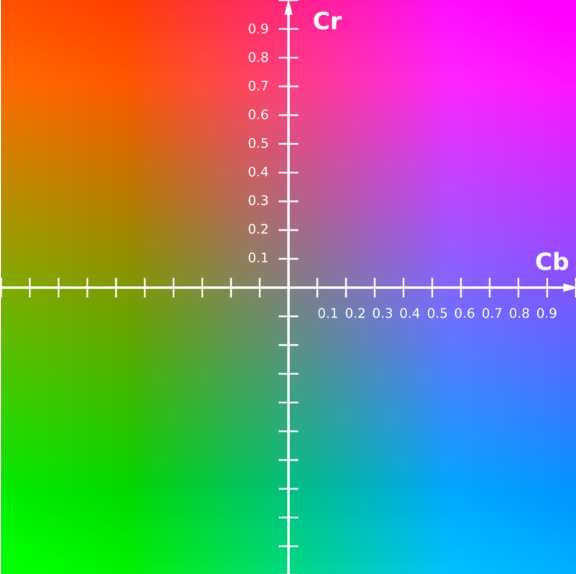
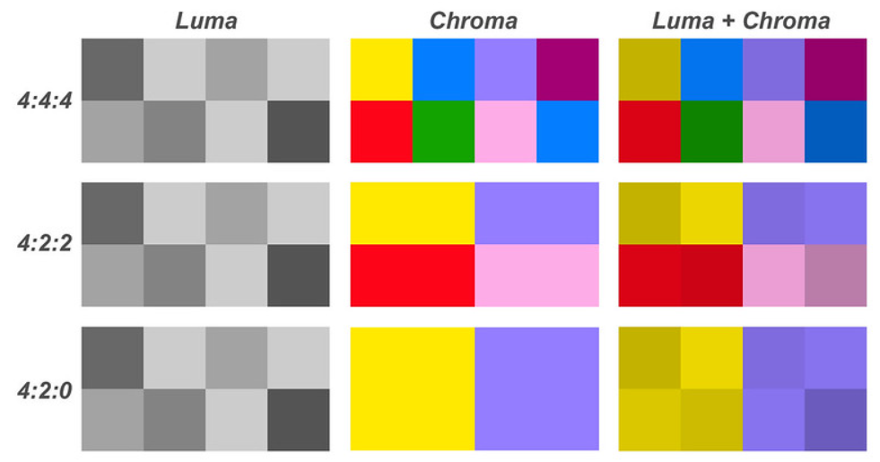

```Text
Author: Antony_Weng <weng851107@gmail.com>

This file is only used for the record of the learning process, only used by myself and the file has never been leaked out.
If there is related infringement or violation of related regulations, please contact me and the related files will be deleted immediately. Thank you!
```

# 目錄

- [Note](#0)
- [相關知識](#1)
  - [單片機 & 嵌入式系統](#1.1)
  - [嵌入式系統之作業系統](#1.2)
  - [簡介裸機與RTOS開發模式](#1.3)
    - [裸機開發模式](#1.3.1)
    - [RTOS的引入](#1.3.2)
  - [單片機常用調試的接口：JTAG、SWD、RDI接口與Jlink、Ulink、STlink仿真器](#1.4)
  - [AMBA(Advanced Microcontroller Bus Architecture) 總線協議](#1.5)
  - [分時多工（Time-Division Multiplexing，TDM）](#1.6)
  - [Ethernet（以太網）之 詳解 MAC、MII、PHY](#1.7)
  - [大端模式和小端模式](#1.8)
    - [什麼是大端和小端](#1.8.1)
    - [陣列在大端小端情況下的儲存](#1.8.2)
    - [為什麼會有大小端模式之分呢？](#1.8.3)
    - [如何判斷機器的位元組序](#1.8.4)
    - [如何進行轉換](#1.8.5)
    - [從軟體的角度理解端模式](#1.8.6)
    - [從系統的角度理解端模式](#1.8.7)
  - [x64 與 x86](#1.9)
  - [段錯誤(Segmentation Fault)](#1.10)
  - [操作硬體方式](#1.11)
  - [查詢Linux發行版本與核心版本](#1.12)
  - [Linux磁碟管理](#1.13)
    - [fdisk (狀態, 分割, 格式化, 掛載)](#1.13.1)
    - [使用操作(df, mount, du)](#1.13.2)
    - [linux掛載SD卡](#1.13.3)
  - [Image Sensor](#1.14)
    - [Camera 工作原理介紹](#1.14.1)
    - [Camera 設備組成](#1.14.2)
    - [YCbCr 空間色彩模型](#1.14.3)
    - [攝像頭接口分類 (DVP、MIPI和usb)](#1.14.4)
  - [Audio](#1.15)
    - [關於pulseaudio和alsa](#1.15.1)
    - [linux下查看音频設備](#1.15.2)
    - [amixer修改與查看codec register](#1.15.3)
    - [聲卡接口Line in、Line out、Mic in和Speak out](#1.15.4)
    - [Output interfaces of MEMS microphones (Amic & Dmic)](#1.15.5)
      - [A-mic](#1.15.5.1)
      - [D-mic](#1.15.5.2)
    - [Noun Definition](#1.15.6)
- [Linux Kernel相關知識](#2)
  - [基本系統數據類型](#2.1)
  - [取得kernel log的方式](#2.2)
  - [User 跟 Kernel溝通有幾種](#2.3)
  - [Linux kernel coding style](#2.4)
  - [Linux內核開發工具](#2.5)
- [快速入門](#3)
- [驅動大全](#4)


<h1 id="0">Note</h1>

[嵌入式Linux教程_韋東山手把手教你嵌入式Linux快速入門到精通](https://www.bilibili.com/video/BV1w4411B7a4?spm_id_from=333.999.0.0&vd_source=790c8244dbe879457094c8374beb04d3)

[韋東山老師, 快速入門 git repository](https://e.coding.net/weidongshan/01_all_series_quickstart.git)

[Linux 内核源码（kernel source）路径](https://blog.csdn.net/lanchunhui/article/details/72866103)

- 内核源码所在的位置：/usr/src

[Linux驱动之用man查看内核函数](https://blog.csdn.net/lang523493505/article/details/104273604)

<h1 id="1">相關知識</h1>

<h2 id="1.1">單片機 & 嵌入式系統</h2>

[Reference](https://ppfocus.com/0/te3daf8fd.html)

### 單片機(Single Chip Microomputer), 微控制器(MicroController Unit)

- 在那個年代半導體工藝還在起步階段，集成能力很差，往往是CPU一個晶片，SRAM一個晶片，Flash一個晶片，需要中斷的話又得有個專門處理中斷的晶片，所以一個完整可用的計算機系統是很多個晶片(Chip)做在一個PCB板上構成的。

- 單片機就是在一個晶片(Chip)上集成了CPU、SRAM、Flash及其他需要模塊，在一個Chip上實現一個微型計算機系統，所以就叫Single Chip Microcomputer。

- 其實從這個角度來講，單片機這個詞現在已經沒意義了，因爲現在的半導體工藝早就很厲害了，現在你買到的所有都是「單片機」，根本不存在分離式的所謂「多片機」。

- 現代的單片機不但集成了CPU、SRAM、Flash等微型計算機不可少的部件，而且大多集成了很多內部外設，如Nand控制器、LCD控制器、串口通信、定時器、RTC等等，所以現在的單片機其實應該叫SoC(System on Chip)。

- 晶片中不帶MMU(memory management unit)從而不支持虛擬地址，只能跑裸機或RTOS(典型如ucos、華爲LiteOS、RT-Thread、freertos等)的system叫單片機(典型如STM32、NXP LPC系列、新的NXP imxRT1052系列等)

- 51單片機之所以出名並活到現在，是因爲Intel後來開放了51內核的版權，所以很多公司很多人可以毫無顧忌的使用它而不擔心付費或版權風險。

- ARM這些年風頭很強，在application級別的SoC中大勝Intel，現在手機行業的晶片都被ARM吃掉了，MIPS之類的更是被壓的生不如死。在單片機領域，ARM的Cortex-M系列(M0、M3、M4、M7)也是大獲全勝，很多半導體廠商都放棄了自己原來的架構轉而做ARM內核的單片機了。

- 單片機不是裸機就是RTOS

```
computer - 指的就是電腦，你可以理解爲就是電腦，譬如筆記本、台式機這些。當然很多年前的電腦很龐大很笨重，
           所以computer就是指的這種有機箱外殼，有鍵盤滑鼠，很龐大笨重，通用性強的電腦。

microcomputer - 指的就是單片機這類東西，它也是一個獨立的電腦系統，有CPU和內存和外設這些，能跑電腦程式。
                但是他相對於computer來說體積很小，而且不是通用的而是專用的，所以叫microcomputer。

microcontroller - 現在很多單片機廠商都把自己的單片機叫microcontroller(微控制器)，microcontroller的重點在於controller，
                  也就是說他們想強調這個chip中集成的system是一個controller，擅長控制。而不是一個DSP(擅長運算)。

system - 更傾向於整個系統，也就是說system=microcomputer+各種外設。簡單理解就是，當串口、LCD控制器等模塊進入了Chip內部時，
         整個microcomputer就成爲system，其實system才是更有意義，更適合現代單片機晶片的一個名字。
         所以現在我們都把晶片叫SoC，這個名字更有價值。
```

### 嵌入式系統(Embedded system)

- 嵌入指的是我們把這個system(硬體上表現爲一個Chip)嵌入到某個設備中去。譬如冰箱的板卡上的晶片就是一個嵌入到冰箱中的system，負責控制用戶按鍵、冰箱照明燈、製冷系統等。可以看出，嵌入式系統這個名字主要是從晶片在使用時的組織形態來命名的。所以從這個角度講，只要是被嵌入到設備中的晶片都可以被叫做嵌入式系統。

- 狹義上講，嵌入式是爲了區別於單片機。我們經常把晶片中不帶MMU(memory management unit)從而不支持虛擬地址，只能跑裸機或RTOS(典型如ucos、華爲LiteOS、RT-Thread、freertos等)的system叫單片機(典型如STM32、NXP LPC系列、新的NXP imxRT1052系列等)

- 晶片自帶MMU可以支持虛擬地址，能夠跑Linux、Vxworks、WinCE、Android這樣的作業系統的system叫嵌入式。

- 嵌入式領域目前最火的就是ARM+linux和ARM+android。晶片都是基於ARM的，低端的有ARM9、ARM11，高端的有Cortex-A7、Cortex-A8、Cortex-A9、Cortex-A53、Cortex-A57等。從單核心到雙核心、四核心、八核心都有。

- 嵌入式級別的ARM因爲有MMU所以可以很好的跑複雜OS，因此雖然晶片本身也可以裸機運行，但是基本沒有人用這類晶片來跑裸機或者RTOS的。都會上作業系統。
  - 產品不需要華麗美觀的人機界面就上linux(譬如路由器、網絡攝像機)
  - 需要人機界面但是界面簡單注重功能和穩定性，那就上linux+QT(譬如工控HMI、電動車充電樁、停車場顯示)
  - 產品很注重人機互動的用戶體驗，那就上Android(譬如智慧型手機、智能電視機、遊戲機等)

<h2 id="1.2">嵌入式系統之作業系統</h2>

嵌入式系統分為軟件和硬件兩部分：

- 硬件：主要包括核心處理器芯片、內存和存儲芯片等外圍芯片；
- 軟件：主要包括有嵌入式系統運行的引導程序如uboot、操作系統（如linux）、底層設備驅動及應用軟件等。

ARM（Advanced RISC Machines）架構：

- 指精簡指令集計算機設備
- 使用ARM 技術生產的各種型號芯片稱為ARM 處理器
- ARM公司使用RISC技術設計芯片，給其他公司授權芯片IP core
  - Cortex-A：針對高端領域的處理器，在移動互聯設備、數字電視等領域使用廣泛。
  - Cortex-R：在實時性方面有巨大優勢，應用領域例如智能汽車、消費電子等。
  - Cortex-M：主要優勢為低成本和低功耗，主要應用於微控制領域，如工業控制和家用電器等

作業系統有兩種：

- 用MMU： Windows, MacOS, Linux, Android  --> 非實時作業系統
- 不用MMU： FreeRTOS, VxWorks, ucOS       --> 實時作業系統

CPU有分帶MMU的和不帶MMU的：

- 帶MMU的有Cortex-A系列ARM9 ARM11系列
- 不帶MMU的有Cortex-M系列…

非實時作業系統的運行單位是進程, 實時作業系統的運行單位是線程，而要實現進程晶片必須要有MMU(存儲管理單元)

STM32是M系列，不可能運行Linux，但可以跑實時操作系統，如ucos、 FreeRTOS、 RT-Thread

<h2 id="1.3">簡介裸機與RTOS開發模式</h2>

<h3 id="1.3.1">裸機開發模式</h3>

- 裸機開發，指的就是沒有操作系統，就是單片機開發。

- 程序的運行，完全取决於代碼的邏輯設計，硬件設備的固定設定。

- 總結來說，裸機程序難以解决的問題就是，控制每個任務的運行時間。難以消除任務與任務之間的相互影響。

**輪詢方式**

```C
void main()
{
    
   while(1){
      eat();         //喂孩子吃飯函數
      message();     //回複同事消息
   }
}
```

**事件驅動方式**

- 事件是一個寬泛的概念，什麼是事件？可以是：按下了按鍵、串口接收到了數據、模塊產生了中斷、某個全局變量被設置了。

- 當某個事件發生時，才調用對應函數，這就叫事件驅動。

```C
void crying_isr(){
   //檢測孩子是否在哭的中斷函數
   eating();//哭了就執行喂孩子吃飯的函數
}
void message_isr(){
   //檢測同事是否發消息函數.
   message();//執行回消息函數
}
void main(){
    
   while(1){
      
   }
}
```

**改進的事件驅動方式**

- 當兩個中斷同時產生的時候，同一時間只能處理一個，如果一個中斷處理時間比較長，就會影響另一個中斷的處理。

- 通過設置標志比特來改進程序

   ```C
   void crying_isr(){

      is_crying=1;         //如果哭了就將標志比特置1
   }
   void message_isr(){

      is_message=1;        //將有消息標志比特置1。
   }
   void main(){

      while(1){
         if(is_crying==1)
            eating();
         if(is_message==1)
            message();
      }
   }
   ```

**常用時間驅動方式：定時器**

- 設置一個定時器，比如每1ms產生一次中斷

   ```
   對於函數A，可以設置它的執行周期，比如每1ms執行一次
   對於函數B，可以設置它的執行周期，比如每2ms執行一次
   對於函數C，可以設置它的執行周期，比如每3ms執行一次
   ```

    ```C
    typedef struct soft_timer{
        int remain;//錶示剩餘多少時間，就需要調用下面的函數
        int period;//錶示周期
        void (*function)(void);//處理函數
    }soft_timer,*p_soft_timer;

    static soft_timer timers[]={
        {1,1,A},
        {2,2,B},
        {3,3,C}
    };//符合題目要求

    void main()
    {  
        while(1){  }
    }
    void timer_isr()
    {
        int i;      
        //是每個timers數組成員的remain都减1.
        for(i=0;i<3;i++){   
            timers[i].remain--;
        }
        //當remain减到0，就錶示要調用對應結構體中的函數了
        for(i=0;i<3;i++){
            if(timers[i].remain==0){        
                timers[i].function();                     //調用函數
                timers[i].remain=timers[i].period;        //重置remain.
            }
        }
    }
    ```

**使用狀態機進行改進**

- 當任務處理函數執行時間都很長的時候，這裏我們可以使用狀態機的思想來解决這個問題，思路就是操作系統的時間片

    ```C
    void crying_isr(void)
    {
        static int state = 0;

        switch (state)
        {

            case 0: /* 開始 */
            {

                /* 盛飯 */
                state++;
                return;
            }

            case 1: /* 盛菜 */
            {

                /* 盛菜 */
                state++;
                return;
            }

            case 2: 
            {

                /* 拿勺子 */
                state++;
                return;
            } 
        }
    }

    void mesage_isr(void)
    {
        static int state = 0;

        switch (state)
        {

            case 0: /* 開始 */
            {

                /* 打開電腦 */
                state++;
                return;
            }

            case 1: 
            {

                /* 觀看信息 */
                state++;
                return;
            }

            case 2: 
            {

                /* 打字 */
                state++;
                return;
            }
        }
    }

    void main()
    { 
        while (1)
        {

            crying_isr();
            message_isr();
            //其實就是將這個執行時間很長的函數，拆分為短時間來處理。
        }
    }
    ```

<h3 id="1.3.2">RTOS的引入</h3>

- 假設要調用兩個函數AB，AB執行的時間都很長，使用裸機程序時可以把AB函數改造為"**狀態機**"，還可以使用**RTOS**。這兩種方法的核心都是"**分時複用**"：
  - 分時：函數A運行一小段時間，函數B再運行一小段時間
  - 複用：複用誰？就是CPU

- 寶媽一會兒喂孩子飯，一會兒回消息。當這個時間足够短的時候，從宏觀上來看就是兩個事件同時發生；從微觀上來看，這依舊是兩件事情。

- 關鍵在於RTOS讓多個任務輪流運行，不再需要我們手工在任務函數去使用狀態機拆分程序。

    ```C
    // RTOS程序 
    喂飯()
    {
        while (1)
        {
        
            喂一口飯();
        }
    }

    回信息()
    {
        while (1)
        {
        
            回一個信息();
        }
    }

    void main()
    {
        
        create_task(喂飯);//創建一個任務
        create_task(回信息);//創建一個任務
        start_scheduler();//執行任務列錶
        while (1)
        {

            sleep();
        }
    }
    ```

<h2 id="1.4">單片機常用調試的接口：JTAG、SWD、RDI接口與Jlink、Ulink、STlink仿真器</h2>

### JTAG協議

- JTAG（Joint Test Action Group，聯合測試行動小組）是一種國際標準測試協議（IEEE 1149.1兼容），主要用於晶片內部測試。現在多數的高級器件都支持JTAG協議，如ARM、DSP、FPGA器件等。

- 標準的JTAG接口是4線：TMS、 TCK、TDI、TDO，分別為模式選擇、時鐘、數據輸入和數據輸出線。
  - TMS：測試模式選擇，TMS用來設置JTAG接口處於某種特定的測試模式；
  - TCK：測試時鐘輸入；
  - TDI：測試數據輸入，數據通過TDI引腳輸入JTAG接口；
  - TDO：測試數據輸出，數據通過TDO引 腳從JTAG接口輸出；

- 目前市場上已經很少看到它的身影了。取而代之的是越來越多的USB接口。

### SWD接口

- 串行調試（Serial Wire Debug），應該可以算是一種和JTAG不同的調試模式，使用的調試協議也應該不一樣，所以最直接的體現在調試接口上，與JTAG的20個引腳相比，SWD只需要4個（或者5個）引腳，結構簡單，但是使用範圍沒有JTAG廣泛，主流調試器上也是後來才加的SWD調試模式。

    

- 板子的體積有限的時候推薦使用SWD模式，它需要的引腳少

### RDI接口

- 遠程調試接口（Remote Debug Interface），是ARM公司提出的標準調試接口，主要用於ARM晶片的仿真，由於各個IDE廠商使用的調試接口各自獨立，硬體無法進行跨平台的調試。

### JLink仿真器

- 基於JTAG的仿真器

- 給一個JTAG協議轉換盒，即一個小型USB到JTAG的轉換盒，其連接到計算機用的是USB接口，而到目標板內部用的還是jtag協議。它完成了一個從軟體到硬體轉換的工作。

### ULink仿真器

- ULINK是ARM/KEIL公司推出的仿真器

- ULINK/ULINK2可以配合Keil軟體實現仿真功能，並且僅可以在Keil軟體上使用，增加了串行調試（SWD）支持，返回時鐘支持和實時代理等功能。

### ST-Link仿真器

- 專門針對意法半導體STM8和STM32系列晶片的仿真器。

- 採用5V的USB2.0全速接口進行供電與數據傳輸，可以方便的對內部固件進行升級，同時支持以 **JTAG** 或 **SWD** 模式連接至 STM32 系列微控制器，或者以 **SWIM** 模式連接至 STM8 系列微控制器

<h2 id="1.5">AMBA(Advanced Microcontroller Bus Architecture) 總線協議</h2>

- AMBA (Advanced Microcontroller Bus Architecture) 高級處理器總線架構
  - AHB (Advanced High-performance Bus) 高級高性能總線
  - ASB (Advanced System Bus) 高級系統總線
  - APB (Advanced Peripheral Bus) 高級外圍總線
  - AXI (Advanced eXtensible Interface) 高級可拓展接口

   

<h2 id="1.6">分時多工（Time-Division Multiplexing，TDM）</h2>

- 分時多工（Time-Division Multiplexing，TDM）是一種數位或者類比（較罕見）的多工技術。

- 使用這種技術，兩個以上的訊號或資料流可以同時在一條通訊線路上傳輸，其表現為同一通訊頻道的子頻道。但在物理上來看，訊號還是輪流占用物理通道的。時間域被分成周期迴圈的一些小段，每段時間長度是固定的，每個時段用來傳輸一個子頻道。

<h2 id="1.7">Ethernet（以太網）之 詳解 MAC、MII、PHY</h2>

[Reference](https://www.twblogs.net/a/5b7a98562b7177392c9666f8)

- 從硬件的角度看，以太網接口電路主要由**MAC（Media Access Control）控制器**和**物理層接口PHY（Physical Layer，PHY）兩大部分構成**。PHY整合了大量模擬硬件，而MAC是典型的全數字器件。

    

  - CPU集成MAC與PHY。目前來說並不多見

    

  - CPU集成MAC，PHY採用獨立芯片。比較常見

    

  - CPU不集成MAC與PHY，MAC與PHY採用集成芯片。比較常見

    

  - MAC及PHY工作在OSI七層模型的數據鏈路層和物理層。具體如下

    

- **MAC（Media Access Control）**即**媒體訪問控制子層協議**。該部分有兩個概念：MAC可以是一個硬件控制器 及 MAC通信以協議。該協議位於OSI七層協議中數據鏈路層的下半部分，主要負責控制與連接物理層的物理介質。

    

- **MII（Media Independent Interface）**即**媒體獨立接口**，MII接口是MAC與PHY連接的標準接口。
  - GMII(Gigabit MII)
  - RMII(Reduced Media Independant Interface)

    

- **PHY（Physical Layer，PHY）**是**IEEE802.3中定義的一個標準模塊**，STA（station management entity，管理實體，一般爲MAC或CPU）通過SMI（Serial Manage Interface）對PHY的行爲、狀態進行管理和控制，而具體管理和控制動作是通過讀寫PHY內部的寄存器實現的。

    

<h2 id="1.8">大端模式和小端模式</h2>

<h3 id="1.8.1">什麼是大端和小端</h3>

數字0x12 34 56 78在記憶體中的表示形式為：

1. Little-Endian就是低位位元組排放在記憶體的低地址端，高位位元組排放在記憶體的高地址端。

   低地址 ——————> 高地址
   0x78  |  0x56  |  0x34  |  0x12

2. Big-Endian就是高位位元組排放在記憶體的低地址端，低位位元組排放在記憶體的高地址端。

   低地址 —————–> 高地址
   0x12  |  0x34  |  0x56  |  0x78

3. 例子：

   

<h3 id="1.8.2">陣列在大端小端情況下的儲存</h3>

以unsigned int value = 0x12345678為例，分別看看在兩種位元組序下其儲存情況，我們可以用unsigned char buf[4]來表示value：

1. Big-Endian: 低地址存放高位，如下：

   高地址
   —————
   buf[3] (0x78) — 低位
   buf[2] (0x56)
   buf[1] (0x34)
   buf[0] (0x12) — 高位
   —————
   低地址

2. Little-Endian: 低地址存放低位，如下：

   高地址
   —————
   buf[3] (0x12) — 高位
   buf[2] (0x34)
   buf[1] (0x56)
   buf[0] (0x78) — 低位
   ————–
   低地址

<h3 id="1.8.3">為什麼會有大小端模式之分呢？</h3>

- 這是因為在計算機系統中，我們是以`位元組`為單位的，每個地址單元都對應著一個位元組，一個位元組為8bit。

  - 位(bit)：計算機中的最小數據單位，計算機存儲的都是二進制0和1來表示的。
  - 字節(Byte)：字節是存儲空間的基本計量單位，也是內存的基本單位，也是編址單位。例如，一個計算機的內存是4GB，就是該計算機的內存中共有4×1024×1024×1024個字節，意味著它有4G的內存尋址空間。

- 但是在C語言中除了8bit的char之外，還有16bit的short型，32bit的long型（要看具體的編譯器），另外，對於位數大於8位的處理器，例如16位或者32位的處理器，由於暫存器寬度大於一個位元組，那麼必然存在著一個如果將`多個位元組安排的問題`。因此就導致了大端儲存模式和小端儲存模式。

  - 4個二進制位(bit)(不夠表示一個字節) = 1個十六進制(hex)
  - 8個二進制位(bit) = 一個字節(Byte) = 2個十六進制(hex)
  - 32個二進制位(bit) = 四個字節(Byte) = 8個十六進制(hex)

- 我們常用的X86結構是小端模式，而KEIL C51則為大端模式。很多的ARM，DSP都為小端模式。有些ARM處理器還可以由硬體來選擇是大端模式還是小端模式。

<h3 id="1.8.4">如何判斷機器的位元組序</h3>

1. 自行撰寫程式來判斷：

   ```C
   BOOL IsBigEndian()  
   {  
      int a = 0x1234;  
      //通過將int強制型別轉換成char單位元組，通過判斷起始儲存位置。即等於 取b等於a的低地址部分  
      char b =  *(char *)&a;  
      if( b == 0x12)  
      {  
         return TRUE;  
      }  
      return FALSE;  
   }
   ```

2. 聯合體union的存放順序是所有成員都從低地址開始存放，利用該特性可以輕鬆地獲得了CPU對記憶體採用Little-endian還是Big-endian模式讀寫：

   ```C
   BOOL IsBigEndian()  
   {  
      union NUM  
      {  
         int a;  
         char b;  
      }num;  
      num.a = 0x1234;  
      if( num.b == 0x12 )  
      {  
         return TRUE;  
      }  
      return FALSE;  
   }
   ```

<h3 id="1.8.5">如何進行轉換</h3>

1. 對於字資料（16位）：

   ```C
   #define BigtoLittle16(A)   (( ((uint16)(A) & 0xff00) >> 8) | (( (uint16)(A) & 0x00ff) << 8))  
   ```

2. 對於雙字資料（32位）：

   ```C
   #define BigtoLittle32(A)   ((( (uint32)(A) & 0xff000000) >> 24) | \
                              (( (uint32)(A) & 0x00ff0000) >> 8)  | \  
                              (( (uint32)(A) & 0x0000ff00) << 8)  | 
                              (( (uint32)(A) & 0x000000ff) << 24))  
   ```

<h3 id="1.8.6">從軟體的角度理解端模式</h3>

從軟體的角度上，不同端模式的處理器進行資料傳遞時必須要考慮端模式的不同。

1. 在Socket介面程式設計中，以下幾個函式用於大小端位元組序的轉換：

   ```C
   #define ntohs(n)     //16位資料型別網路位元組順序到主機位元組順序的轉換  
   #define htons(n)     //16位資料型別主機位元組順序到網路位元組順序的轉換  
   #define ntohl(n)     //32位資料型別網路位元組順序到主機位元組順序的轉換  
   #define htonl(n)     //32位資料型別主機位元組順序到網路位元組順序的轉換  
   ```

   - 其中網際網路使用的網路位元組順序採用大端模式進行編址，而主機位元組順序根據處理器的不同而不同

   - 大端模式處理器的位元組序到網路位元組序不需要轉換，此時`ntohs(n)=n`，`ntohl = n`；

   - 小端模式處理器的位元組序到網路位元組必須要進行轉換，此時`ntohs(n) = __swab16(n)`，`ntohl = __swab32(n)`。

   ```C
   #define ___swab16(x)  
   {  
      __u16 __x = (x);  
            
      ((__u16)((((__u16)(__x) & (__u16)0x00ffU) << 8) | (((__u16)(__x) & (__u16)0xff00U) >> 8) ));  
   }  
   ```

   ```C
   #define ___swab32(x)  
   {  
      __u32 __x = (x);  
      
      ((__u32)((((__u32)(__x) & (__u32)0x000000ffUL) << 24) |  
               (((__u32)(__x) & (__u32)0x0000ff00UL) << 8) |  
               (((__u32)(__x) & (__u32)0x00ff0000UL) >> 8) |  
               (((__u32)(__x) & (__u32)0xff000000UL) >> 24) ));  
   }  
   ```

- 真正的理解大小端模式的區別，必須要從系統的角度，從指令集，暫存器和資料匯流排上深入理解，大小端模式的區別。

<h3 id="1.8.7">從系統的角度理解端模式</h3>

1. 兩個關鍵字：

   - MSB:MoST Significant Bit —— 最高有效位
   - LSB:Least Significant Bit —— 最低有效位

2. 處理器在硬體上由於端模式問題在設計中有所不同。從系統的角度上看，端模式問題對軟體和硬體的設計帶來了不同的影響，當一個處理器系統中大小端模式同時存在時，必須要對這些不同端模式的訪問進行特殊的處理。

3. 本文提到的小端外設是指這種外設中的暫存器以小端方式進行儲存，如PCI裝置的配置空間，NOR FLASH中的暫存器等等。對於有些裝置，如DDR顆粒，沒有以小端方式儲存的暫存器，因此從邏輯上講並不需要對端模式進行轉換。在設計中，只需要將雙方資料匯流排進行一一對應的互連，而不需要進行資料匯流排的轉換。

4. 大端模式的32位處理器，如基於E500核心的MPC8541，將其暫存器的最高位msb（most significant bit）定義為0，最低位lsb（lease significant bit）定義為31；
   小端模式的32位處理器，將其暫存器的最高位定義為31，低位地址定義為0。與此向對應，採用大端模式的32位處理器資料匯流排的最高位為0，最高位為31；採用小端模式的32位處理器的資料匯流排的最高位為31，最低位為0。 

5. 根據所採用的資料匯流排是32位，16位和8位，大小端處理器外部匯流排的位序有所不同
   - 大端模式下32位資料匯流排的msb是第0位，MSB是資料匯流排的第0\~7的欄位；而lsb是第31位，LSB是第24\~31欄位。
   - 小端模式下32位匯流排的msb是第31位，MSB是資料匯流排的第31\~24位，lsb是第0位，LSB是7\~0欄位。
   - 大端模式下16位資料匯流排的msb是第0位，MSB是資料匯流排的第0\~7的欄位；而lsb是第15位，LSB是第8\~15欄位。
   - 小端模式下16位匯流排的msb是第15位，MSB是資料匯流排的第15\~7位，lsb是第0位，LSB是7\~0欄位。
   - 大端模式下8位資料匯流排的msb是第0位，MSB是資料匯流排的第0\~7的欄位；而lsb是第7位，LSB是第0\~7欄位。
   - 小端模式下8位匯流排的msb是第7位，MSB是資料匯流排的第7\~0位，lsb是第0位，LSB是7\~0欄位。

<h2 id="1.9">x64 與 x86</h2>

### [64 位元的 CPU](https://wanker742126.neocities.org/new/win64asm/w64asm_ch00.html)

- x64 架構的 CPU 是屬於 64 位元，包含了 16 個 64 位元的通用暫存器 ( general-purpose registers )，這 16 個暫存器名稱分別是 RAX、RBX、RCX、RDX、RBP、RSP、RSI、RDI、R8、R9、R10、R11、R12、R13、R14、R15。很明顯的，後面的八個暫存器，R8、R9、R10、R11、R12、R13、R14、R15，是新增的；
- 而前面的八個暫存器，RAX、RBX、RCX、RDX、RBP、RSP、RSI、RDI，是把原有的 32 位元加以擴充而成，RAX、RBX…等的「R」是暫存器 ( register ) 的意思。

   

### [32位元、64位元 - CPU 、作業系統、應用軟體](http://wangwangtc.blogspot.com/2017/07/3264-cpu.html)


### Linux 是64位元還是32位元

[如何檢查 Linux 作業系統是 32 位元還是 64 位元？](https://blog.gtwang.org/linux/how-to-check-linux-arch-32bits-64bits/)

1. `uname -m`

   - 32 位元的系統，就會顯示 i686 或 i386
   - 64 位元的系統就會顯示 x86_64

2. `uname -a`

   > Linux steteo1 3.11.0-19-generic #33-Ubuntu SMP Tue Mar 11 18:48:34 UTC 2014 x86_64 x86_64 x86_64 GNU/Linux

<h2 id="1.10">段錯誤(Segmentation Fault)</h2>

段錯誤是指訪問的記憶體超出了系統給這個程式所設定的記憶體空間

- 訪問了不存在的記憶體地址
- 訪問了系統保護的記憶體地址
- 訪問了只讀的記憶體地址等等

<h2 id="1.11">操作硬體方式</h2>

1. 讀/寫（read/write）/dev/xxx
2. 映射（map）操作
3. I/O控制(ioctl)

<h2 id="1.12">查詢Linux發行版本與核心版本</h2>

https://caloskao.org/linux-unix-get-distribution-and-kernel-version/

1. `uname -mrs` (Linux / BSD)：

   在 Linux 與 BSD 的發行版都可使用，在 BSD 系統底下可直接查看發行版本與核心版本，而在 Linux 系統底下僅能查看核心版本，發行版本需透過其它指令得知。

   ```Text
   Linux 4.15.0-23-generic x86_64
   FreeBSD 11.1-RELEASE amd64
   ```

2. `cat /etc/os-release` (Linux)：

   僅能在 Linux 發行版下使用，帶出的發行版資訊很完整，但不含核心版本資訊。

   ```Text
   NAME="Ubuntu"
   VERSION="18.04 LTS (Bionic Beaver)"
   ID=ubuntu
   ID_LIKE=debian
   PRETTY_NAME="Ubuntu 18.04 LTS"
   VERSION_ID="18.04"
   HOME_URL="https://www.ubuntu.com/"
   SUPPORT_URL="https://help.ubuntu.com/"
   BUG_REPORT_URL="https://bugs.launchpad.net/ubuntu/"
   PRIVACY_POLICY_URL="https://www.ubuntu.com/legal/terms-and-policies/privacy-policy"
   VERSION_CODENAME=bionic
   UBUNTU_CODENAME=bionic
   ```

<h2 id="1.13">Linux磁碟管理</h2>


- 由於 MBR 分割表不支援超過 2TB 的磁碟，如果您的硬碟大小超過 2TB，就無法使用 `fdisk` 分割硬碟，請改用 `parted` 以 GPT 的方式分割

    [Linux 的 Parted 指令教學](https://blog.gtwang.org/linux/parted-command-to-create-resize-rescue-linux-disk-partitions/)

<h3 id="1.13.1">fdisk (狀態, 分割, 格式化, 掛載)</h3>

#### 顯示出目前硬碟的掛載狀況

- 剛剛裝上去的新硬碟在這裡是看不到的，因為我們都還沒開始分割

    ```Shell
    $ df -h

    Filesystem            Size  Used Avail Use% Mounted on
    /dev/sda1             440G   46G  372G  12% /
    none                  5.9G  260K  5.9G   1% /dev
    none                  5.9G     0  5.9G   0% /dev/shm
    none                  5.9G   64K  5.9G   1% /var/run
    none                  5.9G     0  5.9G   0% /var/lock
    none                  5.9G     0  5.9G   0% /lib/init/rw
    /dev/sdb1             459G  198M  435G   1% /data1
    ```

- 接著在看看 /dev 下面所有的硬碟情況

    ```Shell
    $ ls /dev/[sh]d*

    /dev/sda  /dev/sda1  /dev/sda2  /dev/sda5  /dev/sdb  /dev/sdb1  /dev/sdc
    ```

- 這樣一比較就知道新的硬碟是 /dev/sdc 這顆，再用 fdisk 確認一下
    --> 看起來沒問題，沒有任何磁碟分割表的資訊

    ```Shell
    $ fdisk -l /dev/sdc

    Disk /dev/sdc: 2000.4 GB, 2000398934016 bytes
    255 heads, 63 sectors/track, 243201 cylinders
    Units = cylinders of 16065 * 512 = 8225280 bytes
    Sector size (logical/physical): 512 bytes / 512 bytes
    I/O size (minimum/optimal): 512 bytes / 512 bytes
    Disk identifier: 0x40bab849
    Device Boot      Start         End      Blocks   Id  System
    ```

#### 硬碟分割

- 接著開始分割，首先進入 fdisk，fdisk 是一個互動模式的分割工具，輸入 m 再按 Enter 可以顯示各種指令的說明：

    ```Shell
    $ fdisk /dev/sdc

    WARNING: DOS-compatible mode is deprecated. It’s strongly recommended to
            switch off the mode (command ‘c’) and change display units to
            sectors (command ‘u’).
    Command (m for help): m
    Command action
    a   toggle a bootable flag
    b   edit bsd disklabel
    c   toggle the dos compatibility flag
    d   delete a partition
    l   list known partition types
    m   print this menu
    n   add a new partition
    o   create a new empty DOS partition table
    p   print the partition table
    q   quit without saving changes
    s   create a new empty Sun disklabel
    t   change a partition’s system id
    u   change display/entry units
    v   verify the partition table
    w   write table to disk and exit
    x   extra functionality (experts only)
    Command (m for help): 
    ```

- 新增一個分割區，步驟如下

    ```Text
    1. 新增分割區，輸入 n 按 Enter。
    2. 選擇要建立 extended 還是 primary partition，因為我的硬碟全部只要一個分割區，所以我選 primary，輸入 p 按 Enter。
    3. 選擇 Partition number，primary 分割區最多可以有四個，隨便選都可以，不過建議選 1，免得以後看起來很奇怪，
    輸入 1 按 Enter。
    4. 輸入開始的 cylinder，用預設值就可以了，直接按 Enter。
    5. 輸入結束的 cylinder，若是要用最大的容量，就直接按 Enter，若是要指定分割區的大小，就用 +size{K,M,G} 的形式指定，
    例如指定為 100G 的大小就輸入 +100G 再按 Enter。
    6. 最後將分割表寫入硬碟，輸入 w 再按 Enter。
    ```

    ```Shell
    Command (m for help): n
    Command action
    e   extended
    p   primary partition (1-4)
    p
    Partition number (1-4): 1
    First cylinder (1-243201, default 1):
    Using default value 1
    Last cylinder, +cylinders or +size{K,M,G} (1-243201, default 243201):
    Using default value 243201
    Command (m for help): w
    The partition table has been altered!
    Calling ioctl() to re-read partition table.
    Syncing disks.
    ```

- 離開 fdisk 就輸入 q 按 Enter 就可以

- 再用 fdisk 確認分割區 --> 最下面一行就是新的分割資訊，看起來沒什麼問題

    ```Shell
    $ fdisk -l /dev/sdc

    Disk /dev/sdc: 2000.4 GB, 2000398934016 bytes
    255 heads, 63 sectors/track, 243201 cylinders
    Units = cylinders of 16065 * 512 = 8225280 bytes
    Sector size (logical/physical): 512 bytes / 512 bytes
    I/O size (minimum/optimal): 512 bytes / 512 bytes
    Disk identifier: 0x40bab849
    Device Boot      Start         End      Blocks   Id  System
    /dev/sdc1               1      243201  1953512001   83  Linux
    ```

#### 格式化（Format）硬碟

- Linux 下格式化就用 `mkfs` 這個指令就可以，`-t` 選項可以指定檔案系統

    ```Shell
    $ mkfs -t ext4 /dev/sdc1

    mke2fs 1.41.11 (14-Mar-2010)
    Filesystem label=
    OS type: Linux
    Block size=4096 (log=2)
    Fragment size=4096 (log=2)
    Stride=0 blocks, Stripe width=0 blocks
    122101760 inodes, 488378000 blocks
    24418900 blocks (5.00%) reserved for the super user
    First data block=0
    Maximum filesystem blocks=4294967296
    14905 block groups
    32768 blocks per group, 32768 fragments per group
    8192 inodes per group
    Superblock backups stored on blocks:
    32768, 98304, 163840, 229376, 294912, 819200, 884736, 1605632, 2654208,
    4096000, 7962624, 11239424, 20480000, 23887872, 71663616, 78675968,
    102400000, 214990848
    Writing inode tables: done                          
    Creating journal (32768 blocks): done
    Writing superblocks and filesystem accounting information: done
    This filesystem will be automatically checked every 32 mounts or
    180 days, whichever comes first.  Use tune2fs -c or -i to override.
    ```

#### 掛載（mount）硬碟

- 在 Linux 下面的磁碟掛載設定都是寫在 `/etc/fstab` 中

- 傳統的寫法是使用 /dev/sda1 這樣的方式指定磁碟，但是若是當磁碟更換安裝的順序時，原本的 /dev/sda1 有可能就會變成 /dev/sdb1，有時候光是分清楚哪顆是哪顆就夠頭痛的了

- 現在新的方式都是使用 **UUID** 來指定磁碟的，所以 /etc/fstab 看起來會像這樣：

    ```Shell
    proc            /proc           proc    nodev,noexec,nosuid 0       0
    UUID=684530e1-df5c-48d7-b3e4-eb0d47054877 /               ext4    errors=remount-ro 0       1
    UUID=35ddf35e-87de-4ab0-88d1-2a654d36b19a none            swap    sw              0       0
    UUID=9746f325-1c82-4c04-b447-b5c596eea6c1 /data1          ext4    defaults        0       2
    ```

- 每一顆硬碟都可不同的 UUID，使用 UUID 來指定磁碟就不會因為安裝的順序不同而產生變化，這樣做的好處是若是當磁碟常常要拔來拔去時，系統管理者不用再去更改 fstab 的設定，系統會自動尋找對應的 UUID 來掛載

- 利用 `blkid` 這個指令，它可以列出所有磁碟的 UUID

    ```Shell
    $ sudo blkid

    /dev/sda1: UUID=”684530e1-df5c-48d7-b3e4-eb0d47054877″ TYPE=”ext4″
    /dev/sda5: UUID=”35ddf35e-87de-4ab0-88d1-2a654d36b19a” TYPE=”swap”
    /dev/sdb1: UUID=”9746f325-1c82-4c04-b447-b5c596eea6c1″ TYPE=”ext4″
    /dev/sdc1: UUID=”146d3bb3-e351-45c8-ac84-42534ce51d29″ TYPE=”ext4″ 
    ```

- 接著把新的硬碟資訊寫進 /etc/fstab 中

    ```Shell
    UUID=146d3bb3-e351-45c8-ac84-42534ce51d29 /data2          ext4    defaults        0       
    ```

- 下次重開機時，系統就會把新的硬碟掛載至 /data2，若要馬上測試掛載硬碟設定是否正確，可以使用 `mount`，再用 `df -h` 確認一下有沒有問題

    ```Shell
    $ mount /data2
    ```

<h3 id="1.13.2">使用操作(df, mount, du)</h3>

**partition information**

```Shell
$ cat /proc/partitions
major     minor  blocks  name

   1        0      65536 ram0
 179        0    7634944 mmcblk0
 179        1        128 mmcblk0p1
 179        2       1024 mmcblk0p2
 179        3        896 mmcblk0p3
 179        4       1024 mmcblk0p4
 179        5      16384 mmcblk0p5
 179        6      16384 mmcblk0p6
 179        7     491520 mmcblk0p7
 179        8      81920 mmcblk0p8
 179        9     819200 mmcblk0p9
 179       10    6206464 mmcblk0p10
```

- kernel log會顯示partition的資訊

    ```Shell
    [    1.135323] mmc0: new HS200 MMC card at address 0001
    [    1.141686] mmcblk0: mmc0:0001 H8G4a2 7.28 GiB
    [    1.147191] mmcblk0boot0: mmc0:0001 H8G4a2 partition 1 4.00 MiB
    [    1.154067] mmcblk0boot1: mmc0:0001 H8G4a2 partition 2 4.00 MiB
    [    1.160106] mmcblk0rpmb: mmc0:0001 H8G4a2 partition 3 4.00 MiB, chardev (250:0)
    [    1.170664]  (bst): 0x0000000000000000, 0x0000000000020000
    [    1.176150]  (bld): 0x0000000000020000, 0x0000000000100000
    [    1.181630]  (ptb): 0x0000000000120000, 0x00000000000e0000
    [    1.187111]  (atf): 0x0000000000200000, 0x0000000000100000
    [    1.192591]  (pba): 0x0000000000300000, 0x0000000001000000
    [    1.198074]  (pri): 0x0000000001300000, 0x0000000001000000
    [    1.203555]  (lnx): 0x0000000002300000, 0x000000001e000000
    [    1.209036]  (add): 0x0000000020300000, 0x0000000005000000
    [    1.214522]  (adc): 0x0000000025300000, 0x0000000032000000
    [    1.220000]  (raw): 0x0000000057300000, 0x000000017ad00000
    [    1.225474]  mmcblk0: p1(bst) p2(bld) p3(ptb) p4(atf) p5(pba) p6(pri) p7(lnx) p8(add) p9(adc) p10(raw)
    ```

**df**

```Shell
$ df
Filesystem                Size      Used Available Use% Mounted on
/dev/root               448.7M    419.9M      1.9M 100% /
devtmpfs                 88.5M         0     88.5M   0% /dev
tmpfs                   496.7M         0    496.7M   0% /dev/shm
tmpfs                   198.7M    288.0K    198.4M   0% /run
tmpfs                   496.7M     12.0K    496.7M   0% /tmp
tmpfs                   496.7M      4.0M    492.7M   1% /var/log
tmpfs                   496.7M         0    496.7M   0% /var/tmp
/dev/mmcblk0p7          787.4M    104.0K    747.3M   0% /sdcard
/dev/mmcblk0p9          787.4M    104.0K    747.3M   0% /sdcard
/dev/mmcblk0p9          787.4M    104.0K    747.3M   0% /adc
tmpfs                    99.3M         0     99.3M   0% /run/user/0
```

**mount**

- 得知目前掛載資訊

    ```Shell
    $ mount
    /dev/root on / type ext4 (rw,relatime,errors=remount-ro)
    devtmpfs on /dev type devtmpfs (rw,relatime,size=90652k,nr_inodes=22663,mode=755)
    sysfs on /sys type sysfs (rw,nosuid,nodev,noexec,relatime)
    proc on /proc type proc (rw,nosuid,nodev,noexec,relatime)
    tmpfs on /dev/shm type tmpfs (rw,nosuid,nodev)
    devpts on /dev/pts type devpts (rw,nosuid,noexec,relatime,gid=5,mode=620,ptmxmode=000)
    tmpfs on /run type tmpfs (rw,nosuid,nodev,size=203444k,nr_inodes=819200,mode=755)
    cgroup2 on /sys/fs/cgroup type cgroup2 (rw,nosuid,nodev,noexec,relatime,nsdelegate)
    mqueue on /dev/mqueue type mqueue (rw,nosuid,nodev,noexec,relatime)
    hugetlbfs on /dev/hugepages type hugetlbfs (rw,relatime,pagesize=2M)
    debugfs on /sys/kernel/debug type debugfs (rw,nosuid,nodev,noexec,relatime)
    tmpfs on /tmp type tmpfs (rw,nosuid,nodev,size=508608k,nr_inodes=409600)
    tmpfs on /var/log type tmpfs (rw,relatime)
    tmpfs on /var/tmp type tmpfs (rw,relatime)
    configfs on /sys/kernel/config type configfs (rw,nosuid,nodev,noexec,relatime)
    /dev/mmcblk0p7 on /sdcard type ext4 (rw,noatime,nodiratime,errors=remount-ro)
    /dev/mmcblk0p9 on /sdcard type ext2 (rw,sync,noatime,nodiratime,errors=remount-ro)
    /dev/mmcblk0p9 on /adc type ext2 (rw,sync,relatime,errors=remount-ro)
    tmpfs on /run/user/0 type tmpfs (rw,nosuid,nodev,relatime,size=101720k,nr_inodes=25430,mode=700)
    ```

**du**

- 檢視檔案與目錄的使用空間狀態

    ```Shell
    $ du --help
    BusyBox v1.31.1 (2020-08-04 08:23:01 CST) multi-call binary.

    Usage: du [-aHLdclsxhmk] [FILE]...

    Summarize disk space used for each FILE and/or directory

        -a      Show file sizes too
        -L      Follow all symlinks
        -H      Follow symlinks on command line
        -d N    Limit output to directories (and files with -a) of depth < N
        -c      Show grand total
        -l      Count sizes many times if hard linked
        -s      Display only a total for each argument
        -x      Skip directories on different filesystems
        -h      Sizes in human readable format (e.g., 1K 243M 2G)
        -m      Sizes in megabytes
        -k      Sizes in kilobytes (default)
    ```

  - `du ` 在當前目錄、子目錄各自檔案大小與總量大小
  - `du -a` 列出所有資料夾與檔案大小
  - `du -ah` 增加易讀性並列出所有資料夾與檔案大小
  - `du -sh` 增加易讀性並僅看當前目錄檔案總量大小

<h3 id="1.13.3">linux掛載SD卡</h3>

https://www.twblogs.net/a/5c22690ebd9eee16b4a77d0e

（1）通過 `fdisk -l` 命令確認板子上的linux系統是否識別SD卡

```bash
$ fdisk -l

Disk /dev/mtdblock0: 1 MB, 1179648 bytes
255 heads, 63 sectors/track, 0 cylinders
Units = cylinders of 16065 * 512 = 8225280 bytes

Disk /dev/mtdblock0 doesn't contain a valid partition table
Disk /dev/mmcblk0: 1967 MB, 1967128576 bytes
40 heads, 56 sectors/track, 1715 cylinders
Units = cylinders of 2240 * 512 = 1146880 bytes

Device Boot Start End Blocks Id System
/dev/mmcblk0p1 * 192 1716 1707008 6 FAT16
```

（2）確保/mnt存在

- `cat /proc/partitions` 看看到底有沒有mmc相關的分區

    ```bash
    $ cat /proc/partitions

    major minor #blocks name

    31 0 1152 mtdblock0
    31 1 768 mtdblock1
    31 2 768 mtdblock2
    31 3 7040 mtdblock3
    31 4 121344 mtdblock4
    179 0 1921024 mmcblk0
    179 1 1707008 mmcblk0p1
    ```

- 沒有這兩個分區(mmcblk0, mmcblk0p1)，就說明SD卡驅動沒有移植成功

- 內核選項裡支持

    ```bash
    device deivers-》mmc/sd card support ->Samsung s3c sd/mmc card interface support
    ```

（3）掛載SD卡

```bash
mount /dev/mmcblk0p1 /mnt/mmc
mount -t vfat /dev/mmcblk0p1 /mnt/mmc
```

（4）卸載SD卡

- 當前目錄不能是/mnt，否則會出現 "umount can't umount /mnt device or resource busy" 的錯誤提示信息。

```bash
umount /mnt/mmc
```

（5）Linux 如何上電掛載SD卡

編輯/etc/init.d/目錄下的rcS文件：vi /etc/init.d/rcS
在裏面加入一行：mount -t vfat /dev/mmcblk0p1 /mmc
這樣上電後開發板就會自動掛載SD卡到主目錄的mmc文件夾

<h2 id="1.14">Image Sensor</h2>

<h3 id="1.14.1">Camera 工作原理介紹</h3>

- **外部光線**穿過 **lens** 後， 經過 **color filter 濾波**後照射到 **Sensor 面**上， Sensor 將從 lens 上傳導過來的**光線轉換爲電信號**，再通過內部的 **AD 轉換**爲數字信號。如果 Sensor 沒有集 成 DSP，則通過 DVP 的方式傳輸到 baseband，此時的數據格式是 RAW DATA。如果集成了 **DSP**， RAW DATA 數據經過 AWB、 則 color matrix、 lens shading、 gamma、 sharpness、 AE 和 de-noise 處理，後輸出 **YUV 或者 RGB** 格式的數據。最後會由 CPU 送到 **framebuffer** 中進行顯示，這樣我們就看到 camera 拍攝到的景象 了。

<h3 id="1.14.2">Camera 設備組成</h3>

**1.  lens（鏡頭）**：

- 分有塑膠透鏡（Plastic)和玻璃透鏡(Glass)，通常鏡頭結構有：1P,2P,1G1P,1G3P,2G2P,4G 等。

**2. sensor（圖像傳感器）**：

- **CCD（Charge Coupled Device）即電荷耦合器件的縮寫** 和 **CMOS（Complementary Metal-Oxide Semiconductor）互補金屬氧化物半導體**
  - CCD傳感器，電荷信號先傳送，後放大，再A/D，成像質量靈敏度高、分辨率好、噪聲小；處理速度慢；造價高，工藝複雜。
  - CMOS傳感器，電荷信號先放大，後A/D，再傳送；成像質量靈敏度低、噪聲明顯；處理速度快；造價低，工藝簡單。

- Sensor 將從 lens 上傳導過來的**光線轉換爲電信號**， 再通過內部的 **AD 轉換爲數字信號**。

- 由於 Sensor 的每個 pixel 只能感光 R 光或者 B 光或者 G 光， 因此每個像素此時存貯的是單色的， 我們稱之爲 **RAW DATA** 數據。 要想將每個像素的 RAW DATA 數據還原成三基色，就需要 **ISP** 來處理。 

**3. ISP（圖像信號處理）**： 

- 主要完成數字圖像的處理工作，把 sensor 採集到的**原始數據轉換爲顯示支持的格式**。 

**4. CAMIF（camera 控制器）**： 

- 芯片上的 camera 接口電路，對設備進行控制，接收 sensor 採集的數據交給 CPU，並送入 LCD 進行顯示。

<h3 id="1.14.3">YCbCr 空間色彩模型</h3>

- **YUV**：中“Y”表示明亮度（Luminance或Luma），也就是灰階值；而“U”和“V” 表示的則是色度（Chrominance或Chroma），作用是描述影像色彩及飽和度，用於指定像素的顏色。

- **RGB**(R,G,B 都是 8bit unsigned) 模型，每個像素點需要 8x3=24 bits。三原色所構成的向量空間無法對影像強度(亮度)做處理，例如柔和化、銳利化等等。同時，由 RGB 構成的影像檔案也在傳輸時佔用較大頻寬、儲存時佔用較多的記憶體。

- **YCbCr** 是 YUV 經過縮放和偏移的翻版。其中 Y 與 YUV 中的 Y 含義一致，Cb，Cr 同樣都指色度(色彩濃度)，色度通常表示為兩個色差分量，Cb是藍色色度，Cr 是紅色色度

- 在YUV 家族中，YCbCr 是在計算機系統中應用最多的成員，其應用領域很廣泛，**JPEG**、**MPEG**均採用此格式。一般人們所講的YUV大多是指YCbCr。

**- YCbCr 與 RGB 轉換：**

$ Y = 0.299 R + 0.578 G + 0.114 B (由此式亦可得知人眼對綠色最敏感喔!) $
$ Cb = 0.564 (B - Y) $
$ Cr = 0.713 (R - Y) $

$ R = Y + 1.402 Cr $
$ G = Y – 0.344 Cb – 0.714 Cr $
$ B = Y + 1.772 Cb $

**- Cb & Cr 色彩濃度圖：**



**- YCbCr 取樣方式4:4:4 vs 4:2:2 vs 4:2:0**

- 開頭第一個數字代表的是區域的寬度〈通常為4〉，後兩碼數字都和色度有關，分別代表了水平與垂直的數值

    

- RGB每pixel使用的24 bits數(8 bits (R) + 8 bits (G) + 8 bits (B))

**1. 4:4:4** 

- 格式沒有經過壓縮抽樣，用於呈現完整亮度與色度

- YCbCr 4:4:4 每pixel使用：8 bits (Y) + 8 bits (Cb) + 8 bits (Cr) = 24 bits

- 存儲形式：
  - 四個像素為: [Y0 U0 V0] [Y1 U1 V1] [Y2 U2 V2] [Y3 U3 V3]
  - 存放的碼流為: Y0 U0 V0 Y1 U1 V1 Y2 U2 V2 Y3 U3 V3
  - 映射出像素點為: [Y0 U0 V0] [Y1 U1 V1] [Y2 U2 V2] [Y3 U3 V3]

**2. 4:2:2** 

- 格式僅採用 4:4:4 的一半色度

- YCbCr 4:2:2 每pixel使用：8 bits (Y) + 4 bits (Cb) + 4 bits (Cr) = 16 bits

- 存儲形式：
  - 四個像素為: [Y0 U0 V0] [Y1 U1 V1] [Y2 U2 V2] [Y3 U3 V3]
  - 存放的碼流為: Y0 U0 Y1 V1 Y2 U2 Y3 V3
  - 映射出像素點為: [Y0 U0 V1] [Y1 U0 V1] [Y2 U2 V3] [Y3 U2 V3]

**3. 4:2:0** 

- 代表存留的色度僅為 4:4:4 格式的四分之一

- 4:2:0並不意味著只有Y,Cb而沒有Cr分量。它指得是對每列掃描線來說，只有一種色度分量以2:1的抽樣率存儲。相鄰的掃描列存儲不同的色度分量，也就是說，如果一行是4:2:0的話，下一行就是4:0:2，再下一行是4:2:0...以此類推。對每個色度分量來說，水平方向和豎直方向的抽樣率都是2:1，所以可以說色度的抽樣率是4:1

- YCbCr 4:2:0/4:0:2 每pixel使用：8 bits (Y) + 2 bits (Cb) + 2 bits (Cr) = 12 bits
    
- 存儲形式：
  - 八個像素為:
    [Y0 U0 V0] [Y1 U1 V1] [Y2 U2 V2] [Y3 U3 V3]
    [Y5 U5 V5] [Y6 U6 V6] [Y7 U7 V7] [Y8 U8 V8]
  - 存放的碼流為:
    Y0 U0 Y1 Y2 U2 Y3
    Y5 V5 Y6 Y7 V7 Y8
  - 映射出像素點為: 
    [Y0 U0 V5] [Y1 U0 V5] [Y2 U2 V7] [Y3 U2 V7]
    [Y5 U0 V5] [Y6 U0 V5] [Y7 U2 V7] [Y8 U2 V7]

<h3 id="1.14.4">攝像頭接口分類 (DVP、MIPI和usb)</h3>

- DVP(Digital Video Port)

- MIPI(MIPI-CSI2)
  - 在攝像頭領域，MIPI一般指CSI2協議，該協議一般是建立在D-PHY物理層上的
  - 但是現在也會採用C-PHY,在MIPI中有一個專門的CCI（類I2C）通信接口，這接口只能用於攝像頭的通信，CSI-2主要由應用層，協議層，物理層組成，只需要一條CLKP/CLKN,多條DATAP/DATAN線,最大支持4lane,4lane的意思是有四組DATAP/DATAN線,2lane的意思是2組DATAP/DATAN線,最大支持4通道數據傳輸,單線傳輸速度高達2Gb/s
  - mipi總線是差分信號，串行傳輸，在傳輸過程中數據比較穩定，抗干擾比較強，並且節約的傳輸線

- USB
  - USB接口是差分信號
  - UVC全稱 USB video class或者USB device class,是Microsoft 與另外幾家設備廠聯合推出的USB視頻捕獲設備定義的協議標準，目前已經成為USB org標準之一。如今的主流操作系統(win XP，linux 2.4.6 and Macos 10.5以及相關的最新版本都支持)都已經提供UVC設備驅動，因此符合UVC規格的硬件設備在不需要安裝任何驅動程序下就可以在主機中正常使用

<h2 id="1.15">Audio</h2>

<h3 id="1.15.1">關於pulseaudio和alsa</h3>

[Linux音频软件：Alsa、OSS和Pulseaudio、ESD](https://blog.csdn.net/qq_34638161/article/details/106568315)

- alsa是一套框架，應用層直接可以調用alsa lib發聲音，但是混音上應該有些不足，操作可能比較複雜。

- pulseaudio，在alsa lib上又封裝了一層，增加了很多pulseaudio自己定義的插件，這樣大大擴展alsa lib的功能，同時混音方面也加強了。
  - 應用之前是`app-->alsa lib --->alsa driver--->發聲音`。
  - 現在是`app--->pulseaudio--->alsa lib--->alsa driver--->發聲音`。
  - 或是為了兼容之前的app(只支持alsa lib的程序)
`app--->alsa lib---> alsa lib的pulseaudio插件--->pulseaudio--->alsa lib--->alsa driver--->發聲音`。

- pulseaudio提供了自己增加插件的功能，你把源碼看明白後，自己可以寫插件，把聲音截斷處理後，再向下流，比較方便，個人感覺比在alsa lib中把聲音截斷要簡單一些。

- pulseaudio分client和server兩部分，server直接打開alsa

   `app--->alsa lib---> alsa lib的pulseaudio插件--->pulseaudio client--->pulseaudio server--->alsa lib--->alsa driver--->發聲音`

<h3 id="1.15.2">linux下查看音频設備</h3>

```bash
cat /proc/asound/cards
```

<h3 id="1.15.3">amixer修改與查看codec register</h3>

```Shell
# amixer -h
Usage: amixer <options> [command]

Available options:
  -h,--help       this help
  -c,--card N     select the card
  -D,--device N   select the device, default 'default'
  -d,--debug      debug mode
  -n,--nocheck    do not perform range checking
  -v,--version    print version of this program
  -q,--quiet      be quiet
  -i,--inactive   show also inactive controls
  -a,--abstract L select abstraction level (none or basic)
  -s,--stdin      Read and execute commands from stdin sequentially
  -R,--raw-volume Use the raw value (default)
  -M,--mapped-volume Use the mapped volume

Available commands:
  scontrols       show all mixer simple controls
  scontents       show contents of all mixer simple controls (default command)
  sset sID P      set contents for one mixer simple control
  sget sID        get contents for one mixer simple control
  controls        show all controls for given card
  contents        show contents of all controls for given card
  cset cID P      set control contents for one control
  cget cID        get control contents for one control
```

<h3 id="1.15.4">聲卡接口Line in、Line out、Mic in和Speak out</h3>


- Line In/Out傳遞的是只經過A/D或D/A芯片轉換後的信號，還原度較高; Speaker Out輸出的是經放大芯片(例如TDA1517P)放大過的信號，聲音會產生一定失真(但很小，人耳幾乎不能察覺)。

- 如果音箱上有放大電路，則連接到Line Out，如果沒有放大電路則連接到Speaker Out

#### Line In

- 線性輸入，用來輸入未經放大芯片放大的模擬音頻信號。

#### Mic In

- 麥克風輸入，用來連接麥克風。

#### Line Out

- 線性輸出，用來輸出未經放大芯片放大的模擬音頻信號

#### Speaket Out（现在通常和Line Out合为一个插孔）

- 用來輸出經放大芯片放大的模擬音頻信號。

#### 3.5mm 音頻接口類型說明

- 有的時候我們將非原配的耳機插入手機或電腦，發現音質非常差或只有某部分音頻，大多是因為耳機與設備的音頻接口類型不同導致的。

- 常見的耳機接口都是 **3.5mm** 音頻接口，分為 **3-pole 和 4-pole** 兩類，而 **4-pole 中又分 Standard 和 OMTP 兩種型號**。這是美國人的叫法，國內一般把 OMTP 稱為國標，而把稱 Standard 為 CTIA 或美標。一般來說，Standard 型號的耳機插頭上的塑料環是白色的，而 OMTP 型號插頭上的塑料環是黑色。

- **3-pole** 的接口，顧名思義在插頭上只有 3 個觸點，從尖端到根部依次是**左聲道、右聲道、電源地**，所以這種接頭的耳機**不支持麥克風**

- **4-pole** 的接口支持麥克風，但從上圖可以清晰地看出，Standard 型號和 OMTP 型號的插頭，其麥克風觸點與電源地觸點的位置正好相反。這就是為什麼當我們將 OMTP 插頭耳機插入 Standard 接口時，聲音聽起來不正常，但按下耳機上的通話按鍵時卻又好了

- 電路中加入了**耳機類型檢測芯片**，如 **ts3a227e**，可以自動檢測耳機接口類型

<h3 id="1.15.5">Output interfaces of MEMS microphones (Amic & Dmic)</h3>

- **MEMS(Micro Electro Mechanical Systems) Mic**，會有Analog & Digital 兩大類別的輸出介面，其中**類比(Analog)** 又分為**單端 (Single ended)** & **差動 (Differential)**兩種輸出。**數位(Digital)**部分則有 **PDM/ I2S/ TDM** 三種數位介面，其中以PDM介面為最大宗。

<h4 id="1.15.5.1">A-mic</h3>

##### 1. Analog Single ended (類比單端)

- 這是佔比較多的輸出格式，且單價會比差動 (Differential) 低一些，感度通常是在 -38dBV~-40dBV區間，所有Audio codec mic Input都支援此信號，是最普及的應用架構，但此類Mic的地迴路在PCB設計時需要特別注意，以避免產生Noise

    

##### 2. Analog differential ended (類比差動)

- 相對佔比較少的輸出格式，且單價會比單端 (Single ended)高一些，由於是差動輸出，因此感度也會提升6dBV，感度通常是在 -32dBV附近，且也可提高**AOP (Acoustic overload Point)**，大部分的Audio codec mic Input 也都支援此信號，是常見降低雜訊的應用架構，可參考Fig.2 ，由於差動架構可有效消除**共模雜訊(Common mode)**。

    

    

<h4 id="1.15.5.2">D-mic</h3>

##### 1. PDM (Pulse Density Modulation 脈波密度調變)

- 是MEMS Mic 數位介面的主流規格，其中**Data BUS 是L/R ch 共用**，因使它只需要**4條線**，即可完成 Stereo L/R 聲音通道傳輸，有利於手攜式裝置的PCB Layout 設計，由於是**數位式，因此需要Clock 時脈信號**，通常是1MHZ~4MHZ，因此音頻頻寬可滿足 20HZ~20KHZ應用，廣泛應用於 3C/汽車/IoT 領域

    

##### 2. I2S (Integrated Interchip Sound 積體電路內置音頻匯流排)

- 是飛利浦公司為數字音頻設備之間的音頻數據傳輸而制定的一種匯流排標準，該匯流排專門用於**音頻設備之間的數據傳輸**，廣泛套用於各種多媒體系統。由於**低階MCU大部分都不支援PDM介面，只支援基本的I2S 介面**，因此Mic廠商仍為這小眾市場推出I2S MEMS Mic，以滿足無Audio codec的產品應用市場

    

##### 3. TDM (Time division Multiplexing 分時多工)

- 是將傳輸媒介的使用時間分割成若干個**固定的時槽（Time Slot）**，每一時槽佔用一小段時間（例如20ms），而這一小段時間就是一個**虛擬通道**。

- 通訊時，互連的雙方會被設定在某一時槽上傳送資料，在某段時間內它擁有傳輸媒介的使用權；而就較長時間來看，**整個傳輸媒體就等同有多條連線「同時」傳送資料**。

- Smart Speaker 需要做**Far Field Voice Pickup (專指一段距離以外之聲音的輸入)**，因此 2pcs Beamforming Mic (指向性麥克風?) 已無法滿足特性，因而發展出 **6~8pcs Mic Array** 的架構，由於每台產品的Mic數量大幅增加，意謂著需要更多通道的數位介面 Ex. PDM / I2S，因此，為了降低Mic 數位介面數量與成本，採用TDM 分時多工將信號輪流傳送，以達到低成本多通道的傳輸方式。

    

<h3 id="1.15.6">Noun Definition</h3>

- FR: 我設定標準音源(ref. SPK)在一定音壓下，輸出一個掃頻音檔(能量相同)，待測MIC收到的表現。會因為電路或是收音路徑進而影響到在不同頻率下的表現

- 比例如果是指SNR的話，就是我們MIC本身在silence就會有一些雜訊，可能來自電路可能來自環境的底噪播MIC判斷為訊號而存成檔案，跟收到的訊號音量的一個比值


<h1 id="2">Linux Kernel相關知識</h1>

<h2 id="2.1">基本系統數據類型</h2>

[/usr/include/sys/types.h基本系統數據類型](https://blog.csdn.net/rong_toa/article/details/79254677)

<h2 id="2.2">取得kernel log的方式</h2>

1. 接上UART，搭配TeraTerm擷取log

2. 透過telnet進 去機台，透過`dmesg`把kernel log儲存下來，由於有buffer大小限制，但若要儲存的log太長，可以使用下面的方式，把全部儲存起來

    ```Shell
    #!/bin/sh

    echo "--------------------kernel log start--------------------\n\n" > /adc/dmesg.log

    while [ 1 ]
    do
        dmesg >> /adc/dmesg.log
        sleep 0.5s
        dmesg -C
        sleep 0.5s
    done
    ```

- Note: 除了使用 `dmesg` , 也可以使用 `journalctl`

<h2 id="2.3">User 跟 Kernel溝通有幾種</h2>

1. 建device node在/dev下，透過open/read/write/ioctl，這個要寫程式，call api。
2. proc下，已經很少用，主要給linux kernel code用
例如：echo 12 > /proc/sys/kernel/printk
3. debugfs，debug用，成品fw都會拿掉，雖然很方便用，類似sysfs。
4. sysfs，目前常見方式，給device driver用。這樣shell script直接用，不用寫程式。

<h2 id="2.4">Linux kernel coding style</h2>

[Linux kernel coding style](https://www.kernel.org/doc/html/v4.10/process/coding-style.html#linux-kernel-coding-style)

<h2 id="2.5">Linux內核開發工具</h2>

[bootlin](https://elixir.bootlin.com/linux/v5.4.148/source)

1. 選擇內核版本；
2. 輸入需要查詢的信息；
3. 點擊查詢按鈕；
4. 選擇與架構相同的文件查看。

  


<h1 id="3">快速入門</h1>

[[第1篇]_新學習路線_視頻介紹_資料下載.md](./[第1篇]_新學習路線_視頻介紹_資料下載.md)

[[第2篇]_安裝虛擬機_Ubuntu基本操作.md](./[第2篇]_安裝虛擬機_Ubuntu基本操作.md)

[[第3篇]_環境搭建與開發板操作(STM32MP157_Pro).md](./[第3篇]_環境搭建與開發板操作(STM32MP157_Pro).md)

*[[第4篇]_嵌入式Linux應用開發基礎知識.md](./[第4篇]_嵌入式Linux應用開發基礎知識.md)

*[[第5篇]_嵌入式Linux驅動開發基礎知識.md](./[第5篇]_嵌入式Linux驅動開發基礎知識.md)

[[第6篇]_項目實戰.md](./[第6篇]_項目實戰.md)

<h1 id="4">驅動大全</h1>

[[第7篇]_驅動大全.md](./[第7篇]_驅動大全.md)

