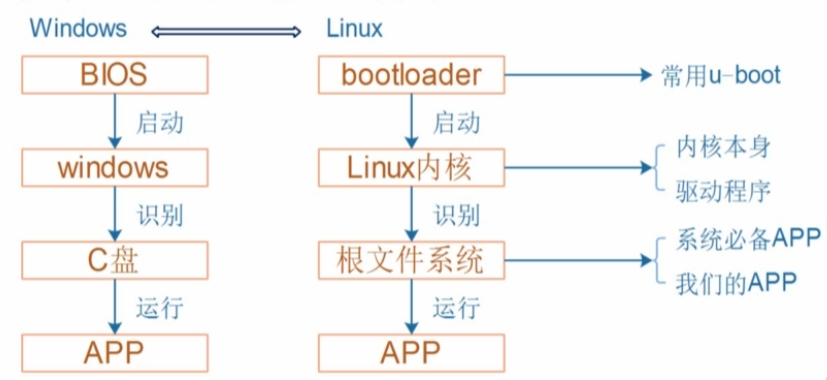
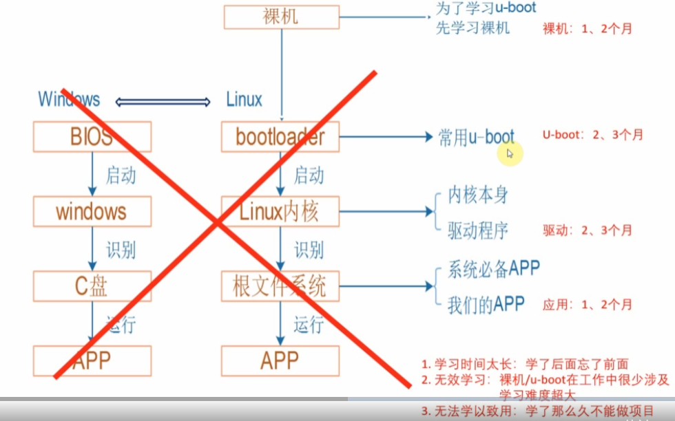
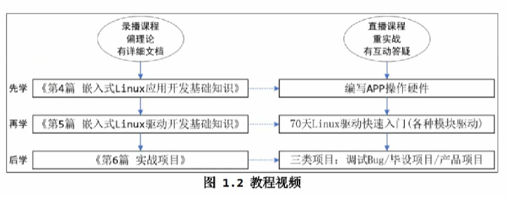

# 目錄

- [Note](#0)
- [1. 嵌入式Linux組成](#1)
- [2. 新的學習路線](#2)
- [3. 開發版體驗操作](#3)

<h1 id="0">Note</h1>

[第1篇：新学习路线/教程介绍/资料下载](https://www.100ask.net/detail/p_6301850be4b0a51fef0fbe92/6?product_id=p_6301850be4b0a51fef0fbe92)

<h1 id="1">01_嵌入式Linux與Winodws的差別</h1>

<h1 id="2">02_新的學習路線</h1>

- 工作中很少改動U-boot，基本上會用就好

- 應用基礎 -> 驅動基礎 -> 項目開發

