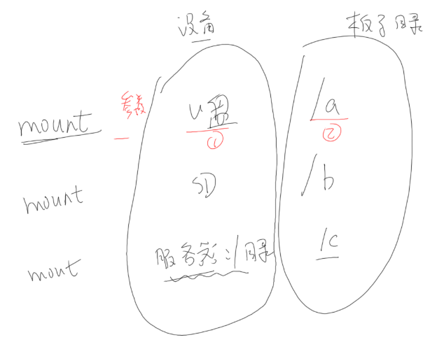
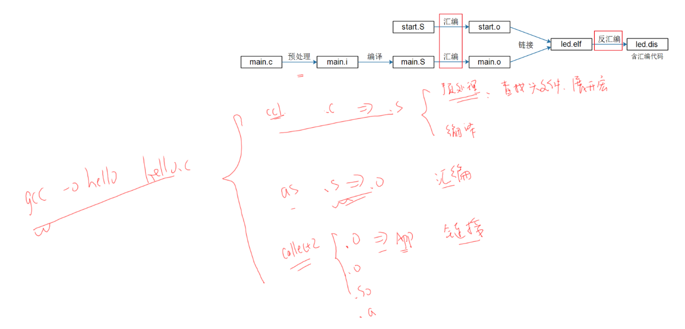
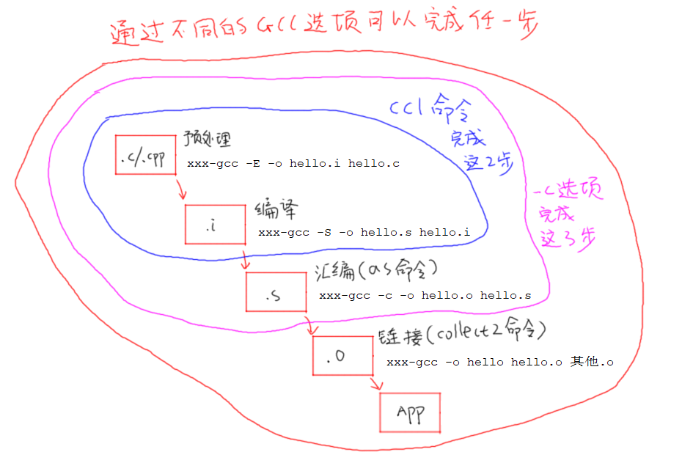
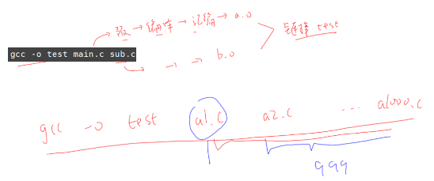
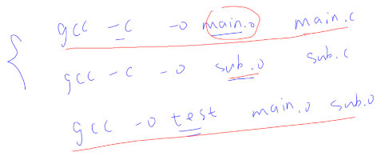
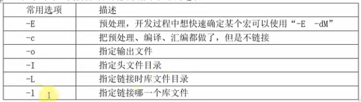
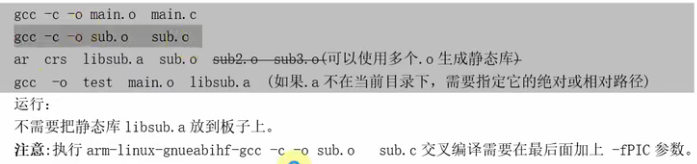
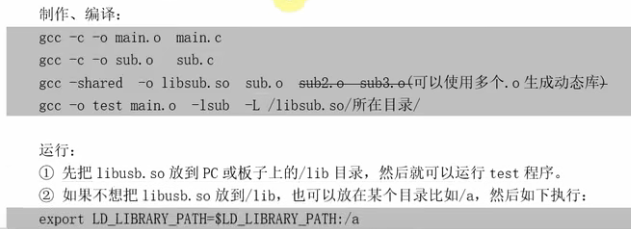
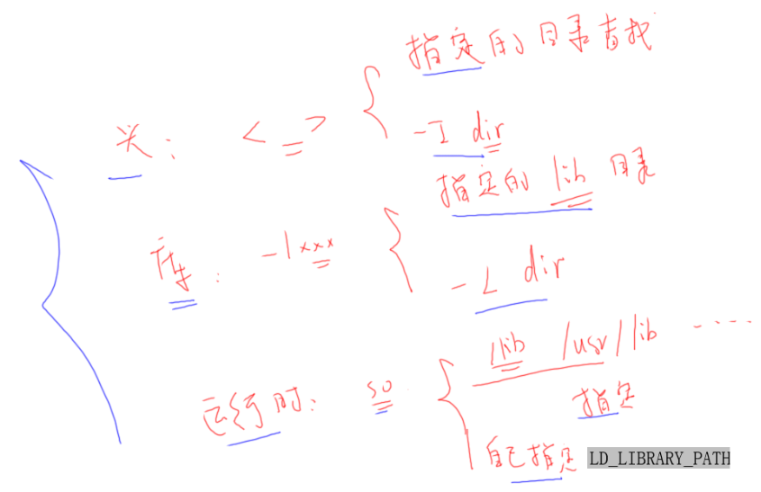
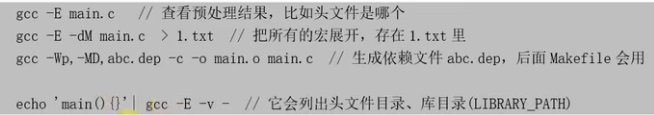

# 目錄

- [Note](#0)
- [01_Hello程序](#1)
  - [1-1_NFS應用](#1.1)
  - [1-2_配置交叉編譯工具鏈](#1.2)
- [02_GCC](#2)
  - [2-1_GCC編譯過程](#2.1)
  - [2-2_GCC常用選項](#2.2)
- [03_Makefile](#3)
  - [3-1_Makefile要達成的效果](#3.1)
  - [3-2_Makefile的引入與規則](#3.2)
  - [3-3_Makefile的語法](#3.3)
  - [3-4_Makefile函數](#3.4)
  - [3-5_Makefile實例](#3.5)


<h1 id="0">Note</h1>

[[第4篇]_嵌入式Linux應用開發基礎知識](https://www.bilibili.com/video/BV1kk4y117Tu?vd_source=790c8244dbe879457094c8374beb04d3)

<h1 id="1">01_Hello程序</h1>

```C
#include <stdio.h>

/* 执行命令: ./hello weidongshan 
 * argc = 2
 * argv[0] = ./hello
 * argv[1] = weidongshan
 */

int main(int argc, char **argv)
{
    if (argc >= 2)
        printf("Hello, %s!\n", argv[1]);
    else
        printf("Hello, world!\n");
    return 0;
}
```

- argc：argument conut 參數個數
- argv：argument value 代表參數值

- header file (.h)： 作為聲明(declare)
- source file (.c)： 作為定義(define)與實現(implement)

- 函式庫目錄定義分為兩種：
  - 系統目錄
  - 指定目錄

<h2 id="1.1">1-1_NFS應用</h2>

- 利用 NFS 來使 Ubuntu 與 開發版 之間傳輸檔案

- 將Ubuntu中的某目錄下掛載到開發版的某個路徑下，在同一個網域下時

    ```Shell
    mount -t nfs -o nolock,vers=3 192.168.1.137:/home/book/nfs_rootfs /mnt
    ```

    

- 但注意要在開發版執行的執行檔要用arm-gcc工具鏈去編譯

    ```Shell
    # PC機編譯器時用的命令是：
    gcc  -o  hello  hello.c

    # 開發板編譯器時用的命令類似下述命令(不同的開發板gcc的首碼可能不同)：
    arm-buildroot-linux-gnueabihf-gcc  -o  hello  hello.c
    ```

- 可以使用 `file` 來查看執行檔

```Shell
chicony@ubuntu:/mnt/disk2/SF/tmp/source/01_hello$ file hello
hello: ELF 64-bit LSB executable, x86-64, version 1 (SYSV), dynamically linked, interpreter /lib64/ld-linux-x86-64.so.2, for GNU/Linux 2.6.32, BuildID[sha1]=d5e79a0a04b6cadd3272cd37627d4d7147b89f96, not stripped
```

<h2 id="1.1">1-2_配置交叉編譯工具鏈</h2>

- 交叉編譯工具鏈用來在Ubuntu主機上編譯應用程式，而這些應用程式是在ARM等其他平臺上運行。

- 設置交叉編譯工具主要是設置PATH， ARCH和CROSS_COMPILE三個環境變數

**永久生效**

- 修改使用者設定檔

    ```Shell
    book@100ask:~$ vim  ~/.bashrc

    # 在行尾添加或修改，加上下面幾行：
    export ARCH=arm
    export CROSS_COMPILE=arm-buildroot-linux-gnueabihf-
    export PATH=$PATH:/home/book/100ask_stm32mp157_pro-sdk/ToolChain/arm-buildroot-linux-gnueabihf_sdk-buildroot/bin

    # 載入這些設置的環境變數
    book@100ask:~$ source  ~/.bashrc
    ```

**臨時生效**

- 手工執行 `export` 命令設置環境變數，該設置只對當前終端有效(另開一個終端需要再次設置)

    ```Shell
    book@100ask:~$ export ARCH=arm
    book@100ask:~$ export CROSS_COMPILE=arm-buildroot-linux-gnueabihf-
    book@100ask:~$ export PATH=$PATH:/home/book/100ask_stm32mp157_pro-sdk/ToolChain/arm-buildroot-linux-gnueabihf_sdk-buildroot/bin
    ```

**手動指定**

- 先設置**PATH環境變數**，
  
- 在make編譯時指定**ARCH架構**與**CROSS_COMPILE交叉編譯工具鏈**(執行make命令時指定的參數，只對當前命令有效；下次執行make時仍需要再次指定那些參數)。

    ```Shell
    book@100ask:~$ export PATH=$PATH:/home/book/100ask_stm32mp157_pro-sdk/ToolChain/arm-buildroot-linux-gnueabihf_sdk-buildroot/bin
    book@100ask:~$ make ARCH=arm CROSS_COMPILE=arm-buildroot-linux-gnueabihf-
    ```

<h1 id="2">02_GCC</h1>

<h2 id="2.1">2-1_GCC編譯過程</h2>

- 機器只能讀取機器碼(即二進制的程式，非0即1)

- 程式的成長流程

    

- `gcc -o hello hello.c` 所完成的動作
  - 可透過加`-v`來查看流程跑了什麼，`gcc -o hello hello.c -v`

    

- GCC編譯過程

    

- 日常說法會把 `編譯` 代表成 `預處理 -> 編譯 -> 匯編`，接著再鏈結

<h2 id="2.2">2-2_GCC常用選項</h2>

- multi-files 進行編譯：各自匯編成.o檔後，鏈結成一個執行檔

    ```Shell
    gcc -o test main.c sub.c
    ```

    

- 當今天有999個文件時，使用這種方式，只要修改一個檔案後，每次重新編譯都會重新編譯999個文件，因此會太消耗資源，所以要先編譯在鏈結，就可以避免掉沒有修改的程式要再重新編譯，較為高效

    

- GCC常用選項

    

- 靜態庫：

    

- 動態庫：

    

- 總結

    
 
    

<h1 id="3">03_Makefile</h1>

<h2 id="3.1">3-1_Makefile要達成的效果</h2>

- 為了能夠高效地編譯程序

- 組織管理程序

- 決定要編譯哪一個文件

<h2 id="3.2">3-2_Makefile的引入與規則</h2>

**Makefile的引入**

- 我們知道.c程序 ==》 得到可執行程序它們之間要經過四個步驟：
    1. 預處理
    2. 編譯
    3. 彙編
    4. 鏈接

- 我們經常把前三個步驟統稱為編譯了。

- 我們具體分析：`gcc -o test a.c b.c`這條命令，它們要經過下面幾個步驟：
    1）對於**a.c**：執行：預處理 編譯 彙編 的過程，**a.c ==>xxx.s ==>xxx.o** 文件。
    2）對於**b.c**：執行：預處理 編譯 彙編 的過程，**b.c ==>yyy.s ==>yyy.o** 文件。
    3）最後：**xxx.o**和**yyy.o**鏈接在一起得到一個**test**應用程序。

    提示：**gcc -o test a.c b.c -v** ：加上一個**‘-v’**選項可以看到它們的處理過程，

- 第一次編譯 a.c 得到 xxx.o 文件，這是很合乎情理的， 執行完第一次之後，如果修改 a.c 又再次執行：`gcc -o test a.c b.c`，對於 a.c 應該重新生成 xxx.o，但是對於 b.c 又會重新編譯一次，這完全沒有必要，b.c 根本沒有修改，直接使用第一次生成的 yyy.o 文件就可以了。

- 因此，對於這些源文件，我們應該分別處理，執行：預處理 編譯 彙編，先分別編譯它們，最後再把它們鏈接在一次，比如：

  - 編譯：

    ```bash
    gcc -o a.o a.c
    gcc -o b.o b.c
    ```

  - 鏈接：

    ```bash
    gcc -o test a.o b.o
    ```

- 比如：上面的例子，當我們修改a.c之後,a.c會重現編譯然後再把它們鏈接在一起就可以了。 `b.c`就不需要重新編譯。

- 如何知道哪些文件被更新了/被修改了？ --> `比較時間`
  - 比較 a.o 和 a.c 的時間，如果a.c的時間比 a.o 的時間更加新的話，就表明 a.c 被修改了，同理b.o和b.c也會進行同樣的比較。
  - 比較test和 a.o,b.o 的時間，如果a.o或者b.o的時間比test更加新的話，就表明應該重新生成test。

**Makefile的規則**

- makefie最基本的語法是規則，規則：

    ```bash
    目標 : 依賴1 依賴2 ...
    [TAB]命令
    ```

- 當**依賴**比**目標**新，執行它們下面的命令。我們要把上面三個命令寫成makefile規則，如下：

    ```bash
    test ：a.o b.o  //test是目標，它依賴於a.o b.o文件，一旦a.o或者b.o比test新的時候，，就需要執行下面的命令，重新生成test可執行程序。
    gcc -o test a.o b.o

    a.o : a.c  //a.o依賴於a.c，當a.c更加新的話，執行下面的命令來生成a.o
    gcc -c -o a.o a.c

    b.o : b.c  //b.o依賴於b.c,當b.c更加新的話，執行下面的命令，來生成b.o
    gcc -c -o b.o b.c
    ```

- 範例: [001_test_app](./%5B%E7%AC%AC4%E7%AF%87%5D_%E5%B5%8C%E5%85%A5%E5%BC%8FLinux%E6%87%89%E7%94%A8%E9%96%8B%E7%99%BC%E5%9F%BA%E7%A4%8E%E7%9F%A5%E8%AD%98/source/04_2018_Makefile/001_test_app/)

<h2 id="3.3">3-3_Makefile的語法</h2>

### Patten - 通配符

- 假如一個目標文件所依賴的依賴文件很多時，我們可以使用通配符，來解決這些繁瑣問題。

    ```bash
    test ：a.o b.o c.o
    gcc -o test a.o b.o

    a.o : a.c
    gcc -c -o a.o a.c

    b.o : b.c
    gcc -c -o b.o b.c

    c.o : c.c
    gcc -c -o c.o c.c
    ```

    ```bash
    test: a.o b.o 
        gcc -o test $^
        
    %.o : %.c
        gcc -c -o $@ $<
    ```

    %.o：表示所用的.o文件
    %.c：表示所有的.c文件
    \$\@：表示目標
    \$\<：表示第1個依賴文件
    \$\^：表示所有依賴文件

- 範例：[001_patten](./%5B%E7%AC%AC4%E7%AF%87%5D_%E5%B5%8C%E5%85%A5%E5%BC%8FLinux%E6%87%89%E7%94%A8%E9%96%8B%E7%99%BC%E5%9F%BA%E7%A4%8E%E7%9F%A5%E8%AD%98/source/04_2018_Makefile/002_syntax/001_patten/)

### 假想目標 .PHONY

1. 我們想清除文件，我們在Makefile的結尾添加如下代碼就可以了：

    ```bash
    test: a.o b.o c.o
        gcc -o test $^
        
    %.o : %.c
        gcc -c -o $@ $<

    clean:
        rm *.o test
    ```

    1）執行 make ：生成第一個可執行文件。
    2）執行 make clean : 清除所有文件，即執行： rm \*.o test。

- make後面可以帶上目標名，也可以不帶，如果不帶目標名的話它就想生成第一個規則裡面的第一個目標。這個寫法有些問題，原因是我們的目錄裡面沒有 clean 這個文件，這個規則執行的條件成立，他就會執行下面的命令來刪除文件。
  - 如果：該目錄下面有名為clean文件怎麼辦呢？

    ```bash
    make: `clean` is up to date.
    ```

  - 它根本沒有執行我們的刪除操作，這是為什麼呢？
  - 現在我們的目錄裡面有名為“clean”的文件，目標文件是有的，並且沒有依賴文件，沒有辦法判斷依賴文件的時間。這種寫法會導致：有同名的"clean"文件時，就沒有辦法執行make clean操作。

- 一個規則能過執行的條件：
  1. 目標文件不存在
  2. 依賴文件比目標新

- 解決辦法：我們需要把目標定義為假象目標，用**關鍵子PHONY**

    ```bash
    # 把clean定義為假象目標。他就不會判斷名為"clean"的文件是否存在
    .PHONY: clean 
    ```

### 變量

在makefile中有兩種變量：

1. 簡單變量(即使變量)：

    ```makefile
    A := xxx    # A的值即刻確定，在定義時即確定
    ```

    對於即使變量使用 `:=` 表示，它的值在定義的時候已經被確定了

2. 延時變量

    ```makefile
    B = xxx   # B的值使用到時才確定
    ```

    對於延時變量使用 `=` 表示。它只有在使用到的時候才確定，在定義/等於時並沒有確定下來。

想使用變量的時候使用`$`來引用

如果不想看到命令是，可以在命令的前面加上`@`符號，就不會顯示命令本身。

當我們執行make命令的時候，make這個指令本身，會把整個Makefile讀進去，進行全部分析，然後解析裡面的變量。常用的變量的定義如下：

```bash
:=      # 即時變量
=       # 延時變量
?=      # 延時變量, 如果是第1次定義才起效, 如果在前面該變量已定義則忽略這句
+=      # 附加, 它是即時變量還是延時變量取決於前面的定義
?=:     # 如果這個變量在前面已經被定義了，這句話就會不會起效果，
```

實例：

```bash
A := $(C)
B = $(C)
C = abc

#D = 100ask
D ?= weidongshan

all:
    @echo A = $(A)
    @echo B = $(B)
    @echo D = $(D)

C += 123
```

執行：

```bash
make
```

結果：

```bash
A =
B = abc 123
D = weidongshan
```

<h2 id="3.4">3-4_Makefile函數</h2>

- makefile裡面可以包含很多函數，這些函數都是make本身實現的，下面我們來幾個常用的函數。

- 引用一個函數用`$`。

### 函數foreach

函数foreach语法如下： 對於list中的每一個var，執行text的公式

```bash
$(foreach var,list,text) 
```

前兩個參數，`var` 和 `list`，將首先擴展，注意最後一個參數 `text` 此時不擴展；接著，對每一個 list 擴展產生的字，將用來為 var擴展後命名的變量賦值；然後 `text` 引用該變量擴展；因此它每次擴展都不相同。結果是由空格隔開的 `text`。在 `list` 中多次擴展的字組成的新的 `list`。 `text` 多次擴展的字串聯起來，字與字之間由空格隔開，如此就產生了函數 `foreach` 的返回值。

實際例子：

```bash
A = a b c
B = $(foreach f, &(A), $(f).o)

all：
    @echo B = $(B)
```

結果：

```bash
B = a.o b.o c.o
```

### 函數filter/filter-out

函數filter/filter-out語法如下：

```bash
$(filter pattern...,text)     # 在text中取出符合patten格式的值
$(filter-out pattern...,text) # 在text中取出不符合patten格式的值
```

實例：

```bash
C = a b c d/

D = $(filter %/, $(C))
E = $(filter-out %/, $(C))

all:
        @echo D = $(D)
        @echo E = $(E)
```

結果：

```bash
D = d/
E = a b c
```

### Wildcard

函數Wildcard語法如下：

```bash
# pattern定義了文件名的格式, wildcard取出其中存在的文件。
$(wildcard pattern)
```

這個函數 wildcard 會以 pattern 這個格式，去尋找存在的文件，返回存在文件的名字。

實例：

在該目錄下創建三個文件：a.c b.c c.c

```bash
files = $(wildcard *.c)

all:
    @echo files = $(files)
```

結果：

```bash
files = a.c b.c c.c
```

我們也可以用wildcard函數來判斷，真實存在的文件

實例：

```bash
files2 = a.c b.c c.c d.c e.c  abc
files3 = $(wildcard $(files2))

all:
    @echo files3 = $(files3)
```

結果：

```bash
files3 = a.c b.c c.c
```

### patsubst

函數 patsubst 語法如下：

```bash
$(patsubst pattern,replacement,\$(var))
```

patsubst 函數是從 var 變量裡面取出每一個值，如果這個符合 pattern 格式，把它替換成 replacement 格式，

實例：

```bash

files2  = a.c b.c c.c d.c e.c abc

dep_files = $(patsubst %.c,%.d,$(files2))

all:
    @echo dep_files = $(dep_files)
```

結果：

```bash
dep_files = a.d b.d c.d d.d e.d abc
```

<h2 id="3.5">3-5_Makefile實例</h2>

在`c.c`裡面，包含一個頭文件`c.h`，在`c.h`裡面定義一個宏，把這個宏打印出來。

c.c:

```C
#include <stdio.h>
#include <c.h>

void func_c()
{
	printf("This is C = %d\n", C);
}
```

c.h:

```C
#define C 1
```

makefile:

```makefile
test: a.o b.o c.o
    gcc -o test $^

%.o : %.c
    gcc -c -o $@ $<

clean:
    rm *.o test

.PHONY: clean
```

然後上傳編譯，執行`./test`,打印出：

```bash
This is B
This is C =1
```

測試沒有問題，然後修改`c.h`：

```C
#define C 2
```

重新編譯，發現沒有更新程序，運行，結果不變，說明現在的Makefile存在問題。

為什麼會出現這個問題呢， 首先我們test依賴c.o，c.o依賴c.c，如果我們更新c.c，會重新更新整個程序。
但c.o也依賴c.h，我們更新了c.h，並沒有在Makefile上體現出來，導致c.h的更新，Makefile無法檢測到。
因此需要添加:

```makefile
c.o : c.c c.h
```

現在每次修改c.h，Makefile都能識別到更新操作，從而更新最後輸出文件。

這樣又冒出了一個新的問題，我們怎麼為每個.c文件添加.h文件呢？對於內核，有幾萬個文件，不可能為每個文件依次寫出其頭文件。因此需要做出改進，讓其自動生成頭文件依賴，可以參考這篇文章：http://blog.csdn.net/qq1452008/article/details/50855810

```bash
gcc -M c.c                          # 打印出依賴

gcc -M -MF c.d c.c                  # 把依賴寫入文件c.d

gcc -c -o c.o c.c -MD -MF c.d       # 編譯c.o, 把依賴寫入文件c.d
```

修改Makefile如下：

```makefile
objs = a.o b.o c.o

dep_files := $(patsubst %,.%.d, $(objs))
dep_files := $(wildcard $(dep_files))

test: $(objs)
    gcc -o test $^

ifneq ($(dep_files),)
include $(dep_files)
endif

%.o : %.c
    gcc -c -o $@ $< -MD -MF .$@.d

clean:
    rm *.o test

distclean:
    rm $(dep_files)

.PHONY: clean	
```

- 首先用obj變量將.o文件放在一塊。
- 利用前面講到的函數，把obj裡所有文件都變為.%.d格式，並用變量dep_files表示。
- 利用前面介紹的wildcard函數，判斷dep_files是否存在。
- 然後是目標文件test依賴所有的.o文件。
- 如果dep_files變量不為空，就將其包含進來。
- 然後就是所有的.o文件都依賴.c文件，且通過-MD -MF生成.d依賴文件。
- 清理所有的.o文件和目標文件
- 清理依賴.d文件。

現在我們修改了任何.h文件，最終都會影響最後生成的文件，也沒任何手工添加.h、.c、.o文件，完成了支持頭文件依賴。

### 自動生成頭文件依賴

可以使用C/C++ 編譯器的 `-M` 選項，即自動獲取源文件中包含的頭文件，並生成一個依賴關係。例如，執行下面的命令：

```Shell
gcc -M main.c 
```

其輸出如下：

```bash
main.o : main.c defs.h
```

由編譯器自動生成依賴關係，這樣做的好處有以下幾點：

- 不必手動書寫若干目標文件的依賴關係，由編譯器自動生成
- 不管是源文件還是頭文件有更新，目標文件都會重新編譯

**參數介紹**

- `-M`

  - 生成文件的依賴關係，同時也把一些標準庫的頭文件包含了進來

  - 本質是告訴預處理器輸出一個適合make 的規則，用於描述各目標文件的依賴關係。對於每個源文件，預處理器輸出一個make 規則，該規則的目標項(target) 是源文件對應的目標文件名，依賴項(dependency) 是源文件中“#include” 引用的所有文件

  - 該選項默認打開了 `-E` 選項， `-E` 參數的用處是使得編譯器在預處理結束時就停止編譯

    ```bash
    $ gcc -M main.c
    # ----------------------------------------------
    main.o: main.c defs.h \
    /usr/include/stdio.h \
    /usr/include/features.h \ 			                                         
    /usr/include/sys/cdefs.h /usr/include/gnu/stubs.h \         			
    /usr/lib/gcc-lib/i486-suse-linux/2.95.3/include/stddef.h \ 			 
    /usr/include/bits/types.h \
    /usr/include/bits/pthreadtypes.h \ 			
    /usr/include/_G_config.h /usr/include/wchar.h \ 			
    /usr/include/bits/wchar.h /usr/include/gconv.h \ 			
    /usr/lib/gcc-lib/i486-suse-linux/2.95.3/include/stdarg.h \ 			
    /usr/include/bits/stdio_lim.h
    ```

- `-MM`

  - 生成文件的依賴關係，和 `-M` 類似，但不包含標準庫的頭文件

    ```bash
    $ gcc -MM main.c
    # ---------------------------------------------
    main.o: main.c defs.h
    ```

- `-MG`

  - 要求把缺失的頭文件按存在對待，並且假定他們和源文件在同一目錄下，必須和 `-M` 選項一起用。

- `-MF File`

  - 當使用了 `-M` 或者 `-MM` 選項時，則把依賴關係寫入名為`File` 的文件中。
  - 若同時也使用了 `-MD` 或 `-MMD`，`-MF` 將覆寫輸出的依賴文件的名稱。

    ```bash
    # 則 -M 輸出的內容就保存在 main.d 文件中了
    $ gcc -M -MF main.d main.c
    ```

- `-MD`

  - 等同於 `-M -MF File`，但是默認關閉了 `-E` 選項
  - 其輸出的文件名是基於 `-o` 選項，若給定了 `-o` 選項，則輸出的文件名是 `-o` 指定的文件名，並添加 `.d` 後綴，若沒有給定，則輸入的文件名作為輸出的文件名，並添加 `.d` 後綴，同時**繼續指定的編譯工作**
  - `-MD` 不會像 `-M` 那樣阻止正常的編譯任務，因為它默認關閉了`-E` 選項，比如命令中使用了 `-c` 選項，其結果要生成 `.o` 文件，若使用了 `-M` 選項，則不會生成 `.o` 文件，若使用的是 `-MD` 選項，則會生成 `.o` 文件

### CFLAGS

下面再添加CFLAGS，即編譯參數

- 比如加上編譯參數 `-Werror`，把所有的警告當成錯誤

- 可以加上 `-I` 參數，指定頭文件路徑
    - `-Iinclude` 表示當前的inclue文件夾下。
此時就可以把c.c文件裡的`#include ".h"`改為`#include <c.h>`，前者表示當**前目錄**，後者表示**編譯器指定的路徑和GCC路徑**。

    ```makefile
    CFLAGS = -Werror -Iinclude

    …………


    %.o : %.c
        gcc $(CFLAGS) -c -o $@ $< -MD -MF .$@.d
    ```
