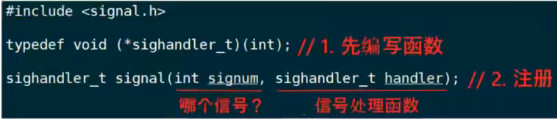
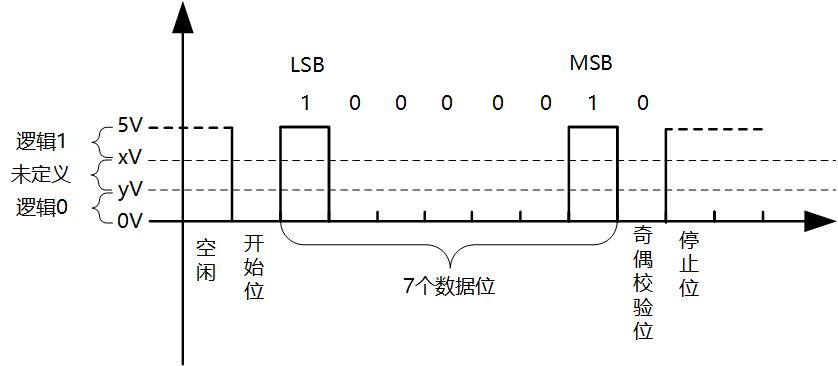
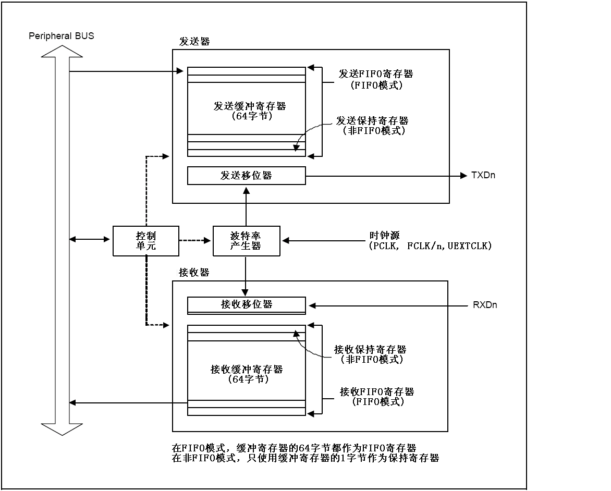
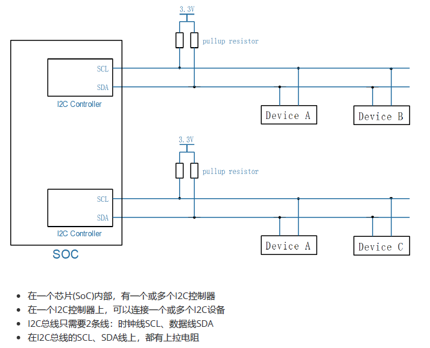
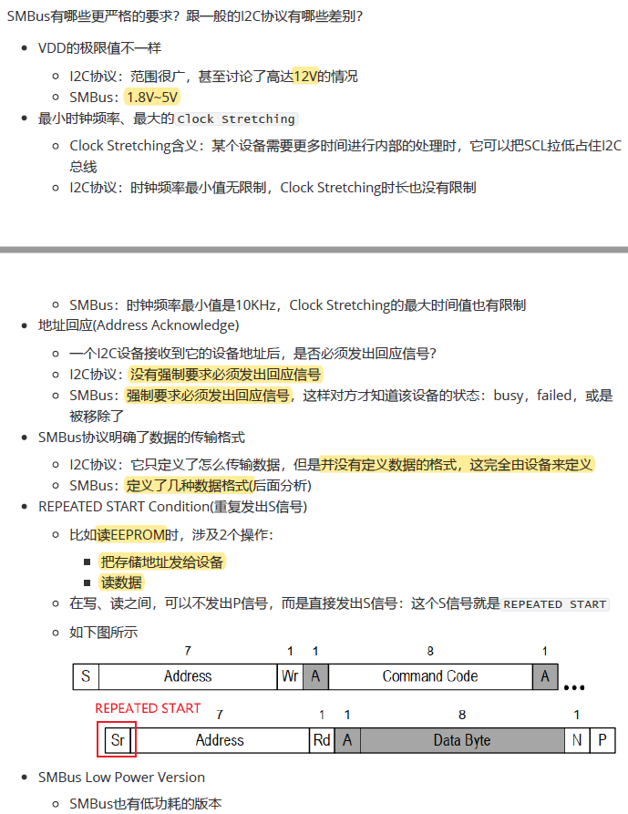
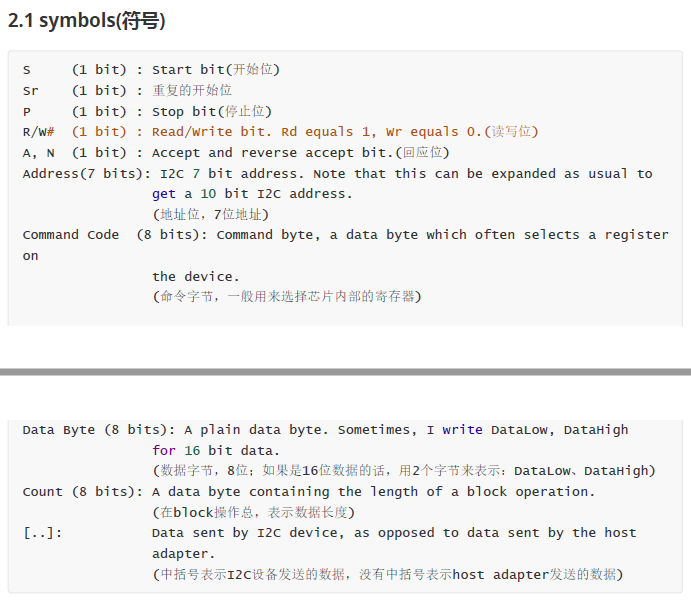
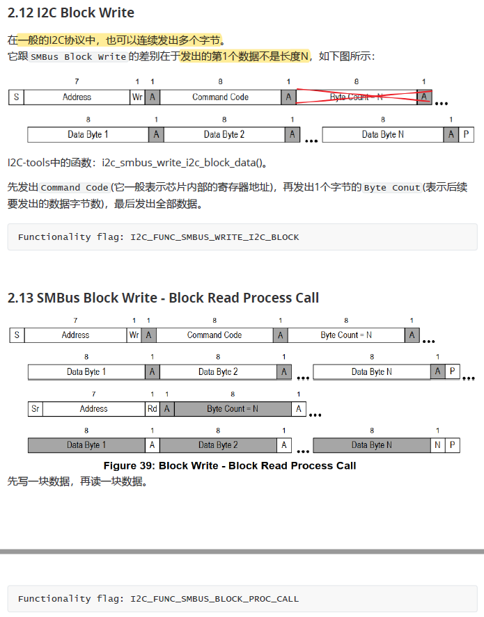
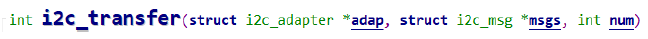
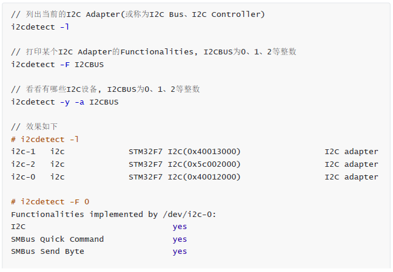

# 目錄

- [Note](#0)
- [01_Hello程序](#1)
  - [1-1_NFS應用](#1.1)
  - [1-2_配置交叉編譯工具鏈](#1.2)
- [02_GCC](#2)
  - [2-1_GCC編譯過程](#2.1)
  - [2-2_GCC常用選項](#2.2)
- [03_Makefile](#3)
  - [3-0_關於gcc、make和CMake的區別](#3.0)
  - [3-1_Makefile要達成的效果](#3.1)
  - [3-2_Makefile的引入與規則](#3.2)
  - [3-3_Makefile的語法](#3.3)
  - [3-4_Makefile函數](#3.4)
  - [3-5_Makefile實例](#3.5)
  - [3-6_通用Makefile的使用](#3.6)
    - [通用Makefile的設計思想](#3.6.0)
    - [一、各級子目錄的Makefile](#3.6.1)
    - [二、頂層目錄的Makefile](#3.6.2)
    - [三、頂層目錄的Makefile.build](#3.6.3)
    - [四、怎麼使用這套Makefile](#3.6.4)
  - [3-7_通用Makefile的解析](#3.7)
  - [3-8_簡介buildroot](#3.8)
  - [3-9_靜動態庫](#3.9)
  - [3-10_參考範例](#3.10)
  - [3-11_指示符include](#3.11)
- [04_文件IO](#4)
  - [4-1_文件IO_讀寫文件](#4.1)
  - [4-2_文件IO_內核接口](#4.2)
- [05_Framebuffer](#5)
  - [5-1_Framebuffer應用編程](#5.1)
- [06_字符應用](#6)
  - [6-1_字符的編碼方式](#6.1)
  - [6-2_ASCII字符的點陣顯示](#6.2)
  - [6-3_中文字符的點陣顯示](#6.3)
  - [6-4_手動交叉編譯程序_以freetype為例](#6.4)
  - [6-5_使用freetype顯示單個文字](#6.5)
  - [6-6_使用freetype顯示一行文字](#6.6)
- [07_輸入系統](#7)
  - [7-1_輸入系統框架及調試](#7.1)
  - [7-2_現場編程讀取獲取輸入設備信息](#7.2)
  - [7-3_查詢與休眠喚醒的方式讀取輸入數據](#7.3)
  - [7-4_POLL或SELECT的方式讀取輸入數據](#7.4)
  - [7-5_異步通知的方式讀取輸入數據](#7.5)
  - [7-6_電阻屏與電容屏](#7.6)
  - [7-7_tslib框架分析](#7.7)
  - [7-8_tslib交叉編譯與測試](#7.8)
  - [7-9_編寫基於tslib的測試程序](#7.9)
- [08_網路相關簡介](#8)
  - [8-1_網路編程概念](#8.1)
  - [8-2_TCP編程範例](#8.2)
  - [8-3_UDP編程範例](#8.3)
- [09_多線程編程](#9)
- [10_UART串口介紹](#10)
  - [10-1_串口應用程序編程介紹](#10.1)
  - [10-2_UART硬件介紹](#10.2)
  - [10-3_TTY體系中設備節點的差別](#10.3)
  - [10-4_TTY驅動程序框架](#10.4)
  - [10-5_串口(UART)應用編程](#10.5)
- [11_I2C介紹](#11)
  - [11-1_I2C應用程序編程介紹](#11.1)
  - [11-2_I2C協議](#11.2)
  - [11-3_SMBus協議](#11.3)
  - [11-4_I2C系統的重要結構體](#11.4)
  - [11-5_無須編寫驅動直接訪問設備_I2C-tool](#11.5)
  - [11-6_編寫APP直接訪問EEPROM](#11.6)


<h1 id="0">Note</h1>

[[第4篇]_嵌入式Linux應用開發基礎知識](https://www.bilibili.com/video/BV1kk4y117Tu?vd_source=790c8244dbe879457094c8374beb04d3)

<h1 id="1">01_Hello程序</h1>

```C
#include <stdio.h>

/* 执行命令: ./hello weidongshan 
 * argc = 2
 * argv[0] = ./hello
 * argv[1] = weidongshan
 */

int main(int argc, char **argv)
{
    if (argc >= 2)
        printf("Hello, %s!\n", argv[1]);
    else
        printf("Hello, world!\n");
    return 0;
}
```

- argc：argument conut 參數個數
- argv：argument value 代表參數值

- header file (.h)： 作為聲明(declare)
- source file (.c)： 作為定義(define)與實現(implement)

- 函式庫目錄定義分為兩種：
  - 系統目錄
  - 指定目錄

<h2 id="1.1">1-1_NFS應用</h2>

- 利用 NFS 來使 Ubuntu 與 開發版 之間傳輸檔案

- 將Ubuntu中的某目錄下掛載到開發版的某個路徑下，在同一個網域下時

    ```Shell
    mount -t nfs -o nolock,vers=3 192.168.1.137:/home/book/nfs_rootfs /mnt
    ```

    

- 但注意要在開發版執行的執行檔要用arm-gcc工具鏈去編譯

    ```Shell
    # PC機編譯器時用的命令是：
    gcc  -o  hello  hello.c

    # 開發板編譯器時用的命令類似下述命令(不同的開發板gcc的首碼可能不同)：
    arm-buildroot-linux-gnueabihf-gcc  -o  hello  hello.c
    ```

- 可以使用 `file` 來查看執行檔

```Shell
chicony@ubuntu:/mnt/disk2/SF/tmp/source/01_hello$ file hello
hello: ELF 64-bit LSB executable, x86-64, version 1 (SYSV), dynamically linked, interpreter /lib64/ld-linux-x86-64.so.2, for GNU/Linux 2.6.32, BuildID[sha1]=d5e79a0a04b6cadd3272cd37627d4d7147b89f96, not stripped
```

<h2 id="1.1">1-2_配置交叉編譯工具鏈</h2>

- 交叉編譯工具鏈用來在Ubuntu主機上編譯應用程式，而這些應用程式是在ARM等其他平臺上運行。

- 設置交叉編譯工具主要是設置PATH， ARCH和CROSS_COMPILE三個環境變數

**永久生效**

- 修改使用者設定檔

    ```Shell
    book@100ask:~$ vim  ~/.bashrc

    # 在行尾添加或修改，加上下面幾行：
    export ARCH=arm
    export CROSS_COMPILE=arm-buildroot-linux-gnueabihf-
    export PATH=$PATH:/home/book/100ask_stm32mp157_pro-sdk/ToolChain/arm-buildroot-linux-gnueabihf_sdk-buildroot/bin

    # 載入這些設置的環境變數
    book@100ask:~$ source  ~/.bashrc
    ```

**臨時生效**

- 手工執行 `export` 命令設置環境變數，該設置只對當前終端有效(另開一個終端需要再次設置)

    ```Shell
    book@100ask:~$ export ARCH=arm
    book@100ask:~$ export CROSS_COMPILE=arm-buildroot-linux-gnueabihf-
    book@100ask:~$ export PATH=$PATH:/home/book/100ask_stm32mp157_pro-sdk/ToolChain/arm-buildroot-linux-gnueabihf_sdk-buildroot/bin
    ```

**手動指定**

- 先設置**PATH環境變數**，
  
- 在make編譯時指定**ARCH架構**與**CROSS_COMPILE交叉編譯工具鏈**(執行make命令時指定的參數，只對當前命令有效；下次執行make時仍需要再次指定那些參數)。

    ```Shell
    book@100ask:~$ export PATH=$PATH:/home/book/100ask_stm32mp157_pro-sdk/ToolChain/arm-buildroot-linux-gnueabihf_sdk-buildroot/bin
    book@100ask:~$ make ARCH=arm CROSS_COMPILE=arm-buildroot-linux-gnueabihf-
    ```

---


怎麼確定交叉編譯器中標頭檔的預設路徑?

- 進入交叉編譯器的目錄裡，執行：`find . -name "stdio.h"`，它位於一個 `include` 目錄下的根目錄裡。

怎麼自己指定標頭檔目錄?

- 編譯時，加上 `-I <標頭檔目錄>` 這樣的選項。

怎麼確定交叉編譯器中庫檔的預設路徑?

- 進入交叉編譯器的目錄裡，執行：`find . -name lib`，可以得到xxxx/lib、xxxx/usr/lib，一般來說這2個目錄就是要找的路徑。
- 如果有很多類似的lib，進去看看，有很多so檔的目錄一般就是要找的路徑。

怎麼自己指定庫檔目錄、指定要用的庫檔?

- 編譯時，加上 `-L <庫檔目錄>` 這樣的選項，用來指定庫目錄
- 編譯時，加上 `-labc` 這樣的選項，用來指定庫檔libabc.so。

<h1 id="2">02_GCC</h1>

<h2 id="2.1">2-1_GCC編譯過程</h2>

機器只能讀取機器碼(即二進制的程式，非0即1)

程式的成長流程


`gcc -o hello hello.c` 所完成的動作

- 可透過加`-v`來查看流程跑了什麼，`gcc -o hello hello.c -v`

    

GCC編譯過程


日常說法會把 `編譯` 代表成 `預處理 -> 編譯 -> 匯編`，接著再鏈結

1. 預處理

    C/C++原始檔案中，以 `#` 開頭的命令被稱為預處理命令，如包含命令`#include`、巨集定義命令`#define`、條件編譯命令`#if`、`#ifdef`等。預處理就是將要包含(include)的檔插入原文件中、將巨集定義展開、根據條件編譯命令選擇要使用的代碼，最後將這些東西輸出到一個`.i`檔中等待進一步處理。

2. 編譯

    編譯就是把C/C++代碼(比如上述的`.i`文件)翻譯成彙編代碼，所用到的工具為cc1(它的名字就是cc1，x86有自己的cc1命令，ARM板也有自己的cc1命令)。

3. 彙編

    彙編就是將第二步輸出的彙編代碼翻譯成符合一定格式的機器代碼，在Linux系統上一般表現為ELF目的檔案(OBJ檔)，用到的工具為as。x86有自己的as命令，ARM版也有自己的as命令，也可能是xxxx-as（比如arm-linux-as）。

4. 連結

    連結就是將上步生成的OBJ檔和系統庫的OBJ檔、庫檔連結起來，最終生成了可以在特定平臺運行的可執行檔，用到的工具為ld或collect2。

<h2 id="2.2">2-2_GCC常用選項</h2>

multi-files 進行編譯：各自匯編成.o檔後，鏈結成一個執行檔

```Shell
gcc -o test main.c sub.c
```


當今天有999個文件時，使用這種方式，只要修改一個檔案後，每次重新編譯都會重新編譯999個文件，因此會太消耗資源，所以要先編譯在鏈結，就可以避免掉沒有修改的程式要再重新編譯，較為高效


**GCC常用選項**


1. `-c`

    預處理、編譯和彙編原始檔案，但是不作連結，編譯器根據原始檔案生成OBJ檔。缺省情況下，GCC通過用`.o替換原始檔案名的尾碼.c，.i，.s`等，產生OBJ檔案名。可以使用-o選項選擇其他名字。GCC忽略-c選項後面任何無法識別的輸入檔。

2. `-S`

    編譯後即停止，不進行彙編。對於每個輸入的非組合語言檔，輸出結果是組合語言檔。缺省情況下，GCC通過用`.s替換原始檔案名尾碼.c, .i`等等，產生彙編檔案名。可以使用-o選項選擇其他名字。GCC忽略任何不需要彙編的輸入檔。

3. `-E`

    預處理後即停止，不進行編譯。預處理後的代碼送往標準輸出。

4. `-o file`

    指定輸出檔為file。無論是預處理、編譯、彙編還是連結，這個選項都可以使用。如果沒有使用`-o`選項，預設的輸出結果是：可執行檔為`a.out`；修改輸入檔的名稱是`source.suffix`，則它的OBJ文件是`source.o`，彙編文件是 `source.s`，而預處理後的C原始程式碼送往標準輸出。

5. `-v`

    顯示製作GCC工具自身時的配置命令；同時顯示編譯器驅動程式、前置處理器、編譯器的版本號。

**警告選項(Warning Option)：**

[Options to Request or Suppress Warnings](https://gcc.gnu.org/onlinedocs/gcc/Warning-Options.html#index-Wunused-variable-Werror=unused-variable%1B]8)

`-Wall`

這個選項基本打開了所有需要注意的警告資訊，比如沒有指定類型的聲明、在聲明之前就使用的函數、區域變數除了聲明就沒再使用等。

```bash
gcc -Wall -c main.c
```

`-w`: Inhibit all warning messages

`-Werror`: Make all warnings into errors

**調試選項(Debugging Option)：**

`-g` 選項加入只有GDB才使用的額外調試資訊。

**優化選項(Optimization Option)：**

1. `-O或-O1`

    不使用`-O`或`-O1`選項時，只有聲明了register的變數才分配使用寄存器。
    使用了`-O`或`-O1`選項，編譯器會試圖減少目的碼的大小和執行時間。

2. `-O2`

    多優化一些。除了涉及空間和速度交換的優化選項，執行幾乎所有的優化工作。

3. `-O3`

    優化的更多。除了打開-O2所做的一切，它還打開了`-finline-functions`選項。

4. `-O0`

    不優化。

**連結器選項(Linker Option)：**

下面的選項用於連結OBJ檔，輸出可執行檔或庫檔。

1. `-nostartfiles`

    不連結系統標準開機檔案，而標準庫檔仍然正常使用：

    ```bash
    $ gcc -v -nostartfiles -o test main.o sub.o

    /usr/lib/gcc-lib/i386-redhat-linux/3.2.2/collect2 --eh-frame-hdr -m elf_i386 -dynamic-linker 
    /lib/ld-linux.so.2 
    -o test 
    -L/usr/lib/gcc-lib/i386-redhat-linux/3.2.2 
    -L/usr/lib/gcc-lib/i386-redhat-linux/3.2.2/../../.. 
    main.o 
    sub.o 
    -lgcc -lgcc_eh -lc -lgcc -lgcc_eh
    /usr/bin/ld: warning: cannot find entry symbol _start; defaulting to 08048184
    ```

    對於一般應用程式，這些開機檔案是必需的，這裡僅是作為例子(這樣編譯出來的test檔無法執行)。在編譯**bootloader**、**內核**時，將用到這個選項。

2. `-nostdlib`

    不連結系統標準開機檔案和標準庫檔，只把指定的檔傳遞給連結器。這個選項常用於**編譯內核、bootloader**等程式，它們不需要開機

    ```bash
    $ gcc -v -nostdlib -o test main.o sub.o

    /usr/lib/gcc-lib/i386-redhat-linux/3.2.2/collect2 --eh-frame-hdr -m elf_i386 -dynamic-linker /lib/ld-linux.so.2 
    -o test 
    -L/usr/lib/gcc-lib/i386-redhat-linux/3.2.2 
    -L/usr/lib/gcc-lib/i386-redhat-linux/3.2.2/../../.. 
    main.o 
    sub.o
    /usr/bin/ld: warning: cannot find entry symbol _start; defaulting to 08048074
    main.o(.text+0x19): In function `main':
    : undefined reference to `printf'
    sub.o(.text+0xf): In function `sub_fun':
    : undefined reference to `printf'
    collect2: ld returned 1 exit status
    ```

    出現了一大堆錯誤，因為printf等函數是在庫檔中實現的。

3. `-static`

    在支援動態連結(dynamic linking)的系統上，阻止連結共用庫。

    仍以options程式為例，是否使用-static選項編譯出來的可執行程式大小相差巨大：

    ```bash
    $ gcc -c -o main.c
    $ gcc -c -o sub.c
    $ gcc -o test main.o sub.o
    $ gcc -o test_static main.o sub.o –static
    $ ls -l test test_static
    -rwxr-xr-x 1 book book   6591 Jan 16 23:51 test
    -rwxr-xr-x 1 book book 546479 Jan 16 23:51 test_static
    ```

    其中test檔為6591位元組，test_static檔為546479位元組。當不使用-static編譯檔時，程式執行前要連結共用庫檔，所以還需要將共用庫檔放入檔案系統中。

4. `-shared`

    生成一個共用OBJ檔，它可以和其他OBJ檔連結產生可執行檔。只有部分系統支援該選項。

    當不想以原始程式碼發佈程式時，可以使用-shared選項生成庫檔，比如對於options程式，可以如下製作庫檔：

    ```bash
    $ gcc -c -o sub.o sub.c
    $ gcc -shared -o libsub.so sub.o
    ```

    以後要使用sub.c中的函數sub_fun時，在連結程式時，指定引腳libsub.so即可，比如：

    ```bash
    $ gcc -o test main.o  -lsub  -L /libsub.so/所在的目錄/
    ```

    可以將多個檔製作為一個庫檔，比如：

    ```bash
    gcc -shared  -o libsub.so  sub.o  sub2.o  sub3.o
    ```

**目錄選項(Directory Option)：**

下列選項指定搜索路徑，用於查找標頭檔，庫檔，或編譯器的某些成員。

1. `-Idir`

    在標頭檔的搜索路徑清單中添加dir 目錄。

    如果以 `#include < >` 包含檔，則只在標準庫目錄開始搜索(包括使用-Idir選項定義的目錄)

    如果以 `#include " "` 包含檔，則先從使用者的工作目錄開始搜索，再搜索標準庫目錄

2. `-Ldir`

    在 `-l` 選項的搜索路徑清單中添加dir目錄。

    仍使用options程式進行說明，先製作庫檔libsub.a：

    ```bash
    $ gcc -c -o sub.o sub.c
    $ gcc -shared -o libsub.a sub.o
    ```

    編譯main.c：

    ```bash
    $ gcc  -c -o  main.o  main.c
    ```

    連結程式，下面的指令將出錯，提示找不到庫檔：

    ```bash
    $ gcc  -o  test  main.o  -lsub
    /usr/bin/ld: cannot find -lsub
    collect2: ld returned 1 exit status
    ```

    可以使用-Ldir選項將目前的目錄加入搜索路徑，如下則連結成功：

    ```bash
    $ gcc -L. -o test main.o -lsub
    ```

**ld/objdump/objcopy選項：**

我們在開發APP時，一般不需要直接調用這3個命令；在開發裸機、bootloader時，或是調試APP時會涉及，到時再講。

**靜態庫：**


**動態庫：**


總結


 


<h1 id="3">03_Makefile</h1>

[Makefile學習教程: 跟我一起寫 Makefile](https://blog.xuite.net/tzeng015/twblog/113272267-Makefile%E5%AD%B8%E7%BF%92%E6%95%99%E7%A8%8B%3A+%E8%B7%9F%E6%88%91%E4%B8%80%E8%B5%B7%E5%AF%AB+Makefile)

<h2 id="3.0">3-0_關於gcc、make和CMake的區別</h2>

https://www.cnblogs.com/xuelisheng/p/9988626.html

- CMake是一種跨平台編譯工具，比make更為高級，使用起來要方便得多。 CMake主要是編寫CMakeLists.txt文件，然後用cmake命令將CMakeLists.txt文件轉化為make所需要的makefile文件，最後用make命令編譯源碼生成可執行程序或共享庫（so(shared object)）.它的作用和qt的qmake是相似的。
- gcc是GNU Compiler Collection（就是GNU編譯器套件），也可以簡單認為是編譯器
- make工具可以看成是一個智能的批處理工具，它本身並沒有編譯和鏈接的功能，而是用類似於批處理的方式—通過調用makefile文件中用戶指定的命令來進行編譯和鏈接的。
- cmake是make maker

<h2 id="3.1">3-1_Makefile要達成的效果</h2>

- 為了能夠高效地編譯程序

- 組織管理程序

- 決定要編譯哪一個文件

- make命令所執行的動作依賴於Makefile文件

<h2 id="3.2">3-2_Makefile的引入與規則</h2>

### Makefile的引入

- 我們知道.c程序 ==》 得到可執行程序它們之間要經過四個步驟：
    1. 預處理
    2. 編譯
    3. 彙編
    4. 鏈接

- 我們經常把前三個步驟統稱為編譯了。

- 我們具體分析：`gcc -o test a.c b.c`這條命令，它們要經過下面幾個步驟：
    1）對於**a.c**：執行：預處理 編譯 彙編 的過程，**a.c ==>xxx.s ==>xxx.o** 文件。
    2）對於**b.c**：執行：預處理 編譯 彙編 的過程，**b.c ==>yyy.s ==>yyy.o** 文件。
    3）最後：**xxx.o**和**yyy.o**鏈接在一起得到一個**test**應用程序。

    提示：**gcc -o test a.c b.c -v** ：加上一個 `-v` 選項可以看到它們的處理過程，

- 第一次編譯 a.c 得到 xxx.o 文件，這是很合乎情理的， 執行完第一次之後，如果修改 a.c 又再次執行：`gcc -o test a.c b.c`，對於 a.c 應該重新生成 xxx.o，但是對於 b.c 又會重新編譯一次，這完全沒有必要，b.c 根本沒有修改，直接使用第一次生成的 yyy.o 文件就可以了。

- 因此，對於這些源文件，我們應該分別處理，執行：預處理 編譯 彙編，先分別編譯它們，最後再把它們鏈接在一次，比如：

  - 編譯：

    ```bash
    gcc -o a.o a.c
    gcc -o b.o b.c
    ```

  - 鏈接：

    ```bash
    gcc -o test a.o b.o
    ```

- 比如：上面的例子，當我們修改a.c之後,a.c會重現編譯然後再把它們鏈接在一起就可以了。 `b.c`就不需要重新編譯。

- 如何知道哪些文件被更新了/被修改了？ --> `比較時間`
  - 比較 a.o 和 a.c 的時間，如果a.c的時間比 a.o 的時間更加新的話，就表明 a.c 被修改了，同理b.o和b.c也會進行同樣的比較。
  - 比較test和 a.o,b.o 的時間，如果a.o或者b.o的時間比test更加新的話，就表明應該重新生成test。

### Makefile的規則

makefie最基本的語法是規則，規則：

```bash
目標(target) : 依賴1 依賴2 (prerequires)...
<TAB>命令(command)
```

- 目標(target)通常是要生成的文件的名稱，可以是可執行文件或OBJ文件，也可以是一個執行的動作名稱，諸如 `clean`。

- 依賴是用來產生目標的材料(比如源文件)，一個目標經常有幾個依賴。

- 命令是生成目標時執行的動作，一個規則可以含有幾個命令，每個命令佔一行。每個命令行前面必須是一個Tab字符，即命令行第一個字符是Tab

當**依賴**比**目標**新，執行它們下面的命令。我們要把上面三個命令寫成makefile規則，如下：

```bash
test ：a.o b.o  //test是目標，它依賴於a.o b.o文件，一旦a.o或者b.o比test新的時候，，就需要執行下面的命令，重新生成test可執行程序。
gcc -o test a.o b.o

a.o : a.c  //a.o依賴於a.c，當a.c更加新的話，執行下面的命令來生成a.o
gcc -c -o a.o a.c

b.o : b.c  //b.o依賴於b.c,當b.c更加新的話，執行下面的命令，來生成b.o
gcc -c -o b.o b.c
```

範例: [001_test_app](./%5B%E7%AC%AC4%E7%AF%87%5D_%E5%B5%8C%E5%85%A5%E5%BC%8FLinux%E6%87%89%E7%94%A8%E9%96%8B%E7%99%BC%E5%9F%BA%E7%A4%8E%E7%9F%A5%E8%AD%98/source/04_2018_Makefile/001_test_app/)

編寫Makefile文件時，要使用Tab來作縮排，不可以使用空格

執行make命令時如果不指定目標，那麼它默認是去生成第1個目標。所以 `第1個目標`，位置很重要。有時候不太方便把第1個目標完整地放在文件前面，這時可以在文件的前面直接放置目標，在後面再完善它的依賴與命令。

比如：

```bash
First_target:         // 這句話放在前面

．．．．// 其他代碼，比如include其他文件得到後面的xxx變量

First_target : $(xxx) $(yyy)   // 在文件的後面再來完善
    command
```

<h2 id="3.3">3-3_Makefile的語法</h2>

### make命令的使用

- 執行make命令時，它會去當前目錄下查找名為 `Makefile` 的文件，並根據它的指示去執行操作，生成第一個目標。

- 我們可以使用 `-f` 選項指定文件，不再使用名為 `Makefile` 的文件，比如：

    ```bash
    make  -f  Makefile.build 
    ```

- 我們可以使用 `-C` 選項指定目錄，切換到其他目錄裡去，比如：

    ```bash
    make -C  a/  -f  Makefile.build 
    ```

- 我們可以指定目標，不再默認生成第一個目標：

    ```bash
    make -C  a/  -f  Makefile.build  other_target
    ```

### Patten - 通配符

- 假如一個目標文件所依賴的依賴文件很多時，我們可以使用通配符，來解決這些繁瑣問題。

    ```bash
    test ：a.o b.o c.o
    gcc -o test a.o b.o

    a.o : a.c
    gcc -c -o a.o a.c

    b.o : b.c
    gcc -c -o b.o b.c

    c.o : c.c
    gcc -c -o c.o c.c
    ```

    ```bash
    test: a.o b.o 
        gcc -o test $^
        
    %.o : %.c
        gcc -c -o $@ $<
    ```

    %.o：表示所用的.o文件
    %.c：表示所有的.c文件
    \$\@：表示目標
    \$\<：表示第1個依賴文件
    \$\^：表示所有依賴文件

- 範例：[001_patten](./%5B%E7%AC%AC4%E7%AF%87%5D_%E5%B5%8C%E5%85%A5%E5%BC%8FLinux%E6%87%89%E7%94%A8%E9%96%8B%E7%99%BC%E5%9F%BA%E7%A4%8E%E7%9F%A5%E8%AD%98/source/04_2018_Makefile/002_syntax/001_patten/)

### 假想目標 .PHONY

1. 我們想清除文件，我們在Makefile的結尾添加如下代碼就可以了：

    ```bash
    test: a.o b.o c.o
        gcc -o test $^
        
    %.o : %.c
        gcc -c -o $@ $<

    clean:
        rm *.o test
    ```

    1）執行 make ：生成第一個可執行文件。
    2）執行 make clean : 清除所有文件，即執行： rm \*.o test。

- make後面可以帶上目標名，也可以不帶，如果不帶目標名的話它就想生成第一個規則裡面的第一個目標。這個寫法有些問題，原因是我們的目錄裡面沒有 clean 這個文件，這個規則執行的條件成立，他就會執行下面的命令來刪除文件。
  - 如果：該目錄下面有名為clean文件怎麼辦呢？

    ```bash
    make: `clean` is up to date.
    ```

  - 它根本沒有執行我們的刪除操作，這是為什麼呢？
  - 現在我們的目錄裡面有名為“clean”的文件，目標文件是有的，並且沒有依賴文件，沒有辦法判斷依賴文件的時間。這種寫法會導致：有同名的"clean"文件時，就沒有辦法執行make clean操作。

- 一個規則能過執行的條件：
  1. 目標文件不存在
  2. 依賴文件比目標新

- 解決辦法：我們需要把目標定義為假象目標，用**關鍵子PHONY**

    ```bash
    # 把clean定義為假象目標。他就不會判斷名為"clean"的文件是否存在
    .PHONY: clean 
    ```

### 變量

在makefile中有兩種變量：

1. 簡單變量(即使變量)：

    ```makefile
    A := xxx    # A的值即刻確定，在定義時即確定
    ```

    對於即使變量使用 `:=` 表示，它的值在定義的時候已經被確定了

2. 延時變量

    ```makefile
    B = xxx   # B的值使用到時才確定
    ```

    對於延時變量使用 `=` 表示。它只有在使用到的時候才確定，在定義/等於時並沒有確定下來。

想使用變量的時候使用`$`來引用

如果不想看到命令是，可以在命令的前面加上`@`符號，就不會顯示命令本身。

當我們執行make命令的時候，make這個指令本身，會把整個Makefile讀進去，進行全部分析，然後解析裡面的變量。常用的變量的定義如下：

```bash
:=      # 即時變量
=       # 延時變量
?=      # 延時變量, 如果是第1次定義才起效, 如果在前面該變量已定義則忽略這句
+=      # 附加, 它是即時變量還是延時變量取決於前面的定義
?=:     # 如果這個變量在前面已經被定義了，這句話就會不會起效果，
```

實例：

```bash
A := $(C)
B = $(C)
C = abc

#D = 100ask
D ?= weidongshan

all:
    @echo A = $(A)
    @echo B = $(B)
    @echo D = $(D)

C += 123
```

執行：

```bash
make
```

結果：

```bash
A =
B = abc 123
D = weidongshan
```

### 變量的導出(export)

在編譯程序時，我們會不斷地使用 `make -C dir` 切換到其他目錄，執行其他目錄裡的Makefile。如果想讓某個變量的值在所有目錄中都可見，要把它 `export` 出來。

比如 `CC = $(CROSS_COMPILE)gcc`，這個CC變量表示編譯器，在整個過程中都是一樣的。定義它之後，要使用 `export CC` 把它導出來。

### Makefile中可以使用shell命令

比如：

```Makefile
TOPDIR := $(shell pwd)
```

這是個立即變量，TOPDIR等於shell命令pwd的結果。

<h2 id="3.4">3-4_Makefile函數</h2>

- makefile裡面可以包含很多函數，這些函數都是make本身實現的，下面我們來幾個常用的函數。

- 引用一個函數用`$`。

- 函數調用的格式如下： `$(function arguments)`
  - 這裡 `function` 是函數名，`arguments` 是該函數的參數。
  - 參數和函數名之間是用空格或Tab隔開，如果有多個參數，它們之間用逗號隔開。
  - 這些空格和逗號不是參數值的一部分。

### 字符串替換和分析函數

#### 函數subst

```Makefile
$(subst from, to, text) 
```

在文本 `text` 中使用 `to` 替換每一處 `from`。

比如：

```Makefile
$(subst ee, EE, feet on the street)
```

結果為 `fEEt on the strEEt`

#### 函數patsubst

函數 patsubst 語法如下：

```Makefile
$(patsubst pattern, replacement, $(var))
```

patsubst 函數是從 var 變量裡面取出每一個值，如果這個符合 pattern 格式，把它替換成 replacement 格式，

實例：

```Makefile
files2  = a.c b.c c.c d.c e.c abc

dep_files = $(patsubst %.c, %.d, $(files2))

all:
    @echo dep_files = $(dep_files)
```

結果：

```bash
dep_files = a.d b.d c.d d.d e.d abc
```

#### 函數strip

```Makefile
$(strip string)
```

去掉前導和結尾空格，並將中間的多個空格壓縮為單個空格。

比如：

```Makefile
$(strip a   b c )
```

結果為 `a b c`

#### 函數findstring

```Makefile
$(findstring find, in)
```

在字符串 `in` 中搜尋 `find`，如果找到，則返回值是 `find`，否則返回值為空。

比如：

```Makefile
$(findstring a, a b c)
$(findstring a, b c)
```

將分別產生值 `a` 和 `(空字符串)`

#### 函數foreach

函数foreach语法如下： 對於list中的每一個var，執行text的公式

```Makefile
$(foreach var, list, text) 
```

前兩個參數，`var` 和 `list`，將首先擴展，注意最後一個參數 `text` 此時不擴展；接著，對每一個 list 擴展產生的字，將用來為 var擴展後命名的變量賦值；然後 `text` 引用該變量擴展；因此它每次擴展都不相同。結果是由空格隔開的 `text`。在 `list` 中多次擴展的字組成的新的 `list`。 `text` 多次擴展的字串聯起來，字與字之間由空格隔開，如此就產生了函數 `foreach` 的返回值。

實際例子：

```Makefile
A = a b c
B = $(foreach f, &(A), $(f).o)

all：
    @echo B = $(B)
```

結果：

```bash
B = a.o b.o c.o
```

### 函數filter/filter-out

函數filter/filter-out語法如下：

```Makefile
$(filter pattern...,text)     # 在text中取出符合patten格式的值
$(filter-out pattern...,text) # 在text中取出不符合patten格式的值
```

實例：

```Makefile
C = a b c d/

D = $(filter %/, $(C))
E = $(filter-out %/, $(C))

all:
        @echo D = $(D)
        @echo E = $(E)
```

結果：

```bash
D = d/
E = a b c
```

#### 函數sort

```Makefile
$(sort list)
```

將 `list` 中的字按字母順序排序，並去掉重複的字。輸出由單個空格隔開的字的列表。

比如：

```Makefile
$(sort foo bar lose)
```

返回值是 `bar foo lose`

### 文件名函数

#### 函數dir

```Makefile
$(dir names...)
```

抽取 `names...` 中每一個文件名的路徑部分，文件名的路徑部分包括從文件名的首字符到最後一個斜杠(含斜杠)之前的一切字符。

比如：

```Makefile
$(dir src/foo.c hacks)
```

結果為 `src/ ./`

#### 函數notdir

```Makefile
$(notdir names...)
```

抽取 `names...` 中每一個文件名中除路徑部分外一切字符（真正的文件名）。

比如：

```Makefile
$(notdir src/foo.c hacks)
```

結果為 `foo.c hacks`

#### 函數suffix

```Makefile
$(suffix names...)
```

抽取 `names...` 中每一個文件名的後綴。

比如：

```Makefile
$(suffix src/foo.c src-1.0/bar.c hacks)
```

結果為 `.c .c`

#### 函數basename

```Makefile
$(basename names...)
```

抽取 `names...` 中每一个文件名中除后缀外一切字符。

比如：

```Makefile
$(basename src/foo.c src-1.0/bar hacks)
```

結果為 `src/foo src-1.0/bar hacks`

#### 函數addsuffix

參數 `names...` 是一系列的文件名，文件名之間用空格隔開；`suffix` 是一個後綴名。將 `suffix(後綴)` 的值附加在每一個獨立文件名的後面，完成後將文件名串聯起來，它們之間用單個空格隔開。

比如：

```Makefile
$(addsuffix .c, foo bar)
```

結果為 `foo.c bar.c`

#### 函數addprefix

```Makefile
$(addprefix prefix,names...)
```

參數 `names` 是一系列的文件名，文件名之間用空格隔開；`prefix` 是一個前綴名。將 `preffix(前綴)` 的值附加在每一個獨立文件名的前面，完成後將文件名串聯起來，它們之間用單個空格隔開。

比如：

```Makefile
$(addprefix src/,foo bar)
```

結果為 `src/foo src/bar`

#### Wildcard

函數Wildcard語法如下：

```Makefile
# pattern定義了文件名的格式, wildcard取出其中存在的文件。
$(wildcard pattern)
```

這個函數 wildcard 會以 pattern 這個格式，去尋找存在的文件，**返回存在文件的名字**。

實例：

在該目錄下創建三個文件：a.c b.c c.c

```Makefile
files = $(wildcard *.c)

all:
    @echo files = $(files)
```

結果：

```bash
files = a.c b.c c.c
```

我們也可以用wildcard函數來判斷，真實存在的文件

實例：

```Makefile
files2 = a.c b.c c.c d.c e.c  abc
files3 = $(wildcard $(files2))

all:
    @echo files3 = $(files3)
```

結果：

```bash
files3 = a.c b.c c.c
```

### 其他函數

#### 函數if

```Makefile
$(if condition, then-part [,else-part])
```

首先把第一個參數 `condition` 的前導空格、結尾空格去掉，然後擴展。如果擴展為非空字符串，則條件 `condition` 為 `真`；如果擴展為空字符串，則條件`condition` 為 `假`。

如果條件 `condition` 為 `真`, 那麼計算第二個參數 `then-part` 的值，並將該值作為整個函數if的值。

如果條件 `condition` 為 `假`, 並且第三個參數存在，則計算第三個參數  `else-part` 的值，並將該值作為整個函數if的值；如果第三個參數不存在，函數if將什麼也不計算，返回空值。

#### 函數origin

```Makefile
$(origin variable)
```

變量 `variable` 是一個查詢變量的名稱，不是對該變量的引用。所以，不能採用 `$` 和 `圓括號` 的格式書寫該變量，當然，如果需要使用非常量的文件名，可以在文件名中使用變量引用。

函數origin的結果是一個字符串，該字符串變量是這樣定義的：

```
‘undefined'		：如果變量‘variable’從沒有定義；
‘default'		：變量‘variable’是缺省定義；
‘environment'		：變量‘variable’作為環境變量定義，選項‘-e’沒有打開；
‘environment override'	：變量‘variable’作為環境變量定義，選項‘-e’已打開；
‘file' 			：變量‘variable’在Makefile中定義；
‘command line' 		：變量‘variable’在命令行中定義；
‘override' 		：變量‘variable’在Makefile中用override指令定義；
‘automatic' 		：變量‘variable’是自動變量
```

#### 函數shell

```Makefile
$(shell command arguments)
```

函數shell是make與外部環境的通訊工具。函數shell的執行結果和在控制台上執行`command arguments` 的結果相似。不過如果 `command arguments` 的結果含有換行符（和回車符），則在函數shell的返回結果中將把它們處理為單個空格，若返回結果最後是換行符（和回車符）則被去掉。

比如當前目錄下有文件1.c、2.c、1.h、2.h，則：

```Makefile
c_src := $(shell ls *.c)
```

<h2 id="3.5">3-5_Makefile實例</h2>

在`c.c`裡面，包含一個頭文件`c.h`，在`c.h`裡面定義一個宏，把這個宏打印出來。

c.c:

```C
#include <stdio.h>
#include <c.h>

void func_c()
{
    printf("This is C = %d\n", C);
}
```

c.h:

```C
#define C 1
```

makefile:

```makefile
test: a.o b.o c.o
    gcc -o test $^

%.o : %.c
    gcc -c -o $@ $<

clean:
    rm *.o test

.PHONY: clean
```

然後上傳編譯，執行`./test`,打印出：

```bash
This is B
This is C =1
```

測試沒有問題，然後修改`c.h`：

```C
#define C 2
```

重新編譯，發現沒有更新程序，運行，結果不變，說明現在的Makefile存在問題。

為什麼會出現這個問題呢， 首先我們test依賴c.o，c.o依賴c.c，如果我們更新c.c，會重新更新整個程序。
但c.o也依賴c.h，我們更新了c.h，並沒有在Makefile上體現出來，導致c.h的更新，Makefile無法檢測到。
因此需要添加:

```makefile
c.o : c.c c.h
```

現在每次修改c.h，Makefile都能識別到更新操作，從而更新最後輸出文件。

這樣又冒出了一個新的問題，我們怎麼為每個.c文件添加.h文件呢？對於內核，有幾萬個文件，不可能為每個文件依次寫出其頭文件。因此需要做出改進，讓其自動生成頭文件依賴，可以參考這篇文章：http://blog.csdn.net/qq1452008/article/details/50855810

```bash
gcc -M c.c                          # 打印出依賴

gcc -M -MF c.d c.c                  # 把依賴寫入文件c.d

gcc -c -o c.o c.c -MD -MF c.d       # 編譯c.o, 把依賴寫入文件c.d
```

修改Makefile如下：

```makefile
objs = a.o b.o c.o

dep_files := $(patsubst %,.%.d, $(objs))
dep_files := $(wildcard $(dep_files))

test: $(objs)
    gcc -o test $^

ifneq ($(dep_files),)
include $(dep_files)
endif

%.o : %.c
    gcc -c -o $@ $< -MD -MF .$@.d

clean:
    rm *.o test

distclean:
    rm $(dep_files)

.PHONY: clean	
```

- 首先用obj變量將.o文件放在一塊。
- 利用前面講到的函數，把obj裡所有文件都變為.%.d格式，並用變量dep_files表示。
- 利用前面介紹的wildcard函數，判斷dep_files是否存在。
- 然後是目標文件test依賴所有的.o文件。
- 如果dep_files變量不為空，就將其包含進來。
- 然後就是所有的.o文件都依賴.c文件，且通過-MD -MF生成.d依賴文件。
- 清理所有的.o文件和目標文件
- 清理依賴.d文件。

現在我們修改了任何.h文件，最終都會影響最後生成的文件，也沒任何手工添加.h、.c、.o文件，完成了支持頭文件依賴。

### 自動生成頭文件依賴

可以使用C/C++ 編譯器的 `-M` 選項，即自動獲取源文件中包含的頭文件，並生成一個依賴關係。例如，執行下面的命令：

```Shell
gcc -M main.c 
```

其輸出如下：

```bash
main.o : main.c defs.h
```

由編譯器自動生成依賴關係，這樣做的好處有以下幾點：

- 不必手動書寫若干目標文件的依賴關係，由編譯器自動生成
- 不管是源文件還是頭文件有更新，目標文件都會重新編譯

**參數介紹**

- `-M`

  - 生成文件的依賴關係，同時也把一些標準庫的頭文件包含了進來

  - 本質是告訴預處理器輸出一個適合make 的規則，用於描述各目標文件的依賴關係。對於每個源文件，預處理器輸出一個make 規則，該規則的目標項(target) 是源文件對應的目標文件名，依賴項(dependency) 是源文件中“#include” 引用的所有文件

  - 該選項默認打開了 `-E` 選項， `-E` 參數的用處是使得編譯器在預處理結束時就停止編譯

    ```bash
    $ gcc -M main.c
    # ----------------------------------------------
    main.o: main.c defs.h \
    /usr/include/stdio.h \
    /usr/include/features.h \ 			                                         
    /usr/include/sys/cdefs.h /usr/include/gnu/stubs.h \         			
    /usr/lib/gcc-lib/i486-suse-linux/2.95.3/include/stddef.h \ 			 
    /usr/include/bits/types.h \
    /usr/include/bits/pthreadtypes.h \ 			
    /usr/include/_G_config.h /usr/include/wchar.h \ 			
    /usr/include/bits/wchar.h /usr/include/gconv.h \ 			
    /usr/lib/gcc-lib/i486-suse-linux/2.95.3/include/stdarg.h \ 			
    /usr/include/bits/stdio_lim.h
    ```

- `-MM`

  - 生成文件的依賴關係，和 `-M` 類似，但不包含標準庫的頭文件

    ```bash
    $ gcc -MM main.c
    # ---------------------------------------------
    main.o: main.c defs.h
    ```

- `-MG`

  - 要求把缺失的頭文件按存在對待，並且假定他們和源文件在同一目錄下，必須和 `-M` 選項一起用。

- `-MF File`

  - 當使用了 `-M` 或者 `-MM` 選項時，則把依賴關係寫入名為`File` 的文件中。
  - 若同時也使用了 `-MD` 或 `-MMD`，`-MF` 將覆寫輸出的依賴文件的名稱。

    ```bash
    # 則 -M 輸出的內容就保存在 main.d 文件中了
    $ gcc -M -MF main.d main.c
    ```

- `-MD`

  - 等同於 `-M -MF File`，但是默認關閉了 `-E` 選項
  - 其輸出的文件名是基於 `-o` 選項，若給定了 `-o` 選項，則輸出的文件名是 `-o` 指定的文件名，並添加 `.d` 後綴，若沒有給定，則輸入的文件名作為輸出的文件名，並添加 `.d` 後綴，同時**繼續指定的編譯工作**
  - `-MD` 不會像 `-M` 那樣阻止正常的編譯任務，因為它默認關閉了`-E` 選項，比如命令中使用了 `-c` 選項，其結果要生成 `.o` 文件，若使用了 `-M` 選項，則不會生成 `.o` 文件，若使用的是 `-MD` 選項，則會生成 `.o` 文件

### CFLAGS

下面再添加CFLAGS，即編譯參數

- 比如加上編譯參數 `-Werror`，把所有的警告當成錯誤

- 可以加上 `-I` 參數，指定頭文件路徑
    - `-Iinclude` 表示當前的inclue文件夾下。
此時就可以把c.c文件裡的`#include ".h"`改為`#include <c.h>`，前者表示當**前目錄**，後者表示**編譯器指定的路徑和GCC路徑**。

    ```makefile
    CFLAGS = -Werror -Iinclude
    …………

    %.o : %.c
        gcc $(CFLAGS) -c -o $@ $< -MD -MF .$@.d
    ```

<h2 id="3.6">3-6_通用Makefile的使用</h2>

<h3 id="3.6.0">通用Makefile的設計思想：</h3>

**在Makefile文件中確定要編譯的文件、目錄，比如：**

```Makefile
obj-y += main.o
obj-y += a/
```

`Makefile` 文件總是被 `Makefile.build` 包含的。

**在Makefile.build中設置編譯規則，有3條編譯規則：**

1. 怎麼編譯子目錄？進入子目錄編譯：

    ```Makefile
    $(subdir-y):
        make -C $@ -f $(TOPDIR)/Makefile.build
    ```

2. 怎麼編譯當前目錄中的文件?

    ```Makefile
    %.o : %.c
        $(CC) $(CFLAGS) $(EXTRA_CFLAGS) $(CFLAGS_$@) -Wp,-MD,$(dep_file) -c -o $@ $<
    ```

3. 當前目錄下的.o和子目錄下的built-in.o要打包起來：

    ```Makefile
    built-in.o : $(cur_objs) $(subdir_objs)
        $(LD) -r -o $@ $^
    ```

**頂層Makefile中把頂層目錄的built-in.o鏈接成APP：**

```Makefile
$(TARGET) : built-in.o
    $(CC) $(LDFLAGS) -o $(TARGET) built-in.o
```

---

參考Linux內核的Makefile編寫一個通用的Makefile，它可以用來編譯應用程序：

1. 支持多個目錄、多層目錄、多個文件
2. 支持給所有文件設置編譯選項
3. 支持給某個目錄設置編譯選項
4. 支持給某個文件單獨設置編譯選項

本程序的Makefile分為3類:
1. 頂層目錄的Makefile
2. 頂層目錄的Makefile.build
3. 各級子目錄的Makefile

<h3 id="3.6.1">一、各級子目錄的Makefile：</h3>

[sub-Makefile](./%5B%E7%AC%AC4%E7%AF%87%5D_%E5%B5%8C%E5%85%A5%E5%BC%8FLinux%E6%87%89%E7%94%A8%E9%96%8B%E7%99%BC%E5%9F%BA%E7%A4%8E%E7%9F%A5%E8%AD%98/source/05_general_Makefile/example/a/Makefile)

它最簡單，形式如下：

```makefile
EXTRA_CFLAGS  := 
CFLAGS_file.o := 

obj-y += file.o
obj-y += subdir/
```

- "`obj-y += file.o`"  表示把當前目錄下的file.c編進程序裡，
- "`obj-y += subdir/`" 表示要進入subdir這個子目錄下去尋找文件來編進程序裡，是哪些文件由subdir目錄下的Makefile決定。
- "`EXTRA_CFLAGS`",    它給當前目錄下的所有文件(不含其下的子目錄)設置額外的編譯選項, 可以不設置
- "`CFLAGS_xxx.o`",    它給當前目錄下的xxx.c設置它自己的編譯選項, 可以不設置

注意: 
1. "subdir/"中的斜杠"/"不可省略
2. 頂層Makefile中的CFLAGS在編譯任意一個.c文件時都會使用
3. `CFLAGS`  `EXTRA_CFLAGS`  `CFLAGS_xxx.o` 三者組成xxx.c的編譯選項

EXTRA_CFLAGS := -D \<MircoName\> ： 代表定義Makefile目錄下某個 .c或.h 使用到的宏

<h3 id="3.6.2">二、頂層目錄的Makefile：</h3>

[Makefile](./%5B%E7%AC%AC4%E7%AF%87%5D_%E5%B5%8C%E5%85%A5%E5%BC%8FLinux%E6%87%89%E7%94%A8%E9%96%8B%E7%99%BC%E5%9F%BA%E7%A4%8E%E7%9F%A5%E8%AD%98/source/05_general_Makefile/example/Makefile)

它除了定義obj-y來指定根目錄下要編進程序去的文件、子目錄外，
主要是定義工具鏈前綴CROSS_COMPILE,
定義編譯參數CFLAGS,
定義鏈接參數LDFLAGS,
這些參數就是文件中用export導出的各變量。

<h3 id="3.6.3">三、頂層目錄的Makefile.build：</h3>

[Makefile.build](./%5B%E7%AC%AC4%E7%AF%87%5D_%E5%B5%8C%E5%85%A5%E5%BC%8FLinux%E6%87%89%E7%94%A8%E9%96%8B%E7%99%BC%E5%9F%BA%E7%A4%8E%E7%9F%A5%E8%AD%98/source/05_general_Makefile/example/Makefile.build)

這是最複雜的部分，它的功能就是把某個目錄及它的所有子目錄中、需要編進程序去的文件都編譯出來，打包為built-in.o

<h3 id="3.6.4">四、怎麼使用這套Makefile：</h3>

1. 把頂層Makefile, Makefile.build放入程序的頂層目錄
   在各自子目錄創建一個空白的Makefile

2. 確定編譯哪些源文件
   修改頂層目錄和各自子目錄Makefile的obj-y : 
    obj-y += xxx.o
	obj-y += yyy/
	這表示要編譯當前目錄下的xxx.c, 要編譯當前目錄下的yyy子目錄	

3. 確定編譯選項、鏈接選項
   修改頂層目錄Makefile的CFLAGS，這是編譯所有.c文件時都要用的編譯選項;
   修改頂層目錄Makefile的LDFLAGS，這是鏈接最後的應用程序時的鏈接選項;
   
   修改各自子目錄下的Makefile：
   "EXTRA_CFLAGS",    它給當前目錄下的所有文件(不含其下的子目錄)設置額外的編譯選項, 可以不設置
   "CFLAGS_xxx.o",    它給當前目錄下的xxx.c設置它自己的編譯選項, 可以不設置
   
4. 使用哪個編譯器？
   修改頂層目錄Makefile的CROSS_COMPILE, 用來指定工具鏈的前綴(比如arm-linux-)
   
5. 確定應用程序的名字：
   修改頂層目錄Makefile的TARGET, 這是用來指定編譯出來的程序的名字

6. 執行"make"來編譯，執行"make clean"來清除，執行"make distclean"來徹底清除

<h2 id="3.7">3-7_通用Makefile的解析</h2>

built-in.o：每個Makefile的目錄下都會把.o編譯成一個build-in.o，最後頂層目錄的Makefile會把當前目錄的.o與全部子目錄的build-in.o再編譯成一個build-in.o，用來代表所有的.o文件


Makefile搭配Makefile.build編譯程式之流程分析


<h2 id="3.8">3-8_簡介buildroot</h2>

### 什麼是buildroot

Buildroot是Linux平臺上一個構建嵌入式Linux系統的框架。

整個Buildroot是由Makefile腳本和Kconfig配置文件構成的。

你可以和編譯Linux內核一樣，通過buildroot配置，menuconfig修改，編譯出一個完整的可以直接燒寫到機器上運行的Linux系統軟件(包含boot、kernel、rootfs以及rootfs中的各種庫和應用程序)。

下載: `git clone git://git.buildroot.net/buildroot`

解壓: `tar -xzvf buildroot-2017.02.9.tar.gz`

### buildroot 的目錄結構, 工作原理, 與更進一步資訊

[https://www.twblogs.net/a/5bf5cc22bd9eee37a1434c76#:~:text=2017.02.9.tar.gz-,1.2%20buildroot%20%E7%9A%84%E7%9B%AE%E9%8C%84%E7%B5%90%E6%A7%8B,-buildroot/package/%EF%BC%9A%E4%B8%8B%E9%9D%A2]

<h2 id="3.9">3-9_靜動態庫</h2>

1. 靜態庫(static library) libxxx.a

   - 生成.o檔 : `gcc xxx.c -c -o xxx.o`

   - 生成.a檔 : `ar -cr libxxx.a xxx.o`

   - 保留.h與.a即可使用相關function 

   - 使用相關庫編譯出執行檔 : `gcc -o main main.c libadd.a`

2. 動態庫(dynamic library) libxxx.so

   - 生成.so檔 : `gcc xxx.c -shared -fPIC -o libxxx.so`

   - 保留.h與.a即可使用相關function 

   - 使用相關庫編譯出執行檔 : `gcc -o main main.c libadd.so`

<h2 id="3.10">3-10_參考範例</h2>

[MakefileTest](./[第4篇]_嵌入式Linux應用開發基礎知識/code/MakefileTest/Makefile)

[TeraSillc_radar_appTest](./[第4篇]_嵌入式Linux應用開發基礎知識/code/TeraSillc_radar_appTest/Makefile)

[libTest](./[第4篇]_嵌入式Linux應用開發基礎知識/code/libTest/Makefile)

[cecbhlibTest](./[第4篇]_嵌入式Linux應用開發基礎知識/code/cecbhlibTest/Makefile)

[cvTest](./[第4篇]_嵌入式Linux應用開發基礎知識/code/cvTest/Makefile)

[Kernel_Read_Test](./[第4篇]_嵌入式Linux應用開發基礎知識/code/Kernel_Read_Test/Makefile)

<h2 id="3.10">3-11_指示符include</h2>

"include"指示符告訴 make 暫停讀取當前的 Makefile, 而轉去讀取"include"指定的一個或者多個文件, 完成以後再繼續當前 Makefile 的讀取

```Makefile
include filenames...
```

- 指示符"include"所在的行可以一個或者多個空格(make程序在處理時將忽略這些空格)開始,切忌不能以 [Tab] 字符開始(如果一行以 [Tab] 字符開始 make 程序將此行作爲一個命令行來處理)

- 指示符"include"和文件名之間、多個文件之間使用空格或者 [Tab] 鍵隔開

FILENAMES 是 shell 所支持的文件名(可以使用通配符)

```Makefile
include foo *.mk $(bar)

is equivalent to

include foo a.mk b.mk c.mk bish bash
```

通常指示符"include"用在以下場合

1. 有多個不同的程序, 由不同目錄下的幾個獨立的Makefile來描述其創建或者更新規則，即需要使用一組通用的變量定義或者模式規則

   - 通用的做法是將這些共同使用的變量或者模式規則定義在一個文件中(沒有具體的文件命名限制) ,在需要使用的Makefile中使用指示符"include"來包含此文件
   - 如Ambarella SDK的make.inc架構即是利用如此

2. 當根據源文件自動產生依賴文件時;我們可以將自動產生的依賴關係保存在另外一個文件中, 主Makefile使用指示符"include"包含這些文件

如果指示符"include"指定的文件不是以斜線開始(絕對路徑, 如/usr/src/Makefile...), 而且當前目錄下也不存在此文件;make將根據文件名試圖在以下幾個目錄下查找

- 查找使用命令行選項"-I"或者"--include-dir"指定的目錄
- 搜索以下幾個目錄(如果其存在) "/usr/gnu/include" "/usr/local/include"和"/usr/include"

當在這些目錄下都沒有找到"include"指定的文件時, make將會提示一個包含文件未找到的告警提示, 但是不會立刻退出。而是繼續處理Makefile的內容。當完成讀取所有的makefile文件後, make將試圖使用規則來創建通過指示符"include"指定的但未找到的文件, 當不能創建它時(沒有創建這個文件的規則), make將提示致命錯誤並退出。

```Makefile
Makefile:錯誤的行數:未找到文件名:提示信息(No such file or directory)
Make: *** No rule to make target ‘<filename>’. Stop
```

用"-include"來代替"include", 忽略由於包含文件不存在或者無法創建時的錯誤"-"的意思是告訴 make, 忽略此操作的錯誤

```Makefile
-include filenames...
```

結論：

- 使用 `include FILENAMES...`, make 程序處理時, 如果"FILENAMES"列表中的任何一個文件不能正常讀取而且不存在一個創建此文件的規則時 make 程序將會提示錯誤並退出。
- 使用 `-include FILENAMES...` 的情況是, 當所包含的文件不存在或者不存在一個規則去創建它, make 程序會繼續執行, 只有在因爲 makefile 的目標的規則不存在時, 才會提示致命錯誤並退出。
- 爲了和其它的 make 程序進行兼容。也可以使用 `sinclude` 來代替"-include"(GNU 所支持的方式)  

<h1 id="4">04_文件IO</h1>

在Linux系統中，一切都是 `文件`：普通文件、驅動程序、網絡通信等等。所有的操作，都是通過 `文件IO` 來操作的。所以，很有必要掌握文件操作的常用接口。

應用程序透過接口來訪問普通文件或硬件


文件從哪裡來?

- 真實硬件文件
- 內核虛擬文件
- 特殊文件(字符設備、塊設備與網路設備)


主設備號代表驅動，次設備號代表設備


如何知道這些函數的用法?

- `help` 只能用於查看某個命令的用法
- `man手冊` 既可以查看命令的用法，還可以查看函數的詳細介紹等等。它含有9大分類，如下：

    ```
    1   Executable programs or shell commands                       // 命令
    2   System calls (functions provided by the kernel)             // 系统调用，比如 man 2 open
    3   Library calls (functions within program libraries)          // 函数库调用
    4   Special files (usually found in /dev)                       // 特殊文件, 比如 man 4 tty 
    5   File formats and conventions eg /etc/passwd                 // 文件格式和约定, 比如man 5 passwd
    6   Games                                                       // 游戏
    7   Miscellaneous (including macro packages and conventions), e.g. man(7), groff(7) //杂项
    8   System administration commands (usually only for root)      // 系统管理命令
    9   Kernel routines [Non standard]                              // 内核例程
    ```

<h2 id="4.1">4-1_文件IO_讀寫文件</h2>

標準Read/Write IO讀寫文件

[copy.c](./[第4篇]_嵌入式Linux應用開發基礎知識/source/06_fileio/copy.c)

透過系統調用mmap映射來讀寫文件

[copy_mmap.c](./[第4篇]_嵌入式Linux應用開發基礎知識/source/06_fileio/copy_mmap.c)

Note: 可以使用 `man 2 open` 來查看open的使用方式

<h2 id="4.2">4-2_文件IO_內核接口</h2>

應用程序透過系統調用接口來調用內核


APP透過系統調用函數執行swi, svc指令，來觸發CPU異常，進而導致CPU跳到某地址執行某函數，如此達成調用內核函數


系統調用函數怎麼進入內核?

- swi指令(ABI, Application Binary Interface)
- svc指令(ARM64)


內核的`sys_open`、`sys_read`會做什麼?

- 首先要分辨文件類型
- 普通文件會以FAT32/EXT4/...保存在塊設備上
- 字符設備


<h1 id="5">05_Framebuffer</h1>

<h2 id="5.1">5-1_Framebuffer應用編程</h2>

### LCD 簡介

在Linux系統中通過Framebuffer驅動程序來控制LCD。

Frame是幀的意思，buffer是緩衝的意思，這意味Framebuffer是一塊內存，裡面保存著一幀影像的每一個像素的顏色值

假設LCD的解析度是1024x768，每一個像素的顏色用32位來表示，那麼Framebuffer的大小就是(1024x768x32/8=3145728字節)

簡單LCD的操作原理
1. 驅動程式設置好LCD控制器
   - LCD控制器的時序、訊號極性
   - LCD解析度、BPP(bits per pixel, 每個像素點用多少個bits來表示)
2. 應用程式使用ioctl獲取LCD解析度、BPP
3. 應用程式通過mmap映射Framebuffer，在Framebuffer中寫入數據


計算某像素點座標所對應的Framebuffer地址

$$
pixel\_address = fb\_base\_addresss + (\frac {xres*y*bpp} {8} + \frac {x*bpp} {8})
$$

像素的顏色在不同BPP格式中，用不同位數的RGB三原色來表示的


### 代碼介紹

[show_pixel.c](./[第4篇]_嵌入式Linux應用開發基礎知識/source/07_framebuffer/show_pixel.c)

**打開設備**

```C
static int fd_fb;

/*開啟設備*/
fd_fb = open("/dev/fb0", O_RDWR);
if (fd_fb < 0)
{
    printf("can't open /dev/fb0\n");
    return -1;
}

/*關閉設備*/
close(fd_fb);
```

**獲取LCD參數, 編寫應用程序時主要關心可變參數**

1. 可變的參數 fb_var_screeninfo
2. 固定的參數 fb_fix_screeninfo

[fb.h](./[第4篇]_嵌入式Linux應用開發基礎知識/doc/fb.h)

```C
#include <linux/fb.h>
```

```C
struct fb_var_screeninfo {
    __u32 xres;                 /* visible resolution 解析度*/
    __u32 yres;

    /*........................*/

    __u32 bits_per_pixel;       /* BPP*/
    __u32 grayscale;            /* 0 = color, 1 = grayscale,*//* >1 = FOURCC*/
    struct fb_bitfield red;     /* bitfield in fb mem if true color, */
    struct fb_bitfield green;   /* else only length is significant */
    struct fb_bitfield blue;    /* RGB分別用多少位來表示，從哪位開始*/

    /*........................*/
};
```

```C
static struct fb_var_screeninfo var;	/* Current var */

static int screen_size;
static unsigned int line_width;
static unsigned int pixel_width;

if (ioctl(fd_fb, FBIOGET_VSCREENINFO, &var))
{
    printf("can't get var\n");
    return -1;
}
line_width  = var.xres * var.bits_per_pixel / 8;
pixel_width = var.bits_per_pixel / 8;
screen_size = var.xres * var.yres * var.bits_per_pixel / 8;
```

**映射Framebuffer**

- 要映射一塊內存，需要知道它的地址 --- 由驅動程序來設置
- 需要知道它的大小 --- 由應用程式決定

```C
static unsigned char *fb_base;

/*映射*/
fb_base = (unsigned char *)mmap(NULL , screen_size, PROT_READ | PROT_WRITE, MAP_SHARED, fd_fb, 0);
if (fb_base == (unsigned char *)-1)
{
    printf("can't mmap\n");
    return -1;
}

/*取消映射*/
munmap(fb_base , screen_size);
```

**描點函數**


```C
/**********************************************************************
 * 函數名稱： lcd_put_pixel
 * 功能描述： 在LCD指定位置上輸出指定顏色（描點）
 * 輸入參數： x坐標，y坐標，顏色
 * 輸出參數： 無
 * 返 回 值： 會
 * 修改日期        版本號     修改人          修改內容
 * -----------------------------------------------
 * 2020/05/12     V1.0       zh(angenao)     創建
 ***********************************************************************/
void lcd_put_pixel(int x, int y, unsigned int color)
{
    unsigned char *pen_8 = fb_base+y*line_width+x*pixel_width;
    unsigned short *pen_16;
    unsigned int *pen_32;

    unsigned int red, green, blue;

    pen_16 = (unsigned short *)pen_8;
    pen_32 = (unsigned int *)pen_8;

    switch (var.bits_per_pixel)
    {
        case 8:
        {
            *pen_8 = color;
            break;
        }
        case 16:
        {
            /* 565 */
            red   = (color >> 16) & 0xff;
            green = (color >> 8) & 0xff;
            blue  = (color >> 0) & 0xff;
            color = ((red >> 3) << 11) | ((green >> 2) << 5) | (blue >> 3);
            *pen_16 = color;
            break;
        }
        case 32:
        {
            *pen_32 = color;
            break;
        }
        default:
        {
            printf("can't surport %dbpp\n", var.bits_per_pixel);
            break;
        }
    }
}

/* 清屏: 全部设为白色 */
memset(fb_base, 0xff, screen_size);

/* 随便设置出100个为红色 */
for (i = 0; i < 100; i++)
    lcd_put_pixel(var.xres/2+i, var.yres/2, 0xFF0000);
```

<h1 id="6">06_字符應用</h1>

<h2 id="6.1">6-1_字符的編碼方式</h2>

什麼叫作編碼?

- 就是一個字符用什麼數字來表示
- 在計算機裡的一切都是用數字來表示，比如字符A用0x01或0x02或0x41來表示

編碼方式

1. ASCII

   - American Standard Code for Information Interchange，美國標準資訊交換碼
   - 每個字符用一個字節來表示，一個字節的7位可以表示128個數值，在ASCII碼中最高位永遠是0


2. ANSI

   - ASNI是ASCII的擴展，向下包含ASCII，對於ASCII的字符仍可以一個字節來表示，對於非ASCII字符則用兩個字節來表示
   - 第一個字節的第7位為1表示為ASNI編碼，以兩個字節來表示一個字符;反之為0則表示ASCII編碼，以一個字節表示一個字符
   - 由Windows提出
   - 使用ANSI編碼方式時，還需選擇要解析數值的字符集，才能正確地顯示出字符


3. UNICODE

   - 統一編碼，避免ANSI在同一個數值下對應不同的字符集會有不同的字符的問題，有著一對一的關係
   - 對於地球上任意一個字符，都給它一個唯一的數值
   - 數值範圍由 0x0000 至 0x10FFFF，有1,114,111個數值可以使用
   - 如何辨識數值 (0x41 0x4e 0x2d) 是代表 A中(0x41, 0x4e 0x2d) 還是 A-N(0x41, 0x4e, 0x2d)，因此涉及**編碼實現**

編碼實現

- ASCII & ANSI 根據地一個字節的第7位來判別是一個字符是由一個字節或是兩個字節來表示

- UNICODE
  1. 用3個字節表示一個UNICODE --> 過度浪費空間
  2. UCS-2 Little endian/UTF-16 LE 小字節序
       - 數值中權重低的放在前面
       - a 以 0x61 0x00 表示, b 以 0x62 0x00 表示, 中 以 0x2d 0x4e 表示
       - 文件開頭為 0xff 0xfe 表示 UTF-16 LE
       - 容錯率較低，只要有一個字節漏掉，整個字符都會偏掉
       - 3字節的字符無法表示
  3. UCS-2 Big endian/UTF-16 BE 大字節序
       - 數值中權重高的放在前面
       - a 以 0x00 0x41 表示 中 以 0x4e 0x2d 表示
       - 文件開頭為 0xff 0xff 表示 UTF-16 BE
       - 容錯率較低，只要有一個字節漏掉，整個字符都會偏掉
       - 3字節的字符無法表示
  4. UTF8: 為了改善上方的問題，是一種變長的編碼方式，分為帶有頭部與不帶頭部的2種UTF8格式文件
     - ASCII字符直接用ASCII碼來表示，一個字節
     - 非ASCII字符使用變長的編碼，每一個字節的高位都自帶長度信息，因此容錯率較高，只會在掉字節處發生亂碼

        

        

<h2 id="6.2">6-2_ASCII字符的點陣顯示</h2>

LCD中要顯示一個ASCII字符，首先要找到字符對應的點陣，在Linux內核中`kernel/linux-5.4/lib/fonts/`路徑下有以結構font_data的形式保存各個字符的點陣

- 常用的為font_8x16.c --> 橫方向8bits, 縱方向16bits
- 每一個bit為一個像素

    

- 在LCD顯示ASCII字符的函數 [show_ascii.c](./[第4篇]_嵌入式Linux應用開發基礎知識/source/08_show_ascii/show_ascii.c)

    ```C
    #define FONTDATAMAX 4096

    static const unsigned char fontdata_8x16[FONTDATAMAX] = {
        /*..........................*/
    }
    /**********************************************************************
     * 函數名稱： lcd_put_ascii
     * 功能描述： 在LCD指定位置上顯示一個8*16的字符
     * 輸入參數： x坐標，y坐標，ascii碼
     * 輸出參數： 無
     * 返 回 值： 無
     * 修改日期        版本號     修改人      修改內容
     * -----------------------------------------------
     * 2020/05/12     V1.0      zh(angenao)      創建
     ***********************************************************************/
    void lcd_put_ascii(int x, int y, unsigned char c)
    {
        unsigned char *dots = (unsigned char *)&fontdata_8x16[c*16];
        int i, b;
        unsigned char byte;

        for (i = 0; i < 16; i++)
        {
            byte = dots[i];
            for (b = 7; b >= 0; b--)
            {
                if (byte & (1<<b))
                {
                    /* show */
                    lcd_put_pixel(x+7-b, y+i, 0xffffff);    /* 白 */
                }
                else
                {
                    /* hide */
                    lcd_put_pixel(x+7-b, y+i, 0);           /* 黑 */
                }
            }
        }
    }
    ```

<h2 id="6.3">6-3_中文字符的點陣顯示</h2>

使用點陣字符時，中文字符的顯示跟ASCII字符是一樣的，要注意的地方為中文的編碼(GB2312 or UTF-8)

編寫C程序時，可以使用ANSI編碼或是UTF-8編碼，可透過下面選項告訴編譯器，若沒指定的話，GCC會默認編碼方式為UTF-8編碼

```bash
-finput-charset=GB2312
-finput-charset=UTF-8
```

將test_charset_ansi.c中的編碼內容轉換成UTF-8

```bash
gcc -finput-charset=GB2312 -fexec-charset=UTF-8 -o test_charset_ansi test_charset_ansi.c
```

將test_charset_utf8.c中的編碼內容轉換成ANSI

```bash
gcc -finput-charset=UTF-8 -fexec-charset=GB2312 -o test_charset_utf8 test_charset_utf8.c
```

常用漢字16*16點陣字庫 [HZK16](./[第4篇]_嵌入式Linux應用開發基礎知識/source/09_show_chinese/HZK16)，每個漢字使用32字節來描述


HZJ16以GB2312編碼值來查找點陣
- 以 `中` 為例，它的編碼值是 `0xd6 0xd0`
- 其中 `0xd6` 表示區碼，表示在哪一區：第 `0xd6 - 0xa1` 區
- 其中 `0xd0` 表示位碼，表示它是這個區的哪一個字符：第 `0xd0 - 0xa1` 個
- 一區有 `94` 個漢字，且區位碼從 `0xa1` 開始
- LCD中文字符的點陣顯示代碼

    ```C
    /**********************************************************************
     * 函數名稱： lcd_put_chinese
     * 功能描述： 在LCD指定位置上顯示一個16*16的漢字
     * 輸入參數： x坐標，y坐標，ascii碼
     * 輸出參數： 無
     * 返 回 值： 無
     * 修改日期        版本號     修改人      修改內容
     * -----------------------------------------------
     * 2020/05/12     V1.0  zh(angenao)      創建
     ***********************************************************************/
    void lcd_put_chinese(int x, int y, unsigned char *str)
    {
        unsigned int area  = str[0] - 0xA1;
        unsigned int where = str[1] - 0xA1;
        unsigned char *dots = hzkmem + (area * 94 + where)*32;
        unsigned char byte;

        int i, j, b;
        for (i = 0; i < 16; i++)
            for (j = 0; j < 2; j++)
            {
                byte = dots[i*2 + j];
                for (b = 7; b >=0; b--)
                {
                    if (byte & (1<<b))
                    {
                        /* show */
                        lcd_put_pixel(x+j*8+7-b, y+i, 0xffffff); /* 白 */
                    }
                    else
                    {
                        /* hide */
                        lcd_put_pixel(x+j*8+7-b, y+i, 0); /* 黑 */
                    }
                }
            }
    }

    int main(int argc, char **argv)
    {
        unsigned char str[] = "中";

        fd_fb = open("/dev/fb0", O_RDWR);
        if (fd_fb < 0)
        {
            printf("can't open /dev/fb0\n");
            return -1;
        }

        if (ioctl(fd_fb, FBIOGET_VSCREENINFO, &var))
        {
            printf("can't get var\n");
            return -1;
        }

        line_width  = var.xres * var.bits_per_pixel / 8;
        pixel_width = var.bits_per_pixel / 8;
        screen_size = var.xres * var.yres * var.bits_per_pixel / 8;
        fbmem = (unsigned char *)mmap(NULL , screen_size, PROT_READ | PROT_WRITE, MAP_SHARED, fd_fb, 0);
        if (fbmem == (unsigned char *)-1)
        {
            printf("can't mmap\n");
            return -1;
        }

        fd_hzk16 = open("HZK16", O_RDONLY);
        if (fd_hzk16 < 0)
        {
            printf("can't open HZK16\n");
            return -1;
        }
        if(fstat(fd_hzk16, &hzk_stat))
        {
            printf("can't get fstat\n");
            return -1;
        }
        hzkmem = (unsigned char *)mmap(NULL , hzk_stat.st_size, PROT_READ, MAP_SHARED, fd_hzk16, 0);
        if (hzkmem == (unsigned char *)-1)
        {
            printf("can't mmap for hzk16\n");
            return -1;
        }

        /* 清屏: 全部设为黑色 */
        memset(fbmem, 0, screen_size);

        lcd_put_ascii(var.xres/2, var.yres/2, 'A'); /*在屏幕中间显示8*16的字母A*/

        printf("chinese code: %02x %02x\n", str[0], str[1]);
        lcd_put_chinese(var.xres/2 + 8,  var.yres/2, str);

        munmap(fbmem , screen_size);
        close(fd_fb);

        return 0;
    }
    ```


<h2 id="6.4">6-4_手動交叉編譯程序_以freetype為例</h2>

FreeType是一個用C語言實現的一個字型光柵化函式庫。它可以用來將字元柵格化並對映成點陣圖以及提供其他字體相關業務的支援。

### 程序運行的一些基礎知識

1. 編譯程序時去哪裡找頭文件
    系統目錄: 交叉編譯工具鏈裡面的某個 include 目錄
    自己指定: 編譯時用 `-I dir` 選項指定
2. 鏈接時去哪找庫文件
    系統目錄: 交叉編譯工具鏈裡面的某個 lib 目錄
    自己指定: 編譯時用 `-L dir` 選項指定
3. 運行時去哪找庫文件
    系統目錄: 開發版上的 `/lib`, `/usr/lib` 目錄
    自己指定: 運行程序時用環境變量 `LD_LIBRARY_PATH` 指定
5. 運行時不需要頭文件，所以頭文件不須放到板子上

### 常見錯誤

頭文件問題 --> 編譯時找不到頭文件

- 在程序中包含頭文件 `#include <xxx.h>`，對於尖括號的頭文件要去哪裡找它
  - 系統目錄: 交叉編譯工具鏈裡面的某個 include 目錄
  - 自己指定: 編譯時用 `-I dir` 選項指定

- 透過下方指令可以得知**系統目錄**下的頭文件目錄與庫目錄(LIBRARY_PATH)

    ```bash
    echo 'main() {}' | arm-linux-gcc -E -v -
    echo 'main() {}' | gcc -E -v -
    ```

- 找不到頭文件時，需要確認頭文件目錄有沒有這個文件，或是自己指定頭文件目錄

庫文件問題

- `undefined reference tp 'xxx'`：表示xxx函數未定義
  - 函數真的未定義，實作它
  - 未連結使用到函數的函數庫

- 怎麼指定某函式庫，想鏈結 `libabc.so`，在鏈結時加上：`-labc`

- 函式庫在哪裡?
  - 系統目錄：交叉編譯工具鏈裡面的某個 lib 目錄
  - 自己指定：鏈結時用 `-L dir` 選項指定

- 透過下方指令可以得知**系統目錄**下的頭文件目錄與庫目錄(LIBRARY_PATH)

    ```bash
    echo 'main() {}' | arm-linux-gcc -E -v -
    echo 'main() {}' | gcc -E -v -
    ```

運行問題

- 運行程序時找不到函式庫

    ```
    error while loading shared libraries: libxxx.so: cannot open shared object file: No such file or directory
    ```

    系統目錄: 開發版上的 `/lib`, `/usr/lib` 目錄
    自己指定: 運行程序時用環境變量 `LD_LIBRARY_PATH` 指定，執行下方命令

    ```bash
    ## method_1
    export LD_LIBRARY_PATH=/xxx_dir; ./test

    ## method_2
    LD_LIBRARY_PATH=/xxx_dir  ./test
    ```

### 交叉編譯程序的萬能命令

交叉編譯開源軟件時，如果裡面有 `configure` 的話，可以使用下方命令：

```bash
## 分析開源軟件，生成一個Makefile
$ ./configure --host=arm-linux --prefix=$PWD/tmp
$ make
$ make install
```

- --host寫編譯工具鏈的前綴，如arm-buildroot-linux-gnueabihf-gcc的前綴是arm-buildroot-linux-gnueabihf-

- 就可以在當前目錄的 tmp 目錄下看見 bin, lib, include 等目錄，裡面存有可執行程序, 函式庫, 頭文件

把頭文件、庫文件放到工具鏈目錄裡

- 編譯一個函式庫後，把得到的頭文件與庫文件放入工具鏈的 `include`, `lib` 目錄，別個應用程序要使用這些函數時，會比較方便
- 工具鏈裡有多個 `include`, `lib` 目錄，透過下方指令可以確定系統目錄下的頭文件目錄與庫目錄(LIBRARY_PATH)

    ```bash
    echo 'main() {}' | arm-linux-gcc -E -v -
    echo 'main() {}' | gcc -E -v -
    ```

把庫文件放到開發版上的`lib`或`/usr/lib`目錄裡

- 程序在開發版上運行時，需要用到板子上/lib或/usr/lib下的庫文件，不需要頭文件

<h2 id="6.5">6-5_使用freetype顯示單個文字</h2>


<h2 id="6.6">6-6_使用freetype顯示一行文字</h2>


<h1 id="7">07_輸入系統</h1>

什麼是輸入設備
- 常見的輸入設備有 `鍵盤`、`滑鼠`、`遙控桿`、`書寫板` 與 `觸碰屏幕`，用戶通過這些輸入設備與Linux系統進行數據交換

什麼是輸入系統
- 輸入設備種類繁多，能否統一他們的接口
- Linux系統實現一套兼容所有輸入設備的框架來統一管理這些設備，驅動人員基於這套框架開發驅動程序，應用開發人員就可以使用統一的API去使用設備

<h2 id="7.1">7-1_輸入系統框架及調試</h2>

### 框架概述

用戶程序直接訪問 `/dev/input/event0` 節點設備，或者使用 `tslib` 訪問設備節點，數據的流程如下：
1. APP發起讀操作，若無數據則休眠
2. 用戶操作設備，硬件上產生中斷
3. 輸入系統驅動層對應的驅動程序處理中斷
    讀取到數據，轉換成標準的輸入事件，向核心層匯報
    所謂輸入事件就是一個 `struct input_event` 結構體
4. 核心層可以決定把輸入事件轉發給上面哪個handler來處理
    比如 `evdev_handler`, `kbd_handler`, `joydev_handler` 等等
    最常用的是 `evdev_handler` 它能夠接收任意類型的事件，任意id的設備都可以和它匹配連接
5. APP對輸入事件的處理
    APP獲取數據的方式有兩種：
   - 直接訪問 `/dev/input/event0` 節點設備

        ```bash
        ## 查詢目前使用event的相關資訊
        cat /proc/bus/input/devices

        ## 直接訪問節點設備
        hexdump /dev/input/event0
        ```

        

   - 使用 `tslib`、`libinput` 函式庫來間接訪問設備節點


### 編寫APP需要掌握的知識

內核中如何表示一個輸入設備

- 使用 `input_dev` 結構體來表示輸入設備

    ```C
    struct input_dev {
        const char *name;
        const char *phys;
        const char *uniq;
        struct input_id id;

        unsigned long propbit[BITS_TO_LONGS(INPUT_PROP_CNT)];

        unsigned long evbit[BITS_TO_LONGS(EV_CNT)];
        unsigned long keybit[BITS_TO_LONGS(KEY_CNT)];
        unsigned long relbit[BITS_TO_LONGS(REL_CNT)];
        unsigned long absbit[BITS_TO_LONGS(ABS_CNT)];
        unsigned long mscbit[BITS_TO_LONGS(MSC_CNT)];
        unsigned long ledbit[BITS_TO_LONGS(LED_CNT)];
        unsigned long sndbit[BITS_TO_LONGS(SND_CNT)];
        unsigned long ffbit[BITS_TO_LONGS(FF_CNT)];
        unsigned long swbit[BITS_TO_LONGS(SW_CNT)];

        /*.............................*/
    }
    ```

驅動程序上報的數據函義三項重要內容：


APP可以得到什麼數據

- 可以得到一系列的輸入事件，就是一個一個 `struct input_event` 結構體
- 每個結構體都有發生時間，`struct timeval` 表示自系統啟動以來過多少時間，含有 `tv_sec`(秒), `tv_usec`(微秒)

    ```C
    struct input_event {
    #if (__BITS_PER_LONG != 32 || !defined(__USE_TIME_BITS64)) && !defined(__KERNEL__)
        struct timeval time;
    #define input_event_sec time.tv_sec
    #define input_event_usec time.tv_usec
    #else
        __kernel_ulong_t __sec;
    #if defined(__sparc__) && defined(__arch64__)
        unsigned int __usec;
        unsigned int __pad;
    #else
        __kernel_ulong_t __usec;
    #endif
    #define input_event_sec  __sec
    #define input_event_usec __usec
    #endif
        __u16 type;
        __u16 code;
        __s32 value;
    };
    ```

設置同步事件作為事件的分界，表示上報事件已經完成，(type, code, value) = (0000, 0000, 0000 0000)


如何得知設備節點對應的硬件，取得與event對應的相關設備訊息

```bash
$ cat /proc/bus/input/devices
```


- B: EV=b 用來表示該設備支持哪類輸入事件
  - b=1011，bit0, 1, 3為high，表示支持三類事件(EV_SYN, EV_KEY, EV_ABS)
  - B: ABS=2658000 3，表示設備支持EV_ABS事件中的哪些事件，是2個32位的數字(0x02658000, 0x00000003)，高位在前，低位在後，組成一個64位數字，為high的bit有0, 1, 47, 48, 50, 53, 54 (即0x00, 0x01, 0x2f, 0x30, 0x32, 0x35, 0x36)


<h2 id="7.2">7-2_現場編程讀取獲取輸入設備信息</h2>

輸入系統支持完整的API操作：阻塞、非阻塞、POLL/SELECT、異步通知

APP訪問硬件的4種方式，以媽媽怎麼知道孩子醒了為例

1. 時不時進房間看一下：`查詢方式`
    簡單，但是累

2. 進去房間陪小孩一起睡覺，小孩醒會吵醒她：`休眠-喚醒`
    不累，但是媽媽沒辦法做其他事

3. 媽媽要做很多事，但可以陪小孩睡一陣子，訂個鬧鐘：`poll方式`
    要浪費點時間，但是可以繼續做其他事
    媽媽要是被小孩吵醒，不然被鬧鐘吵醒

4. 媽媽在客廳做事情，小孩醒了他會自己走出房門告訴媽媽：`異步通知`

獲取設備信息

- 通過ioctl獲取設備信息，ioctl的參數如下

    ```C
    int ioctl(int fd, unsigned long request, ...);
    ```

    

- 範例 [01_get_input_info.c](./[第4篇]_嵌入式Linux應用開發基礎知識/source/11_input/01_app_demo/01_get_input_info.c)

    ```C
    int err;
    int len;
    struct input_id id;
    unsigned int evbit[2];

    err = ioctl(fd, EVIOCGID, &id);

    len = ioctl(fd, EVIOCGBIT(0, sizeof(evbit)), &evbit);
    ```

<h2 id="7.3">7-3_查詢與休眠喚醒的方式讀取輸入數據</h2>

查詢方式

- APP調用open函數時，傳入 `O_NONBLOCK` 表示 `非阻塞`
- APP調用read函數讀取數據時，如果驅動程序中有數據，則APP的read函數會返回數據，否則會立刻返回錯誤

    ```C
    int fd;
    int len;
    struct input_event event;

    fd = open(argv[1], O_RDWR | O_NONBLOCK);

    while (1)
    {
        len = read(fd, &event, sizeof(event));
        if (len == sizeof(event))
        {
            printf("get event: type = 0x%x, code = 0x%x, value = 0x%x\n", event.type, event.code, event.value);
        }
        else
        {
            printf("read err %d\n", len);
        }
    }
    ```

休眠-喚醒

- APP調用open函數時，不要傳入 `O_NONBLOCK`，代表 `阻塞`
- APP調用read函數讀取數據時，如果驅動程序中有數據，則APP的read函數會返回數據，否則APP會在內核態休眠，當有數據時驅動程序會把APP喚醒，read函數恢復執行並返回數據給APP

    ```C
    int fd;
    int len;
    struct input_event event;

    fd = open(argv[1], O_RDWR);

    while (1)
    {
        len = read(fd, &event, sizeof(event));

        printf("get event: type = 0x%x, code = 0x%x, value = 0x%x\n", event.type, event.code, event.value);
    }
    ```

範例: [02_input_read.c](./[第4篇]_嵌入式Linux應用開發基礎知識/source/11_input/01_app_demo/02_input_read.c)

<h2 id="7.4">7-4_POLL或SELECT的方式讀取輸入數據</h2>

POLL/SELECT介紹

- POLL機制與SELECT機制是完全一樣的，只是APP接口函數不一樣

- 簡單來說就是**定個時鐘**，在調用poll、select函數時，可以傳入 `超時時間`，在時間內，若有數據可讀且有空間可寫就會立刻返回，否則等到 `超時時間` 結束時返回錯誤

用法如下

- APP先調用open函數
- APP不是直接調用read函數，而是先調用poll或select函數，這2個函數中可以傳入 `超時時間`。
- 作用是如果驅動程序中有數據，則立刻返回，否則進入休眠。在休眠期間，若有人操作硬件使驅動程序獲得數據後，就會把APP喚醒，導致poll或select立刻返回。
- 如果在 `超時時間` 內無人操作硬件的話，時間到時poll或select函數也會返回，可以根據返回值判斷是哪一種返回

POLL/SELECT函數可以監測多個文件, 多個事件

- 函數介紹

    ```C
    #include <poll.h>

    struct pollfd {
        int   fd;         /* file descriptor */
        short events;     /* requested events */
        short revents;    /* returned events */
    };

    /*The caller should specify the number of items in the fds array in nfds.*/
    /*The timeout argument specifies the number of milliseconds*/
    /*On success, a positive number is returned; this is the number of structures which have nonzero revents fields (in other words, those descriptors with events or errors reported).  A value of 0
       indicates that the call timed out and no file descriptors were ready.  On error, -1 is returned, and errno is set appropriately.
    */
    int poll(struct pollfd *fds, nfds_t nfds, int timeout);
    ```

- 事件類型介紹

    

- 先從poll的返回值知道它不是超時返回，再去判斷fds數組中的revents

- 範例: [03_input_read_poll.c](./[第4篇]_嵌入式Linux應用開發基礎知識/source/11_input/01_app_demo/03_input_read_poll.c)

    ```C
    #include <poll.h>

    struct input_event event;
    struct pollfd fds[1];
    nfds_t nfds = 1;

    fd = open(argv[1], O_RDWR | O_NONBLOCK);

    while (1)
    {
        fds[0].fd = fd;
        fds[0].events  = POLLIN;
        fds[0].revents = 0;
        ret = poll(fds, nfds, 5000);
        if (ret > 0)
        {
            if (fds[0].revents == POLLIN)
            {
                while (read(fd, &event, sizeof(event)) == sizeof(event))
                {
                    printf("get event: type = 0x%x, code = 0x%x, value = 0x%x\n", event.type, event.code, event.value);
                }
            }
        }
        else if (ret == 0)
        {
            printf("time out\n");
        }
        else
        {
            printf("poll err\n");
        }
    }
    ```

- SELECT範例: [04_input_read_select.c](./[第4篇]_嵌入式Linux應用開發基礎知識/source/11_input/01_app_demo/04_input_read_select.c)

<h2 id="7.5">7-5_異步通知的方式讀取輸入數據</h2>

### 功能介紹

同步：你慢我等你 
異步：你慢那你自己玩，我做自己的事情去，有情況再通知我

異步通知：APP可以忙自己的事，當驅動程序用數據時會主動給APP發信號，導致APP執行信號處理函數

發信號所引發的議題
1. 誰發： 驅動程序發
2. 發什麼： 信號
3. 發什麼信號： SIGIO(驅動程序要通知應用程序所發的信號)
4. 怎麼發： 內核裡提供函數
5. 發給誰： APP，APP要把自己的進程號告訴驅動
6. APP收到後做什麼： 執行信號處理函數
7. 信號處理函數和信號之間怎麼掛鉤起來： APP註冊信號處理函數

小孩通知媽媽的事情有很多： 壞了, 渴了, 想找人玩
Linux系統中也有很多信號，在Linux內核源文件 `include/uapi/asm-generic/signal.h` 中，有很多信號的宏定義


驅動程序通知APP時，它會發出 `SIGIO` 這個信號，表示有 `IO事件` 要處理
就APP而言，想要處理SIGIO信號，就需要提供信號處理函數，並請要跟SIGIO掛鉤。可以透過 `signal函數` 來給某個信號註冊處理函數



除了註冊SIGIO的處理函數，APP還要做什麼呢?
1. 內核裡有很多驅動，你想讓哪一個驅動給你發SIGIO信號?
    APP要打開驅動程序的設備節點
2. 驅動程序怎麼知道要發信號給哪個APP
    APP要把自己的進程ID告訴驅動程序
3. APP有時候想收到信號，有時候又不想收到信號
    把APP的意圖告訴驅動，設置Flag裡面的FASYNC位為high，使能**異步通知**

### 應用編程

範例: [05_input_read_fasync.c](./[第4篇]_嵌入式Linux應用開發基礎知識/source/11_input/01_app_demo/05_input_read_fasync.c)

```C
#include <signal.h>

int fd;     /*global variable*/
```

1. 編寫信號處理函數

    ```C
    void my_sig_handler(int sig)
    {
        struct input_event event;
        while (read(fd, &event, sizeof(event)) == sizeof(event))
        {
            printf("get event: type = 0x%x, code = 0x%x, value = 0x%x\n", event.type, event.code, event.value);
        }
    }
    ```

2. 註冊信號處理函數

    ```C
    signal(SIGIO, my_sig_handler);
    ```

3. 打開驅動

    ```C
    fd = open(argv[1], O_RDWR | O_NONBLOCK);
    ```

4. 把進程ID告訴驅動

    ```C
    fcntl(fd, F_SETOWN, getpid());
    ```

5. 使能驅動的FASYNC功能

    ```C
    flags = fcntl(fd, F_GETFL);
    fcntl(fd, F_SETFL, flags | FASYNC);
    ```

<h2 id="7.6">7-6_電阻屏與電容屏</h2>

觸摸屏分為電阻屏與電容屏

- 電阻屏結構簡單，在以前很流行
- 電容屏支持多點觸摸，現在手機基本上都是使用電容屏

LCD與觸摸屏並不是同一種東西，LCD和觸摸屏都是輸入設備，只是常常把觸摸屏製作的與LCD的尺寸一樣，並把它覆蓋在LCD上，就變成觸摸屏幕

### 電阻屏

歐姆定律

- 假設電阻是均勻的，長度會和電阻成正比關係

    

電阻屏原理

- 基於歐姆定理來實現的，它有上下兩個薄膜(電阻)

    

- 平時上下兩層薄膜無接觸，當點擊觸摸屏時，上下兩層薄膜接觸，這時候就可以測量觸點電壓
  1. 測量 X 座標
    在xp、xm兩端施加3.3V電壓，yp和ym不能加電壓(yp就相當於探針)，測量yp電壓值，該電壓值就跟 X 座標成正比關係

    $$X = 3.3*V_{yp}/X_{max}$$


- 透過在觸摸屏取得觸點的電壓值，並轉換成LCD可以辨識位置的座標值，便可達到觸摸屏幕的效果

  - 但在實際使用時，電阻屏的$X_{max}$, $Y_{max}$無從得知，所以使用之前要先校準，依次點擊觸摸屏的四個角與中心點，推算出X, Y座標的公式

    $$
    X=func(V_{yp}) \\
    Y=func(V_{xp})
    $$

  - 根據LCD的解析度大小與電壓之間的比例關係來建立起關係

    

電阻屏數據

- Linux驅動程序中會上報觸點的X, Y數據，需要APP再次處理才能轉換為LCD座標值

    

### 電容屏


電容屏中有一個控制晶片，它會週期性產生驅動信號，接收電極接收到信號，並可測量電荷大小。

當電容屏被按下時，相當引入了新的電容，進而影響接收電極接收到的電荷大小，主控晶片根據電荷大小即可計算出觸點位置

控制晶片一般是使用I2C接口，只須編寫程序，通過I2C讀取晶片暫存器即可以得到這些數據

電容屏數據

- 支持多點觸摸(Multi-touch)
- TypeB類型能分辨是哪一個觸點，上報數據時會先上報觸點ID，在上報它的數據
- 範例：

    

    

    

電容屏實驗數據


- TOUCH_MAJOR & WIFTH_MAJOR: 橢圓形狀的長軸

    

<h2 id="7.7">7-7_tslib框架分析</h2>

https://www.bilibili.com/video/BV1kk4y117Tu?p=27&vd_source=790c8244dbe879457094c8374beb04d3

主要代碼如下


<h2 id="7.8">7-8_tslib交叉編譯與測試</h2>

https://www.bilibili.com/video/BV1kk4y117Tu?p=28&vd_source=790c8244dbe879457094c8374beb04d3


<h2 id="7.9">7-9_編寫基於tslib的測試程序</h2>

手指觸碰屏幕時，驅動系統會上報事件


使用tslib的話，可以使用ts_read_mt()來完成讀取數據的動作

```C
/*
 * Return a scaled touchscreen multitouch sample.
 */
/*slots: 幾個觸碰點, nr: 讀幾次數據*/
TSAPI int ts_read_mt(struct tsdev *, struct ts_sample_mt **, int slots, int nr);

struct ts_sample_mt {
    /* ABS_MT_* event codes. linux/include/uapi/linux/input-event-codes.h
        * has the definitions.
        */
    int		x;
    int		y;
    unsigned int	pressure;
    int		slot;
    int		tracking_id;

    int		tool_type;
    int		tool_x;
    int		tool_y;
    unsigned int	touch_major;
    unsigned int	width_major;
    unsigned int	touch_minor;
    unsigned int	width_minor;
    int		orientation;
    int		distance;
    int		blob_id;

    struct timeval	tv;

    /* BTN_TOUCH state */
    short		pen_down;

    /* valid is set != 0 if this sample
        * contains new data; see below for the
        * bits that get set.
        * valid is set to 0 otherwise
        */
    short		valid;
};
```

範例程序:
- 目的 - 不斷印出2個觸點的距離
- 思路 - 假設是5點觸摸屏，調用一次ts_read_mt可以得到5個新數據，使用新舊數據判斷，如果有2個觸點，就印出距離

    [mt_cal_distance.c](./[第4篇]_嵌入式Linux應用開發基礎知識/source/11_input/02_tslib/mt_cal_distance.c)

<h1 id="8">08_網路相關簡介</h1>

<h2 id="8.1">8-1_網路編程概念</h2>

在編程程序時，通常會用UART加上有print log的設置，但當數量變多時，不可能使用這麼多UART線，加上過多的print log，會導致程序速度變慢，非實際使用情況，故通常會透過網路把多台的log資訊傳回到某一台電腦(server?)

數據傳輸三要素：源、目的、長度

分為服務器與客戶端
- 服務器
  - 被動響應請求
- 客戶端
  - 主動發起請求


數據傳輸有兩種方式
- TCP
  - 可靠傳輸，有重傳機制，確保資料有傳遞成功
  - 流量控制
  - 當數據是不可丟失時使用這種方式，如控制器或是傳遞文件
- UDP
  - 不可靠的，資料丟出去，接收者未必一定有收到
  - 不需要唯一識別碼和序號
  - 當掉了丟出數據中的某一個並不會影響到其呈獻的效果時，使用這種方式，如視訊時，掉了幾幀並不會影響太多，但避免重傳，可提升速度


文件的讀寫

- 透過open, read, write

    

IP與端口：用來表示網路傳輸中的源或目的


網路協議被分為 5 層


- 應用層：系統結構中的最高層，直接為用戶的應用進程(如 電子郵件, 文件傳輸和終端仿真)提供服務
  - 全球廣域網路(www)的HTTP協議
  - 電子郵件的SMTP協議
  - 文件傳送的FTP協議
  - DNS
  - Telnet
  - ....
- 傳輸層：負責向兩個主機中進程之間的通信提供服務
  - 傳輸控制協議(Transmission Control Protocol, TCP)
  - 使用者資料包協定(User Datagram Protocol, UDP)
- 網路層：將資料從源網路傳輸到目的網路
- 資料連結層：封包從一個裝置的網路層傳輸到另外一個裝置的網路層的方法
- 實體(物理)層：物理層確保原始的數據可在各種物理媒體上傳輸

以初學者來說，我們需要使用**傳輸層**編寫應用程序，而應用程序位於**應用層**

- TCP

    

    

- UDP

    

    

<h2 id="8.2">8-2_TCP編程範例</h2>

[Linux网络编程入门 (转载)](https://www.cnblogs.com/duzouzhe/archive/2009/06/19/1506699.html)

C 語言中的 fork 函數可以將目前的程式行程（process）複製一份，建立出新的子行程（child process），而原本的行程就稱為父行程（parent process）

fork 在執行之後，會傳回一個整數的傳回值，以下是各種數值所代表的意義：

- 負值（小於零）：建立子行程失敗。
- 零：代表這個程式處於新建立的子行程中。
- 正值（大於零）：代表這個程式處於原本的父行程中，這個整數值則是子行程的 ID。

在程序一開始時，執行`signal(SIGCHLD, SIG_IGN);`，可以避免子進程退出時產生殭屍進程

```C
socket(AF_INET, SOCK_STREAM, 0);
```

[Server範例](./[第4篇]_嵌入式Linux應用開發基礎知識/source/12_socket/tcp/server.c)

```C
#include <sys/types.h>
#include <sys/socket.h>
#include <string.h>
#include <sys/socket.h>
#include <netinet/in.h>
#include <arpa/inet.h>
#include <unistd.h>
#include <stdio.h>
#include <signal.h>

/* socket
 * bind
 * listen
 * accept
 * send/recv
 */

#define SERVER_PORT 8888
#define BACKLOG     10

int main(int argc, char **argv)
{
    int iSocketServer;
    int iSocketClient;
    struct sockaddr_in tSocketServerAddr;
    struct sockaddr_in tSocketClientAddr;
    int iRet;
    int iAddrLen;

    int iRecvLen;
    unsigned char ucRecvBuf[1024];

    int iClientNum = -1;

    signal(SIGCHLD, SIG_IGN);   /*避免子進程退出時產生殭屍進程*/

    iSocketServer = socket(AF_INET, SOCK_STREAM, 0);
    if (-1 == iSocketServer)
    {
        printf("socket error!\n");
        return -1;
    }

    tSocketServerAddr.sin_family      = AF_INET;
    tSocketServerAddr.sin_port        = htons(SERVER_PORT);  /* host to net, short */
    tSocketServerAddr.sin_addr.s_addr = INADDR_ANY;  /*htonl(IP); INADDR_ANY表示可以和任何的主機通信*/
    memset(tSocketServerAddr.sin_zero, 0, 8);

    iRet = bind(iSocketServer, (const struct sockaddr *)&tSocketServerAddr, sizeof(struct sockaddr));
    if (-1 == iRet)
    {
        printf("bind error!\n");
        return -1;
    }

    iRet = listen(iSocketServer, BACKLOG);	/*BACKLOG 代表最多可以連接的client端數量*/
    if (-1 == iRet)
    {
        printf("listen error!\n");
        return -1;
    }

    while (1)
    {
        iAddrLen = sizeof(struct sockaddr);
        iSocketClient = accept(iSocketServer, (struct sockaddr *)&tSocketClientAddr, &iAddrLen);
        if (-1 != iSocketClient)
        {
            iClientNum++;
            printf("Get connect from client %d : %s\n",  iClientNum, inet_ntoa(tSocketClientAddr.sin_addr));	/*inet_ntoa: 把IP轉換成一般字符串形式*/
            if (!fork())
            {
                /* 子進程的源碼 */
                while (1)
                {
                    /* 接收客戶端發來的數據並顯示出來 */
                    iRecvLen = recv(iSocketClient, ucRecvBuf, 1023, 0);
                    if (iRecvLen <= 0)
                    {
                        close(iSocketClient);
                        return -1;
                    }
                    else
                    {
                        ucRecvBuf[iRecvLen] = '\0';
                        printf("Get Msg From Client %d: %s\n", iClientNum, ucRecvBuf);
                    }
                }
            }
        }
    }

    close(iSocketServer);
    return 0;
}
```

[Client範例](./[第4篇]_嵌入式Linux應用開發基礎知識/source/12_socket/tcp/client.c)

```C
#include <sys/types.h>
#include <sys/socket.h>
#include <string.h>
#include <sys/socket.h>
#include <netinet/in.h>
#include <arpa/inet.h>
#include <unistd.h>
#include <stdio.h>

/* socket
 * connect
 * send/recv
 */

#define SERVER_PORT 8888

int main(int argc, char **argv)
{
    int iSocketClient;
    struct sockaddr_in tSocketServerAddr;

    int iRet;
    unsigned char ucSendBuf[1024];
    int iSendLen;

    if (argc != 2)
    {
        printf("Usage:\n");
        printf("%s <server_ip>\n", argv[0]);
        return -1;
    }

    iSocketClient = socket(AF_INET, SOCK_STREAM, 0);

    tSocketServerAddr.sin_family      = AF_INET;
    tSocketServerAddr.sin_port        = htons(SERVER_PORT);  /* host to net, short */
    //tSocketServerAddr.sin_addr.s_addr = INADDR_ANY;
    if (0 == inet_aton(argv[1], &tSocketServerAddr.sin_addr))	/*inet_aton: 把字符串轉換成inet address*/
    {
        printf("invalid server_ip\n");
        return -1;
    }
    memset(tSocketServerAddr.sin_zero, 0, 8);


    iRet = connect(iSocketClient, (const struct sockaddr *)&tSocketServerAddr, sizeof(struct sockaddr));
    if (-1 == iRet)
    {
        printf("connect error!\n");
        return -1;
    }

    while (1)
    {
        if (fgets(ucSendBuf, 1023, stdin))
        {
            iSendLen = send(iSocketClient, ucSendBuf, strlen(ucSendBuf), 0);
            if (iSendLen <= 0)
            {
                close(iSocketClient);
                return -1;
            }
        }
    }

    return 0;
}
```

<h2 id="8.3">8-3_UDP編程範例</h2>

```C
socket(AF_INET, SOCK_DGRAM, 0);
```

[Server範例](./[第4篇]_嵌入式Linux應用開發基礎知識/source/12_socket/udp/server.c)

使用connect + send

- [Client範例1](./[第4篇]_嵌入式Linux應用開發基礎知識/source/12_socket/udp/client.c)

不使用connect + sendto(含有目的)

- [Client範例2](./[第4篇]_嵌入式Linux應用開發基礎知識/source/12_socket/udp2/client.c)

<h1 id="9">09_多線程編程</h1>

[參考資料]

### 為什麼要使用多線程

使用多線程的話，可以獨立地處理不同事件，使代碼更加簡潔

假設要做 2 件事，一件需要阻塞等待，另一件需要實時進行，如播放器一邊在屏幕播放視頻，一邊在等待用戶的按鍵操作。如果使用單線程必須一會查詢有無按鍵，一會播放視頻，查詢案件太久就會導致視頻卡頓，視頻播放太久就無法及時響應用戶的操作，透過多線程即可解決此問題

### 線程的概念

線程：作業系統所能調度的最小單位

普通的進程：只有一個線程在執行對應的程序

多線程編程：使一個進程可以去執行多個不同的任務

相比多進程編程而言，線程享有共享資源，即在進程中出現的全局變量，每個線程都可以去訪問它，與進程共享 4G 內存空間，使得系統資源消耗減少

調度的最小單位為線程，分配內存的最小單位為進程

`ps`：查看進程

`ps -T`：查看線程

`ps -T -p <pid>`： 查看某進程的線程

### 編程演示

創建線程


- [pthread1.c](./[第4篇]_嵌入式Linux應用開發基礎知識/source/13_thread/pthread1.c)

主線程讀取標準輸入, 發給**接收線程**

- [pthread2.c](./[第4篇]_嵌入式Linux應用開發基礎知識/source/13_thread/pthread2.c)

同步操作，透過信號量修改while (g_hasData == 0);死循環占用大量CPU資源

```C
// 初始化
#include <semaphore.h>
int sem_init(sem_t *sem,int pshared,unsigned int value);

等待/释放：
#include <pthread.h>
int sem_wait(sem_t *sem);
int sem_post(sem_t *sem);
```

- [pthread3.c](./[第4篇]_嵌入式Linux應用開發基礎知識/source/13_thread/pthread3.c)

互斥訪問，避免同時訪問導致獲得的變量不一致

```C
static pthread_mutex_t g_tMutex  = PTHREAD_MUTEX_INITIALIZER;

pthread_mutex_lock(&g_tMutex);

pthread_mutex_unlock(&g_tMutex);
```

- [pthread4.c](./[第4篇]_嵌入式Linux應用開發基礎知識/source/13_thread/pthread4.c)

同步操作，條件變量

```C
static pthread_cond_t  g_tConVar = PTHREAD_COND_INITIALIZER;
static pthread_mutex_t g_tMutex  = PTHREAD_MUTEX_INITIALIZER;

/*線程A: 等待條件成立*/
pthread_mutex_lock(&g_tMutex);
pthread_cond_wait(&g_tConVar, &g_tMutex);   /*等待條件成立，並釋放互斥變量，條件成立時，獲取互斥變量*/
/* 操作臨界資源 */
pthread_mutex_unlock(&g_tMutex);

/*線程B: 喚醒等待g_tConVar的線程*/
pthread_cond_signal(&g_tConVar);
```

- [pthread5.c](./[第4篇]_嵌入式Linux應用開發基礎知識/source/13_thread/pthread5.c)

<h1 id="10">10_UART串口介紹</h1>

<h2 id="10.1">10-1_串口應用程序編程介紹</h2>

UART：通用異步收發傳輸器（Universal Asynchronous Receiver/Transmitter)，簡稱串口。

- 調試：移植u-boot、內核、應用程序時，主要使用串口查看打印信息
- 外接各種模塊：GPS、藍芽......等等

    

<h2 id="10.2">10-2_UART硬件介紹</h2>

### 1. 串口的硬件介紹

UART的全稱是**Universal Asynchronous Receiver and Transmitter**，即異步發送和接收。
串口在嵌入式中用途非常的廣泛，主要的用途有：

* **打印調試信息**；
* **外接各種模塊**：GPS、藍牙、Radar；

串口因為結構簡單、穩定可靠，廣受歡迎。

通過三根線即可，發送、接收、地線。


通過TxD->RxD把ARM開發板要發送的信息發送給PC機。
通過RxD->TxD線把PC機要發送的信息發送給ARM開發板。
最下面的地線統一參考地。

### 2. 串口的參數

- 波特率：一般選波特率都會有9600,19200,115200等選項。其實意思就是每秒傳輸這麼多個比特位數(bit)。
- 起始位:先發出一個邏輯”0”的信號，表示傳輸數據的開始。
- 數據位：可以是5~8位邏輯”0”或”1”。如ASCII碼（7位），擴展BCD碼（8位）。小端傳輸。
- 校驗位：數據位加上這一位後，使得“1”的位數應為偶數(偶校驗)或奇數(奇校驗)，以此來校驗數據傳送的正確性。
- 停止位：它是一個字符數據的結束標誌。

    

- 縮寫: 115200, 8n1 ---> baudrate=115200, 8bits Data, n 沒有校驗位, 1 停止位為high

**怎麼發送一字節數據，比如‘A‘?**

‘A’的ASCII值是**0x41**,二進制就是**01000001**，怎樣把這8位數據發送給PC機呢？

* 雙方約定好波特率（每一位(bit)佔據的時間）；

* 規定傳輸協議

  *  **原來是高電平，ARM拉低電平，保持1bit時間**；
  *  PC在低電平開始處計時；
  *  ARM根據數據依次驅動TxD的電平，同時PC依次讀取RxD引腳電平，獲得數據；

  

前面圖中提及到了邏輯電平，也就是說代表信號1的引腳電平是人為規定的。
如圖是**TTL/CMOS邏輯電平**下，傳輸‘A’時的波形：



* 在xV至5V之間，就認為是邏輯1
* 在0V至yV之間就為邏輯0

如圖是**RS-232邏輯電平**下，傳輸‘A’時的波形：


* 在-12V至-3V之間，就認為是邏輯1
* 在+3V至+12V之間就為邏輯0

**RS-232的電平比TTL/CMOS高，能傳輸更遠的距離，在工業上用得比較多。**

市面上大多數ARM芯片都不止一個串口，一般使用串口0來調試，其它串口來外接模塊。

### 3. 串口電平

ARM芯片上得串口都是TTL電平的，通過板子上或者外接的**電平轉換芯片**，轉成RS232接口，連接到電腦的RS232串口上，實現兩者的數據傳輸。


現在的電腦越來越少有RS232串口的接口，當USB是幾乎都有的。因此使用**USB串口芯片**將ARM芯片上的TTL電平轉換成USB串口協議，即可通過USB與電腦數據傳輸。


上面的兩種方式，對ARM芯片的編程操作都是一樣的。

### 4. 串口內部結構

ARM芯片是如何發送/接收數據？
如圖所示串口結構圖：



* 要發送數據時
  * CPU控制內存要發送的數據通過FIFO傳給UART單位，
  * UART裡面的移位器，依次將數據發送出去，
  * 在發送完成後產生中斷提醒CPU傳輸完成。

* 接收數據時
  * 獲取接收引腳的電平，逐位放進接收移位器，
  * 再放入FIFO，寫入內存。
  * 在接收完成後產生中斷提醒CPU傳輸完成。

<h2 id="10.3">10-3_TTY體系中設備節點的差別</h2>

TTY的歷史來源

- TELETYPE

    

- 以前電腦不普及，因此會多個終端共用一台電腦

    

    

- 終端升級，不再透過串口(UART)，但其驅動仍在TTY體系

    

- 個人電腦與虛擬終端

    

下圖中兩條紅線之內的代碼被稱為TTY子系統


- 會有多個虛擬終端可以共同使用同一個display, keyboard終端

- /dev/tty：代表當前終端

- UART串口不會使用虛擬終端

Console


- 可利用 `cat /proc/cmdline` 來取得目前的 cmdline 是什麼

    ```bash
    32bits-Arm $ cat /proc/cmdline
    console=ttyS0 noinitrd root=/dev/mmcblk0p7 rw rootfstype=ext4 init=/linuxrc rootwait

    chicony@ubuntu:~$ cat /proc/cmdline 
    BOOT_IMAGE=/boot/vmlinuz-4.4.0-142-generic root=UUID=696523e2-dd6d-43d8-8c1e-f0c45f05e24f ro splash quiet
    ```

<h2 id="10.4">10-4_TTY驅動程序框架</h2>

什麼是行規程(line discipline)

- 當我們在一個終端上按下按鍵 `l` 的時候，終端只是把字母 `l` 回顯了回來，緊接著按下按鍵 `s`，依然是回顯字母 `s`，隨後我們按下回車鍵，回顯的不再是回車鍵(請問怎麼回顯)，而是列出並顯示了當前目錄下的所有文件，這些規則是如何定義的？

- 當我們按下組合鍵 `Ctrl-C` 的時候，當前的進程就終止了，這個又是如何規定的？為什麼不是組合鍵 `Shift-B` 來完成同樣的事？

- 所有這些問題都可以用行規程來回答，行規程是一套約定俗成的協議。約定雙方可以是計算機和終端(包括輸出設備和人體輸入設備)。

- 行規程規定了鍵盤，串口，打印機，顯示器等輸入輸出設備和用戶態Shell等程序之間的行為規範，鍵盤上的按鍵事件被行規程解釋成了Shell可以理解的輸入並給出相應的輸出。人們要想操作計算機，這套規程是必不可少的，它事實上規定了信息從外部進入計算機的規範。

使用場景


TTY驅動程序框架


<h2 id="10.5">10-5_串口(UART)應用編程</h2>

[Serial Programming Guide for POSIX Operating Systems](https://digilander.libero.it/robang/rubrica/serial.htm#CONTENTS)

### 串口API


在Linux系統中，操作設備的統一接口就是：open/ioctl/read/write

對於UART，又在ioctl之上封裝了很多函數，主要是用來設置行規程(line sidcipline)

所以對於UART編程的套路如下：

- open
- 設置行規程，如波特率, 數據位, 停止位, 檢驗位, RAW模式, 一有數據就返回
- read/write

行規程的參數用 `結構體termios` 來表示，[Linux串口—struct termios结构体](https://blog.csdn.net/yemingzhu163/article/details/5897156)

```C
typedef unsigned char	cc_t;
typedef unsigned int	speed_t;
typedef unsigned int	tcflag_t;

#define NCCS 32
struct termios
{
    tcflag_t c_iflag;		/* input mode flags */
    tcflag_t c_oflag;		/* output mode flags */
    tcflag_t c_cflag;		/* control mode flags */
    tcflag_t c_lflag;		/* local mode flags */
    cc_t c_line;		/* line discipline */
    cc_t c_cc[NCCS];		/* control characters */
    speed_t c_ispeed;		/* input speed */
    speed_t c_ospeed;		/* output speed */
#define _HAVE_STRUCT_TERMIOS_C_ISPEED 1
#define _HAVE_STRUCT_TERMIOS_C_OSPEED 1
};
```


### 串口回環範例

[serial_send_recv.c](./[第4篇]_嵌入式Linux應用開發基礎知識/source/14_UART/01_app_send_recv/serial_send_recv.c)

開啟串口

```C
int open_port(char *com)
{
    int fd;
    //fd = open(com, O_RDWR|O_NOCTTY|O_NDELAY);
    fd = open(com, O_RDWR|O_NOCTTY);
    if (-1 == fd){
        return(-1);
    }

        if(fcntl(fd, F_SETFL, 0)<0) /* 设置串口为阻塞状态*/
        {
            printf("fcntl failed!\n");
            return -1;
        }

        return fd;
}
```

- O_NOCTTYl：設置其不作為控制終端，即不會把`ctrl+C`視為控制命令，而是當作raw data

- fcntl

    

- 設置 波特率, 數據位, 停止位, 檢驗位, 讀多少數據或多久返回

    ```C
    /* set_opt(fd,115200,8,'N',1) */
    int set_opt(int fd,int nSpeed, int nBits, char nEvent, int nStop)
    {
        struct termios newtio,oldtio;

        if ( tcgetattr( fd,&oldtio) != 0) { 
            perror("SetupSerial 1");
            return -1;
        }

        bzero( &newtio, sizeof( newtio ) );
        newtio.c_cflag |= CLOCAL | CREAD; 
        newtio.c_cflag &= ~CSIZE; 

        newtio.c_lflag  &= ~(ICANON | ECHO | ECHOE | ISIG);  /*Input*/
        newtio.c_oflag  &= ~OPOST;   /*Output*/

        switch( nBits )
        {
        case 7:
            newtio.c_cflag |= CS7;
        break;
        case 8:
            newtio.c_cflag |= CS8;
        break;
        }

        switch( nEvent )
        {
        case 'O':
            newtio.c_cflag |= PARENB;
            newtio.c_cflag |= PARODD;
            newtio.c_iflag |= (INPCK | ISTRIP);
        break;
        case 'E': 
            newtio.c_iflag |= (INPCK | ISTRIP);
            newtio.c_cflag |= PARENB;
            newtio.c_cflag &= ~PARODD;
        break;
        case 'N': 
            newtio.c_cflag &= ~PARENB;
        break;
        }

        switch( nSpeed )
        {
        case 2400:
            cfsetispeed(&newtio, B2400);
            cfsetospeed(&newtio, B2400);
        break;
        case 4800:
            cfsetispeed(&newtio, B4800);
            cfsetospeed(&newtio, B4800);
        break;
        case 9600:
            cfsetispeed(&newtio, B9600);
            cfsetospeed(&newtio, B9600);
        break;
        case 115200:
            cfsetispeed(&newtio, B115200);
            cfsetospeed(&newtio, B115200);
        break;
        default:
            cfsetispeed(&newtio, B9600);
            cfsetospeed(&newtio, B9600);
        break;
        }

        if( nStop == 1 )
            newtio.c_cflag &= ~CSTOPB;
        else if ( nStop == 2 )
            newtio.c_cflag |= CSTOPB;

        newtio.c_cc[VMIN]  = 1;  /* 读数据时的最小字节数: 没读到这些数据我就不返回! */
        newtio.c_cc[VTIME] = 0; /* 等待第1个数据的时间: 
                                    * 0: 代表永遠等待
                                    * 比如VMIN设为10表示至少读到10个数据才返回,
                                    * 但是没有数据总不能一直等吧? 可以设置VTIME(单位是10秒)
                                    * 假设VTIME=1，表示: 
                                    *    10秒内一个数据都没有的话就返回
                                    *    如果10秒内至少读到了1个字节，那就继续等待，完全读到VMIN个数据再返回
                                    */

        tcflush(fd,TCIFLUSH);

        if((tcsetattr(fd,TCSANOW,&newtio))!=0)
        {
            perror("com set error");
            return -1;
        }
        //printf("set done!\n");
        return 0;
    }
    ```

### GPS範例

[gps_read.c](./[第4篇]_嵌入式Linux應用開發基礎知識/source/14_UART/02_gps/gps_read.c)

讀取raw data：

```C
/* eg. $GPGGA,082559.00,4005.22599,N,11632.58234,E,1,04,3.08,14.6,M,-5.6,M,,*76"<CR><LF>*/
int read_gps_raw_data(int fd, char *buf)
{
    int i = 0;
    int iRet;
    char c;
    int start = 0;

    while (1)
    {
        iRet = read(fd, &c, 1);
        if (iRet == 1)
        {
            if (c == '$')
                start = 1;
            if (start)
            {
                buf[i++] = c;
            }
            if (c == '\n' || c == '\r')
                return 0;
        }
        else
        {
            return -1;
        }
    }
}
```

解析數據

```C
/* eg. $GPGGA,082559.00,4005.22599,N,11632.58234,E,1,04,3.08,14.6,M,-5.6,M,,*76"<CR><LF> */
int parse_gps_raw_data(char *buf, char *time, char *lat, char *ns, char *lng, char *ew)
{
    char tmp[10];

    if (buf[0] != '$')
        return -1;
    else if (strncmp(buf+3, "GGA", 3) != 0)
        return -1;
    else if (strstr(buf, ",,,,,"))
    {
        printf("Place the GPS to open area\n");
        return -1;
    }
    else {
        //printf("raw data: %s\n", buf);
        sscanf(buf, "%[^,],%[^,],%[^,],%[^,],%[^,],%[^,]", tmp, time, lat, ns, lng, ew);
        return 0;
    }
}
```

<h1 id="11">11_I2C介紹</h1>

<h2 id="11.1">11-1_I2C應用程序編程介紹</h2>

硬件架構



軟件架構


<h2 id="11.2">11-2_I2C協議</h2>

[i2c_spec.pdf](./[第4篇]_嵌入式Linux應用開發基礎知識/doc/i2c_spec.pdf)

### 硬件連接


### 傳輸數據類比


### IIC傳輸數據的格式


<h2 id="11.3">11-3_SMBus協議</h2>

參考資料：

- Linux內核文檔： Documentation\i2c\smbus-protocol.rst
- SMBus協議： http://www.smbus.org/specs/
- [SMBus_3_0_20141220.pdf](./[第4篇]_嵌入式Linux應用開發基礎知識/doc/SMBus_3_0_20141220.pdf)
- I2CTools: https://mirrors.edge.kernel.org/pub/software/utils/i2c-tools/

### SMBus是I2C協議的一個子集




### SMBus協議分析

對於I2C協議，它只定義了怎麼傳輸數據，但是並沒有定義數據的格式，這完全由設備來定義。

對於SMBus協議，它定義了幾種數據格式。

下面文檔中的 `Functionality flag` 是Linux的某個I2C控制器驅動所支持的功能。
比如 `Functionality flag: I2C_FUNC_SMBUS_QUICK`，表示需要I2C控制器支持 `SMBus Quick Command`







### SMBus和I2C的建議

因為很多設備都實現了SMBus，而不是更寬泛的I2C協議，所以優先使用SMBus。

即使I2C控制器沒有實現SMBus，軟件方面也是可以使用I2C協議來模擬SMBus。

所以：Linux建議優先使用SMBus。

<h2 id="11.4">11-4_I2C系統的重要結構體</h2>

參考資料：

- Linux驅動程序: drivers/i2c/i2c-dev.c

- I2CTools: https://mirrors.edge.kernel.org/pub/software/utils/i2c-tools/

### I2C硬件框架


### I2C傳輸協議


### Linux軟件框架


### 重要結構體

使用一句話概括I2C傳輸：APP通過I2C Controller與I2C Device傳輸數據。

在Linux中：

- 怎麼表示I2C Controller
  - 一個芯片裡可能有多個I2C Controller，比如第0個、第1個、……
  - 對於使用者，只要確定是第幾個I2C Controller即可
  - 使用i2c_adapter表示一個I2C BUS，或稱為I2C Controller
  - 裡面有2個重要的成員：
    - nr：第幾個I2C BUS(I2C Controller)
    - i2c_algorithm，裡面有該I2C BUS的傳輸函數，用來收發I2C數據
  - i2c_adapter

    

  - i2c_algorithm

    

- 怎麼表示I2C Device
  - 一個I2C Device，一定有設備地址
  - 它連接在哪個I2C Controller上，即對應的i2c_adapter是什麼
  - 使用i2c_client來表示一個I2C Device

    

  - 怎麼表示要傳輸的數據
    - 在上面的i2c_algorithm結構體中可以看到要傳輸的數據被稱為：i2c_msg
    - i2c_msg

        

  - i2c_msg中的flags用來表示傳輸方向：bit 0等於I2C_M_RD表示讀，bit 0等於0表示寫
  - 一個i2c_msg要麼是讀，要麼是寫
  - 舉例：設備地址為0x50的EEPROM，要讀取它裡面存儲地址為0x10的一個字節，應該構造幾個i2c_msg？
    - 要構造2個i2c_msg
    - 第一個i2c_msg表示寫操作，把要訪問的存儲地址0x10發給設備
    - 第二個i2c_msg表示讀操作
    - 代碼如下

        

### 內核裡怎麼傳輸數據

使用一句話概括I2C傳輸：

- APP通過I2C Controller與I2C Device傳輸數據
- APP通過i2c_adapter與i2c_client傳輸i2c_msg
- 內核函數i2c_transfer
  - i2c_msg裡含有addr，所以這個函數里不需要i2c_client

    

<h2 id="11.5">11-5_無須編寫驅動直接訪問設備_I2C-tool</h2>

### 無需編寫驅動程序即可訪問I2C設備

APP訪問硬件肯定是需要驅動程序的

對於I2C設備，內核提供了驅動程序drivers/i2c/i2c-dev.c ，通過它可以直接使用下面的I2C控制器
驅動程序來訪問I2C設備。

框架如下：


i2c-tools是一套好用的工具，也是一套示例代碼。

### 體驗I2C-Tools

使用一句話概括I2C傳輸：APP通過I2C Controller與I2C Device傳輸數據。

所以使用I2C-Tools時也需要指定：

- 哪個I2C控制器(或稱為I2C BUS、I2C Adapter)
- 哪個I2C設備(設備地址)
- 數據：讀還是寫、數據本身


`i2cdetect`：I2C檢測




`i2cget`：I2C讀


`i2cset`：I2C寫


`i2ctransfer`：I2C傳輸(不是基於SMBus)


使用I2C-Tools操作傳感器AP3216C


### I2C-Tools的訪問I2C設備的2種方式

I2C-Tools可以通過SMBus來訪問I2C設備，也可以使用一般的I2C協議來訪問I2C設備。

使用一句話概括I2C傳輸：APP通過I2C Controller與I2C Device傳輸數據。

在APP裡，有這幾個問題：

- 怎麼指定I2C控制器？
  - i2c-dev.c提供為每個I2C控制器(I2C Bus、I2C Adapter)都生成一個設備節點：`/dev/i2c-0`、`/dev/i2c-1`等待
  - open某個`/dev/i2c-X`節點，就是去訪問該I2C控制器下的設備

- 怎麼指定I2C設備？
  - 通過ioctl指定I2C設備的地址
  - `ioctl(file, I2C_SLAVE, address)`
    - 如果該設備已經有了對應的設備驅動程序，則返回失敗
  - `ioctl(file, I2C_SLAVE_FORCE, address)`
    - 如果該設備已經有了對應的設備驅動程序，但是還是想通過i2c-dev驅動來訪問它，則使用這個ioctl來指定I2C設備地址
  - 怎麼傳輸數據？兩種方式
    - 一般的I2C方式：`ioctl(file, I2C_RDWR, &rdwr)`
    - SMBus方式：`ioctl(file, I2C_SMBUS, &args)`

### 源碼分析

使用I2C的方式: `i2ctransfer.c`

[i2cbusses.c](./[第4篇]_嵌入式Linux應用開發基礎知識/source/15_I2C/01_at24c02_test/i2cbusses.c)


使用SMBus的方式: `i2cget.c`、`i2cset.c`

[smbus.c](./[第4篇]_嵌入式Linux應用開發基礎知識/source/15_I2C/01_at24c02_test/smbus.c)


<h2 id="11.6">11-6_編寫APP直接訪問EEPROM</h2>

### 硬件連接


### AT24C02訪問方法


根據 [i2cbusses.c](./[第4篇]_嵌入式Linux應用開發基礎知識/source/15_I2C/01_at24c02_test/i2cbusses.c) 與 [smbus.c](./[第4篇]_嵌入式Linux應用開發基礎知識/source/15_I2C/01_at24c02_test/smbus.c) 撰寫AT24C02訪問範例 [at24c02_test.c](./[第4篇]_嵌入式Linux應用開發基礎知識/source/15_I2C/01_at24c02_test/at24c02_test.c)

```C
int open_i2c_dev(int i2cbus, char *filename, size_t size, int quiet)
{
    int file, len;

    len = snprintf(filename, size, "/dev/i2c/%d", i2cbus);
    if (len >= (int)size) {
        fprintf(stderr, "%s: path truncated\n", filename);
        return -EOVERFLOW;
    }
    file = open(filename, O_RDWR);

    if (file < 0 && (errno == ENOENT || errno == ENOTDIR)) {
        len = snprintf(filename, size, "/dev/i2c-%d", i2cbus);
        if (len >= (int)size) {
            fprintf(stderr, "%s: path truncated\n", filename);
            return -EOVERFLOW;
        }
        file = open(filename, O_RDWR);
    }

    if (file < 0 && !quiet) {
        if (errno == ENOENT) {
            fprintf(stderr, "Error: Could not open file "
                "`/dev/i2c-%d' or `/dev/i2c/%d': %s\n",
                i2cbus, i2cbus, strerror(ENOENT));
        } else {
            fprintf(stderr, "Error: Could not open file "
                "`%s': %s\n", filename, strerror(errno));
            if (errno == EACCES)
                fprintf(stderr, "Run as root?\n");
        }
    }

    return file;
}
```

```C
int set_slave_addr(int file, int address, int force)
{
    /* With force, let the user read from/write to the registers
        even when a driver is also running */
    if (ioctl(file, force ? I2C_SLAVE_FORCE : I2C_SLAVE, address) < 0) {
        fprintf(stderr,
            "Error: Could not set address to 0x%02x: %s\n",
            address, strerror(errno));
        return -errno;
    }

    return 0;
}
```

```C
__s32 i2c_smbus_write_byte_data(int file, __u8 command, __u8 value)
{
    union i2c_smbus_data data;
    data.byte = value;
    return i2c_smbus_access(file, I2C_SMBUS_WRITE, command, I2C_SMBUS_BYTE_DATA, &data);
}
```

```C
__s32 i2c_smbus_read_i2c_block_data(int file, __u8 command, __u8 length, __u8 *values)
{
    union i2c_smbus_data data;
    int i, err;

    if (length > I2C_SMBUS_BLOCK_MAX)
        length = I2C_SMBUS_BLOCK_MAX;
    data.block[0] = length;

    err = i2c_smbus_access(file, I2C_SMBUS_READ, command,
                    length == 32 ? I2C_SMBUS_I2C_BLOCK_BROKEN :
                I2C_SMBUS_I2C_BLOCK_DATA, &data);
    if (err < 0)
        return err;

    for (i = 1; i <= data.block[0]; i++)
        values[i-1] = data.block[i];
    return data.block[0];
}
```
