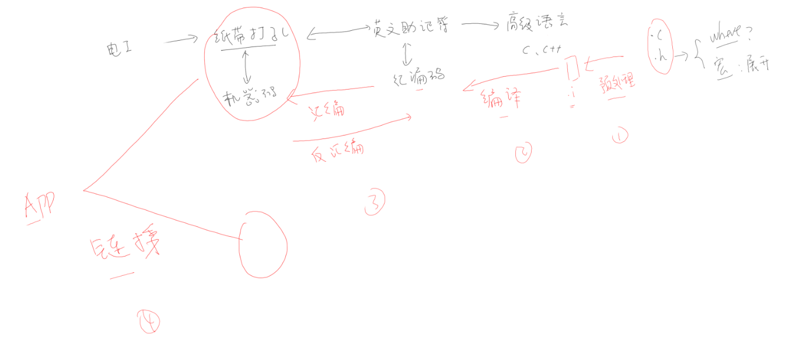
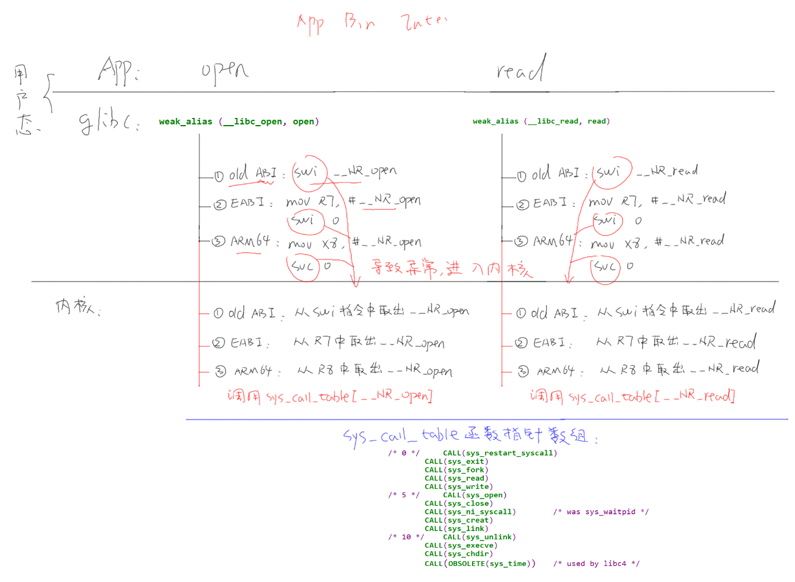

# 目錄

- [Note](#0)
- [01_Hello程序](#1)
  - [1-1_NFS應用](#1.1)
  - [1-2_配置交叉編譯工具鏈](#1.2)
- [02_GCC](#2)
  - [2-1_GCC編譯過程](#2.1)
  - [2-2_GCC常用選項](#2.2)
- [03_Makefile](#3)
  - [3-1_Makefile要達成的效果](#3.1)
  - [3-2_Makefile的引入與規則](#3.2)
  - [3-3_Makefile的語法](#3.3)
  - [3-4_Makefile函數](#3.4)
  - [3-5_Makefile實例](#3.5)
  - [3-6_通用Makefile的使用](#3.6)
    - [通用Makefile的設計思想](#3.6.0)
    - [一、各級子目錄的Makefile](#3.6.1)
    - [二、頂層目錄的Makefile](#3.6.2)
    - [三、頂層目錄的Makefile.build](#3.6.3)
    - [四、怎麼使用這套Makefile](#3.6.4)
  - [3-7_通用Makefile的解析](#3.7)
- [04_文件IO](#4)
  - [4-1_文件IO_讀寫文件](#4.1)
  - [4-2_文件IO_內核接口](#4.2)
- [05_Framebuffer](#5)
  - [5-1_Framebuffer應用編程](#5.1)
- [06_字符應用](#6)
  - [6-1_字符的編碼方式](#6.1)
  - [6-2_ASCII字符的點陣顯示](#6.2)
  - [6-3_中文字符的點陣顯示](#6.3)
  - [6-4_交叉編譯程序_以freetype為例](#6.4)
  - [6-5_使用freetype顯示單個文字](#6.5)
  - [6-6_使用freetype顯示一行文字](#6.6)


<h1 id="0">Note</h1>

[[第4篇]_嵌入式Linux應用開發基礎知識](https://www.bilibili.com/video/BV1kk4y117Tu?vd_source=790c8244dbe879457094c8374beb04d3)

<h1 id="1">01_Hello程序</h1>

```C
#include <stdio.h>

/* 执行命令: ./hello weidongshan 
 * argc = 2
 * argv[0] = ./hello
 * argv[1] = weidongshan
 */

int main(int argc, char **argv)
{
    if (argc >= 2)
        printf("Hello, %s!\n", argv[1]);
    else
        printf("Hello, world!\n");
    return 0;
}
```

- argc：argument conut 參數個數
- argv：argument value 代表參數值

- header file (.h)： 作為聲明(declare)
- source file (.c)： 作為定義(define)與實現(implement)

- 函式庫目錄定義分為兩種：
  - 系統目錄
  - 指定目錄

<h2 id="1.1">1-1_NFS應用</h2>

- 利用 NFS 來使 Ubuntu 與 開發版 之間傳輸檔案

- 將Ubuntu中的某目錄下掛載到開發版的某個路徑下，在同一個網域下時

    ```Shell
    mount -t nfs -o nolock,vers=3 192.168.1.137:/home/book/nfs_rootfs /mnt
    ```

    

- 但注意要在開發版執行的執行檔要用arm-gcc工具鏈去編譯

    ```Shell
    # PC機編譯器時用的命令是：
    gcc  -o  hello  hello.c

    # 開發板編譯器時用的命令類似下述命令(不同的開發板gcc的首碼可能不同)：
    arm-buildroot-linux-gnueabihf-gcc  -o  hello  hello.c
    ```

- 可以使用 `file` 來查看執行檔

```Shell
chicony@ubuntu:/mnt/disk2/SF/tmp/source/01_hello$ file hello
hello: ELF 64-bit LSB executable, x86-64, version 1 (SYSV), dynamically linked, interpreter /lib64/ld-linux-x86-64.so.2, for GNU/Linux 2.6.32, BuildID[sha1]=d5e79a0a04b6cadd3272cd37627d4d7147b89f96, not stripped
```

<h2 id="1.1">1-2_配置交叉編譯工具鏈</h2>

- 交叉編譯工具鏈用來在Ubuntu主機上編譯應用程式，而這些應用程式是在ARM等其他平臺上運行。

- 設置交叉編譯工具主要是設置PATH， ARCH和CROSS_COMPILE三個環境變數

**永久生效**

- 修改使用者設定檔

    ```Shell
    book@100ask:~$ vim  ~/.bashrc

    # 在行尾添加或修改，加上下面幾行：
    export ARCH=arm
    export CROSS_COMPILE=arm-buildroot-linux-gnueabihf-
    export PATH=$PATH:/home/book/100ask_stm32mp157_pro-sdk/ToolChain/arm-buildroot-linux-gnueabihf_sdk-buildroot/bin

    # 載入這些設置的環境變數
    book@100ask:~$ source  ~/.bashrc
    ```

**臨時生效**

- 手工執行 `export` 命令設置環境變數，該設置只對當前終端有效(另開一個終端需要再次設置)

    ```Shell
    book@100ask:~$ export ARCH=arm
    book@100ask:~$ export CROSS_COMPILE=arm-buildroot-linux-gnueabihf-
    book@100ask:~$ export PATH=$PATH:/home/book/100ask_stm32mp157_pro-sdk/ToolChain/arm-buildroot-linux-gnueabihf_sdk-buildroot/bin
    ```

**手動指定**

- 先設置**PATH環境變數**，
  
- 在make編譯時指定**ARCH架構**與**CROSS_COMPILE交叉編譯工具鏈**(執行make命令時指定的參數，只對當前命令有效；下次執行make時仍需要再次指定那些參數)。

    ```Shell
    book@100ask:~$ export PATH=$PATH:/home/book/100ask_stm32mp157_pro-sdk/ToolChain/arm-buildroot-linux-gnueabihf_sdk-buildroot/bin
    book@100ask:~$ make ARCH=arm CROSS_COMPILE=arm-buildroot-linux-gnueabihf-
    ```

---


怎麼確定交叉編譯器中標頭檔的預設路徑?

- 進入交叉編譯器的目錄裡，執行：`find . -name "stdio.h"`，它位於一個 `include` 目錄下的根目錄裡。

怎麼自己指定標頭檔目錄?

- 編譯時，加上 `-I <標頭檔目錄>` 這樣的選項。

怎麼確定交叉編譯器中庫檔的預設路徑?

- 進入交叉編譯器的目錄裡，執行：`find . -name lib`，可以得到xxxx/lib、xxxx/usr/lib，一般來說這2個目錄就是要找的路徑。
- 如果有很多類似的lib，進去看看，有很多so檔的目錄一般就是要找的路徑。

怎麼自己指定庫檔目錄、指定要用的庫檔?

- 編譯時，加上 `-L <庫檔目錄>` 這樣的選項，用來指定庫目錄
- 編譯時，加上 `-labc` 這樣的選項，用來指定庫檔libabc.so。

<h1 id="2">02_GCC</h1>

<h2 id="2.1">2-1_GCC編譯過程</h2>

機器只能讀取機器碼(即二進制的程式，非0即1)

程式的成長流程



`gcc -o hello hello.c` 所完成的動作

- 可透過加`-v`來查看流程跑了什麼，`gcc -o hello hello.c -v`

    

GCC編譯過程


日常說法會把 `編譯` 代表成 `預處理 -> 編譯 -> 匯編`，接著再鏈結

1. 預處理

    C/C++原始檔案中，以 `#` 開頭的命令被稱為預處理命令，如包含命令`#include`、巨集定義命令`#define`、條件編譯命令`#if`、`#ifdef`等。預處理就是將要包含(include)的檔插入原文件中、將巨集定義展開、根據條件編譯命令選擇要使用的代碼，最後將這些東西輸出到一個`.i`檔中等待進一步處理。

2. 編譯

    編譯就是把C/C++代碼(比如上述的`.i`文件)翻譯成彙編代碼，所用到的工具為cc1(它的名字就是cc1，x86有自己的cc1命令，ARM板也有自己的cc1命令)。

3. 彙編

    彙編就是將第二步輸出的彙編代碼翻譯成符合一定格式的機器代碼，在Linux系統上一般表現為ELF目的檔案(OBJ檔)，用到的工具為as。x86有自己的as命令，ARM版也有自己的as命令，也可能是xxxx-as（比如arm-linux-as）。

4. 連結

    連結就是將上步生成的OBJ檔和系統庫的OBJ檔、庫檔連結起來，最終生成了可以在特定平臺運行的可執行檔，用到的工具為ld或collect2。

<h2 id="2.2">2-2_GCC常用選項</h2>

multi-files 進行編譯：各自匯編成.o檔後，鏈結成一個執行檔

```Shell
gcc -o test main.c sub.c
```


當今天有999個文件時，使用這種方式，只要修改一個檔案後，每次重新編譯都會重新編譯999個文件，因此會太消耗資源，所以要先編譯在鏈結，就可以避免掉沒有修改的程式要再重新編譯，較為高效


**GCC常用選項**


1. `-c`

    預處理、編譯和彙編原始檔案，但是不作連結，編譯器根據原始檔案生成OBJ檔。缺省情況下，GCC通過用`.o替換原始檔案名的尾碼.c，.i，.s`等，產生OBJ檔案名。可以使用-o選項選擇其他名字。GCC忽略-c選項後面任何無法識別的輸入檔。

2. `-S`

    編譯後即停止，不進行彙編。對於每個輸入的非組合語言檔，輸出結果是組合語言檔。缺省情況下，GCC通過用`.s替換原始檔案名尾碼.c, .i`等等，產生彙編檔案名。可以使用-o選項選擇其他名字。GCC忽略任何不需要彙編的輸入檔。

3. `-E`

    預處理後即停止，不進行編譯。預處理後的代碼送往標準輸出。

4. `-o file`

    指定輸出檔為file。無論是預處理、編譯、彙編還是連結，這個選項都可以使用。如果沒有使用`-o`選項，預設的輸出結果是：可執行檔為`a.out`；修改輸入檔的名稱是`source.suffix`，則它的OBJ文件是`source.o`，彙編文件是 `source.s`，而預處理後的C原始程式碼送往標準輸出。

5. `-v`

    顯示製作GCC工具自身時的配置命令；同時顯示編譯器驅動程式、前置處理器、編譯器的版本號。

**警告選項(Warning Option)：**

`-Wall`

這個選項基本打開了所有需要注意的警告資訊，比如沒有指定類型的聲明、在聲明之前就使用的函數、區域變數除了聲明就沒再使用等。

```bash
gcc -Wall -c main.c
```

**調試選項(Debugging Option)：**

`-g` 選項加入只有GDB才使用的額外調試資訊。

**優化選項(Optimization Option)：**

1. `-O或-O1`

    不使用`-O`或`-O1`選項時，只有聲明了register的變數才分配使用寄存器。
    使用了`-O`或`-O1`選項，編譯器會試圖減少目的碼的大小和執行時間。

2. `-O2`

    多優化一些。除了涉及空間和速度交換的優化選項，執行幾乎所有的優化工作。

3. `-O3`

    優化的更多。除了打開-O2所做的一切，它還打開了`-finline-functions`選項。

4. `-O0`

    不優化。

**連結器選項(Linker Option)：**

下面的選項用於連結OBJ檔，輸出可執行檔或庫檔。

1. `-nostartfiles`

    不連結系統標準開機檔案，而標準庫檔仍然正常使用：

    ```bash
    $ gcc -v -nostartfiles -o test main.o sub.o

    /usr/lib/gcc-lib/i386-redhat-linux/3.2.2/collect2 --eh-frame-hdr -m elf_i386 -dynamic-linker 
    /lib/ld-linux.so.2 
    -o test 
    -L/usr/lib/gcc-lib/i386-redhat-linux/3.2.2 
    -L/usr/lib/gcc-lib/i386-redhat-linux/3.2.2/../../.. 
    main.o 
    sub.o 
    -lgcc -lgcc_eh -lc -lgcc -lgcc_eh
    /usr/bin/ld: warning: cannot find entry symbol _start; defaulting to 08048184
    ```

    對於一般應用程式，這些開機檔案是必需的，這裡僅是作為例子(這樣編譯出來的test檔無法執行)。在編譯**bootloader**、**內核**時，將用到這個選項。

2. `-nostdlib`

    不連結系統標準開機檔案和標準庫檔，只把指定的檔傳遞給連結器。這個選項常用於**編譯內核、bootloader**等程式，它們不需要開機

    ```bash
    $ gcc -v -nostdlib -o test main.o sub.o

    /usr/lib/gcc-lib/i386-redhat-linux/3.2.2/collect2 --eh-frame-hdr -m elf_i386 -dynamic-linker /lib/ld-linux.so.2 
    -o test 
    -L/usr/lib/gcc-lib/i386-redhat-linux/3.2.2 
    -L/usr/lib/gcc-lib/i386-redhat-linux/3.2.2/../../.. 
    main.o 
    sub.o
    /usr/bin/ld: warning: cannot find entry symbol _start; defaulting to 08048074
    main.o(.text+0x19): In function `main':
    : undefined reference to `printf'
    sub.o(.text+0xf): In function `sub_fun':
    : undefined reference to `printf'
    collect2: ld returned 1 exit status
    ```

    出現了一大堆錯誤，因為printf等函數是在庫檔中實現的。

3. `-static`

    在支援動態連結(dynamic linking)的系統上，阻止連結共用庫。

    仍以options程式為例，是否使用-static選項編譯出來的可執行程式大小相差巨大：

    ```bash
    $ gcc -c -o main.c
    $ gcc -c -o sub.c
    $ gcc -o test main.o sub.o
    $ gcc -o test_static main.o sub.o –static
    $ ls -l test test_static
    -rwxr-xr-x 1 book book   6591 Jan 16 23:51 test
    -rwxr-xr-x 1 book book 546479 Jan 16 23:51 test_static
    ```

    其中test檔為6591位元組，test_static檔為546479位元組。當不使用-static編譯檔時，程式執行前要連結共用庫檔，所以還需要將共用庫檔放入檔案系統中。

4. `-shared`

    生成一個共用OBJ檔，它可以和其他OBJ檔連結產生可執行檔。只有部分系統支援該選項。

    當不想以原始程式碼發佈程式時，可以使用-shared選項生成庫檔，比如對於options程式，可以如下製作庫檔：

    ```bash
    $ gcc -c -o sub.o sub.c
    $ gcc -shared -o libsub.so sub.o
    ```

    以後要使用sub.c中的函數sub_fun時，在連結程式時，指定引腳libsub.so即可，比如：

    ```bash
    $ gcc -o test main.o  -lsub  -L /libsub.so/所在的目錄/
    ```

    可以將多個檔製作為一個庫檔，比如：

    ```bash
    gcc -shared  -o libsub.so  sub.o  sub2.o  sub3.o
    ```

**目錄選項(Directory Option)：**

下列選項指定搜索路徑，用於查找標頭檔，庫檔，或編譯器的某些成員。

1. `-Idir`

    在標頭檔的搜索路徑清單中添加dir 目錄。

    如果以 `#include < >` 包含檔，則只在標準庫目錄開始搜索(包括使用-Idir選項定義的目錄)

    如果以 `#include " "` 包含檔，則先從使用者的工作目錄開始搜索，再搜索標準庫目錄

2. `-Ldir`

    在 `-l` 選項的搜索路徑清單中添加dir目錄。

    仍使用options程式進行說明，先製作庫檔libsub.a：

    ```bash
    $ gcc -c -o sub.o sub.c
    $ gcc -shared -o libsub.a sub.o
    ```

    編譯main.c：

    ```bash
    $ gcc  -c -o  main.o  main.c
    ```

    連結程式，下面的指令將出錯，提示找不到庫檔：

    ```bash
    $ gcc  -o  test  main.o  -lsub
    /usr/bin/ld: cannot find -lsub
    collect2: ld returned 1 exit status
    ```

    可以使用-Ldir選項將目前的目錄加入搜索路徑，如下則連結成功：

    ```bash
    $ gcc -L. -o test main.o -lsub
    ```

**ld/objdump/objcopy選項：**

我們在開發APP時，一般不需要直接調用這3個命令；在開發裸機、bootloader時，或是調試APP時會涉及，到時再講。

**靜態庫：**


**動態庫：**


總結


 


<h1 id="3">03_Makefile</h1>

<h2 id="3.1">3-1_Makefile要達成的效果</h2>

- 為了能夠高效地編譯程序

- 組織管理程序

- 決定要編譯哪一個文件

- make命令所執行的動作依賴於Makefile文件

<h2 id="3.2">3-2_Makefile的引入與規則</h2>

### Makefile的引入

- 我們知道.c程序 ==》 得到可執行程序它們之間要經過四個步驟：
    1. 預處理
    2. 編譯
    3. 彙編
    4. 鏈接

- 我們經常把前三個步驟統稱為編譯了。

- 我們具體分析：`gcc -o test a.c b.c`這條命令，它們要經過下面幾個步驟：
    1）對於**a.c**：執行：預處理 編譯 彙編 的過程，**a.c ==>xxx.s ==>xxx.o** 文件。
    2）對於**b.c**：執行：預處理 編譯 彙編 的過程，**b.c ==>yyy.s ==>yyy.o** 文件。
    3）最後：**xxx.o**和**yyy.o**鏈接在一起得到一個**test**應用程序。

    提示：**gcc -o test a.c b.c -v** ：加上一個 `-v` 選項可以看到它們的處理過程，

- 第一次編譯 a.c 得到 xxx.o 文件，這是很合乎情理的， 執行完第一次之後，如果修改 a.c 又再次執行：`gcc -o test a.c b.c`，對於 a.c 應該重新生成 xxx.o，但是對於 b.c 又會重新編譯一次，這完全沒有必要，b.c 根本沒有修改，直接使用第一次生成的 yyy.o 文件就可以了。

- 因此，對於這些源文件，我們應該分別處理，執行：預處理 編譯 彙編，先分別編譯它們，最後再把它們鏈接在一次，比如：

  - 編譯：

    ```bash
    gcc -o a.o a.c
    gcc -o b.o b.c
    ```

  - 鏈接：

    ```bash
    gcc -o test a.o b.o
    ```

- 比如：上面的例子，當我們修改a.c之後,a.c會重現編譯然後再把它們鏈接在一起就可以了。 `b.c`就不需要重新編譯。

- 如何知道哪些文件被更新了/被修改了？ --> `比較時間`
  - 比較 a.o 和 a.c 的時間，如果a.c的時間比 a.o 的時間更加新的話，就表明 a.c 被修改了，同理b.o和b.c也會進行同樣的比較。
  - 比較test和 a.o,b.o 的時間，如果a.o或者b.o的時間比test更加新的話，就表明應該重新生成test。

### Makefile的規則

makefie最基本的語法是規則，規則：

```bash
目標(target) : 依賴1 依賴2 (prerequires)...
<TAB>命令(command)
```

- 目標(target)通常是要生成的文件的名稱，可以是可執行文件或OBJ文件，也可以是一個執行的動作名稱，諸如 `clean`。

- 依賴是用來產生目標的材料(比如源文件)，一個目標經常有幾個依賴。

- 命令是生成目標時執行的動作，一個規則可以含有幾個命令，每個命令佔一行。每個命令行前面必須是一個Tab字符，即命令行第一個字符是Tab

當**依賴**比**目標**新，執行它們下面的命令。我們要把上面三個命令寫成makefile規則，如下：

```bash
test ：a.o b.o  //test是目標，它依賴於a.o b.o文件，一旦a.o或者b.o比test新的時候，，就需要執行下面的命令，重新生成test可執行程序。
gcc -o test a.o b.o

a.o : a.c  //a.o依賴於a.c，當a.c更加新的話，執行下面的命令來生成a.o
gcc -c -o a.o a.c

b.o : b.c  //b.o依賴於b.c,當b.c更加新的話，執行下面的命令，來生成b.o
gcc -c -o b.o b.c
```

範例: [001_test_app](./%5B%E7%AC%AC4%E7%AF%87%5D_%E5%B5%8C%E5%85%A5%E5%BC%8FLinux%E6%87%89%E7%94%A8%E9%96%8B%E7%99%BC%E5%9F%BA%E7%A4%8E%E7%9F%A5%E8%AD%98/source/04_2018_Makefile/001_test_app/)

編寫Makefile文件時，要使用Tab來作縮排，不可以使用空格

執行make命令時如果不指定目標，那麼它默認是去生成第1個目標。所以 `第1個目標`，位置很重要。有時候不太方便把第1個目標完整地放在文件前面，這時可以在文件的前面直接放置目標，在後面再完善它的依賴與命令。

比如：

```bash
First_target:         // 這句話放在前面

．．．．// 其他代碼，比如include其他文件得到後面的xxx變量

First_target : $(xxx) $(yyy)   // 在文件的後面再來完善
    command
```

<h2 id="3.3">3-3_Makefile的語法</h2>

### make命令的使用

- 執行make命令時，它會去當前目錄下查找名為 `Makefile` 的文件，並根據它的指示去執行操作，生成第一個目標。

- 我們可以使用 `-f` 選項指定文件，不再使用名為 `Makefile` 的文件，比如：

    ```bash
    make  -f  Makefile.build 
    ```

- 我們可以使用 `-C` 選項指定目錄，切換到其他目錄裡去，比如：

    ```bash
    make -C  a/  -f  Makefile.build 
    ```

- 我們可以指定目標，不再默認生成第一個目標：

    ```bash
    make -C  a/  -f  Makefile.build  other_target
    ```

### Patten - 通配符

- 假如一個目標文件所依賴的依賴文件很多時，我們可以使用通配符，來解決這些繁瑣問題。

    ```bash
    test ：a.o b.o c.o
    gcc -o test a.o b.o

    a.o : a.c
    gcc -c -o a.o a.c

    b.o : b.c
    gcc -c -o b.o b.c

    c.o : c.c
    gcc -c -o c.o c.c
    ```

    ```bash
    test: a.o b.o 
        gcc -o test $^
        
    %.o : %.c
        gcc -c -o $@ $<
    ```

    %.o：表示所用的.o文件
    %.c：表示所有的.c文件
    \$\@：表示目標
    \$\<：表示第1個依賴文件
    \$\^：表示所有依賴文件

- 範例：[001_patten](./%5B%E7%AC%AC4%E7%AF%87%5D_%E5%B5%8C%E5%85%A5%E5%BC%8FLinux%E6%87%89%E7%94%A8%E9%96%8B%E7%99%BC%E5%9F%BA%E7%A4%8E%E7%9F%A5%E8%AD%98/source/04_2018_Makefile/002_syntax/001_patten/)

### 假想目標 .PHONY

1. 我們想清除文件，我們在Makefile的結尾添加如下代碼就可以了：

    ```bash
    test: a.o b.o c.o
        gcc -o test $^
        
    %.o : %.c
        gcc -c -o $@ $<

    clean:
        rm *.o test
    ```

    1）執行 make ：生成第一個可執行文件。
    2）執行 make clean : 清除所有文件，即執行： rm \*.o test。

- make後面可以帶上目標名，也可以不帶，如果不帶目標名的話它就想生成第一個規則裡面的第一個目標。這個寫法有些問題，原因是我們的目錄裡面沒有 clean 這個文件，這個規則執行的條件成立，他就會執行下面的命令來刪除文件。
  - 如果：該目錄下面有名為clean文件怎麼辦呢？

    ```bash
    make: `clean` is up to date.
    ```

  - 它根本沒有執行我們的刪除操作，這是為什麼呢？
  - 現在我們的目錄裡面有名為“clean”的文件，目標文件是有的，並且沒有依賴文件，沒有辦法判斷依賴文件的時間。這種寫法會導致：有同名的"clean"文件時，就沒有辦法執行make clean操作。

- 一個規則能過執行的條件：
  1. 目標文件不存在
  2. 依賴文件比目標新

- 解決辦法：我們需要把目標定義為假象目標，用**關鍵子PHONY**

    ```bash
    # 把clean定義為假象目標。他就不會判斷名為"clean"的文件是否存在
    .PHONY: clean 
    ```

### 變量

在makefile中有兩種變量：

1. 簡單變量(即使變量)：

    ```makefile
    A := xxx    # A的值即刻確定，在定義時即確定
    ```

    對於即使變量使用 `:=` 表示，它的值在定義的時候已經被確定了

2. 延時變量

    ```makefile
    B = xxx   # B的值使用到時才確定
    ```

    對於延時變量使用 `=` 表示。它只有在使用到的時候才確定，在定義/等於時並沒有確定下來。

想使用變量的時候使用`$`來引用

如果不想看到命令是，可以在命令的前面加上`@`符號，就不會顯示命令本身。

當我們執行make命令的時候，make這個指令本身，會把整個Makefile讀進去，進行全部分析，然後解析裡面的變量。常用的變量的定義如下：

```bash
:=      # 即時變量
=       # 延時變量
?=      # 延時變量, 如果是第1次定義才起效, 如果在前面該變量已定義則忽略這句
+=      # 附加, 它是即時變量還是延時變量取決於前面的定義
?=:     # 如果這個變量在前面已經被定義了，這句話就會不會起效果，
```

實例：

```bash
A := $(C)
B = $(C)
C = abc

#D = 100ask
D ?= weidongshan

all:
    @echo A = $(A)
    @echo B = $(B)
    @echo D = $(D)

C += 123
```

執行：

```bash
make
```

結果：

```bash
A =
B = abc 123
D = weidongshan
```

### 變量的導出(export)

在編譯程序時，我們會不斷地使用 `make -C dir` 切換到其他目錄，執行其他目錄裡的Makefile。如果想讓某個變量的值在所有目錄中都可見，要把它 `export` 出來。

比如 `CC = $(CROSS_COMPILE)gcc`，這個CC變量表示編譯器，在整個過程中都是一樣的。定義它之後，要使用 `export CC` 把它導出來。

### Makefile中可以使用shell命令

比如：

```Makefile
TOPDIR := $(shell pwd)
```

這是個立即變量，TOPDIR等於shell命令pwd的結果。

<h2 id="3.4">3-4_Makefile函數</h2>

- makefile裡面可以包含很多函數，這些函數都是make本身實現的，下面我們來幾個常用的函數。

- 引用一個函數用`$`。

- 函數調用的格式如下： `$(function arguments)`
  - 這裡 `function` 是函數名，`arguments` 是該函數的參數。
  - 參數和函數名之間是用空格或Tab隔開，如果有多個參數，它們之間用逗號隔開。
  - 這些空格和逗號不是參數值的一部分。

### 字符串替換和分析函數

#### 函數subst

```Makefile
$(subst from, to, text) 
```

在文本 `text` 中使用 `to` 替換每一處 `from`。

比如：

```Makefile
$(subst ee, EE, feet on the street)
```

結果為 `fEEt on the strEEt`

#### 函數patsubst

函數 patsubst 語法如下：

```Makefile
$(patsubst pattern, replacement, $(var))
```

patsubst 函數是從 var 變量裡面取出每一個值，如果這個符合 pattern 格式，把它替換成 replacement 格式，

實例：

```Makefile
files2  = a.c b.c c.c d.c e.c abc

dep_files = $(patsubst %.c, %.d, $(files2))

all:
    @echo dep_files = $(dep_files)
```

結果：

```bash
dep_files = a.d b.d c.d d.d e.d abc
```

#### 函數strip

```Makefile
$(strip string)
```

去掉前導和結尾空格，並將中間的多個空格壓縮為單個空格。

比如：

```Makefile
$(strip a   b c )
```

結果為 `a b c`

#### 函數findstring

```Makefile
$(findstring find, in)
```

在字符串 `in` 中搜尋 `find`，如果找到，則返回值是 `find`，否則返回值為空。

比如：

```Makefile
$(findstring a, a b c)
$(findstring a, b c)
```

將分別產生值 `a` 和 `(空字符串)`

#### 函數foreach

函数foreach语法如下： 對於list中的每一個var，執行text的公式

```Makefile
$(foreach var, list, text) 
```

前兩個參數，`var` 和 `list`，將首先擴展，注意最後一個參數 `text` 此時不擴展；接著，對每一個 list 擴展產生的字，將用來為 var擴展後命名的變量賦值；然後 `text` 引用該變量擴展；因此它每次擴展都不相同。結果是由空格隔開的 `text`。在 `list` 中多次擴展的字組成的新的 `list`。 `text` 多次擴展的字串聯起來，字與字之間由空格隔開，如此就產生了函數 `foreach` 的返回值。

實際例子：

```Makefile
A = a b c
B = $(foreach f, &(A), $(f).o)

all：
    @echo B = $(B)
```

結果：

```bash
B = a.o b.o c.o
```

### 函數filter/filter-out

函數filter/filter-out語法如下：

```Makefile
$(filter pattern...,text)     # 在text中取出符合patten格式的值
$(filter-out pattern...,text) # 在text中取出不符合patten格式的值
```

實例：

```Makefile
C = a b c d/

D = $(filter %/, $(C))
E = $(filter-out %/, $(C))

all:
        @echo D = $(D)
        @echo E = $(E)
```

結果：

```bash
D = d/
E = a b c
```

#### 函數sort

```Makefile
$(sort list)
```

將 `list` 中的字按字母順序排序，並去掉重複的字。輸出由單個空格隔開的字的列表。

比如：

```Makefile
$(sort foo bar lose)
```

返回值是 `bar foo lose`

### 文件名函数

#### 函數dir

```Makefile
$(dir names...)
```

抽取 `names...` 中每一個文件名的路徑部分，文件名的路徑部分包括從文件名的首字符到最後一個斜杠(含斜杠)之前的一切字符。

比如：

```Makefile
$(dir src/foo.c hacks)
```

結果為 `src/ ./`

#### 函數notdir

```Makefile
$(notdir names...)
```

抽取 `names...` 中每一個文件名中除路徑部分外一切字符（真正的文件名）。

比如：

```Makefile
$(notdir src/foo.c hacks)
```

結果為 `foo.c hacks`

#### 函數suffix

```Makefile
$(suffix names...)
```

抽取 `names...` 中每一個文件名的後綴。

比如：

```Makefile
$(suffix src/foo.c src-1.0/bar.c hacks)
```

結果為 `.c .c`

#### 函數basename

```Makefile
$(basename names...)
```

抽取 `names...` 中每一个文件名中除后缀外一切字符。

比如：

```Makefile
$(basename src/foo.c src-1.0/bar hacks)
```

結果為 `src/foo src-1.0/bar hacks`

#### 函數addsuffix

參數 `names...` 是一系列的文件名，文件名之間用空格隔開；`suffix` 是一個後綴名。將 `suffix(後綴)` 的值附加在每一個獨立文件名的後面，完成後將文件名串聯起來，它們之間用單個空格隔開。

比如：

```Makefile
$(addsuffix .c, foo bar)
```

結果為 `foo.c bar.c`

#### 函數addprefix

```Makefile
$(addprefix prefix,names...)
```

參數 `names` 是一系列的文件名，文件名之間用空格隔開；`prefix` 是一個前綴名。將 `preffix(前綴)` 的值附加在每一個獨立文件名的前面，完成後將文件名串聯起來，它們之間用單個空格隔開。

比如：

```Makefile
$(addprefix src/,foo bar)
```

結果為 `src/foo src/bar`

#### Wildcard

函數Wildcard語法如下：

```Makefile
# pattern定義了文件名的格式, wildcard取出其中存在的文件。
$(wildcard pattern)
```

這個函數 wildcard 會以 pattern 這個格式，去尋找存在的文件，**返回存在文件的名字**。

實例：

在該目錄下創建三個文件：a.c b.c c.c

```Makefile
files = $(wildcard *.c)

all:
    @echo files = $(files)
```

結果：

```bash
files = a.c b.c c.c
```

我們也可以用wildcard函數來判斷，真實存在的文件

實例：

```Makefile
files2 = a.c b.c c.c d.c e.c  abc
files3 = $(wildcard $(files2))

all:
    @echo files3 = $(files3)
```

結果：

```bash
files3 = a.c b.c c.c
```

### 其他函數

#### 函數if

```Makefile
$(if condition, then-part [,else-part])
```

首先把第一個參數 `condition` 的前導空格、結尾空格去掉，然後擴展。如果擴展為非空字符串，則條件 `condition` 為 `真`；如果擴展為空字符串，則條件`condition` 為 `假`。

如果條件 `condition` 為 `真`, 那麼計算第二個參數 `then-part` 的值，並將該值作為整個函數if的值。

如果條件 `condition` 為 `假`, 並且第三個參數存在，則計算第三個參數  `else-part` 的值，並將該值作為整個函數if的值；如果第三個參數不存在，函數if將什麼也不計算，返回空值。

#### 函數origin

```Makefile
$(origin variable)
```

變量 `variable` 是一個查詢變量的名稱，不是對該變量的引用。所以，不能採用 `$` 和 `圓括號` 的格式書寫該變量，當然，如果需要使用非常量的文件名，可以在文件名中使用變量引用。

函數origin的結果是一個字符串，該字符串變量是這樣定義的：

```
‘undefined'		：如果變量‘variable’從沒有定義；
‘default'		：變量‘variable’是缺省定義；
‘environment'		：變量‘variable’作為環境變量定義，選項‘-e’沒有打開；
‘environment override'	：變量‘variable’作為環境變量定義，選項‘-e’已打開；
‘file' 			：變量‘variable’在Makefile中定義；
‘command line' 		：變量‘variable’在命令行中定義；
‘override' 		：變量‘variable’在Makefile中用override指令定義；
‘automatic' 		：變量‘variable’是自動變量
```

#### 函數shell

```Makefile
$(shell command arguments)
```

函數shell是make與外部環境的通訊工具。函數shell的執行結果和在控制台上執行`command arguments` 的結果相似。不過如果 `command arguments` 的結果含有換行符（和回車符），則在函數shell的返回結果中將把它們處理為單個空格，若返回結果最後是換行符（和回車符）則被去掉。

比如當前目錄下有文件1.c、2.c、1.h、2.h，則：

```Makefile
c_src := $(shell ls *.c)
```

<h2 id="3.5">3-5_Makefile實例</h2>

在`c.c`裡面，包含一個頭文件`c.h`，在`c.h`裡面定義一個宏，把這個宏打印出來。

c.c:

```C
#include <stdio.h>
#include <c.h>

void func_c()
{
    printf("This is C = %d\n", C);
}
```

c.h:

```C
#define C 1
```

makefile:

```makefile
test: a.o b.o c.o
    gcc -o test $^

%.o : %.c
    gcc -c -o $@ $<

clean:
    rm *.o test

.PHONY: clean
```

然後上傳編譯，執行`./test`,打印出：

```bash
This is B
This is C =1
```

測試沒有問題，然後修改`c.h`：

```C
#define C 2
```

重新編譯，發現沒有更新程序，運行，結果不變，說明現在的Makefile存在問題。

為什麼會出現這個問題呢， 首先我們test依賴c.o，c.o依賴c.c，如果我們更新c.c，會重新更新整個程序。
但c.o也依賴c.h，我們更新了c.h，並沒有在Makefile上體現出來，導致c.h的更新，Makefile無法檢測到。
因此需要添加:

```makefile
c.o : c.c c.h
```

現在每次修改c.h，Makefile都能識別到更新操作，從而更新最後輸出文件。

這樣又冒出了一個新的問題，我們怎麼為每個.c文件添加.h文件呢？對於內核，有幾萬個文件，不可能為每個文件依次寫出其頭文件。因此需要做出改進，讓其自動生成頭文件依賴，可以參考這篇文章：http://blog.csdn.net/qq1452008/article/details/50855810

```bash
gcc -M c.c                          # 打印出依賴

gcc -M -MF c.d c.c                  # 把依賴寫入文件c.d

gcc -c -o c.o c.c -MD -MF c.d       # 編譯c.o, 把依賴寫入文件c.d
```

修改Makefile如下：

```makefile
objs = a.o b.o c.o

dep_files := $(patsubst %,.%.d, $(objs))
dep_files := $(wildcard $(dep_files))

test: $(objs)
    gcc -o test $^

ifneq ($(dep_files),)
include $(dep_files)
endif

%.o : %.c
    gcc -c -o $@ $< -MD -MF .$@.d

clean:
    rm *.o test

distclean:
    rm $(dep_files)

.PHONY: clean	
```

- 首先用obj變量將.o文件放在一塊。
- 利用前面講到的函數，把obj裡所有文件都變為.%.d格式，並用變量dep_files表示。
- 利用前面介紹的wildcard函數，判斷dep_files是否存在。
- 然後是目標文件test依賴所有的.o文件。
- 如果dep_files變量不為空，就將其包含進來。
- 然後就是所有的.o文件都依賴.c文件，且通過-MD -MF生成.d依賴文件。
- 清理所有的.o文件和目標文件
- 清理依賴.d文件。

現在我們修改了任何.h文件，最終都會影響最後生成的文件，也沒任何手工添加.h、.c、.o文件，完成了支持頭文件依賴。

### 自動生成頭文件依賴

可以使用C/C++ 編譯器的 `-M` 選項，即自動獲取源文件中包含的頭文件，並生成一個依賴關係。例如，執行下面的命令：

```Shell
gcc -M main.c 
```

其輸出如下：

```bash
main.o : main.c defs.h
```

由編譯器自動生成依賴關係，這樣做的好處有以下幾點：

- 不必手動書寫若干目標文件的依賴關係，由編譯器自動生成
- 不管是源文件還是頭文件有更新，目標文件都會重新編譯

**參數介紹**

- `-M`

  - 生成文件的依賴關係，同時也把一些標準庫的頭文件包含了進來

  - 本質是告訴預處理器輸出一個適合make 的規則，用於描述各目標文件的依賴關係。對於每個源文件，預處理器輸出一個make 規則，該規則的目標項(target) 是源文件對應的目標文件名，依賴項(dependency) 是源文件中“#include” 引用的所有文件

  - 該選項默認打開了 `-E` 選項， `-E` 參數的用處是使得編譯器在預處理結束時就停止編譯

    ```bash
    $ gcc -M main.c
    # ----------------------------------------------
    main.o: main.c defs.h \
    /usr/include/stdio.h \
    /usr/include/features.h \ 			                                         
    /usr/include/sys/cdefs.h /usr/include/gnu/stubs.h \         			
    /usr/lib/gcc-lib/i486-suse-linux/2.95.3/include/stddef.h \ 			 
    /usr/include/bits/types.h \
    /usr/include/bits/pthreadtypes.h \ 			
    /usr/include/_G_config.h /usr/include/wchar.h \ 			
    /usr/include/bits/wchar.h /usr/include/gconv.h \ 			
    /usr/lib/gcc-lib/i486-suse-linux/2.95.3/include/stdarg.h \ 			
    /usr/include/bits/stdio_lim.h
    ```

- `-MM`

  - 生成文件的依賴關係，和 `-M` 類似，但不包含標準庫的頭文件

    ```bash
    $ gcc -MM main.c
    # ---------------------------------------------
    main.o: main.c defs.h
    ```

- `-MG`

  - 要求把缺失的頭文件按存在對待，並且假定他們和源文件在同一目錄下，必須和 `-M` 選項一起用。

- `-MF File`

  - 當使用了 `-M` 或者 `-MM` 選項時，則把依賴關係寫入名為`File` 的文件中。
  - 若同時也使用了 `-MD` 或 `-MMD`，`-MF` 將覆寫輸出的依賴文件的名稱。

    ```bash
    # 則 -M 輸出的內容就保存在 main.d 文件中了
    $ gcc -M -MF main.d main.c
    ```

- `-MD`

  - 等同於 `-M -MF File`，但是默認關閉了 `-E` 選項
  - 其輸出的文件名是基於 `-o` 選項，若給定了 `-o` 選項，則輸出的文件名是 `-o` 指定的文件名，並添加 `.d` 後綴，若沒有給定，則輸入的文件名作為輸出的文件名，並添加 `.d` 後綴，同時**繼續指定的編譯工作**
  - `-MD` 不會像 `-M` 那樣阻止正常的編譯任務，因為它默認關閉了`-E` 選項，比如命令中使用了 `-c` 選項，其結果要生成 `.o` 文件，若使用了 `-M` 選項，則不會生成 `.o` 文件，若使用的是 `-MD` 選項，則會生成 `.o` 文件

### CFLAGS

下面再添加CFLAGS，即編譯參數

- 比如加上編譯參數 `-Werror`，把所有的警告當成錯誤

- 可以加上 `-I` 參數，指定頭文件路徑
    - `-Iinclude` 表示當前的inclue文件夾下。
此時就可以把c.c文件裡的`#include ".h"`改為`#include <c.h>`，前者表示當**前目錄**，後者表示**編譯器指定的路徑和GCC路徑**。

    ```makefile
    CFLAGS = -Werror -Iinclude
    …………

    %.o : %.c
        gcc $(CFLAGS) -c -o $@ $< -MD -MF .$@.d
    ```

<h2 id="3.6">3-6_通用Makefile的使用</h2>

<h3 id="3.6.0">通用Makefile的設計思想：</h3>

**在Makefile文件中確定要編譯的文件、目錄，比如：**

```Makefile
obj-y += main.o
obj-y += a/
```

`Makefile` 文件總是被 `Makefile.build` 包含的。

**在Makefile.build中設置編譯規則，有3條編譯規則：**

1. 怎麼編譯子目錄？進入子目錄編譯：

    ```Makefile
    $(subdir-y):
        make -C $@ -f $(TOPDIR)/Makefile.build
    ```

2. 怎麼編譯當前目錄中的文件?

    ```Makefile
    %.o : %.c
        $(CC) $(CFLAGS) $(EXTRA_CFLAGS) $(CFLAGS_$@) -Wp,-MD,$(dep_file) -c -o $@ $<
    ```

3. 當前目錄下的.o和子目錄下的built-in.o要打包起來：

    ```Makefile
    built-in.o : $(cur_objs) $(subdir_objs)
        $(LD) -r -o $@ $^
    ```

**頂層Makefile中把頂層目錄的built-in.o鏈接成APP：**

```Makefile
$(TARGET) : built-in.o
    $(CC) $(LDFLAGS) -o $(TARGET) built-in.o
```

---

參考Linux內核的Makefile編寫一個通用的Makefile，它可以用來編譯應用程序：

1. 支持多個目錄、多層目錄、多個文件
2. 支持給所有文件設置編譯選項
3. 支持給某個目錄設置編譯選項
4. 支持給某個文件單獨設置編譯選項

本程序的Makefile分為3類:
1. 頂層目錄的Makefile
2. 頂層目錄的Makefile.build
3. 各級子目錄的Makefile

<h3 id="3.6.1">一、各級子目錄的Makefile：</h3>

[sub-Makefile](./%5B%E7%AC%AC4%E7%AF%87%5D_%E5%B5%8C%E5%85%A5%E5%BC%8FLinux%E6%87%89%E7%94%A8%E9%96%8B%E7%99%BC%E5%9F%BA%E7%A4%8E%E7%9F%A5%E8%AD%98/source/05_general_Makefile/example/a/Makefile)

它最簡單，形式如下：

```makefile
EXTRA_CFLAGS  := 
CFLAGS_file.o := 

obj-y += file.o
obj-y += subdir/
```

- "`obj-y += file.o`"  表示把當前目錄下的file.c編進程序裡，
- "`obj-y += subdir/`" 表示要進入subdir這個子目錄下去尋找文件來編進程序裡，是哪些文件由subdir目錄下的Makefile決定。
- "`EXTRA_CFLAGS`",    它給當前目錄下的所有文件(不含其下的子目錄)設置額外的編譯選項, 可以不設置
- "`CFLAGS_xxx.o`",    它給當前目錄下的xxx.c設置它自己的編譯選項, 可以不設置

注意: 
1. "subdir/"中的斜杠"/"不可省略
2. 頂層Makefile中的CFLAGS在編譯任意一個.c文件時都會使用
3. `CFLAGS`  `EXTRA_CFLAGS`  `CFLAGS_xxx.o` 三者組成xxx.c的編譯選項

EXTRA_CFLAGS := -D \<MircoName\> ： 代表定義Makefile目錄下某個 .c或.h 使用到的宏

<h3 id="3.6.2">二、頂層目錄的Makefile：</h3>

[Makefile](./%5B%E7%AC%AC4%E7%AF%87%5D_%E5%B5%8C%E5%85%A5%E5%BC%8FLinux%E6%87%89%E7%94%A8%E9%96%8B%E7%99%BC%E5%9F%BA%E7%A4%8E%E7%9F%A5%E8%AD%98/source/05_general_Makefile/example/Makefile)

它除了定義obj-y來指定根目錄下要編進程序去的文件、子目錄外，
主要是定義工具鏈前綴CROSS_COMPILE,
定義編譯參數CFLAGS,
定義鏈接參數LDFLAGS,
這些參數就是文件中用export導出的各變量。

<h3 id="3.6.3">三、頂層目錄的Makefile.build：</h3>

[Makefile.build](./%5B%E7%AC%AC4%E7%AF%87%5D_%E5%B5%8C%E5%85%A5%E5%BC%8FLinux%E6%87%89%E7%94%A8%E9%96%8B%E7%99%BC%E5%9F%BA%E7%A4%8E%E7%9F%A5%E8%AD%98/source/05_general_Makefile/example/Makefile.build)

這是最複雜的部分，它的功能就是把某個目錄及它的所有子目錄中、需要編進程序去的文件都編譯出來，打包為built-in.o

<h3 id="3.6.4">四、怎麼使用這套Makefile：</h3>

1. 把頂層Makefile, Makefile.build放入程序的頂層目錄
   在各自子目錄創建一個空白的Makefile

2. 確定編譯哪些源文件
   修改頂層目錄和各自子目錄Makefile的obj-y : 
    obj-y += xxx.o
	obj-y += yyy/
	這表示要編譯當前目錄下的xxx.c, 要編譯當前目錄下的yyy子目錄	

3. 確定編譯選項、鏈接選項
   修改頂層目錄Makefile的CFLAGS，這是編譯所有.c文件時都要用的編譯選項;
   修改頂層目錄Makefile的LDFLAGS，這是鏈接最後的應用程序時的鏈接選項;
   
   修改各自子目錄下的Makefile：
   "EXTRA_CFLAGS",    它給當前目錄下的所有文件(不含其下的子目錄)設置額外的編譯選項, 可以不設置
   "CFLAGS_xxx.o",    它給當前目錄下的xxx.c設置它自己的編譯選項, 可以不設置
   
4. 使用哪個編譯器？
   修改頂層目錄Makefile的CROSS_COMPILE, 用來指定工具鏈的前綴(比如arm-linux-)
   
5. 確定應用程序的名字：
   修改頂層目錄Makefile的TARGET, 這是用來指定編譯出來的程序的名字

6. 執行"make"來編譯，執行"make clean"來清除，執行"make distclean"來徹底清除

<h2 id="3.7">3-7_通用Makefile的解析</h2>

built-in.o：每個Makefile的目錄下都會把.o編譯成一個build-in.o，最後頂層目錄的Makefile會把當前目錄的.o與全部子目錄的build-in.o再編譯成一個build-in.o，用來代表所有的.o文件


Makefile搭配Makefile.build編譯程式之流程分析


<h1 id="4">04_文件IO</h1>

在Linux系統中，一切都是 `文件`：普通文件、驅動程序、網絡通信等等。所有的操作，都是通過 `文件IO` 來操作的。所以，很有必要掌握文件操作的常用接口。

應用程序透過接口來訪問普通文件或硬件


文件從哪裡來?

- 真實硬件文件
- 內核虛擬文件
- 特殊文件(字符設備、塊設備與網路設備)


主設備號代表驅動，次設備號代表設備


如何知道這些函數的用法?

- `help` 只能用於查看某個命令的用法
- `man手冊` 既可以查看命令的用法，還可以查看函數的詳細介紹等等。它含有9大分類，如下：

    ```
    1   Executable programs or shell commands                       // 命令
    2   System calls (functions provided by the kernel)             // 系统调用，比如 man 2 open
    3   Library calls (functions within program libraries)          // 函数库调用
    4   Special files (usually found in /dev)                       // 特殊文件, 比如 man 4 tty 
    5   File formats and conventions eg /etc/passwd                 // 文件格式和约定, 比如man 5 passwd
    6   Games                                                       // 游戏
    7   Miscellaneous (including macro packages and conventions), e.g. man(7), groff(7) //杂项
    8   System administration commands (usually only for root)      // 系统管理命令
    9   Kernel routines [Non standard]                              // 内核例程
    ```

<h2 id="4.1">4-1_文件IO_讀寫文件</h2>

標準Read/Write IO讀寫文件

[copy.c](./[第4篇]_嵌入式Linux應用開發基礎知識/source/06_fileio/copy.c)

透過系統調用mmap映射來讀寫文件

[copy_mmap.c](./[第4篇]_嵌入式Linux應用開發基礎知識/source/06_fileio/copy_mmap.c)

Note: 可以使用 `man 2 open` 來查看open的使用方式

<h2 id="4.2">4-2_文件IO_內核接口</h2>

應用程序透過系統調用接口來調用內核


APP透過系統調用函數執行swi, svc指令，來觸發CPU異常，進而導致CPU跳到某地址執行某函數，如此達成調用內核函數


系統調用函數怎麼進入內核?

- swi指令(ABI, Application Binary Interface)
- svc指令(ARM64)



內核的`sys_open`、`sys_read`會做什麼?

- 首先要分辨文件類型
- 普通文件會以FAT32/EXT4/...保存在塊設備上
- 字符設備


<h1 id="5">05_Framebuffer</h1>

<h2 id="5.1">5-1_Framebuffer應用編程</h2>

### LCD 簡介

在Linux系統中通過Framebuffer驅動程序來控制LCD。

Frame是幀的意思，buffer是緩衝的意思，這意味Framebuffer是一塊內存，裡面保存著一幀影像的每一個像素的顏色值

假設LCD的解析度是1024x768，每一個像素的顏色用32未來表示，那麼Framebuffer的大小就是(1024x768x32/8=3145728字節)

簡單LCD的操作原理
1. 驅動程式設置好LCD控制器
   - LCD控制器的時序、訊號極性
   - LCD解析度、BPP(bits per pixel, 每個像素點用多少個bits來表示)
2. 應用程式使用ioctl獲取LCD解析度、BPP
3. 應用程式通過mmap映射Framebuffer，在Framebuffer中寫入數據


計算某像素點座標所對應的Framebuffer地址

$$
pixel\_address = fb\_base\_addresss + (\frac {xres*y*bpp} {8} + \frac {x*bpp} {8})
$$

像素的顏色在不同BPP格式中，用不同位數的RGB三原色來表示的


### 代碼介紹

[show_pixel.c](./[第4篇]_嵌入式Linux應用開發基礎知識/source/07_framebuffer/show_pixel.c)

**打開設備**

```C
static int fd_fb;

/*開啟設備*/
fd_fb = open("/dev/fb0", O_RDWR);
if (fd_fb < 0)
{
    printf("can't open /dev/fb0\n");
    return -1;
}

/*關閉設備*/
close(fd_fb);
```

**獲取LCD參數, 編寫應用程序時主要關心可變參數**

1. 可變的參數 fb_var_screeninfo
2. 固定的參數 fb_fix_screeninfo

[fb.h](./[第4篇]_嵌入式Linux應用開發基礎知識/doc/fb.h)

```C
#include <linux/fb.h>
```

```C
struct fb_var_screeninfo {
    __u32 xres;                 /* visible resolution 解析度*/
    __u32 yres;

    /*........................*/

    __u32 bits_per_pixel;       /* BPP*/
    __u32 grayscale;            /* 0 = color, 1 = grayscale,*//* >1 = FOURCC*/
    struct fb_bitfield red;     /* bitfield in fb mem if true color, */
    struct fb_bitfield green;   /* else only length is significant */
    struct fb_bitfield blue;    /* RGB分別用多少未來表示，從哪位開始*/

    /*........................*/
};
```

```C
static struct fb_var_screeninfo var;	/* Current var */

static int screen_size;
static unsigned int line_width;
static unsigned int pixel_width;

if (ioctl(fd_fb, FBIOGET_VSCREENINFO, &var))
{
    printf("can't get var\n");
    return -1;
}
line_width  = var.xres * var.bits_per_pixel / 8;
pixel_width = var.bits_per_pixel / 8;
screen_size = var.xres * var.yres * var.bits_per_pixel / 8;
```

**映射Framebuffer**

- 要映射一塊內存，需要知道它的地址 --- 由驅動程序來設置
- 需要知道它的大小 --- 由應用程式決定

```C
static unsigned char *fb_base;

/*映射*/
fb_base = (unsigned char *)mmap(NULL , screen_size, PROT_READ | PROT_WRITE, MAP_SHARED, fd_fb, 0);
if (fb_base == (unsigned char *)-1)
{
    printf("can't mmap\n");
    return -1;
}

/*取消映射*/
munmap(fb_base , screen_size);
```

**描點函數**


```C
/**********************************************************************
 * 函數名稱： lcd_put_pixel
 * 功能描述： 在LCD指定位置上輸出指定顏色（描點）
 * 輸入參數： x坐標，y坐標，顏色
 * 輸出參數： 無
 * 返 回 值： 會
 * 修改日期        版本號     修改人          修改內容
 * -----------------------------------------------
 * 2020/05/12     V1.0       zh(angenao)     創建
 ***********************************************************************/
void lcd_put_pixel(int x, int y, unsigned int color)
{
    unsigned char *pen_8 = fb_base+y*line_width+x*pixel_width;
    unsigned short *pen_16;
    unsigned int *pen_32;

    unsigned int red, green, blue;

    pen_16 = (unsigned short *)pen_8;
    pen_32 = (unsigned int *)pen_8;

    switch (var.bits_per_pixel)
    {
        case 8:
        {
            *pen_8 = color;
            break;
        }
        case 16:
        {
            /* 565 */
            red   = (color >> 16) & 0xff;
            green = (color >> 8) & 0xff;
            blue  = (color >> 0) & 0xff;
            color = ((red >> 3) << 11) | ((green >> 2) << 5) | (blue >> 3);
            *pen_16 = color;
            break;
        }
        case 32:
        {
            *pen_32 = color;
            break;
        }
        default:
        {
            printf("can't surport %dbpp\n", var.bits_per_pixel);
            break;
        }
    }
}

/* 清屏: 全部设为白色 */
memset(fb_base, 0xff, screen_size);

/* 随便设置出100个为红色 */
for (i = 0; i < 100; i++)
    lcd_put_pixel(var.xres/2+i, var.yres/2, 0xFF0000);
```

<h1 id="6">06_字符應用</h1>

<h2 id="6.1">6-1_字符的編碼方式</h2>

什麼叫作編碼?

- 就是一個字符用什麼數字來表示
- 在計算機裡的一切都是用數字來表示，比如字符A用0x01或0x02或0x41來表示

編碼方式

1. ASCII

   - American Standard Code for Information Interchange，美國標準資訊交換碼
   - 每個字符用一個字節來表示，一個字節的7位可以表示128個數值，在ASCII碼中最高位永遠是0


2. ANSI

   - ASNI是ASCII的擴展，向下包含ASCII，對於ASCII的字符仍可以一個字節來表示，對於非ASCII字符則用兩個字節來表示
   - 第一個字節的第7位為1表示為ASNI編碼，以兩個字節來表示一個字符;反之為0則表示ASCII編碼，以一個字節表示一個字符
   - 由Windows提出
   - 使用ANSI編碼方式時，還需選擇要解析數值的字符集，才能正確地顯示出字符


3. UNICODE

   - 統一編碼，避免ANSI在同一個數值下對應不同的字符集會有不同的字符的問題，有著一對一的關係
   - 對於地球上任意一個字符，都給它一個唯一的數值
   - 數值範圍由 0x0000 至 0x10FFFF，有1,114,111個數值可以使用
   - 如何辨識數值 (0x41 0x4e 0x2d) 是代表 A中(0x41, 0x4e 0x2d) 還是 A-N(0x41, 0x4e, 0x2d)，因此涉及**編碼實現**

編碼實現

- ASCII & ANSI 根據地一個字節的第7位來判別是一個字符是由一個字節或是兩個字節來表示

- UNICODE
  1. 用3個字節表示一個UNICODE --> 過度浪費空間
  2. UCS-2 Little endian/UTF-16 LE 小字節序
       - 數值中權重低的放在前面
       - a 以 0x61 0x00 表示, b 以 0x62 0x00 表示, 中 以 0x2d 0x4e 表示
       - 文件開頭為 0xff 0xfe 表示 UTF-16 LE
       - 容錯率較低，只要有一個字節漏掉，整個字符都會偏掉
       - 3字節的字符無法表示
  3. UCS-2 Big endian/UTF-16 BE 大字節序
       - 數值中權重高的放在前面
       - a 以 0x00 0x41 表示 中 以 0x4e 0x2d 表示
       - 文件開頭為 0xff 0xff 表示 UTF-16 BE
       - 容錯率較低，只要有一個字節漏掉，整個字符都會偏掉
       - 3字節的字符無法表示
  4. UTF8: 為了改善上方的問題，是一種變長的編碼方式，分為帶有頭部與不帶頭部的2種UTF8格式文件
     - ASCII字符直接用ASCII碼來表示，一個字節
     - 非ASCII字符使用變長的編碼，每一個字節的高位都自帶長度信息，因此容錯率較高，只會在掉字節處發生亂碼

        

        

<h2 id="6.2">6-2_ASCII字符的點陣顯示</h2>

LCD中要顯示一個ASCII字符，首先要找到字符對應的點陣，在Linux內核中`kernel/linux-5.4/lib/fonts/`路徑下有以結構font_data的形式保存各個字符的點陣

- 常用的為font_8x16.c --> 橫方向8bits, 縱方向16bits
- 每一個bit為一個像素

    

- 在LCD顯示ASCII字符的函數 [show_ascii.c](./[第4篇]_嵌入式Linux應用開發基礎知識/source/08_show_ascii/show_ascii.c)

    ```C
    #define FONTDATAMAX 4096

    static const unsigned char fontdata_8x16[FONTDATAMAX] = {
        /*..........................*/
    }
    /**********************************************************************
     * 函數名稱： lcd_put_ascii
     * 功能描述： 在LCD指定位置上顯示一個8*16的字符
     * 輸入參數： x坐標，y坐標，ascii碼
     * 輸出參數： 無
     * 返 回 值： 無
     * 修改日期        版本號     修改人      修改內容
     * -----------------------------------------------
     * 2020/05/12     V1.0      zh(angenao)      創建
     ***********************************************************************/
    void lcd_put_ascii(int x, int y, unsigned char c)
    {
        unsigned char *dots = (unsigned char *)&fontdata_8x16[c*16];
        int i, b;
        unsigned char byte;

        for (i = 0; i < 16; i++)
        {
            byte = dots[i];
            for (b = 7; b >= 0; b--)
            {
                if (byte & (1<<b))
                {
                    /* show */
                    lcd_put_pixel(x+7-b, y+i, 0xffffff);    /* 白 */
                }
                else
                {
                    /* hide */
                    lcd_put_pixel(x+7-b, y+i, 0);           /* 黑 */
                }
            }
        }
    }
    ```

<h2 id="6.3">6-3_中文字符的點陣顯示</h2>

使用點陣字符時，中文字符的顯示跟ASCII字符是一樣的，要注意的地方為中文的編碼(GB2312 or UTF-8)

編寫C程序時，可以使用ANSI編碼或是UTF-8編碼，可透過下面選項告訴編譯器，若沒指定的話，GCC會默認編碼方式為UTF-8編碼

```bash
-finput-charset=GB2312
-finput-charset=UTF-8
```

將test_charset_ansi.c中的編碼內容轉換成UTF-8

```bash
gcc -finput-charset=GB2312 -fexec-charset=UTF-8 -o test_charset_ansi test_charset_ansi.c
```

將test_charset_utf8.c中的編碼內容轉換成ANSI

```bash
gcc -finput-charset=UTF-8 -fexec-charset=GB2312 -o test_charset_utf8 test_charset_utf8.c
```

常用漢字16*16點陣字庫 [HZK16](./[第4篇]_嵌入式Linux應用開發基礎知識/source/09_show_chinese/HZK16)，每個漢字使用32字節來描述


HZJ16以GB2312編碼值來查找點陣
- 以 `中` 為例，它的編碼值是 `0xd6 0xd0`
- 其中 `0xd6` 表示區碼，表示在哪一區：第 `0xd6 - 0xa1` 區
- 其中 `0xd0` 表示位碼，表示它是這個區的哪一個字符：第 `0xd0 - 0xa1` 個
- 一區有 `94` 個漢字，且區位碼從 `0xa1` 開始
- LCD中文字符的點陣顯示代碼

    ```C
    /**********************************************************************
     * 函數名稱： lcd_put_chinese
     * 功能描述： 在LCD指定位置上顯示一個16*16的漢字
     * 輸入參數： x坐標，y坐標，ascii碼
     * 輸出參數： 無
     * 返 回 值： 無
     * 修改日期        版本號     修改人	      修改內容
     * -----------------------------------------------
     * 2020/05/12	     V1.0	  zh(angenao)	      創建
     ***********************************************************************/
    void lcd_put_chinese(int x, int y, unsigned char *str)
    {
        unsigned int area  = str[0] - 0xA1;
        unsigned int where = str[1] - 0xA1;
        unsigned char *dots = hzkmem + (area * 94 + where)*32;
        unsigned char byte;

        int i, j, b;
        for (i = 0; i < 16; i++)
            for (j = 0; j < 2; j++)
            {
                byte = dots[i*2 + j];
                for (b = 7; b >=0; b--)
                {
                    if (byte & (1<<b))
                    {
                        /* show */
                        lcd_put_pixel(x+j*8+7-b, y+i, 0xffffff); /* 白 */
                    }
                    else
                    {
                        /* hide */
                        lcd_put_pixel(x+j*8+7-b, y+i, 0); /* 黑 */
                    }
                }
            }
    }

    int main(int argc, char **argv)
    {
        unsigned char str[] = "中";

        fd_fb = open("/dev/fb0", O_RDWR);
        if (fd_fb < 0)
        {
            printf("can't open /dev/fb0\n");
            return -1;
        }

        if (ioctl(fd_fb, FBIOGET_VSCREENINFO, &var))
        {
            printf("can't get var\n");
            return -1;
        }

        line_width  = var.xres * var.bits_per_pixel / 8;
        pixel_width = var.bits_per_pixel / 8;
        screen_size = var.xres * var.yres * var.bits_per_pixel / 8;
        fbmem = (unsigned char *)mmap(NULL , screen_size, PROT_READ | PROT_WRITE, MAP_SHARED, fd_fb, 0);
        if (fbmem == (unsigned char *)-1)
        {
            printf("can't mmap\n");
            return -1;
        }

        fd_hzk16 = open("HZK16", O_RDONLY);
        if (fd_hzk16 < 0)
        {
            printf("can't open HZK16\n");
            return -1;
        }
        if(fstat(fd_hzk16, &hzk_stat))
        {
            printf("can't get fstat\n");
            return -1;
        }
        hzkmem = (unsigned char *)mmap(NULL , hzk_stat.st_size, PROT_READ, MAP_SHARED, fd_hzk16, 0);
        if (hzkmem == (unsigned char *)-1)
        {
            printf("can't mmap for hzk16\n");
            return -1;
        }

        /* 清屏: 全部设为黑色 */
        memset(fbmem, 0, screen_size);

        lcd_put_ascii(var.xres/2, var.yres/2, 'A'); /*在屏幕中间显示8*16的字母A*/

        printf("chinese code: %02x %02x\n", str[0], str[1]);
        lcd_put_chinese(var.xres/2 + 8,  var.yres/2, str);

        munmap(fbmem , screen_size);
        close(fd_fb);

        return 0;
    }
    ```


<h2 id="6.4">6-4_交叉編譯程序_以freetype為例</h2>


<h2 id="6.5">6-5_使用freetype顯示單個文字</h2>


<h2 id="6.6">6-6_使用freetype顯示一行文字</h2>


