# 目錄

- [Note](#0)
- [01_嵌入式Linux驅動開發基礎知識的引導](#1)
- [02_Hello驅動](#2)
- [03_硬件知識_LED原理圖](#3)
- [04_普通的GPIO引腳操作方法](#4)
- [05_STM32MP157的GPIO操作方法](#5)
- [06_STM32MP157_LED](#6)
  - [6-1_STM32MP157的LED操作方法](#6.1)
  - [6-2_基於STM32MP157的LED驅動程序](#6.2)
- [07_LED驅動程序架構](#7)
- [08_百問網STM32MP157的LED驅動程序](#8)
- [09_驅動設計的思想_面向對象_分層_分離](#9)
- [10_驅動設計進化之路_總線設備驅動模型](#10)
- [11_LED模板驅動程序的改造_總線設備驅動模型](#11)
- [12_設備樹](#12)
  - [12-1_驅動進化之路_設備樹的語法](#12.1)
  - [12-2_驅動進化之路_內核對設備樹的處理與使用](#12.2)
- [13_LED模板驅動程序的改造_設備樹](#13)
- [14_APP怎麼讀取按鍵值](#14)
- [15_查詢方式的按鍵驅動程序_編寫框架](#15)
- [16_STM32MP157的按鍵驅動_查詢方式](#16)
- [17_Pinctrl子系統重要概念](#17)
  - [17-1_Pinctrl子系統重要概念](#17.1)
  - [17-2_GPIO子系統重要概念](#17.2)
  - [17-3_基於GPIO子系統的LED驅動程序](#17.3)
  - [17-4_在STM32MP157上機實驗](#17.4)


<h1 id="0">Note</h1>

以STM32MP157_Pro開發板作為教材

[[第5篇]_嵌入式Linux驅動開發基礎知識](https://www.bilibili.com/video/BV14f4y1Q7ti/?vd_source=790c8244dbe879457094c8374beb04d3)

[Linux驱动虚拟地址和物理地址的映射](https://blog.csdn.net/myxmu/article/details/21461181)

<h1 id="1">01_嵌入式Linux驅動開發基礎知識的引導</h1>

了解驅動開發的流程、方法，掌握從APP到驅動的調用流程

明白“Linux驅動 = 軟件框架 + 硬件操作”

以LED驅動為例，會如下講解

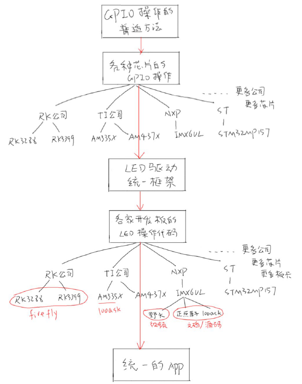

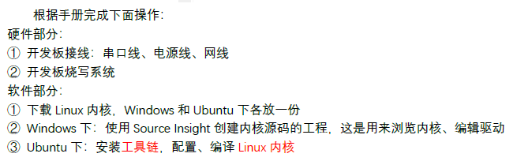

<h1 id="2">02_Hello驅動</h1>

[02_Hello驅動.pdf](./[第5篇]_嵌入式Linux驅動開發基礎知識/doc/02_Hello驅動.pdf)

- 1.1 APP 打開的文件在內核中如何表示

- 1.2 打開字符設備節點時，內核中也有對應的struct file

- 1.3 請猜猜怎麼編寫驅動程序

- 1.4 編寫代碼
  - 1.4.1 寫驅動程序
  - 1.4.2 寫測試程序
  - 1.4.3 測試

- 1.5 Hello 驅動中的一些補充知識
  - 1.5.1 module_init/module_exit 的實現
  - 1.5.2 register_chrdev 的內部實現
  - 1.5.3 class_destroy/device_create 淺析

[hello_drv.c](./[第5篇]_嵌入式Linux驅動開發基礎知識/source/01_hello_drv/hello_drv.c)： Hello的驅動程序

[hello_drv_test.c](./[第5篇]_嵌入式Linux驅動開發基礎知識/source/01_hello_drv/hello_drv_test.c)： Hello的應用程序

[Makefile](./[第5篇]_嵌入式Linux驅動開發基礎知識/source/01_hello_drv/Makefile)： 同時編譯Hello的驅動與應用程序

<h1 id="3">03_硬件知識_LED原理圖</h1>


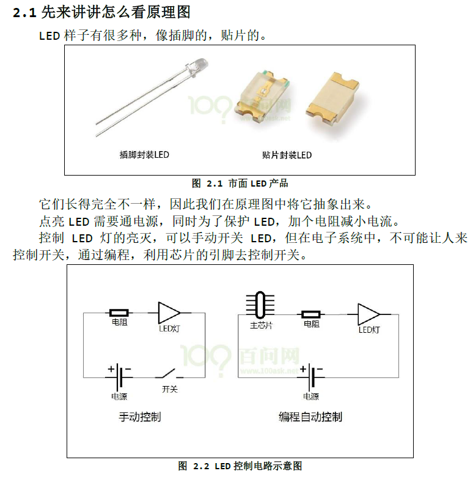

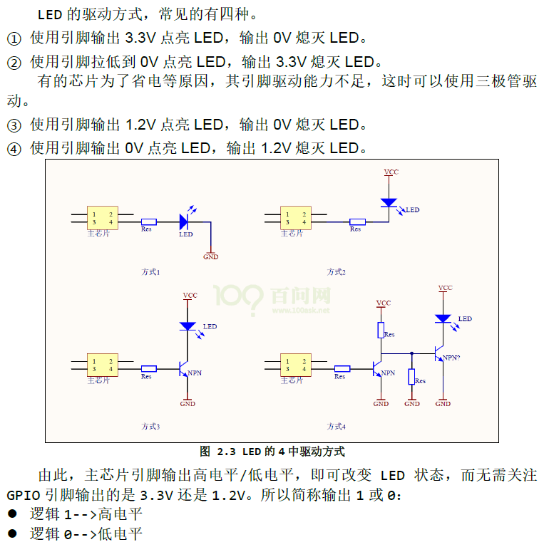

<h1 id="4">04_普通的GPIO引腳操作方法</h1>

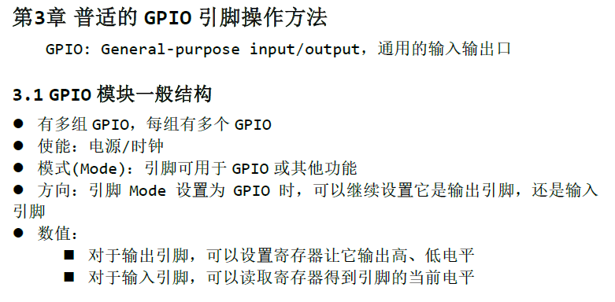

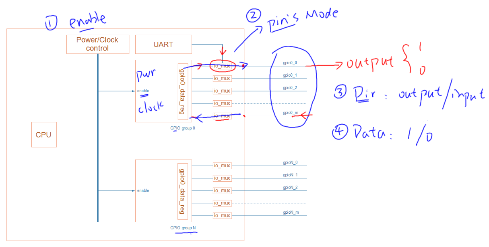

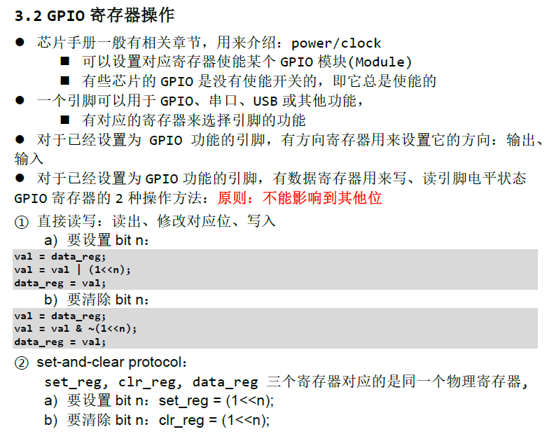

<h1 id="5">05_STM32MP157的GPIO操作方法</h1>

[05_STM32MP157的GPIO操作方法.pdf](./[第5篇]_嵌入式Linux驅動開發基礎知識/doc/05_STM32MP157的GPIO操作方法.pdf)

- 3.3 具體單板的GPIO 操作方法

- 3.4 STM32MP157 GPIO 操作方法
  - 3.4.1 STM32MP157 的GPIO 模塊結構
  - 3.4.2 RCC 用於設置是否向GPIO 模塊提供時鐘
  - 3.4.3 GPIOx_MODER 配置GPIO 模式
  - 3.4.4 GPIOx_OTYPER 配置GPIO 輸出

- 3.5 GPIOx_IDR 設置輸入GPIO
  - 3.5.1 讀GPIO
  - 3.5.2 寫GPIO

[05_STM32MP157的GPIO操作方法_2.pdf](./[第5篇]_嵌入式Linux驅動開發基礎知識/doc/05_STM32MP157的GPIO操作方法_2.pdf)

- GPIO變化速度，當速度越快時，可以傳輸的資料越大，但對外的干擾越大

    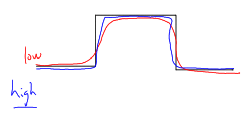

<h1 id="6">06_STM32MP157_LED</h1>

<h2 id="6.1">6-1_STM32MP157的LED操作方法</h2>

[6-1_STM32MP157的LED操作方法.pdf](./[第5篇]_嵌入式Linux驅動開發基礎知識/doc/6-1_STM32MP157的LED操作方法.pdf)

<h2 id="6.2">6-2_基於STM32MP157的LED驅動程序</h2>

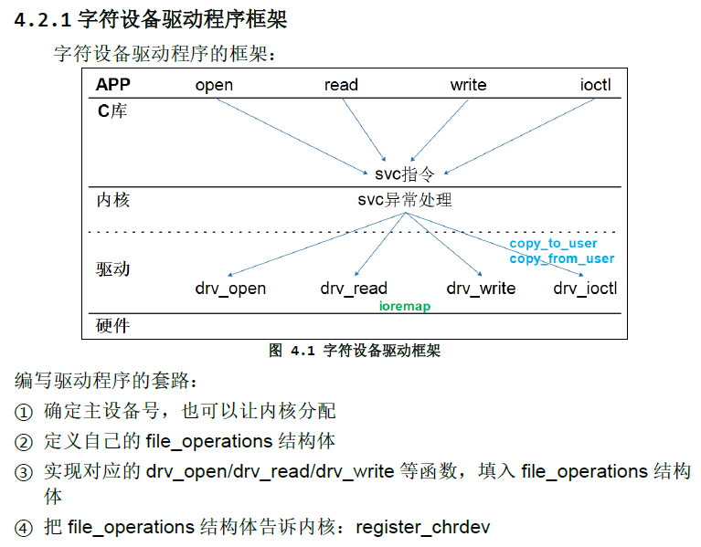

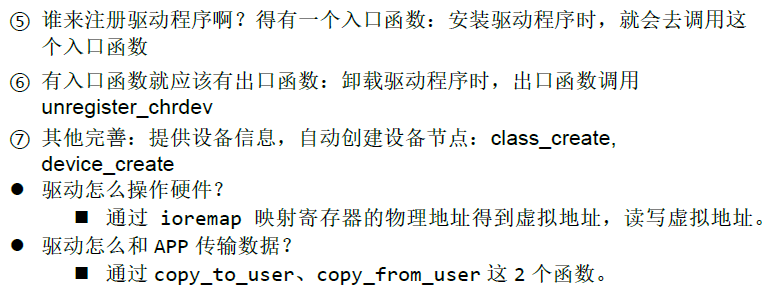

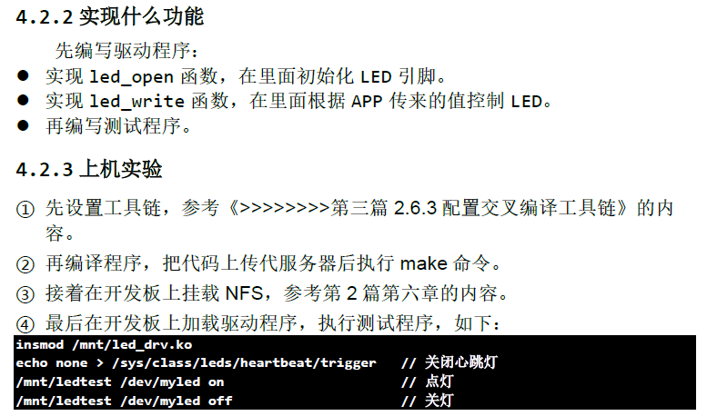

00_led_drv_simple

- [led_drv.c](./[第5篇]_嵌入式Linux驅動開發基礎知識/source/02_led_drv/00_led_drv_simple/led_drv.c)
- [ledtest.c](./[第5篇]_嵌入式Linux驅動開發基礎知識/source/02_led_drv/00_led_drv_simple/ledtest.c)
- [Makefile](./[第5篇]_嵌入式Linux驅動開發基礎知識/source/02_led_drv/00_led_drv_simple/Makefile)

<h1 id="7">07_LED驅動程序架構</h1>

[07_LED驅動程序架構.pdf](./[第5篇]_嵌入式Linux驅動開發基礎知識/doc/07_LED驅動程序架構.pdf)

- 5.1 回顧字符設備驅動程序框架
- 5.2 對於LED 驅動，我們想要什麼樣的接口？
- 5.3 LED 驅動能支持多個板子的基礎：分層思想
- 5.4 寫代碼
  - 5.4.1 驅動程序
    - 1. 把LED 的操作抽像出一個led_operations 結構體
    - 2. 驅動程序的上層：file_operations 結構體
  - 5.4.2 測試程序
  - 5.4.3 上機測試
- 5.5 課後作業

01_led_drv_template： 以面向對象的思想，改進代碼，建立一個code template

- [leddrv.c](./[第5篇]_嵌入式Linux驅動開發基礎知識/source/02_led_drv/01_led_drv_template/leddrv.c)
  - [led_opr.h](./[第5篇]_嵌入式Linux驅動開發基礎知識/source/02_led_drv/01_led_drv_template/led_opr.h)
- [board_demo.c](./[第5篇]_嵌入式Linux驅動開發基礎知識/source/02_led_drv/01_led_drv_template/board_demo.c)
- [ledtest.c](./[第5篇]_嵌入式Linux驅動開發基礎知識/source/02_led_drv/01_led_drv_template/ledtest.c)
- [Makefile](./[第5篇]_嵌入式Linux驅動開發基礎知識/source/02_led_drv/01_led_drv_template/Makefile)

<h1 id="8">08_STM32MP157的LED驅動程序</h1>

[08_STM32MP157的LED驅動程序.pdf](./[第5篇]_嵌入式Linux驅動開發基礎知識/doc/08_STM32MP157的LED驅動程序.pdf)

- 6.1 怎麼寫LED 驅動程序？
  - 6.1.1 ioremap 函數的使用：

    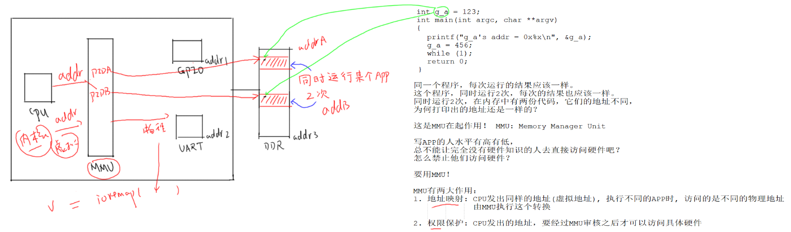

  - 6.1.2 volatile 的使用：
- 6.2 百問網STM32MP157 的LED 驅動程序
  - 6.2.1 所涉及的寄存器操作
  - 6.2.2 寫程序
  - 6.2.3 上機實驗
  - 6.2.4 課後作業

02_led_drv_for_boards：對不同的board有不同控制LED的實體實現，以STM32MP157為例

- [board_100ask_stm32mp157.c](./[第5篇]_嵌入式Linux驅動開發基礎知識/source/02_led_drv/02_led_drv_for_boards/board_100ask_stm32mp157.c)
  - [led_opr.h](./[第5篇]_嵌入式Linux驅動開發基礎知識/source/02_led_drv/02_led_drv_for_boards/led_opr.h)
- [leddrv.c](./[第5篇]_嵌入式Linux驅動開發基礎知識/source/02_led_drv/02_led_drv_for_boards/leddrv.c)
- [ledtest.c](./[第5篇]_嵌入式Linux驅動開發基礎知識/source/02_led_drv/02_led_drv_for_boards/ledtest.c)
- [Makefile]

請新增iounmap執行的地方

- board.c --> 新增 `board_demo_led_exit()`

    ```C
    static void board_demo_led_exit (int which) /* 初始化LED, which-哪个LED */
    {
        iounmap(RCC_PLL4CR);
        iounmap(RCC_MP_AHB4ENSETR);
        iounmap(GPIOA_MODER);
        iounmap(GPIOA_BSRR);
    }

    static struct led_operations board_demo_led_opr = {
        .num  = 1,
        .init = board_demo_led_init,
        .exit = board_demo_led_exit,
        .ctl  = board_demo_led_ctl,
    };
    ```

- led_opr.h

    ```C
    struct led_operations {
        int num;
        int (*init) (int which); /* 初始化LED, which-哪个LED */
        void (*exit) (int which); /* iounmap */
        int (*ctl) (int which, char status); /* 控制LED, which-哪个LED,status:1-亮,0-灭 */
    };
    ```

- leddrv.c

    ```C
    static void __exit led_exit(void)
    {
        int i;
        printk("%s %s line %d\n", __FILE__, __FUNCTION__, __LINE__);

        p_led_opr->init(minor);

        for (i = 0; i < p_led_opr->num; i++)
            device_destroy(led_class, MKDEV(major, i)); /* /dev/100ask_led0,1,... */

        device_destroy(led_class, MKDEV(major, 0));
        class_destroy(led_class);
        unregister_chrdev(major, "100ask_led");
    }
    ```

請修改代碼支持2個LED

- board.c

    ```C
    static int board_demo_led_init (int which) /* 初始化LED, which-哪个LED */ 
    {
        /*..................*/

        if (which == 0)
        {
            /*..................*/
        }
        else if (which == 1)
        {
            /*..................*/
        }

        return 0;
    }

    static int board_demo_led_ctl (int which, char status) /* 控制LED, which-哪个LED, status:1-亮,0-灭 */
    {
        if (which == 0)
        {
            /*..................*/
        }
        else if (which == 1)
        {
            /*..................*/
        }

        return 0;
    }

    static struct led_operations board_demo_led_opr = {
        .num  = 2,
        .init = board_demo_led_init,
        .ctl  = board_demo_led_ctl,
    };
    ```

<h1 id="9">09_驅動設計的思想_面向對象_分層_分離</h1>

Linux驅動 = 驅動框架 + 硬件操作 = 驅動框架 + 單片機

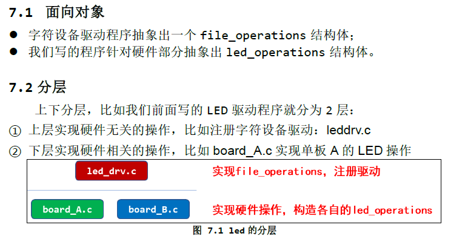

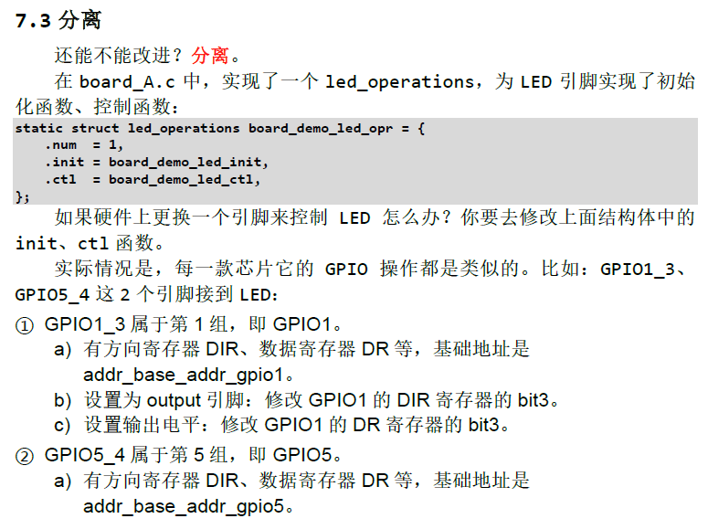

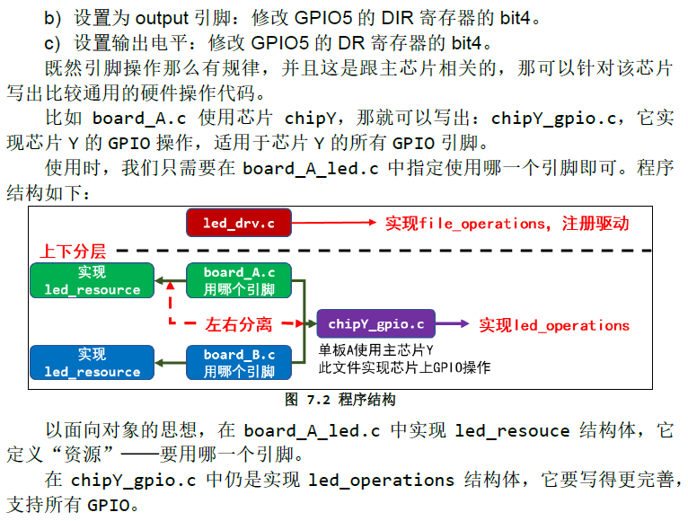

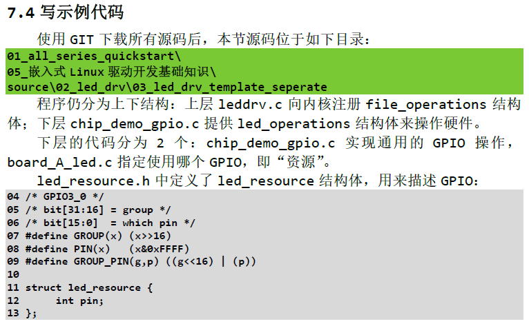

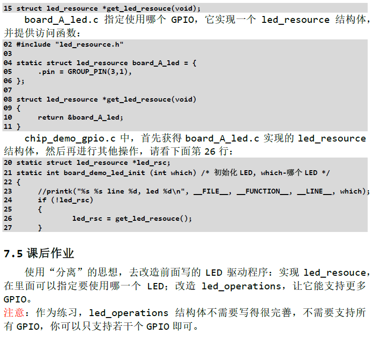

面向對象_分層_分離的範例

- [board_A_led.c](./[第5篇]_嵌入式Linux驅動開發基礎知識/source/02_led_drv/03_led_drv_template_seperate/board_A_led.c)

  - [led_resource.h](./[第5篇]_嵌入式Linux驅動開發基礎知識/source/02_led_drv/03_led_drv_template_seperate/led_resource.h)

- [chip_demo_gpio.c](./[第5篇]_嵌入式Linux驅動開發基礎知識/source/02_led_drv/03_led_drv_template_seperate/chip_demo_gpio.c)

  - [led_opr.h](./[第5篇]_嵌入式Linux驅動開發基礎知識/source/02_led_drv/03_led_drv_template_seperate/led_opr.h)

- [leddrv.c](./[第5篇]_嵌入式Linux驅動開發基礎知識/source/02_led_drv/03_led_drv_template_seperate/leddrv.c)

- [ledtest.c](./[第5篇]_嵌入式Linux驅動開發基礎知識/source/02_led_drv/03_led_drv_template_seperate/ledtest.c)

- [Makefile](./[第5篇]_嵌入式Linux驅動開發基礎知識/source/02_led_drv/03_led_drv_template_seperate/Makefile)

<h1 id="10">10_驅動設計進化之路_總線設備驅動模型</h1>

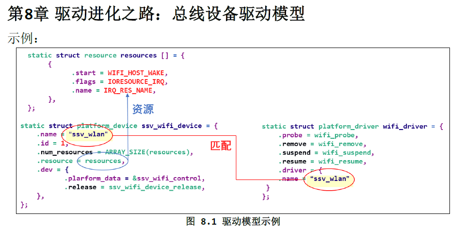

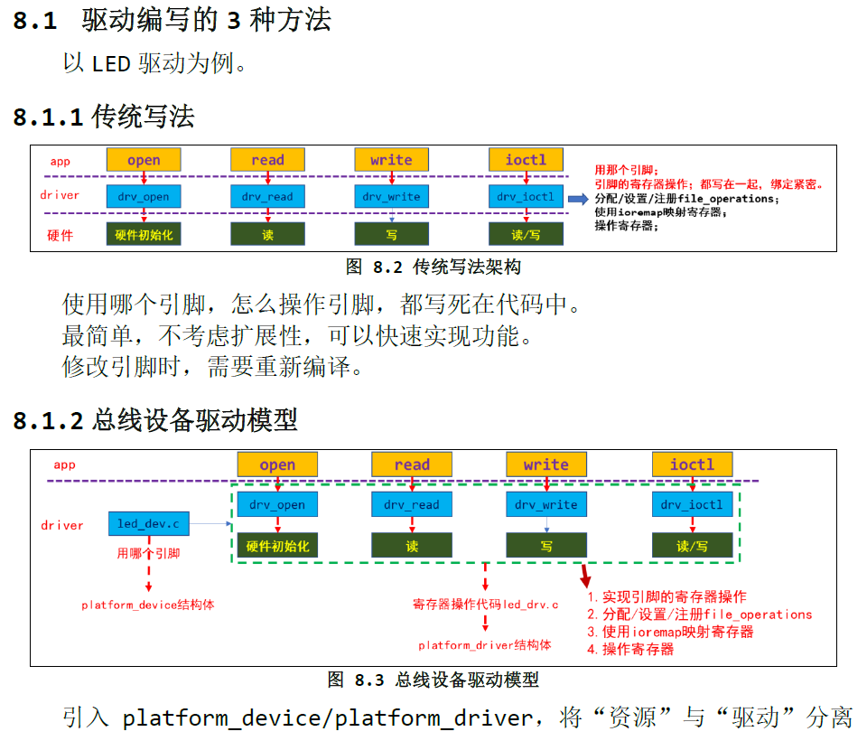

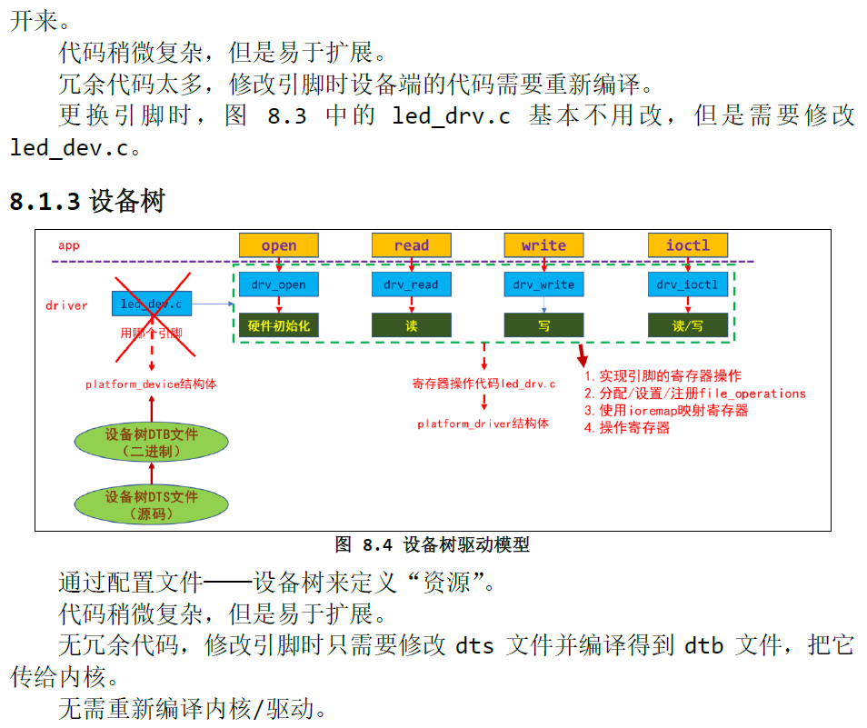

- 原先以不同大量的platform_device來定義設備資訊，並且存放於Linux Kernel當中，但這樣會導致內核過於龐大，且修改設備資訊的話，整個內核就需要重新編譯。將其修改在內核之外以device-tree的形式表示的話，可以大大地優化

- 內核會解析.dtb來取得設備資訊

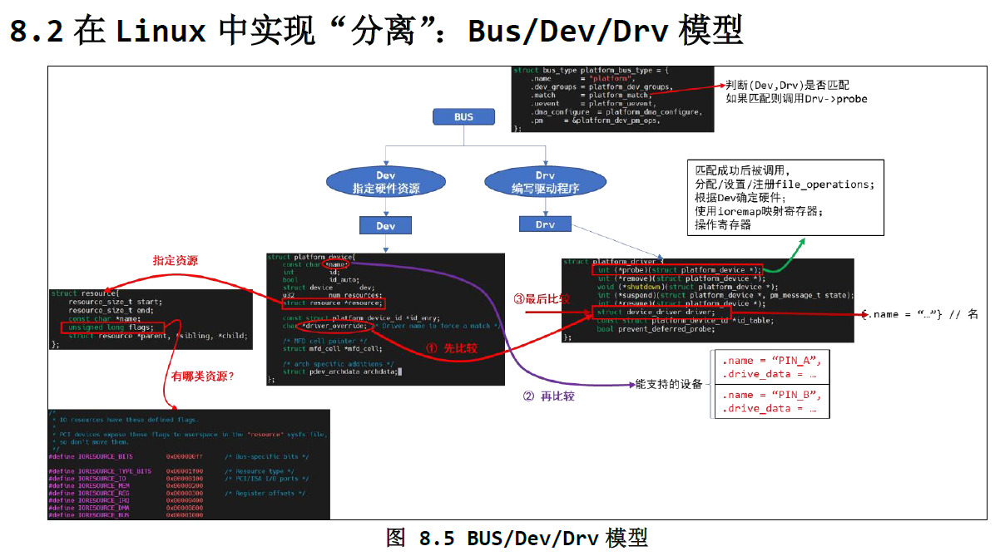

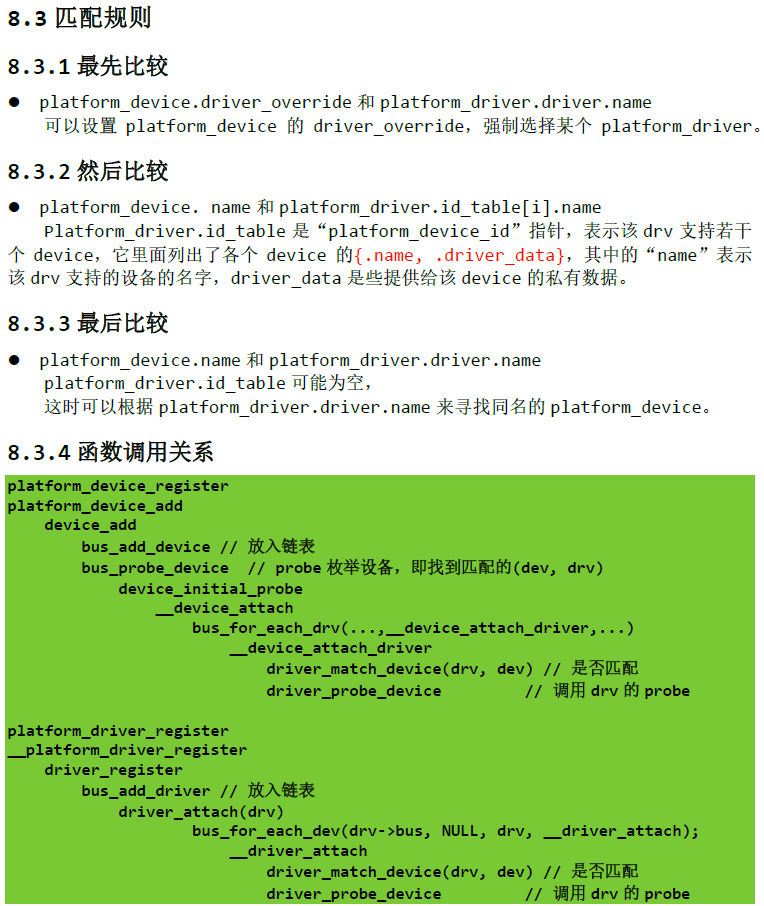

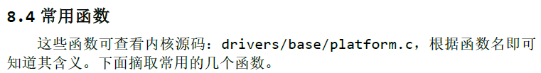

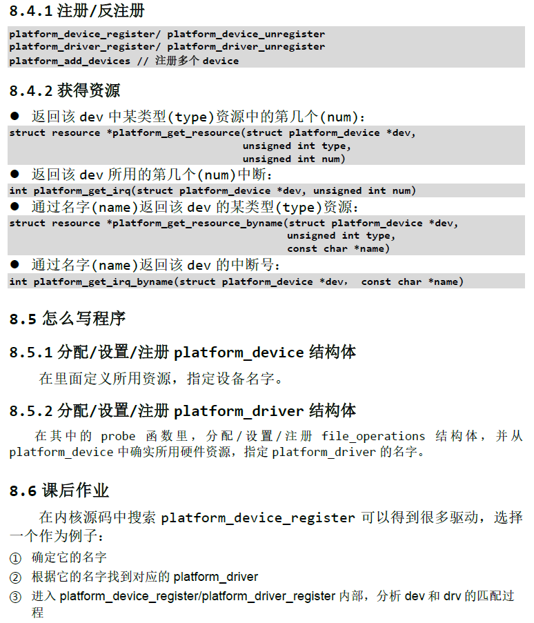

<h1 id="11">11_LED模板驅動程序的改造_總線設備驅動模型</h1>

[11_LED模板驅動程序的改造_總線設備驅動模型.pdf](./[第5篇]_嵌入式Linux驅動開發基礎知識/doc/11_LED模板驅動程序的改造_總線設備驅動模型.pdf)

- 9.1 原來的框架
- 9.2 要實現的框架
- 9.3 寫代碼
  - 9.3.1 注意事項
  - 9.3.2 實現 platform_device 結構體
  - 9.3.3 實現 platform_driver 結構體

設備

- [board_A_led.c](./[第5篇]_嵌入式Linux驅動開發基礎知識/source/02_led_drv/04_led_drv_template_bus_dev_drv/board_A_led.c)

- [led_resource.h](./[第5篇]_嵌入式Linux驅動開發基礎知識/source/02_led_drv/04_led_drv_template_bus_dev_drv/led_resource.h)

驅動

- 根據不同的chip而實現不同的控制驅動
  - [chip_demo_gpio.c](./[第5篇]_嵌入式Linux驅動開發基礎知識/source/02_led_drv/04_led_drv_template_bus_dev_drv/chip_demo_gpio.c)

  - [led_opr.h](./[第5篇]_嵌入式Linux驅動開發基礎知識/source/02_led_drv/04_led_drv_template_bus_dev_drv/led_opr.h)

- 通用的部分，創建register_chrdev, class, device的節點 與 應用程序使用的接口

  - [leddrv.c](./[第5篇]_嵌入式Linux驅動開發基礎知識/source/02_led_drv/04_led_drv_template_bus_dev_drv/leddrv.c)

  - [leddrv.h](./[第5篇]_嵌入式Linux驅動開發基礎知識/source/02_led_drv/04_led_drv_template_bus_dev_drv/leddrv.h)

應用程序

- [ledtest.c](./[第5篇]_嵌入式Linux驅動開發基礎知識/source/02_led_drv/04_led_drv_template_bus_dev_drv/ledtest.c)

Makefile

- [Makefile](./[第5篇]_嵌入式Linux驅動開發基礎知識/source/02_led_drv/04_led_drv_template_bus_dev_drv/Makefile)

<h1 id="12">12_設備樹</h1>

[官方文檔 devicetree-specification-v0.4-rc1.pdf](./[第5篇]_嵌入式Linux驅動開發基礎知識/doc/devicetree-specification-v0.4-rc1.pdf)

- https://www.devicetree.org/specifications/

<h2 id="12.1">12-1_驅動進化之路_設備樹的語法</h2>

[12_設備樹語法與內核對設備樹的使用.pdf](./[第5篇]_嵌入式Linux驅動開發基礎知識/doc/12_設備樹語法與內核對設備樹的使用.pdf)

- 10.1 設備樹的引入與作用
  - 使用配置文件取代用.c撰寫的設備資訊
  - 而配置文件使用設備樹來完成
  - 設備樹文件是給內核使用的
  - 而設備樹文件是由bootloader傳給內核的
  - 進入uboot中，輸入print，可以查看到 `fdtfile=xxxx/xxx.dtb`
  - `/sys/firmware/devicetree`
  - `/sys/firmware/fdt`
- 10.2 設備樹的語法
  - `" "`: 雙引號內放字串
  - `< >`: 尖括號內放32bits的數字，可用16進制或10進制
  - `[ ]`: 中括號內放16進制的單字節，不必加0x
  - 10.2.1 Devicetree 格式
    - [] 表示該參數可有可無
    - DTS 文件的格式
    - node 的格式
    - properties 的格式
  - 10.2.2 dts 文件包含 dtsi 文件
  - 10.2.3 常用的屬性
    - `#address 單元格、#size 單元格`：影響子節點內的 `reg屬性`
    - `compatible`：兼容的驅動程式, "廠家, 模組" 來命名
    - `model`：定義使用的硬體名稱
    - `status`：透過ok/disable修改實際板子(dts)來覆寫公板(dtsi)
    - `reg`：<地址 大小> 成對出現，用來描述一段空間或是表示是哪顆CPU

        ```
        cpus {
            #address-cells = <1>;
            #size-cells = <0>;
            cpu@0 {
                compatible = "arm,cortex-a53", "arm,armv8";
                device_type = "cpu";
                reg = <0x0>;
                enable-method = "psci";
            };

            cpu@1 {
                compatible = "arm,cortex-a53", "arm,armv8";
                device_type = "cpu";
                reg = <0x1>;
                enable-method = "psci";
            };

            cpu@2 {
                compatible = "arm,cortex-a53", "arm,armv8";
                device_type = "cpu";
                reg = <0x2>;
                enable-method = "psci";
            };

            cpu@3 {
                compatible = "arm,cortex-a53", "arm,armv8";
                device_type = "cpu";
                reg = <0x3>;
                enable-method = "psci";
            };
        };
        ```

  - 10.2.4 常用的節點 node
    - 根節點
    - cpu節點
    - memory節點
    - chosen節點
- 10.3 編譯、更換設備樹
  - 10.3.1 在內核中直接 make
  - 10.3.2 手工編譯
  - 10.3.3 給開發板更換設備樹文件
  - 10.3.4 板子啟動後查看設備樹

<h2 id="12.2">12-2_驅動進化之路_內核對設備樹的處理與使用</h2>

[12_設備樹語法與內核對設備樹的使用.pdf](./[第5篇]_嵌入式Linux驅動開發基礎知識/doc/12_設備樹語法與內核對設備樹的使用.pdf)

- 10.4 內核對設備樹的處理
  - 10.4.1 dtb 中每一個節點都被轉換為device_node 結構體

    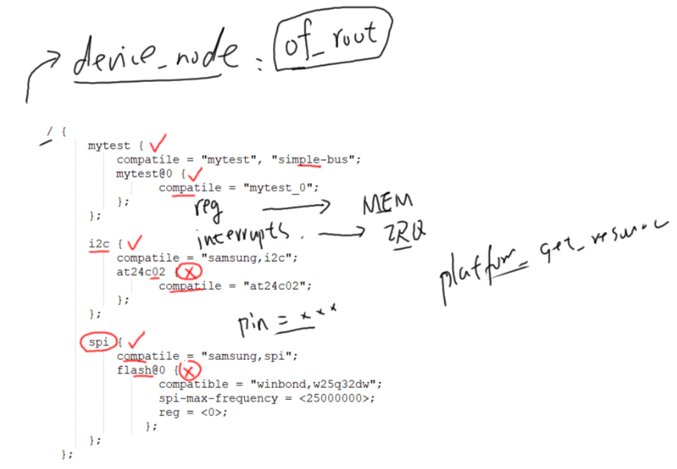

  - 10.4.2 哪些設備樹節點會被轉換為platform_device
  - 10.4.3 怎麼轉換為platform_device
- 10.5 platform_device 如何與platform_driver 配對
  - 10.5.1 最先比較：是否強制選擇某個driver
  - 10.5.2 然後比較：設備樹信息
  - 10.5.3 接下來比較：platform_device_id
  - 10.5.4 最後比較
  - 10.5.5 一個圖概括所有的配對過程
- 10.6 沒有轉換為platform_device 的節點，如何使用
- 10.7 內核裡操作設備樹的常用函數
  - 10.7.1 內核中設備樹相關的頭文件介紹
  - 10.7.2 platform_device 相關的函數
  - 10.7.3 有些節點不會生成platform_device，怎麼訪問它們
- 10.8 怎麼修改設備樹文件

<h1 id="13">13_LED模板驅動程序的改造_設備樹</h1>

[13_LED模板驅動程序的改造_設備樹.pdf](./[第5篇]_嵌入式Linux驅動開發基礎知識/doc/13_LED模板驅動程序的改造_設備樹.pdf)

- 11.1 總結 3 種寫驅動程序的方法
  - 11.1.1 資源和驅動在同一個文件裡
  - 11.1.2 資源用 platform_device 指定、驅動在 platform_driver 實現
  - 11.1.3 資源用設備樹指定驅動在 platform_driver 實現
- 11.2 怎麼使用設備樹寫驅動程序
  - 11.2.1 設備樹節點要與 platform_driver 能匹配
    - `compatible`
  - 11.2.2 設備樹節點指定資源，platform_driver 獲得資源
    - `of_property_read_u32`
- 11.3 開始編程
  - 11.3.1 修改設備樹添加 led 設備節點
  - 11.3.2 修改 platform_driver 的源碼
    - `of_match_table`
- 11.4 上機實驗
  - 使用新的設備樹dtb文件啟動單板，查看`/sys/firmware/devicetree/base`下有無節點
  - 查看`/sys/devices/platform` 目錄下有無對應的platform_device
- 11.5 調試技巧
  - 11.5.1 設備樹的信息
    - `/sys/firmware/devicetree/base/`
  - 11.5.2 platform_device 的信息
    - `/sys/devices/platform`
  - 11.5.3 platform_driver 的信息
    - `/sys/bus/platform/drivers`

設備樹

[100ask_led.dts](./[第5篇]_嵌入式Linux驅動開發基礎知識/source/02_led_drv/05_led_drv_template_device_tree/100ask_led.dts)

驅動

- 根據不同的chip而實現不同的控制驅動
  - [chip_demo_gpio.c](./[第5篇]_嵌入式Linux驅動開發基礎知識/source/02_led_drv/05_led_drv_template_device_tree/chip_demo_gpio.c)

  - [led_opr.h](./[第5篇]_嵌入式Linux驅動開發基礎知識/source/02_led_drv/05_led_drv_template_device_tree/led_opr.h)

- 通用的部分，創建register_chrdev, class, device的節點 與 應用程序使用的接口

  - [leddrv.c](./[第5篇]_嵌入式Linux驅動開發基礎知識/source/02_led_drv/05_led_drv_template_device_tree/leddrv.c)

  - [leddrv.h](./[第5篇]_嵌入式Linux驅動開發基礎知識/source/02_led_drv/05_led_drv_template_device_tree/leddrv.h)

應用程序

- [ledtest.c](./[第5篇]_嵌入式Linux驅動開發基礎知識/source/02_led_drv/05_led_drv_template_device_tree/ledtest.c)

Makefile

- [Makefile](./[第5篇]_嵌入式Linux驅動開發基礎知識/source/02_led_drv/05_led_drv_template_device_tree/Makefile)

<h1 id="14">14_APP怎麼讀取按鍵值</h1>

[14_APP怎麼讀取按鍵值.pdf](./[第5篇]_嵌入式Linux驅動開發基礎知識/doc/14_APP怎麼讀取按鍵值.pdf)

- 12.1 媽媽怎麼知道孩子醒了
- 12.2 APP 讀取按鍵的 4 種方法

    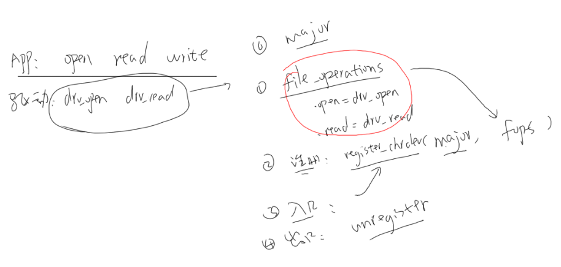

  - 12.2.1 查詢方式

    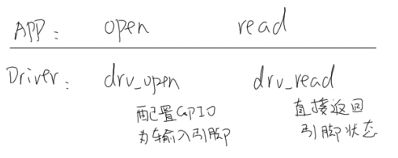

  - 12.2.2 休眠 喚醒方式：timeout = 無限大

    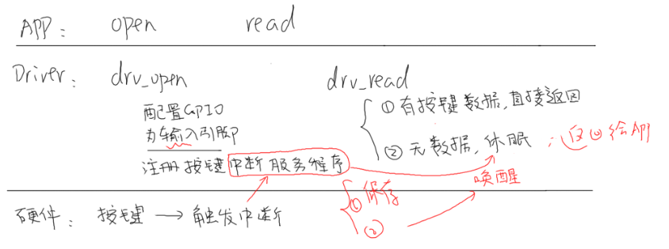

  - 12.2.3 poll 方式：設置timeout

    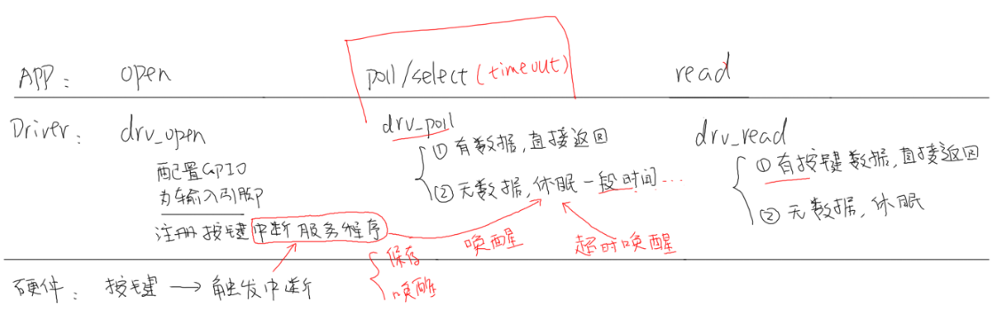

  - 12.2.4 異步通知方式：信號處理

    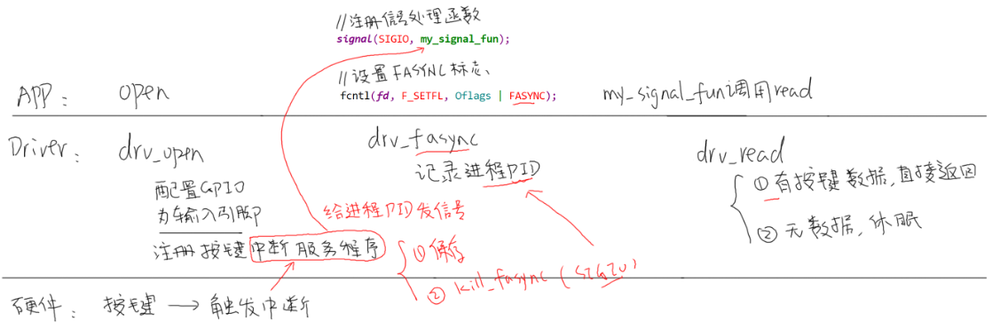

    [signal.c](./[第5篇]_嵌入式Linux驅動開發基礎知識/source/03_signal_example/signal.c)

  - 12.2.5 驅動程序提供能力，不提供策略

<h1 id="15">15_查詢方式的按鍵驅動程序_編寫框架</h1>

[15_查詢方式的按鍵驅動程序_編寫框架.pdf](./[第5篇]_嵌入式Linux驅動開發基礎知識/doc/15_查詢方式的按鍵驅動程序_編寫框架.pdf)

- 13.1 LED 驅動回顧
- 13.2 按鍵驅動編寫思路
- 13.3 編程：先寫框架
  - 13.3.1 把按鍵的操作抽像出一個button_operations 結構體
  - 13.3.2 驅動程序的上層：file_operations 結構體
- 13.4 測試

驅動

- 根據不同的chip而實現不同的控制驅動
  - [board_xxx.c](./[第5篇]_嵌入式Linux驅動開發基礎知識/source/04_button_drv/01_button_drv_template/board_xxx.c)

- 通用的部分，創建register_chrdev, class, device的節點 與 應用程序使用的接口

  - [button_drv.c](./[第5篇]_嵌入式Linux驅動開發基礎知識/source/04_button_drv/01_button_drv_template/button_drv.c)

  - [button_drv.h](./[第5篇]_嵌入式Linux驅動開發基礎知識/source/04_button_drv/01_button_drv_template/button_drv.h)

應用程序

- [button_test.c](./[第5篇]_嵌入式Linux驅動開發基礎知識/source/04_button_drv/01_button_drv_template/button_test.c)

Makefile

- [Makefile](./[第5篇]_嵌入式Linux驅動開發基礎知識/source/04_button_drv/01_button_drv_template/Makefile)

<h1 id="16">16_STM32MP157的按鍵驅動_查詢方式</h1>

[16_STM32MP157的按鍵驅動_查詢方式.pdf](./[第5篇]_嵌入式Linux驅動開發基礎知識/doc/16_STM32MP157的按鍵驅動_查詢方式.pdf)

- 14.1 GPIO 操作回顧
- 14.2 百問網STM32MP157 的按鍵驅動程序(查詢方式)
  - 14.2.1 先看原理圖確定引腳及操作方法
  - 14.2.2 再看芯片手冊確定寄存器及操作方法
  - 14.2.3 編程
  - 14.2.4 測試

驅動

- 根據不同的chip而實現不同的控制驅動
  - [board_100ask_stm32mp157.c](./[第5篇]_嵌入式Linux驅動開發基礎知識/source/04_button_drv/02_button_drv_for_100ask_stm32mp157/board_100ask_stm32mp157.c)

- 通用的部分，創建register_chrdev, class, device的節點 與 應用程序使用的接口

  - [button_drv.c](./[第5篇]_嵌入式Linux驅動開發基礎知識/source/04_button_drv/02_button_drv_for_100ask_stm32mp157/button_drv.c)

  - [button_drv.h](./[第5篇]_嵌入式Linux驅動開發基礎知識/source/04_button_drv/02_button_drv_for_100ask_stm32mp157/button_drv.h)

應用程序

- [button_test.c](./[第5篇]_嵌入式Linux驅動開發基礎知識/source/04_button_drv/02_button_drv_for_100ask_stm32mp157/button_test.c)

Makefile

- [Makefile](./[第5篇]_嵌入式Linux驅動開發基礎知識/source/04_button_drv/02_button_drv_for_100ask_stm32mp157/Makefile)

<h1 id="17">17_Pinctrl與GPIO子系統</h1>

<h2 id="17.1">17-1_Pinctrl子系統重要概念</h2>

`Documentation/devicetree/bindings/Pinctrl/Pinctrl-bindings.txt`

`Documentation/gpio/Pinctrl-bindings.txt`

[17-1_Pinctrl子系統重要概念.pdf](./[第5篇]_嵌入式Linux驅動開發基礎知識/doc/17-1_Pinctrl子系統重要概念.pdf)

- 15.1.1 引入
- 15.1.2 重要概念

    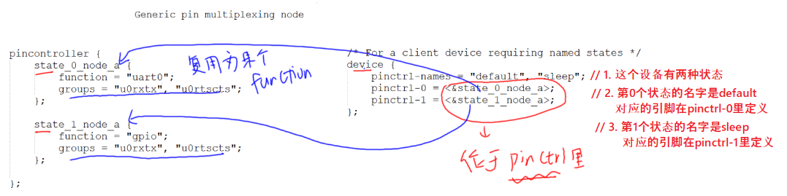

    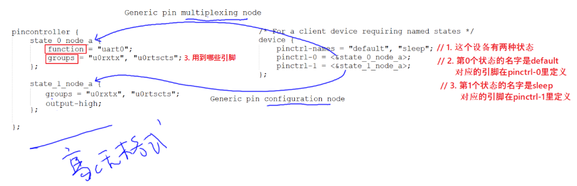

- 15.1.3 示例
- 15.1.4 代碼中怎麼引用pinctrl

<h2 id="17.2">17-2_GPIO子系統重要概念</h2>

`Documentation/devicetree/bindings/gpio/gpio.txt`

[17-2_GPIO子系統重要概念.pdf](./[第5篇]_嵌入式Linux驅動開發基礎知識/doc/17-2_GPIO子系統重要概念.pdf)

- 15.2.1 引入
- 15.2.2 在設備樹中指定引腳
- 15.2.3 在驅動代碼中調用 GPIO 子系統
- 15.2.4 sysfs 中的訪問方法

<h2 id="17.3">17-3_基於GPIO子系統的LED驅動程序</h2>

[17-3_基於GPIO子系統的LED驅動程序.pdf](./[第5篇]_嵌入式Linux驅動開發基礎知識/doc/17-3_基於GPIO子系統的LED驅動程序.pdf)

- 15.3.1 編寫思路
- 15.3.2 在設備樹中添加 Pinctrl 信息
- 15.3.3 在設備樹中添加 GPIO 信息
- 15.3.4 編程示例

透過Pinctrl & GPIO 

<h2 id="17.4">17-4_在STM32MP157上機實驗</h2>

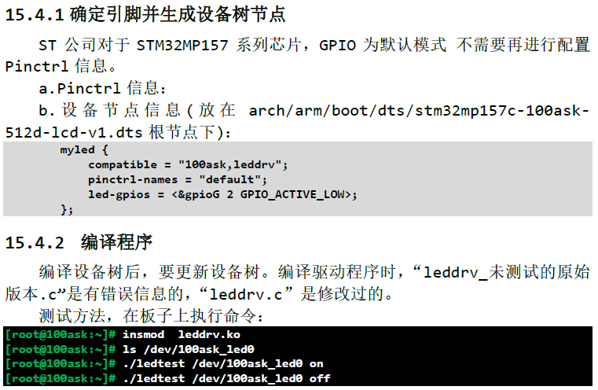


