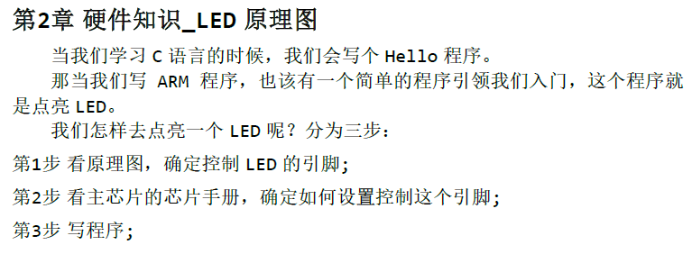

# 目錄

- [Note](#0)
- [01_嵌入式Linux驅動開發基礎知識的引導](#1)
- [02_Hello驅動](#2)
- [03_硬件知識_LED原理圖](#3)
- [04_普通的GPIO引腳操作方法](#4)
- [05_STM32MP157的GPIO操作方法](#5)
- [06_STM32MP157_LED](#6)
  - [6-1_STM32MP157的LED操作方法](#6.1)
  - [6-2_基於STM32MP157的LED驅動程序](#6.2)
- [07_LED驅動程序架構](#7)
- [08_百問網STM32MP157的LED驅動程序](#8)
- [09_驅動設計的思想_面向對象_分層_分離](#9)
- [10_驅動設計進化之路_總線設備驅動模型](#10)
- [11_LED模板驅動程序的改造_總線設備驅動模型](#11)
- [12_設備樹](#12)
  - [12-1_驅動進化之路_設備樹的語法](#12.1)
  - [12-2_驅動進化之路_內核對設備樹的處理與使用](#12.2)
- [13_LED模板驅動程序的改造_設備樹](#13)
- [14_APP怎麼讀取按鍵值](#14)
- [15_查詢方式的按鍵驅動程序_編寫框架](#15)
- [16_STM32MP157的按鍵驅動_查詢方式](#16)
- [17_Pinctrl子系統重要概念](#17)
  - [17-1_Pinctrl子系統重要概念](#17.1)
  - [17-2_GPIO子系統重要概念](#17.2)
  - [17-3_基於GPIO子系統的LED驅動程序](#17.3)
  - [17-4_在STM32MP157上機實驗](#17.4)
- [18_異常與中斷的概念與處理流程](#18)
- [19_Linux系統對中斷的處理](#19)
- [20_驅動程序的基石](#20)
  - [20-1_休眠與喚醒](#20.1)
  - [20-2_POLL機制](#20.2)
  - [20-3_異步通知](#20.3)
  - [20-4_阻塞與非阻塞](#20.4)
  - [20-5_定時器](#20.5)
  - [20-5-1_新內核定時器說明](#20.5.1)
  - [20-6_中斷下半部tasklet](#20.6)
  - [20-7_工作隊列](#20.7)
  - [20-8_中斷的線程化處理](#20.8)
  - [20-9_mmap基礎知識](#20.9)
  - [20-10_mmap編程](#20.10)


<h1 id="0">Note</h1>

以STM32MP157_Pro開發板作為教材

[[第5篇]_嵌入式Linux驅動開發基礎知識](https://www.bilibili.com/video/BV14f4y1Q7ti/?vd_source=790c8244dbe879457094c8374beb04d3)

[Linux驱动虚拟地址和物理地址的映射](https://blog.csdn.net/myxmu/article/details/21461181)

<h1 id="1">01_嵌入式Linux驅動開發基礎知識的引導</h1>

了解驅動開發的流程、方法，掌握從APP到驅動的調用流程

明白“Linux驅動 = 軟件框架 + 硬件操作”

以LED驅動為例，會如下講解


<h1 id="2">02_Hello驅動</h1>

[02_Hello驅動.pdf](./[第5篇]_嵌入式Linux驅動開發基礎知識/doc/02_Hello驅動.pdf)

- 1.1 APP 打開的文件在內核中如何表示

- 1.2 打開字符設備節點時，內核中也有對應的struct file

- 1.3 請猜猜怎麼編寫驅動程序

- 1.4 編寫代碼
  - 1.4.1 寫驅動程序
  - 1.4.2 寫測試程序
  - 1.4.3 測試

- 1.5 Hello 驅動中的一些補充知識
  - 1.5.1 module_init/module_exit 的實現
  - 1.5.2 register_chrdev 的內部實現
  - 1.5.3 class_destroy/device_create 淺析

[hello_drv.c](./[第5篇]_嵌入式Linux驅動開發基礎知識/source/01_hello_drv/hello_drv.c)： Hello的驅動程序

[hello_drv_test.c](./[第5篇]_嵌入式Linux驅動開發基礎知識/source/01_hello_drv/hello_drv_test.c)： Hello的應用程序

[Makefile](./[第5篇]_嵌入式Linux驅動開發基礎知識/source/01_hello_drv/Makefile)： 同時編譯Hello的驅動與應用程序

<h1 id="3">03_硬件知識_LED原理圖</h1>




<h1 id="4">04_普通的GPIO引腳操作方法</h1>


<h1 id="5">05_STM32MP157的GPIO操作方法</h1>

[05_STM32MP157的GPIO操作方法.pdf](./[第5篇]_嵌入式Linux驅動開發基礎知識/doc/05_STM32MP157的GPIO操作方法.pdf)

- 3.3 具體單板的GPIO 操作方法

- 3.4 STM32MP157 GPIO 操作方法
  - 3.4.1 STM32MP157 的GPIO 模塊結構
  - 3.4.2 RCC 用於設置是否向GPIO 模塊提供時鐘
  - 3.4.3 GPIOx_MODER 配置GPIO 模式
  - 3.4.4 GPIOx_OTYPER 配置GPIO 輸出

- 3.5 GPIOx_IDR 設置輸入GPIO
  - 3.5.1 讀GPIO
  - 3.5.2 寫GPIO

[05_STM32MP157的GPIO操作方法_2.pdf](./[第5篇]_嵌入式Linux驅動開發基礎知識/doc/05_STM32MP157的GPIO操作方法_2.pdf)

- GPIO變化速度，當速度越快時，可以傳輸的資料越大，但對外的干擾越大

    

<h1 id="6">06_STM32MP157_LED</h1>

<h2 id="6.1">6-1_STM32MP157的LED操作方法</h2>

[6-1_STM32MP157的LED操作方法.pdf](./[第5篇]_嵌入式Linux驅動開發基礎知識/doc/6-1_STM32MP157的LED操作方法.pdf)

<h2 id="6.2">6-2_基於STM32MP157的LED驅動程序</h2>


00_led_drv_simple

- [led_drv.c](./[第5篇]_嵌入式Linux驅動開發基礎知識/source/02_led_drv/00_led_drv_simple/led_drv.c)
- [ledtest.c](./[第5篇]_嵌入式Linux驅動開發基礎知識/source/02_led_drv/00_led_drv_simple/ledtest.c)
- [Makefile](./[第5篇]_嵌入式Linux驅動開發基礎知識/source/02_led_drv/00_led_drv_simple/Makefile)

<h1 id="7">07_LED驅動程序架構</h1>

[07_LED驅動程序架構.pdf](./[第5篇]_嵌入式Linux驅動開發基礎知識/doc/07_LED驅動程序架構.pdf)

- 5.1 回顧字符設備驅動程序框架
- 5.2 對於LED 驅動，我們想要什麼樣的接口？
- 5.3 LED 驅動能支持多個板子的基礎：分層思想
- 5.4 寫代碼
  - 5.4.1 驅動程序
    - 1. 把LED 的操作抽像出一個led_operations 結構體
    - 2. 驅動程序的上層：file_operations 結構體
  - 5.4.2 測試程序
  - 5.4.3 上機測試
- 5.5 課後作業

01_led_drv_template： 以面向對象的思想，改進代碼，建立一個code template

- [leddrv.c](./[第5篇]_嵌入式Linux驅動開發基礎知識/source/02_led_drv/01_led_drv_template/leddrv.c)
  - [led_opr.h](./[第5篇]_嵌入式Linux驅動開發基礎知識/source/02_led_drv/01_led_drv_template/led_opr.h)
- [board_demo.c](./[第5篇]_嵌入式Linux驅動開發基礎知識/source/02_led_drv/01_led_drv_template/board_demo.c)
- [ledtest.c](./[第5篇]_嵌入式Linux驅動開發基礎知識/source/02_led_drv/01_led_drv_template/ledtest.c)
- [Makefile](./[第5篇]_嵌入式Linux驅動開發基礎知識/source/02_led_drv/01_led_drv_template/Makefile)

<h1 id="8">08_STM32MP157的LED驅動程序</h1>

[08_STM32MP157的LED驅動程序.pdf](./[第5篇]_嵌入式Linux驅動開發基礎知識/doc/08_STM32MP157的LED驅動程序.pdf)

- 6.1 怎麼寫LED 驅動程序？
  - 6.1.1 ioremap 函數的使用：

    

  - 6.1.2 volatile 的使用：
- 6.2 百問網STM32MP157 的LED 驅動程序
  - 6.2.1 所涉及的寄存器操作
  - 6.2.2 寫程序
  - 6.2.3 上機實驗
  - 6.2.4 課後作業

02_led_drv_for_boards：對不同的board有不同控制LED的實體實現，以STM32MP157為例

- [board_100ask_stm32mp157.c](./[第5篇]_嵌入式Linux驅動開發基礎知識/source/02_led_drv/02_led_drv_for_boards/board_100ask_stm32mp157.c)
  - [led_opr.h](./[第5篇]_嵌入式Linux驅動開發基礎知識/source/02_led_drv/02_led_drv_for_boards/led_opr.h)
- [leddrv.c](./[第5篇]_嵌入式Linux驅動開發基礎知識/source/02_led_drv/02_led_drv_for_boards/leddrv.c)
- [ledtest.c](./[第5篇]_嵌入式Linux驅動開發基礎知識/source/02_led_drv/02_led_drv_for_boards/ledtest.c)
- [Makefile]

請新增iounmap執行的地方

- board.c --> 新增 `board_demo_led_exit()`

    ```C
    static void board_demo_led_exit (int which) /* 初始化LED, which-哪个LED */
    {
        iounmap(RCC_PLL4CR);
        iounmap(RCC_MP_AHB4ENSETR);
        iounmap(GPIOA_MODER);
        iounmap(GPIOA_BSRR);
    }

    static struct led_operations board_demo_led_opr = {
        .num  = 1,
        .init = board_demo_led_init,
        .exit = board_demo_led_exit,
        .ctl  = board_demo_led_ctl,
    };
    ```

- led_opr.h

    ```C
    struct led_operations {
        int num;
        int (*init) (int which); /* 初始化LED, which-哪个LED */
        void (*exit) (int which); /* iounmap */
        int (*ctl) (int which, char status); /* 控制LED, which-哪个LED,status:1-亮,0-灭 */
    };
    ```

- leddrv.c

    ```C
    static void __exit led_exit(void)
    {
        int i;
        printk("%s %s line %d\n", __FILE__, __FUNCTION__, __LINE__);

        p_led_opr->init(minor);

        for (i = 0; i < p_led_opr->num; i++)
            device_destroy(led_class, MKDEV(major, i)); /* /dev/100ask_led0,1,... */

        device_destroy(led_class, MKDEV(major, 0));
        class_destroy(led_class);
        unregister_chrdev(major, "100ask_led");
    }
    ```

請修改代碼支持2個LED

- board.c

    ```C
    static int board_demo_led_init (int which) /* 初始化LED, which-哪个LED */ 
    {
        /*..................*/

        if (which == 0)
        {
            /*..................*/
        }
        else if (which == 1)
        {
            /*..................*/
        }

        return 0;
    }

    static int board_demo_led_ctl (int which, char status) /* 控制LED, which-哪个LED, status:1-亮,0-灭 */
    {
        if (which == 0)
        {
            /*..................*/
        }
        else if (which == 1)
        {
            /*..................*/
        }

        return 0;
    }

    static struct led_operations board_demo_led_opr = {
        .num  = 2,
        .init = board_demo_led_init,
        .ctl  = board_demo_led_ctl,
    };
    ```

<h1 id="9">09_驅動設計的思想_面向對象_分層_分離</h1>

Linux驅動 = 驅動框架 + 硬件操作 = 驅動框架 + 單片機


面向對象_分層_分離的範例

- [board_A_led.c](./[第5篇]_嵌入式Linux驅動開發基礎知識/source/02_led_drv/03_led_drv_template_seperate/board_A_led.c)

  - [led_resource.h](./[第5篇]_嵌入式Linux驅動開發基礎知識/source/02_led_drv/03_led_drv_template_seperate/led_resource.h)

- [chip_demo_gpio.c](./[第5篇]_嵌入式Linux驅動開發基礎知識/source/02_led_drv/03_led_drv_template_seperate/chip_demo_gpio.c)

  - [led_opr.h](./[第5篇]_嵌入式Linux驅動開發基礎知識/source/02_led_drv/03_led_drv_template_seperate/led_opr.h)

- [leddrv.c](./[第5篇]_嵌入式Linux驅動開發基礎知識/source/02_led_drv/03_led_drv_template_seperate/leddrv.c)

- [ledtest.c](./[第5篇]_嵌入式Linux驅動開發基礎知識/source/02_led_drv/03_led_drv_template_seperate/ledtest.c)

- [Makefile](./[第5篇]_嵌入式Linux驅動開發基礎知識/source/02_led_drv/03_led_drv_template_seperate/Makefile)

<h1 id="10">10_驅動設計進化之路_總線設備驅動模型</h1>


- 原先以不同大量的platform_device來定義設備資訊，並且存放於Linux Kernel當中，但這樣會導致內核過於龐大，且修改設備資訊的話，整個內核就需要重新編譯。將其修改在內核之外以device-tree的形式表示的話，可以大大地優化

- 內核會解析.dtb來取得設備資訊


<h1 id="11">11_LED模板驅動程序的改造_總線設備驅動模型</h1>

[11_LED模板驅動程序的改造_總線設備驅動模型.pdf](./[第5篇]_嵌入式Linux驅動開發基礎知識/doc/11_LED模板驅動程序的改造_總線設備驅動模型.pdf)

- 9.1 原來的框架
- 9.2 要實現的框架
- 9.3 寫代碼
  - 9.3.1 注意事項
  - 9.3.2 實現 platform_device 結構體
  - 9.3.3 實現 platform_driver 結構體

設備

- [board_A_led.c](./[第5篇]_嵌入式Linux驅動開發基礎知識/source/02_led_drv/04_led_drv_template_bus_dev_drv/board_A_led.c)

- [led_resource.h](./[第5篇]_嵌入式Linux驅動開發基礎知識/source/02_led_drv/04_led_drv_template_bus_dev_drv/led_resource.h)

驅動

- 根據不同的chip而實現不同的控制驅動
  - [chip_demo_gpio.c](./[第5篇]_嵌入式Linux驅動開發基礎知識/source/02_led_drv/04_led_drv_template_bus_dev_drv/chip_demo_gpio.c)

  - [led_opr.h](./[第5篇]_嵌入式Linux驅動開發基礎知識/source/02_led_drv/04_led_drv_template_bus_dev_drv/led_opr.h)

- 通用的部分，創建register_chrdev, class, device的節點 與 應用程序使用的接口

  - [leddrv.c](./[第5篇]_嵌入式Linux驅動開發基礎知識/source/02_led_drv/04_led_drv_template_bus_dev_drv/leddrv.c)

  - [leddrv.h](./[第5篇]_嵌入式Linux驅動開發基礎知識/source/02_led_drv/04_led_drv_template_bus_dev_drv/leddrv.h)

應用程序

- [ledtest.c](./[第5篇]_嵌入式Linux驅動開發基礎知識/source/02_led_drv/04_led_drv_template_bus_dev_drv/ledtest.c)

Makefile

- [Makefile](./[第5篇]_嵌入式Linux驅動開發基礎知識/source/02_led_drv/04_led_drv_template_bus_dev_drv/Makefile)

<h1 id="12">12_設備樹</h1>

[官方文檔 devicetree-specification-v0.4-rc1.pdf](./[第5篇]_嵌入式Linux驅動開發基礎知識/doc/devicetree-specification-v0.4-rc1.pdf)

- https://www.devicetree.org/specifications/

<h2 id="12.1">12-1_驅動進化之路_設備樹的語法</h2>

[12_設備樹語法與內核對設備樹的使用.pdf](./[第5篇]_嵌入式Linux驅動開發基礎知識/doc/12_設備樹語法與內核對設備樹的使用.pdf)

- 10.1 設備樹的引入與作用
  - 使用配置文件取代用.c撰寫的設備資訊
  - 而配置文件使用設備樹來完成
  - 設備樹文件是給內核使用的
  - 而設備樹文件是由bootloader傳給內核的
  - 進入uboot中，輸入print，可以查看到 `fdtfile=xxxx/xxx.dtb`
  - `/sys/firmware/devicetree`
  - `/sys/firmware/fdt`
- 10.2 設備樹的語法
  - `" "`: 雙引號內放字串
  - `< >`: 尖括號內放32bits的數字，可用16進制或10進制
  - `[ ]`: 中括號內放16進制的單字節，不必加0x
  - 10.2.1 Devicetree 格式
    - [] 表示該參數可有可無
    - DTS 文件的格式
    - node 的格式
    - properties 的格式
  - 10.2.2 dts 文件包含 dtsi 文件
  - 10.2.3 常用的屬性
    - `#address 單元格、#size 單元格`：影響子節點內的 `reg屬性`
    - `compatible`：兼容的驅動程式, "廠家, 模組" 來命名
    - `model`：定義使用的硬體名稱
    - `status`：透過ok/disable修改實際板子(dts)來覆寫公板(dtsi)
    - `reg`：<地址 大小> 成對出現，用來描述一段空間或是表示是哪顆CPU

        ```
        cpus {
            #address-cells = <1>;
            #size-cells = <0>;
            cpu@0 {
                compatible = "arm,cortex-a53", "arm,armv8";
                device_type = "cpu";
                reg = <0x0>;
                enable-method = "psci";
            };

            cpu@1 {
                compatible = "arm,cortex-a53", "arm,armv8";
                device_type = "cpu";
                reg = <0x1>;
                enable-method = "psci";
            };

            cpu@2 {
                compatible = "arm,cortex-a53", "arm,armv8";
                device_type = "cpu";
                reg = <0x2>;
                enable-method = "psci";
            };

            cpu@3 {
                compatible = "arm,cortex-a53", "arm,armv8";
                device_type = "cpu";
                reg = <0x3>;
                enable-method = "psci";
            };
        };
        ```

  - 10.2.4 常用的節點 node
    - 根節點
    - cpu節點
    - memory節點
    - chosen節點
- 10.3 編譯、更換設備樹
  - 10.3.1 在內核中直接 make
  - 10.3.2 手工編譯
    - 在內核目錄下執行 `make dtbs`
  - 10.3.3 給開發板更換設備樹文件
    - 將 `.dtb` 更新至開發版 `/boot/目錄下`
  - 10.3.4 板子啟動後查看設備樹

<h2 id="12.2">12-2_驅動進化之路_內核對設備樹的處理與使用</h2>

[12_設備樹語法與內核對設備樹的使用.pdf](./[第5篇]_嵌入式Linux驅動開發基礎知識/doc/12_設備樹語法與內核對設備樹的使用.pdf)

- 10.4 內核對設備樹的處理
  - 10.4.1 dtb 中每一個節點都被轉換為device_node 結構體

    

  - 10.4.2 哪些設備樹節點會被轉換為platform_device
  - 10.4.3 怎麼轉換為platform_device
- 10.5 platform_device 如何與platform_driver 配對
  - 10.5.1 最先比較：是否強制選擇某個driver
  - 10.5.2 然後比較：設備樹信息
  - 10.5.3 接下來比較：platform_device_id
  - 10.5.4 最後比較
  - 10.5.5 一個圖概括所有的配對過程
- 10.6 沒有轉換為platform_device 的節點，如何使用
- 10.7 內核裡操作設備樹的常用函數
  - 10.7.1 內核中設備樹相關的頭文件介紹
  - 10.7.2 platform_device 相關的函數
  - 10.7.3 有些節點不會生成platform_device，怎麼訪問它們
- 10.8 怎麼修改設備樹文件

<h1 id="13">13_LED模板驅動程序的改造_設備樹</h1>

[13_LED模板驅動程序的改造_設備樹.pdf](./[第5篇]_嵌入式Linux驅動開發基礎知識/doc/13_LED模板驅動程序的改造_設備樹.pdf)

- 11.1 總結 3 種寫驅動程序的方法
  - 11.1.1 資源和驅動在同一個文件裡
  - 11.1.2 資源用 platform_device 指定、驅動在 platform_driver 實現
  - 11.1.3 資源用設備樹指定驅動在 platform_driver 實現
- 11.2 怎麼使用設備樹寫驅動程序
  - 11.2.1 設備樹節點要與 platform_driver 能匹配
    - `compatible`
  - 11.2.2 設備樹節點指定資源，platform_driver 獲得資源
    - `of_property_read_u32`
- 11.3 開始編程
  - 11.3.1 修改設備樹添加 led 設備節點
  - 11.3.2 修改 platform_driver 的源碼
    - `of_match_table`
- 11.4 上機實驗
  - 使用新的設備樹dtb文件啟動單板，查看`/sys/firmware/devicetree/base`下有無節點
  - 查看`/sys/devices/platform` 目錄下有無對應的platform_device
- 11.5 調試技巧
  - 11.5.1 設備樹的信息
    - `/sys/firmware/devicetree/base/`
  - 11.5.2 platform_device 的信息
    - `/sys/devices/platform`
  - 11.5.3 platform_driver 的信息
    - `/sys/bus/platform/drivers`

設備樹

[100ask_led.dts](./[第5篇]_嵌入式Linux驅動開發基礎知識/source/02_led_drv/05_led_drv_template_device_tree/100ask_led.dts)

驅動

- 根據不同的chip而實現不同的控制驅動
  - [chip_demo_gpio.c](./[第5篇]_嵌入式Linux驅動開發基礎知識/source/02_led_drv/05_led_drv_template_device_tree/chip_demo_gpio.c)

  - [led_opr.h](./[第5篇]_嵌入式Linux驅動開發基礎知識/source/02_led_drv/05_led_drv_template_device_tree/led_opr.h)

- 通用的部分，創建register_chrdev, class, device的節點 與 應用程序使用的接口

  - [leddrv.c](./[第5篇]_嵌入式Linux驅動開發基礎知識/source/02_led_drv/05_led_drv_template_device_tree/leddrv.c)

  - [leddrv.h](./[第5篇]_嵌入式Linux驅動開發基礎知識/source/02_led_drv/05_led_drv_template_device_tree/leddrv.h)

應用程序

- [ledtest.c](./[第5篇]_嵌入式Linux驅動開發基礎知識/source/02_led_drv/05_led_drv_template_device_tree/ledtest.c)

Makefile

- [Makefile](./[第5篇]_嵌入式Linux驅動開發基礎知識/source/02_led_drv/05_led_drv_template_device_tree/Makefile)

<h1 id="14">14_APP怎麼讀取按鍵值</h1>

[14_APP怎麼讀取按鍵值.pdf](./[第5篇]_嵌入式Linux驅動開發基礎知識/doc/14_APP怎麼讀取按鍵值.pdf)

- 12.1 媽媽怎麼知道孩子醒了
- 12.2 APP 讀取按鍵的 4 種方法

    

  - 12.2.1 查詢方式

    

  - 12.2.2 休眠 喚醒方式：timeout = 無限大

    

  - 12.2.3 poll 方式：設置timeout

    

  - 12.2.4 異步通知方式：信號處理

    

    [signal.c](./[第5篇]_嵌入式Linux驅動開發基礎知識/source/03_signal_example/signal.c)

  - 12.2.5 驅動程序提供能力，不提供策略

<h1 id="15">15_查詢方式的按鍵驅動程序_編寫框架</h1>

[15_查詢方式的按鍵驅動程序_編寫框架.pdf](./[第5篇]_嵌入式Linux驅動開發基礎知識/doc/15_查詢方式的按鍵驅動程序_編寫框架.pdf)

- 13.1 LED 驅動回顧
- 13.2 按鍵驅動編寫思路
- 13.3 編程：先寫框架
  - 13.3.1 把按鍵的操作抽像出一個button_operations 結構體
  - 13.3.2 驅動程序的上層：file_operations 結構體
- 13.4 測試

驅動

- 根據不同的chip而實現不同的控制驅動
  - [board_xxx.c](./[第5篇]_嵌入式Linux驅動開發基礎知識/source/04_button_drv/01_button_drv_template/board_xxx.c)

- 通用的部分，創建register_chrdev, class, device的節點 與 應用程序使用的接口

  - [button_drv.c](./[第5篇]_嵌入式Linux驅動開發基礎知識/source/04_button_drv/01_button_drv_template/button_drv.c)

  - [button_drv.h](./[第5篇]_嵌入式Linux驅動開發基礎知識/source/04_button_drv/01_button_drv_template/button_drv.h)

應用程序

- [button_test.c](./[第5篇]_嵌入式Linux驅動開發基礎知識/source/04_button_drv/01_button_drv_template/button_test.c)

Makefile

- [Makefile](./[第5篇]_嵌入式Linux驅動開發基礎知識/source/04_button_drv/01_button_drv_template/Makefile)

<h1 id="16">16_STM32MP157的按鍵驅動_查詢方式</h1>

[16_STM32MP157的按鍵驅動_查詢方式.pdf](./[第5篇]_嵌入式Linux驅動開發基礎知識/doc/16_STM32MP157的按鍵驅動_查詢方式.pdf)

- 14.1 GPIO 操作回顧
- 14.2 百問網STM32MP157 的按鍵驅動程序(查詢方式)
  - 14.2.1 先看原理圖確定引腳及操作方法
  - 14.2.2 再看芯片手冊確定寄存器及操作方法
  - 14.2.3 編程
  - 14.2.4 測試

驅動

- 根據不同的chip而實現不同的控制驅動
  - [board_100ask_stm32mp157.c](./[第5篇]_嵌入式Linux驅動開發基礎知識/source/04_button_drv/02_button_drv_for_100ask_stm32mp157/board_100ask_stm32mp157.c)

- 通用的部分，創建register_chrdev, class, device的節點 與 應用程序使用的接口

  - [button_drv.c](./[第5篇]_嵌入式Linux驅動開發基礎知識/source/04_button_drv/02_button_drv_for_100ask_stm32mp157/button_drv.c)

  - [button_drv.h](./[第5篇]_嵌入式Linux驅動開發基礎知識/source/04_button_drv/02_button_drv_for_100ask_stm32mp157/button_drv.h)

應用程序

- [button_test.c](./[第5篇]_嵌入式Linux驅動開發基礎知識/source/04_button_drv/02_button_drv_for_100ask_stm32mp157/button_test.c)

Makefile

- [Makefile](./[第5篇]_嵌入式Linux驅動開發基礎知識/source/04_button_drv/02_button_drv_for_100ask_stm32mp157/Makefile)

<h1 id="17">17_Pinctrl與GPIO子系統</h1>

<h2 id="17.1">17-1_Pinctrl子系統重要概念</h2>

`Documentation/devicetree/bindings/Pinctrl/Pinctrl-bindings.txt`

`Documentation/gpio/Pinctrl-bindings.txt`

[17-1_Pinctrl子系統重要概念.pdf](./[第5篇]_嵌入式Linux驅動開發基礎知識/doc/17-1_Pinctrl子系統重要概念.pdf)

- 15.1.1 引入
- 15.1.2 重要概念

    

    

- 15.1.3 示例
- 15.1.4 代碼中怎麼引用pinctrl

<h2 id="17.2">17-2_GPIO子系統重要概念</h2>

`Documentation/devicetree/bindings/gpio/gpio.txt`

[17-2_GPIO子系統重要概念.pdf](./[第5篇]_嵌入式Linux驅動開發基礎知識/doc/17-2_GPIO子系統重要概念.pdf)

- 15.2.1 引入
- 15.2.2 在設備樹中指定引腳
- 15.2.3 在驅動代碼中調用 GPIO 子系統
- 15.2.4 sysfs 中的訪問方法

<h2 id="17.3">17-3_基於GPIO子系統的LED驅動程序</h2>

[17-3_基於GPIO子系統的LED驅動程序.pdf](./[第5篇]_嵌入式Linux驅動開發基礎知識/doc/17-3_基於GPIO子系統的LED驅動程序.pdf)

- 15.3.1 編寫思路
- 15.3.2 在設備樹中添加 Pinctrl 信息
- 15.3.3 在設備樹中添加 GPIO 信息
- 15.3.4 編程示例

透過Pinctrl & GPIO 子系統，就不用自己作框架來符合各種硬件，這些框架由GPIO子系統處理了，GPIO子系統把硬件的不同封裝起來，因此可以把之前多個檔案變成一個檔案

以GPIO子系統撰寫的驅動

- [leddrv.c](./[第5篇]_嵌入式Linux驅動開發基礎知識/source/05_gpio_and_pinctrl/01_led/leddrv.c)

應用程序

- [ledtest.c](./[第5篇]_嵌入式Linux驅動開發基礎知識/source/05_gpio_and_pinctrl/01_led/ledtest.c)

Makefile

- [Makefile](./[第5篇]_嵌入式Linux驅動開發基礎知識/source/05_gpio_and_pinctrl/01_led/Makefile)

<h2 id="17.4">17-4_在STM32MP157上機實驗</h2>

[STM32CubeMX配置STM32引腳演示](https://www.bilibili.com/video/BV14f4y1Q7ti?p=36&vd_source=790c8244dbe879457094c8374beb04d3)


- 由於GPIO子系統跟Pinctrl子系統關係密切，使用gpiod_get等函數獲得GPIO引腳時，他就會被設置為GPIO功能，因此無須在Pinctrl裡設置

- 因為GPIO子系統可以避免直接操作暫存器

- 所以在device-tree中，我們不需要設置Pinctrl配置，只需要指定使用哪個GPIO引腳即可，如下所示

    ```dts
    myled{
        compatible = "100ask, leddrv";
        led-gpios = <&gpio5 3 GPIO_ACTIVE_LOW>;
    }
    ```

<h1 id="18">18_異常與中斷的概念與處理流程</h1>

[18_異常與中斷的概念與處理流程.pdf](./[第5篇]_嵌入式Linux驅動開發基礎知識/doc/18_異常與中斷的概念與處理流程.pdf)

- 16.1 中斷的引入

    

  - 16.1.1 媽媽怎麼知道孩子醒了
  - 16.1.2 嵌入系統中也有類似的情況

    

- 16.2 中斷的處理流程
- 16.3 異常向量表

    

- 16.4 參考資料

<h1 id="19">19_Linux系統對中斷的處理</h1>

[19_Linux系統對中斷的處理.pdf](./[第5篇]_嵌入式Linux驅動開發基礎知識/doc/19_Linux系統對中斷的處理.pdf)

## 19-1_進程、線程、中斷的核心：棧

- 17.1.1 ARM 處理器程序運行的過程
  - 確保RAM中的數據與代碼不會被破壞, CPU暫存器的數值不會被修改
  - 但CPU暫存器會被多個程序共同使用，因此剛某個程序要切換出去時，要保存這些暫存器，儲存於內存，棧(stack)裡面
    
    

- 17.1.2 程序被中斷時，怎麼保存現場
- 17.1.3 進程、線程的概念
  - 資源分配的單位是進程，調度的單位是線程
  - 一個進程裡，可能有多個線程，這些線程共用打開的文件句柄、全局變量等等。
  - 每一個線程，都有自己的棧。
  - 按鍵線程可以使用阻塞方式讀取按鍵，無按鍵時是休眠的

## 19-2_Linux系統對中斷處理的演進

- 17.2.1 Linux 對中斷的擴展：硬件中斷、軟件中斷

    

    

- 17.2.2 中斷處理原則1：不能嵌套
  - 在Linux 系統上中斷無法嵌套：即當前中斷A 沒處理完之前，不會響應另一個中斷B(即使它的優先級更高)。
- 17.2.3 中斷處理原則2：越快越好
  - 在中斷的處理過程中，該CPU 是不能進行進程調度的，所以中斷的處理要越快越好，儘早讓其他中斷能被處理──進程調度靠定時器中斷來實現。
- 17.2.4 拆分為：上半部、下半部
  - 中斷的處理可以分為上半部，下半部
  - 中斷上半部(handler 函數)，用來處理緊急的事，它是在關中斷的狀態下執行的
  - 中斷下半部，用來處理耗時的、不那麼緊急的事，它是在開中斷的狀態下執行的
  - 中斷下半部執行時，有可能會被多次打斷，有可能會再次發生同一個中斷
  - 中斷上半部執行完後，觸發中斷下半部的處理
  - 中斷上半部、下半部的執行過程中，不能休眠：中斷休眠的話，以後誰來調度進程啊？
  - 中斷下半部會處理所有的軟件中斷
  - 避免佔用CPU時間太多，中斷下半部會以內核線程來處理
  - 中斷下半部的實現有很多種方法，講2 種主要的：tasklet(小任務)、
work queue(工作隊列)。


- 17.2.5 下半部要做的事情耗時不是太長：tasklet
  - tasklet 是使用軟件中斷來實現

    

- 17.2.6 工作隊列
  - 在中斷下半部的執行過程中，雖然是開中斷的，期間可以處理各類中斷。但是畢竟整個中斷的處理還沒走完，這期間APP 是無法執行的。
  - 應該用內核線程來做：在中斷上半部喚醒內核線程。內核線程和
APP 都一樣競爭執行，APP 有機會執行，系統不會卡頓。
  - 內核線程是系統幫我們創建的，一般是kworker 線程，內核中有很多
這樣的線程
  - kworker 線程要去 "工作隊列"(work queue)上取出一個一個 "工作"
(work)

- 17.2.7 新技術：threaded irq
  - 使用線程來處理中斷，並不是什麼新鮮事。使用work 就可以實現，但是需要定義work、調用schedule_work，好麻煩。
  - 可以只提供thread_fn，系統會為這個函數創建一個內核線程。發生中
斷時，內核線程就會執行這個函數。
  - 新技術threaded irq，為每一個中斷都創建一個內核線程；多個中斷的
內核線程可以分配到多個CPU 上執行，這提高了效率。

## 19-3_Linux中斷系統中的重要數據結構

- 17.3.1 irq_desc 數組
  - 在 Linux 內核中有一個中斷數組，對於每一個硬件中斷，都有一個數組項，這個數組就是irq_desc 數組。
- 17.3.2 irqaction 結構體
  - 當調用request_irq、request_threaded_irq 註冊中斷處理函數時，內
核就會構造一個irqaction 結構體。
- 17.3.3 irq_data 結構體
  - 它就是個中轉站，裡面有irq_chip 指針 irq_domain 指針，都是指向別
的結構體
- 17.3.4 irq_domain 結構體
  - 何在設備樹中指定中斷，設備樹的中斷如何被轉換為irq
  - 讀取GPIO暫存器得到hwirq，根據hwirq得到之前映射的irq
- 17.3.5 irq_chip 結構體
  - 在 request_irq 後，並不需要手工去使能中斷，原因就是系統調用對
應的 irq_chip 裡的函數幫我們使能了中斷。

## 19-4_在設備樹中指定中斷_在代碼中獲得中斷

- 17.4.1 設備樹里中斷節點的語法

    

  - 1 設備樹里的中斷控制器
  - 2 設備樹里使用中斷
- 17.4.2 設備樹里中斷節點的示例
- 17.4.3 在代碼中獲得中斷

**GIC中斷控制器**(interrupt controller)通過**中斷類型**、**中斷號**、**中斷觸發**方式這三個要素可以描述一個唯一指定的中斷。這種能夠描述出系統中唯一中斷的要素組合稱為interrupt specifier

- GIC的外設中斷（除去SGI)類型有兩類：
  - SPI，共享外設中斷(由GIC內部的distributor來分發到相關CPU)，中斷號：32~1019
  - PPI，私有外設中斷(指定CPU接收)，中斷號：16~31

- 外設中斷號的分配規則如下：
  - 32~1019給SPI
  - 16~31給PPI

- 所有外設中斷都支持四種觸發方式：
  - 上升沿觸發
  - 下降沿觸發
  - 高電平觸發
  - 低電平觸發

所以DTS中接在GIC的device node的interrupts屬性也是用這三個要素來描述一個具體的中斷。


## 19-5_編寫使用中斷的按鍵驅動程序

- 17.5.1 編程思路
  - 1 設備樹相關
    - 查看原理圖確定按鍵使用的引腳
    - 在設備樹中添加節點
    - 在節點裡指定中斷信息
  - 2 驅動代碼相關
    - 取得中斷號
    - 編寫中斷處理函數
    - `request_irq()`
- 17.5.2 先編寫驅動程序
  - 1 從設備樹獲得GPIO

    ```C
    count = of_gpio_count(node);
    for (i = 0; i < count; i++)
        gpio_keys_100ask[i].gpio = of_get_gpio_flags(node, i, &flag);
    ```

  - 2 從GPIO 獲得中斷號

    ```C
    gpio_keys_100ask[i].irq = gpio_to_irq(gpio_keys_100ask[i].gpio);
    ```

  - 3 申請中斷

    ```C
    err = request_irq(gpio_keys_100ask[i].irq, gpio_key_isr, \
    IRQF_TRIGGER_RISING | IRQF_TRIGGER_FALLING, "100ask_gpio_key", &gpio_keys_100ask[i]);
    ```

  - 4 中斷函數

    ```C
    static irqreturn_t gpio_key_isr(int irq, void *dev_id)
    {
        struct gpio_key *gpio_key = dev_id;
        int val;
        val = gpiod_get_value(gpio_key->gpiod);
        printk("key %d %d\n", gpio_key->gpio, val);
        return IRQ_HANDLED;
    }
    ```


適用於所有支援GPIO子系統的開發版

GPIO子系統中斷驅動

[gpio_key_drv.c](./[第5篇]_嵌入式Linux驅動開發基礎知識/source/06_gpio_irq/01_simple/gpio_key_drv.c)

- `devm_gpio_request_one()`：為某設備請求與配置GPIO

device-tree

[修改后stm32mp157c-100ask-512d-lcd-v1.dts](./[第5篇]_嵌入式Linux驅動開發基礎知識/source/06_gpio_irq/01_simple/修改后stm32mp157c-100ask-512d-lcd-v1.dts)

Makefile

[Makefile](./[第5篇]_嵌入式Linux驅動開發基礎知識/source/06_gpio_irq/01_simple/Makefile)

## 19-6_STM32MP157設備樹修改及上機實驗

- 17.6.1 查看原理圖確定按鍵引腳
- 17.6.2 修改設備樹
- 17.6.3 上機實驗

<h1 id="20">20_驅動程序的基石</h1>

[20_驅動程序的基石.pdf](./[第5篇]_嵌入式Linux驅動開發基礎知識/doc/20_驅動程序的基石.pdf)

<h2 id="20.1">20-1_休眠與喚醒</h2>

18.1.1 適用場景

- 先前 `查詢方式` 在系統調用後，會直接返回引腳電平，不管有無數據

    

- 當應用程序必須等待某個事件發生，比如必須等待按鍵被按下時，可以使用 `休眠-喚醒` 機制

    

  - 進程/線程 上下文: 指的是應用態與內核態，可以休眠
  - 中斷 上下文: 指的是硬件態與內核態，不可以休眠

18.1.2 內核函數

- `include\linux\wait.h`

1. 休眠函數

    

    

2. 喚醒函數

    

18.1.3 驅動框架

1. 初始化 wq 隊列
2. 在驅動的 read 函數中，調用 wait_event_interruptible
3. 在中斷服務程序裡，調用 wake_up_interruptible 喚醒線程

18.1.4 編程

**`02_read_key_irq`**

驅動

- [gpio_key_drv.c](./[第5篇]_嵌入式Linux驅動開發基礎知識/source/06_gpio_irq/02_read_key_irq/gpio_key_drv.c)

    ```C
    static int g_key = 0;

    static DECLARE_WAIT_QUEUE_HEAD(gpio_key_wait);

    static ssize_t gpio_key_drv_read (struct file *file, char __user *buf, size_t size, loff_t *offset)
    {
        //printk("%s %s line %d\n", __FILE__, __FUNCTION__, __LINE__);
        int err;

        wait_event_interruptible(gpio_key_wait, g_key);
        err = copy_to_user(buf, &g_key, 4);
        g_key = 0;

        return 4;
    }

    static irqreturn_t gpio_key_isr(int irq, void *dev_id)
    {
        struct gpio_key *gpio_key = dev_id;
        int val;
        val = gpiod_get_value(gpio_key->gpiod);


        printk("key %d %d\n", gpio_key->gpio, val);
        g_key = (gpio_key->gpio << 8) | val;
        wake_up_interruptible(&gpio_key_wait);

        return IRQ_HANDLED;
    }
    ```

應用程序

- [button_test.c](./[第5篇]_嵌入式Linux驅動開發基礎知識/source/06_gpio_irq/02_read_key_irq/button_test.c)

    ```C
    fd = open(argv[1], O_RDWR);
    if (fd == -1)
    {
        printf("can not open file %s\n", argv[1]);
        return -1;
    }

    while (1)
    {
        /* 3. 读文件 */
        read(fd, &val, 4);
        printf("get button : 0x%x\n", val);
    }
    ```

Makefile

- [Makefile](./[第5篇]_嵌入式Linux驅動開發基礎知識/source/06_gpio_irq/02_read_key_irq/Makefile)


**`03_read_key_irq_circle_buffer`**

- 每次硬件觸發時，驅動都會執行中斷函數獲得數值，但應用程式只會讀取到最近的一筆，因此將原本使用一個全局變量來接收，改成設置環形緩衝區來作改善

    

驅動

- [gpio_key_drv.c](./[第5篇]_嵌入式Linux驅動開發基礎知識/source/06_gpio_irq/03_read_key_irq_circle_buffer/gpio_key_drv.c)

    ```C
    /* 环形缓冲区 */
    #define BUF_LEN 128
    static int g_keys[BUF_LEN];
    static int r, w;

    #define NEXT_POS(x) ((x+1) % BUF_LEN)

    static int is_key_buf_empty(void)
    {
        return (r == w);
    }

    static int is_key_buf_full(void)
    {
        return (r == NEXT_POS(w));
    }

    static void put_key(int key)
    {
        if (!is_key_buf_full())
        {
            g_keys[w] = key;
            w = NEXT_POS(w);
        }
    }

    static int get_key(void)
    {
        int key = 0;
        if (!is_key_buf_empty())
        {
            key = g_keys[r];
            r = NEXT_POS(r);
        }
        return key;
    }

    static DECLARE_WAIT_QUEUE_HEAD(gpio_key_wait);

    /* 实现对应的open/read/write等函数，填入file_operations结构体                   */
    static ssize_t gpio_key_drv_read (struct file *file, char __user *buf, size_t size, loff_t *offset)
    {
        //printk("%s %s line %d\n", __FILE__, __FUNCTION__, __LINE__);
        int err;
        int key;

        wait_event_interruptible(gpio_key_wait, !is_key_buf_empty());
        key = get_key();
        err = copy_to_user(buf, &key, 4);

        return 4;
    }

    static irqreturn_t gpio_key_isr(int irq, void *dev_id)
    {
        struct gpio_key *gpio_key = dev_id;
        int val;
        int key;

        val = gpiod_get_value(gpio_key->gpiod);


        printk("key %d %d\n", gpio_key->gpio, val);
        key = (gpio_key->gpio << 8) | val;
        put_key(key);
        wake_up_interruptible(&gpio_key_wait);

        return IRQ_HANDLED;
    }
    ```

應用程序

- [button_test.c](./[第5篇]_嵌入式Linux驅動開發基礎知識/source/06_gpio_irq/03_read_key_irq_circle_buffer/button_test.c)

    

  - 中斷獲得的資訊由於存在緩衝區內，所以應用程序執行時，不會丟失數據

Makefile

- [Makefile](./[第5篇]_嵌入式Linux驅動開發基礎知識/source/06_gpio_irq/03_read_key_irq_circle_buffer/Makefile)

18.1.5 上機實驗

18.1.6 使用環形緩衝區改進驅動程序

<h2 id="20.2">20-2_POLL機制</h2>

18.2.1 適用場景

- 使用休眠-喚醒的方式等待某個事件發生時，有一個缺點：等待的時間可能很久。我們可以加上一個超時時間，這時就可以使用 `poll` 機制

18.2.2 使用流程


- poll機制
  - 會判別2次是否有數據才會返回
  - 會掛入隊列，返回狀態。內核會幫你休眠

    

18.2.3 驅動編程

- 使用 poll 機制時，驅動程序的核心就是提供對應的 `drv_poll` 函數
  - 把當前線程掛入隊列wq：`poll_wait`
  - 返回設備狀態：
    - 查詢"有沒有數據可以讀"：`POLLIN`，否則返回0
    - 查詢"有沒有空間給我寫數據"：`POLLOUT`，否則返回0
    - 所以 drv_poll 要返回自己的當前狀態：`(POLLIN | POLLRDNORM)` 或 `(POLLOUT | POLLWRNORM)`。

        ```
        POLLRDNORM 等同於POLLIN，為了兼容某些APP 把它們一起返回
        POLLWRNORM 等同於POLLOUT ，為了兼容某些APP 把它們一起返回
        ```

18.2.4 應用編程

- APP 可以調用 `poll` 或 `select` 函數，這2個函數的作用是一樣的。

- poll/select 函數可以監測多個文件，可以監測多種事件

    

    

18.2.5 現場編程

**04_read_key_irq_poll**

驅動

- [gpio_key_drv.c](./[第5篇]_嵌入式Linux驅動開發基礎知識/source/06_gpio_irq/04_read_key_irq_poll/gpio_key_drv.c)

    ```C
    static DECLARE_WAIT_QUEUE_HEAD(gpio_key_wait);

    static unsigned int gpio_key_drv_poll(struct file *fp, poll_table * wait)
    {
        printk("%s %s line %d\n", __FILE__, __FUNCTION__, __LINE__);
        poll_wait(fp, &gpio_key_wait, wait);
        return is_key_buf_empty() ? 0 : POLLIN | POLLRDNORM;
    }
    ```

應用程序

- [button_test.c](./[第5篇]_嵌入式Linux驅動開發基礎知識/source/06_gpio_irq/04_read_key_irq_poll/button_test.c)

    ```C
    struct pollfd fds[1];
    int timeout_ms = 5000;

    fds[0].fd = fd;
    fds[0].events = POLLIN;


    while (1)
    {
        /* 3. 读文件 */
        ret = poll(fds, 1, timeout_ms);

        if ((ret == 1) && (fds[0].revents & POLLIN))
        {
            read(fd, &val, 4);
            printf("get button : 0x%x\n", val);
        }
        else
        {
            printf("timeout\n");
        }
    }
    ```

Makefile

- [Makefile](./[第5篇]_嵌入式Linux驅動開發基礎知識/source/06_gpio_irq/04_read_key_irq_poll/Makefile)

18.2.6 POLL 機制的內核代碼詳解

<h2 id="20.3">20-3_異步通知</h2>

18.3.1 適用場景

- 使用 `休眠-喚醒`、`POLL` 機制時，都需要休眠等待某個事件發生時，它們的差別在於後者可以指定休眠的時長。

- 異步通知：
  - 同步：主動等待。你在旁邊等著，眼睛盯著店員，生怕別人插隊，他一做好你就知道。
  - 異步：被動獲得結果。你付錢後就去玩手機了，店員做好後他會打電話告訴你。


18.3.2 使用流程

- 驅動程序透過發信號來通知APP

    ① 誰發：驅動程序發
    ② 發什麼：信號
    ③ 發什麼信號：SIGIO
    ④ 怎麼發：內核裡提供有函數
    ⑤ 發給誰：APP，APP 要把自己告訴驅動
    ⑥ APP 收到後做什麼：執行信號處理函數
    ⑦ 信號處理函數和信號，之間怎麼掛鉤：APP 註冊信號處理函數

- Linux 系統中有信號的宏定義，在 Linux 內核源文件 `include\uapi\asmgeneric\
signal.h` 中

  - `SIGIO`：驅動常用信號，表示有IO事件
  - `kill -9 <pid>`：透過kill發出SIGKILL信號

- 信號註冊

    

- APP
  - APP 要打開驅動程序的設備節點
  - APP 要把自己的進程 ID 告訴驅動程序
  - APP 的何時想收到信號的意愿告诉驱动

- 驅動程序
  - APP 設置進程 ID 時，驅動程序要記錄下進程 ID
  - APP 還要使能驅動程序的異步通知功能，驅動中有對應的函數。f_flags 中有一個FASYNC 位，它被設置為1 時表示使能異步通知功能。
  - 發生中斷時，有數據時，驅動程序調用內核輔助函數(`kill_fasync`)發信號


18.3.3 驅動編程

**05_read_key_irq_poll_fasync**

- [gpio_key_drv.c](./[第5篇]_嵌入式Linux驅動開發基礎知識/source/06_gpio_irq/05_read_key_irq_poll_fasync/gpio_key_drv.c)

    ```C
    struct fasync_struct *button_fasync;

    static DECLARE_WAIT_QUEUE_HEAD(gpio_key_wait);

    /* 实现对应的open/read/write等函数，填入file_operations结构体                   */
    static ssize_t gpio_key_drv_read (struct file *file, char __user *buf, size_t size, loff_t *offset)
    {
        //printk("%s %s line %d\n", __FILE__, __FUNCTION__, __LINE__);
        int err;
        int key;

        wait_event_interruptible(gpio_key_wait, !is_key_buf_empty());
        key = get_key();
        err = copy_to_user(buf, &key, 4);

        return 4;
    }

    static int gpio_key_drv_fasync(int fd, struct file *file, int on)
    {
        if (fasync_helper(fd, file, on, &button_fasync) >= 0)
            return 0;
        else
            return -EIO;
    }

    /* 定义自己的file_operations结构体                                              */
    static struct file_operations gpio_key_drv = {
        .owner   = THIS_MODULE,
        .read    = gpio_key_drv_read,
        .fasync  = gpio_key_drv_fasync,
    };

    static irqreturn_t gpio_key_isr(int irq, void *dev_id)
    {
        struct gpio_key *gpio_key = dev_id;
        int val;
        int key;

        val = gpiod_get_value(gpio_key->gpiod);

        printk("key %d %d\n", gpio_key->gpio, val);
        key = (gpio_key->gpio << 8) | val;
        put_key(key);
        wake_up_interruptible(&gpio_key_wait);
        kill_fasync(&button_fasync, SIGIO, POLL_IN);

        return IRQ_HANDLED;
    }
    ```

18.3.4 應用編程

**05_read_key_irq_poll_fasync**

- [button_test.c](./[第5篇]_嵌入式Linux驅動開發基礎知識/source/06_gpio_irq/05_read_key_irq_poll_fasync/button_test.c)

    ```C
    #include <signal.h>

    static void sig_func(int sig)
    {
        int val;
        read(fd, &val, 4);
        printf("get button : 0x%x\n", val);
    }

    signal(SIGIO, sig_func);

    /* 2. 打开文件 */
    fd = open(argv[1], O_RDWR);
    if (fd == -1)
    {
        printf("can not open file %s\n", argv[1]);
        return -1;
    }

    fcntl(fd, F_SETOWN, getpid());
    flags = fcntl(fd, F_GETFL);
    fcntl(fd, F_SETFL, flags | FASYNC);

    while (1)
    {
        printf("www.100ask.net \n");
        sleep(2);
    }
    ```

18.3.5 現場編程

**05_read_key_irq_poll_fasync**

- [Makefile](./[第5篇]_嵌入式Linux驅動開發基礎知識/source/06_gpio_irq/05_read_key_irq_poll_fasync/Makefile)

<h2 id="20.4">20-4_阻塞與非阻塞</h2>

- 所謂阻塞，就是等待某件事情發生

- 使用 poll 時，如果傳入的超時時間不為0，這種訪問方法也是`阻塞`的。
- 使用 poll 時，可以設置超時時間為0，這樣即使沒有數據它也會立刻返回，這就是`非阻塞`方式

- APP 調用 open 函數時，傳入`O_NONBLOCK`，就表示要使用非阻塞方式；默認是阻塞方式。
  - 對於普通文件、塊設備文件，`O_NONBLOCK` 不起作用。
  - 對於字符設備文件，`O_NONBLOCK` 起作用的前提是驅動程序針對O_NONBLOCK 做了處理。
  - 在 open 之後，也可以通過 `fcntl` 修改為阻塞或非阻塞。

18.4.1 應用編程

- open 時設置：

    ```C
    int fd = open(“/dev/xxx”, O_RDWR | O_NONBLOCK);     /* 非阻塞方式 */
    int fd = open(“/dev/xxx”, O_RDWR );                 /* 阻塞方式 */
    ```

- open 之後設置：

    ```C
    int flags = fcntl(fd, F_GETFL);
    fcntl(fd, F_SETFL, flags | O_NONBLOCK);         /* 非阻塞方式 */
    fcntl(fd, F_SETFL, flags & ~O_NONBLOCK);        /* 阻塞方式 */
    ```

- [button_test.c](./[第5篇]_嵌入式Linux驅動開發基礎知識/source/06_gpio_irq/06_read_key_irq_poll_fasync_block/button_test.c)

18.4.2 驅動編程

- 當 APP 打開某個驅動時，在內核中會有一個struct file 結構體對應這個驅動，這個結構體中有f_flags，就是打開文件時的標記位；可以設置f_flasgs `的O_NONBLOCK` 位，表示非阻塞；也可以清除這個位表示阻塞。

    ```C
    static ssize_t drv_read(struct file *fp, char __user *buf, size_t count, loff_t *ppos)
    {
        if (queue_empty(&as->queue) && fp->f_flags & O_NONBLOCK)
            return -EAGAIN;
        wait_event_interruptible(apm_waitqueue, !queue_empty(&as->queue));
        ……
    }
    ```

- [gpio_key_drv.c](./[第5篇]_嵌入式Linux驅動開發基礎知識/source/06_gpio_irq/06_read_key_irq_poll_fasync_block/gpio_key_drv.c)

18.4.3 驅動開發原則

- 驅動程序程序"只提供功能，不提供策略"。就是說驅動程序可以提供休眠喚醒、查詢等等各種方式，驅動程序只提供這些能力，怎麼用由 APP 決定。

<h2 id="20.5">20-5_定時器</h2>

18.5.1 內核函數

- 所謂定時器，就是鬧鐘，時間到後你就要做某些事

- 有 2 個要素：時間、做事，換成程序員的話就是：`超時時間`、`函數`

- `include\linux\timer.h`

- `setup_timer(timer, fn, data)`：
  - 設置定時器，主要是初始化timer_list 結構體，設置其中的函數、參數

- `void add_timer(struct timer_list *timer)`：
  - 向內核添加定時器。 timer->expires 表示超時時間
  - 當超時時間到達，內核就會調用這個函數：timer->function(timer->data)

- `int mod_timer(struct timer_list *timer, unsigned long expires)`：
  - 修改定時器的超時時間
  - 它等同於：

    ```C
    del_timer(timer);
    timer->expires = expires;
    add_timer(timer);
    ```

- `int del_timer(struct timer_list *timer)`：
  - 刪除定時器

18.5.2 定時器時間單位

- 編譯內核時，可以在內核源碼根目錄下用 `ls -a` 看到一個隱藏文件，它就是內核配置文件

- `CONFIG_HZ=100`：這表示內核每秒中會發生 100 次系統滴答中斷(tick)，每發生一次 tick 中斷，全局變量 jiffies 就會累加 1

- 在 add_timer 之前，直接修改：

    ```C
    timer.expires = jiffies + xxx;      /*xxx 表示多少个滴答后超时，也就是xxx*10ms*/
    timer.expires = jiffies + 2*HZ;     /*HZ 等于CONFIG_HZ，2*HZ 就相当于2 秒*/
    ```

- 在 add_timer 之後，使用 mod_timer 修改：

    ```C
    mod_timer(&timer, jiffies + xxx);       /*xxx 表示多少个滴答后超时，也就是xxx*10ms*/
    mod_timer(&timer, jiffies + 2*HZ);      /*HZ 等于CONFIG_HZ，2*HZ 就相当于2 秒*/
    ```

18.5.3 使用定時器處理按鍵抖動

- 按下或鬆開一個按鍵，因為機械抖動造成它的 GPIO 電平會反複變化，最後才穩定

- 如果不處理抖動的話，用戶只操作一次按鍵，中斷程序可能會上報多個數據

- 在 GPIO 中斷中並不立刻記錄按鍵值，而是修改定時器超時時間，10ms 後再處理。若 10ms 內又發生中斷，認為抖動則再延後 10ms，直到 10ms 內未發生中斷才紀錄數據

18.5.4 現場編程

驅動

- [gpio_key_drv.c](./[第5篇]_嵌入式Linux驅動開發基礎知識/source/06_gpio_irq/07_read_key_irq_poll_fasync_block_timer/gpio_key_drv.c)

    ```C
    struct gpio_key{
        int gpio;
        struct gpio_desc *gpiod;
        int flag;
        int irq;
        struct timer_list key_timer;
    };

    static DECLARE_WAIT_QUEUE_HEAD(gpio_key_wait);

    static void key_timer_expire(unsigned long data)
    {
        /* data ==> gpio */
        struct gpio_key *gpio_key = data;
        int val;
        int key;

        val = gpiod_get_value(gpio_key->gpiod);


        printk("key_timer_expire key %d %d\n", gpio_key->gpio, val);
        key = (gpio_key->gpio << 8) | val;
        put_key(key);
        wake_up_interruptible(&gpio_key_wait);
        kill_fasync(&button_fasync, SIGIO, POLL_IN);
    }


    /* 实现对应的open/read/write等函数，填入file_operations结构体                   */
    static ssize_t gpio_key_drv_read (struct file *file, char __user *buf, size_t size, loff_t *offset)
    {
        //printk("%s %s line %d\n", __FILE__, __FUNCTION__, __LINE__);
        int err;
        int key;

        if (is_key_buf_empty() && (file->f_flags & O_NONBLOCK))
            return -EAGAIN;

        wait_event_interruptible(gpio_key_wait, !is_key_buf_empty());
        key = get_key();
        err = copy_to_user(buf, &key, 4);

        return 4;
    }
    ```

應用程序

- [button_test.c](./[第5篇]_嵌入式Linux驅動開發基礎知識/source/06_gpio_irq/07_read_key_irq_poll_fasync_block_timer/button_test.c)

18.5.5 上機實驗

- 透過定時器可以屏蔽掉因為機械抖動造成的數據，但對於硬件良好的按鈕，反而會因為設置定時器而造成驅動取得的數據並沒有上報到應用程序

- 定時器可以使某些工作延時處理

- 定時器屬於軟件中斷，如果 jiffies >= timer.expire，則執行某個函數

18.5.6 深入研究：定時器的內部機制

<h2 id="20.5.1">20-5-1_新內核定時器說明</h2>

驅動

- [gpio_key_drv.c](./[第5篇]_嵌入式Linux驅動開發基礎知識/source/06_gpio_irq/07_read_key_irq_poll_fasync_block_timer_new_timer/gpio_key_drv.c)

- `timer_setup(&gpio_keys_100ask[i].key_timer, key_timer_expire, 0);`
    old: `setup_timer(&gpio_keys_100ask[i].key_timer, key_timer_expire, &gpio_keys_100ask[i]);` 第三個參數可以放給函數的參數


- `static void key_timer_expire(struct timer_list *t);`
    old: `static void key_timer_expire(unsigned long data);`

- 由於timer呼叫的函數要有struct timer_list的指針作為引數，可以透過這個結構體在該函數內取得更多資訊

    ```C
    struct gpio_key *gpio_key = from_timer(gpio_key, t, key_timer);
    ```

應用程序

- [button_test.c](./[第5篇]_嵌入式Linux驅動開發基礎知識/source/06_gpio_irq/07_read_key_irq_poll_fasync_block_timer_new_timer/button_test.c)

<h2 id="20.6">20-6_中斷下半部tasklet</h2>

中斷的處理有幾個原則：

- 不能嵌套
- 越快越好

在上半部(硬件中斷)處理緊急的事情，在上半部的處理過程中，中斷是被禁止的；
在下半部(軟件中斷)處理耗時的事情，在下半部的處理過程中，中斷是使能的。


18.6.1 內核函數

1. 定義tasklet

   - 中斷下半部使用結構體 `tasklet_struct` 來表示
   - `include\linux\interrupt.h`

    ```C
    struct tasklet_struct
    {
        struct tasklet_struct *next;
        unsigned long state;
        atomic_t count;
        void (*func)(unsigned long);
        unsigned long data;
    };
    ```

   - state 有 2 位：
     - bit0 表示TASKLET_STATE_SCHED
       - 等於 1 時表示已經執行了tasklet_schedule 把該tasklet 放入隊列了
     - bit1 表示TASKLET_STATE_RUN
       - 等於 1 時，表示正在運行tasklet 中的func 函數；函數執行完後內核會把該位清0

   - count 表示該 tasklet 是否使能
     - 等於 0 表示使能了，非0 表示被禁止了
     - 對於count 非0 的 tasklet，裡面的 func 函數不會被執行
     - 實現一個 tasklet_struct 結構體，這可以用這 2 個宏來定義結構體

        ```C
        /*使能 tasklet_struct 結構體*/
        #define DECLARE_TASKLET(name, func, data) \
        struct tasklet_struct name = { NULL, 0, ATOMIC_INIT(0), func, data }

        /*禁止 tasklet_struct 結構體，使用之前要先调用tasklet_enable 使能它*/
        #define DECLARE_TASKLET_DISABLED(name, func, data) \
        struct tasklet_struct name = { NULL, 0, ATOMIC_INIT(1), func, data }
        ```

     - 也可以使用函數來初始化 tasklet 結構體

        ```C
        extern void tasklet_init(struct tasklet_struct *t, void (*func)(unsigned long), unsigned long data);
        ```

2. 使能/禁止tasklet

   - tasklet_enable 把 count 增加 1

        ```C
        static inline void tasklet_enable(struct tasklet_struct *t);
        ```

   - tasklet_disable 把 count 減少 1

        ```C
        static inline void tasklet_disable(struct tasklet_struct *t);
        ```

3. 調度tasklet

   - 把 tasklet 放入鏈表，並且設置它的 TASKLET_STATE_SCHED 狀態為 1。

        ```C
        static inline void tasklet_schedule(struct tasklet_struct *t);
        ```

4. kill tasklet

   - 如果一個 tasklet 未被調度，tasklet_kill 會把它的 TASKLET_STATE_SCHED 狀態清 0
   - 如果一個 tasklet 已被調度，tasklet_kill 會等待它執行完華，再把它的 TASKLET_STATE_SCHED 狀態清0

    ```C
    extern void tasklet_kill(struct tasklet_struct *t);
    ```

18.6.2 tasklet 使用方法

- 先定義 tasklet
- 需要使用時調用 tasklet_schedule
- 驅動卸載前調用 tasklet_kill

18.6.3 tasklet 內部機制

- tasklet 屬於 TASKLET_SOFTIRQ 軟件中
- 入口函數為 tasklet_action，這在內核kernel\softirq.c 中設置

    ① tasklet_schedule 調度 tasklet 時，其中的函數並不會立刻執行，而只是把 tasklet 放入隊列；
    ② 調用一次 tasklet_schedule，只會導致 tasklnet 的函數被執行一次；
    ③ 如果 tasklet 的函數尚未執行，多次調用 tasklet_schedule 也是無效的，只會放入隊列一次。


08_read_key_irq_poll_fasync_block_timer_tasklet 驅動程序

- [gpio_key_drv.c](./[第5篇]_嵌入式Linux驅動開發基礎知識/source/06_gpio_irq/08_read_key_irq_poll_fasync_block_timer_tasklet/gpio_key_drv.c)

```C
struct gpio_key{
    int gpio;
    struct gpio_desc *gpiod;
    int flag;
    int irq;
    struct timer_list key_timer;
    struct tasklet_struct tasklet;
};

static void key_tasklet_func(unsigned long data)
{
    /* data ==> gpio */
    struct gpio_key *gpio_key = data;
    int val;
    int key;

    val = gpiod_get_value(gpio_key->gpiod);

    printk("key_tasklet_func key %d %d\n", gpio_key->gpio, val);
}

static irqreturn_t gpio_key_isr(int irq, void *dev_id)
{
    struct gpio_key *gpio_key = dev_id;
    printk("gpio_key_isr key %d irq happened\n", gpio_key->gpio);
    tasklet_schedule(&gpio_key->tasklet);
    mod_timer(&gpio_key->key_timer, jiffies + HZ/50);
    return IRQ_HANDLED;
}

tasklet_init(&gpio_keys_100ask[i].tasklet, key_tasklet_func, &gpio_keys_100ask[i]);
```


08_read_key_irq_poll_fasync_block_timer_tasklet 應用程序

- [button_test.c](./[第5篇]_嵌入式Linux驅動開發基礎知識/source/06_gpio_irq/08_read_key_irq_poll_fasync_block_timer_tasklet/button_test.c)

Makefile

- [Makefile](./[第5篇]_嵌入式Linux驅動開發基礎知識/source/06_gpio_irq/08_read_key_irq_poll_fasync_block_timer_tasklet/Makefile)

<h2 id="20.7">20-7_工作隊列</h2>

前面講的定時器、下半部 tasklet，它們都是在中斷上下文中執行，它們**無法休眠**

當要處理更複雜的事情時，往往更耗時。這些更耗時的工作放在定時器或是下半部中，會使得系統很卡；並且循環等待某件事情完成也太浪費 CPU 資源了，導致應用程序無法獲得CPU資源?

如果使用線程來處理這些耗時的工作，那就可以解決系統卡頓的問題：因為**線程可以休眠**。

- 應用程序的休眠與喚醒

    

- 內和線程的休眠與喚醒

    

  - 由上圖可知，若使用內核預設的線程來執行work，若某work太耗時會影響到後面work的處理，因此也可以不使用預設線程，自行創建一個內核線程來執行某work

內核線程與應用程序線程共同競爭CPU的資源

在內核中， 我們並不需要自己去創建線程， 可以使用**工作隊列(workqueue)**

內核初始化工作隊列時，就為它創建了內核線程

使用 "工作隊列"，只需要把"工作"放入"工作隊列中"，對應的內核線程就會取出"工作"，執行里面的函數

工作隊列的應用場合：要做的事情比較耗時，甚至可能需要休眠，那麼可
以使用工作隊列。

缺點：多個工作(函數)是在某個內核線程中依序執行的，前面函數執行很
慢，就會影響到後面的函數。在多CPU 的系統下，一個工作隊列可以有多個內核線程，可以在一定程度上緩解這個問題。

18.7.1 內核函數

- 內核線程、工作隊列(workqueue)都由內核創建了，我們只是使用一個 work_struct 結構體

  - 第1步 構造一個 work_struct 結構體，裡面有函數；
  - 第2步 把這個 work_struct 結構體放入工作隊列，內核線程就會運行 work 中的函數。

1. 定義 work

   - `include\linux\workqueue.h`

        ```C
        #define DECLARE_WORK(n, f) \
        struct work_struct n = __WORK_INITIALIZER(n, f)

        #define DECLARE_DELAYED_WORK(n, f) \
        struct delayed_work n = __DELAYED_WORK_INITIALIZER(n, f, 0)
        ```

   - 如果要在代碼中初始化work_struct 結構體，可以使用下面的宏：

        ```C
        #define INIT_WORK(_work, _func)
        ```

2. 使用 work：schedule_work

   - 調用 schedule_work 時，就會把 work_struct 結構體放入隊列中，並喚醒對應的內核線程。內核線程就會從隊列裡把 work_struct 結構體取出來，執行里面的函數。

3. 其他函數

18.7.2 編程、上機

18.7.3 內部機制

- 初學者知道 work_struct 中的函數是運行於內核線程的上下文，這就足夠了

- `kernel\workqueue.c`

1. Linux 2.x 的工作隊列創建過程

   - 創建 workqueue 時就會同時創建內核線程

    

2. Linux 4.x 的工作隊列創建過程

   - 內核線程和 workqueue 是分開創建的

    

09_read_key_irq_poll_fasync_block_timer_tasklet_workqueue_new_timer 驅動程序

- [gpio_key_drv.c](./[第5篇]_嵌入式Linux驅動開發基礎知識/source/06_gpio_irq/09_read_key_irq_poll_fasync_block_timer_tasklet_workqueue_new_timer/gpio_key_drv.c)

```C
#include <linux/workqueue.h>

struct gpio_key{
    int gpio;
    struct gpio_desc *gpiod;
    int flag;
    int irq;
    struct timer_list key_timer;
    struct tasklet_struct tasklet;
    struct work_struct work;
};

static void key_work_func(struct work_struct *work)
{
    struct gpio_key *gpio_key = container_of(work, struct gpio_key, work);
    int val;

    val = gpiod_get_value(gpio_key->gpiod);

    /*#include <asm/current.h> 打印目前線程的PID*/
    printk("key_work_func: the process is %s pid %d\n",current->comm, current->pid);	
    printk("key_work_func key %d %d\n", gpio_key->gpio, val);
}

static irqreturn_t gpio_key_isr(int irq, void *dev_id)
{
    struct gpio_key *gpio_key = dev_id;
    //printk("gpio_key_isr key %d irq happened\n", gpio_key->gpio);
    //tasklet_schedule(&gpio_key->tasklet);
    //mod_timer(&gpio_key->key_timer, jiffies + HZ/50);
    schedule_work(&gpio_key->work);
    return IRQ_HANDLED;
}

static int gpio_key_probe(struct platform_device *pdev)
{
    /*..............*/
    INIT_WORK(&gpio_keys_100ask[i].work, key_work_func);
    /*..............*/
}

```

09_read_key_irq_poll_fasync_block_timer_tasklet_workqueue_new_timer 應用程序

- [button_test.c](./[第5篇]_嵌入式Linux驅動開發基礎知識/source/06_gpio_irq/09_read_key_irq_poll_fasync_block_timer_tasklet_workqueue_new_timer/button_test.c)

Makefile

- [Makefile](./[第5篇]_嵌入式Linux驅動開發基礎知識/source/06_gpio_irq/09_read_key_irq_poll_fasync_block_timer_tasklet_workqueue_new_timer/Makefile)

<h2 id="20.8">20-8_中斷的線程化處理</h2>

複雜、耗時的事情，盡量使用內核線程來處理

在同一個內核線程，工作隊列中有多個 work，前一個 work 沒處理完會影響後面的 work

解決方法有很多種：

- 自己創建一個內核線程，不跟別的 work 放在一起
- `threaded irq`，線程化的中斷處理

中斷的處理仍然可以認為分為上半部、下半部。上半部用來處理緊急的事情，下半部用一個內核線程來處理，這個內核線程專用於這個中斷。


- 你可以只提供 thread_fn，系統會為這個函數創建一個內核線程

- 發生中斷時，系統會立刻調用 handler 函數，然後喚醒某個內核線程，內核線程再來執行 thread_fn 函數


18.8.1 內核機制

1. 調用request_threaded_irq 後內核的數據結構

    

2. request_threaded_irq

   - `kernel\irq\manage.c`
   - 創建一個內核線程

    ```C
    int request_threaded_irq(unsigned int irq, irq_handler_t handler,
                            irq_handler_t thread_fn, unsigned long irqflags,
                            const char *devname, void *dev_id)
    {
        // 分配、设置一个irqaction 结构体
        action = kzalloc(sizeof(struct irqaction), GFP_KERNEL);
        if (!action)
        return -ENOMEM;
        action->handler = handler;
        action->thread_fn = thread_fn;
        action->flags = irqflags;
        action->name = devname;
        action->dev_id = dev_id;
        retval = __setup_irq(irq, desc, action); // 进一步处理
    }

    __setup_irq()
    {
        /*................*/
        if (new->thread_fn && !nested) {
            ret = setup_irq_thread(new, irq, false);
        /*................*/
    }

    setup_irq_thread()
    {
        /*...............*/
        if (!secondary) {
            t = kthread_create(irq_thread, new, "irq/%d-%s", irq, new->name);
        } else {
            t = kthread_create(irq_thread, new, "irq/%d-s-%s", irq, new->name);
            param.sched_priority -= 1;
        }
        new->thread = t;
        /*...............*/
    }
    ```

3. 中斷的執行過程

18.8.2 編程、上機

- 調用 request_threaded_irq 函數註冊中斷，調用 free_irq 卸載中斷

- 從前面可知，我們可以提供上半部函數，也可以不提供：
  - 如果不提供， 內核會提供默認的上半部處理函數，`irq_default_primary_handler`，它是直接返回 `IRQ_WAKE_THREAD`
  - 如果提供的話，返回值必須是：`IRQ_WAKE_THREAD`，在thread_fn 中，如果中斷被正確處理了，應該返回 `IRQ_HANDLED`。

10_read_key_irq_poll_fasync_block_timer_tasklet_workqueue_threadedirq_new_timer 驅動程序

- [gpio_key_drv.c](./[第5篇]_嵌入式Linux驅動開發基礎知識/source/06_gpio_irq/10_read_key_irq_poll_fasync_block_timer_tasklet_workqueue_threadedirq_new_timer/gpio_key_drv.c)

```C
static irqreturn_t gpio_key_isr(int irq, void *dev_id)
{
    struct gpio_key *gpio_key = dev_id;
    //printk("gpio_key_isr key %d irq happened\n", gpio_key->gpio);
    //tasklet_schedule(&gpio_key->tasklet);
    //mod_timer(&gpio_key->key_timer, jiffies + HZ/50);
    //schedule_work(&gpio_key->work);
    return IRQ_WAKE_THREAD;
}

static irqreturn_t gpio_key_thread_func(int irq, void *data)
{
    struct gpio_key *gpio_key = data;
    int val;

    val = gpiod_get_value(gpio_key->gpiod);

    printk("gpio_key_thread_func: the process is %s pid %d\n",current->comm, current->pid);	
    printk("gpio_key_thread_func key %d %d\n", gpio_key->gpio, val);

    return IRQ_HANDLED;
}

static int gpio_key_probe(struct platform_device *pdev)
{
    /*...............*/
    err = request_threaded_irq(gpio_keys_100ask[i].irq, gpio_key_isr, gpio_key_thread_func, IRQF_TRIGGER_RISING | IRQF_TRIGGER_FALLING, "100ask_gpio_key", &gpio_keys_100ask[i]);
    /*...............*/
}
```

10_read_key_irq_poll_fasync_block_timer_tasklet_workqueue_threadedirq_new_timer 應用程序

- [button_test.c](./[第5篇]_嵌入式Linux驅動開發基礎知識/source/06_gpio_irq/10_read_key_irq_poll_fasync_block_timer_tasklet_workqueue_threadedirq_new_timer/button_test.c)

Makefile

- [Makefile](./[第5篇]_嵌入式Linux驅動開發基礎知識/source/06_gpio_irq/10_read_key_irq_poll_fasync_block_timer_tasklet_workqueue_threadedirq_new_timer/Makefile)

<h2 id="20.9">20-9_mmap基礎知識</h2>

應用程序和驅動程序之間傳遞數據時，可以通過 read、write 函數進行。這涉及在 用戶態buffer 和 內核態buffer 之間傳數據，如下圖所示：


應用程序不能直接讀寫驅動程序中的 buffer，需要在 用戶態buffer 和 內核態 buffer 之間進行一次數據拷貝。這種方式在數據量比較小時沒什麼問題；但是數據量比較大時效率就太低了。

通過 mmap 實現(memory map)，把內核的 buffer 映射到用戶態，讓APP 在用戶態直接讀寫驅動程序中的 buffer

18.9.1 內存映射現象與數據結構

```C
/*test.c*/

#include <stdio.h>
#include <unistd.h>
#include <stdlib.h>
int a;
int main(int argc, char **argv)
{
    if (argc != 2)
    {
        printf("Usage: %s <number>\n", argv[0]);
        return -1;
    }
    a = strtol(argv[1], NULL, 0);
    printf("a's address = 0x%lx, a's value = %d\n", &a, a);
    while (1)
    {
        sleep(10);
    }
    return 0;
}
```


- 分別執行 test 程序 2 次，最後執行ps，可以看到這 2 個程序同時存在，這 2 個程序裡 a 變量的地址相同，但是值不同

- 這裡要引入虛擬地址的概念： CPU 發出的地址是虛擬地址， 它經過
MMU(Memory Manage Unit，內存管理單元)映射到物理地址上，對於不同進程的同一個虛擬地址，MMU 會把它們映射到不同的物理地址

    

- 有 MMU 的作業系統中，不管是APP或是驅動，要訪問內存的物理地址時都必須先通過MMU轉換虛擬地址

    

- MMU 負責把虛擬地址映射為物理地址，可以執行ps 命令查看進程ID，然後執行 `cat /proc/325/maps` 得到映射關係。

- 每一個 APP 在內核裡都有一個 `tast_struct`，這個結構體中保存有內存信息：`mm_struct`。而虛擬地址、物理地址的映射關係保存在`頁目錄`表中

    

  - 每個 APP 在內核中都有一個 `task_struct` 結構體，它用來描述一個進程；
  - 每個 APP 都要佔據內存，在 task_struct 中用 `mm_struct` 來管理進程佔用的內存；
    - 內存有虛擬地址、物理地址，mm_struct 中用 `mmap` 來描述虛擬地址，用 `pgd` 來描述對應的物理地址。
  - 每個 APP 都有一系列的 VMA：virtual memory area
    - 比如APP 含有代碼段、數據段、BSS 段、棧等等，還有共享庫。這些單元會保存在內存裡，它們的地址空間不同，權限不同(代碼段是只讀的可運行的、數據段可讀可寫)，內核用一系列的 `vm_area_struct` 來描述它們。

18.9.2 ARM 架構內存映射簡介

- ARM 架構支持一級頁表映射
  - MMU 根據 CPU 發來的虛擬地址可以找到第 1 個頁表，從第 1 個頁表裡就可以知道這個虛擬地址對應的物理地址。
  - 一級頁表里地址映射的最小單位是1M

- ARM 架構還支持二級頁表映射
  - MMU 根據 CPU 發來的虛擬地址先找到第 1 個頁表，從第 1 個頁表裡就可以知道第 2 級頁表在哪裡；再取出第 2 級頁表，從第 2 個頁表裡才能確定這個虛擬地址對應的物理地址。
  - 二級頁表地址映射的最小單位有4K、1K，Linux 使用 4K。

1. 一級頁表映射過程

   - 一級頁表中每一個表項用來設置 1M 的空間，對於 32 位的系統，虛擬地址空間有4G，4G/1M=4096。所以一級頁表要映射整個 4G 空間的話，需要 4096 個頁表項。

        ```
        第 0 個頁表項用來表示虛擬地址第 0 個1M(虛擬地址為0～0xFFFFF)對應哪一塊物理內存，
            並且有一些權限設置；
        第 1 個頁表項用來表示虛擬地址第 1 個1M(虛擬地址為0x100000～ 0x1FFFFF)對應哪一塊物理內存，
            並且有一些權限設置；
        依次類推。
        ```

   - 地址映射過程：

        

   - 所以 CPU 要訪問虛擬地址 0x12345678 時，實際上訪問的是 0x81045678 的物理地址。

        

2. 二級頁表映射過程 - `可用來映射更小的塊`

    

    

    

    

   - 所以 CPU 要訪問虛擬地址 0x12345678 時，實際上訪問的是 0x81889678 的物理地址

18.9.3 怎麼給 APP 新建一塊內存映射

**1. mmap 調用過程**

- APP 調用mmap 系統函數時，內核就幫我們構造了一個 vm_area_stuct 結構體，表示APP 的一塊虛擬內存空間。裡面含有虛擬地址的地址範圍、權限。

- 你想映射某個內核buffer，你需要得到它的物理地址，引數輸入0(NULL)，將由內核自動配置

- 給 vm_area_struct 和 物理地址 建立 映射關係

 

 

**2. cache 和 buffer**

- [參考 ARM 的 cache 和 寫緩衝器（write buffer）](https://blog.csdn.net/gameit/article/details/13169445)

- 下圖是 CPU 和 內存 之間的關係，有 cache、buffer(寫緩衝器)。
  - Cache 是一塊高速內存；
  - 寫緩衝器相當於一個 FIFO，可以把多個寫操作集合起來一次寫入內存。

    

- 程序運行時有 "局部性原理"
  - 時間局部性：
    - 在某個時間點訪問了存儲器的特定位置，很可能在一小段時間裡，會反复地訪問這個位置。
  - 空間局部性：
    - 訪問了存儲器的特定位置，很可能在不久的將來訪問它附近的位置。

- CPU 的速度非常快，內存的速度相對來說很慢。根據 "局部性原理"，可以引入 cache 加快速度

- 讀取內存 addr 處的數據時
  - 先看看 cache 中有沒有addr 的數據，如果有就直接從cache 裡返回數據：這被稱為 cache 命中。
  - 如果 cache 中沒有 addr 的數據，則從內存裡把數據讀入，注意：它不是僅僅讀入一個數據，而是讀入一行數據(cache line)。
  - 而 CPU 很可能會再次用到這個 addr 的數據，或是會用到它附近的數據，這時就可以快速地從 cache 中獲得數據。

- 寫數據
  - CPU 要寫數據時，可以直接寫內存，這很慢；也可以先把數據寫入 cache，這很快。
  - 但是 cache 中的數據終究是要寫入內存的啊，這有 2 種寫策略：

    

    

- 使用寫回功能，可以大幅提高效率。但是要注意 cache 和 內存 中的數據很可能不一致，下面為一些不適合使用 cache 的情況
  - 操作硬件的暫存器
  - 顯存(framebuffer)
  - 直接記憶體存取（Direct Memory Access，DMA）

- 一般RAM會搭配cache來加快速度

- 是否使用 cache、是否使用 buffer，就有 4 種組合(Linux 內核文件
`arch\arm\include\asm\pgtable-2level.h`)：

    

**3. 驅動程序要做的事**

1. 確定物理地址：使用 (0)NULL，讓內核自動配置
2. 確定屬性：是否使用cache、buffer
3. 建立映射關係


- 參考Linux 源文件，示例代碼如下：

    

    

<h2 id="20.10">20-10_mmap編程</h2>

APP 編程

- [hello_drv_test.c](./[第5篇]_嵌入式Linux驅動開發基礎知識/source/07_mmap/hello_drv_test.c)

    ```C
    buf =  mmap(NULL, 1024*8, PROT_READ | PROT_WRITE, MAP_SHARED, fd, 0);
    if (buf == MAP_FAILED)
    {
        printf("can not mmap file /dev/hello\n");
        return -1;
    }
    ```

驅動編程

- [hello_drv.c](./[第5篇]_嵌入式Linux驅動開發基礎知識/source/07_mmap/hello_drv.c)

    ```C
    static char *kernel_buf;
    static int bufsiz = 1024*8;

    static int hello_drv_mmap(struct file *file, struct vm_area_struct *vma)
    {
        /* 获得物理地址 */
        unsigned long phy = virt_to_phys(kernel_buf);

        /* 设置属性: cache, buffer */
        vma->vm_page_prot = pgprot_writecombine(vma->vm_page_prot);

        /* map */
        if (remap_pfn_range(vma, vma->vm_start, phy >> PAGE_SHIFT,
                    vma->vm_end - vma->vm_start, vma->vm_page_prot)) {
            printk("mmap remap_pfn_range failed\n");
            return -ENOBUFS;
        }

        return 0;
    }

    static struct file_operations hello_drv = {
        .owner	 = THIS_MODULE,
        .open    = hello_drv_open,
        .read    = hello_drv_read,
        .write   = hello_drv_write,
        .release = hello_drv_close,
        .mmap    = hello_drv_mmap,
    };

    static int __init hello_init(void)
    {
        /*..................*/

        kernel_buf = kmalloc(bufsiz, GFP_KERNEL);
        strcpy(kernel_buf, "old");

        /*.................*/
    }

    static void __exit hello_exit(void)
    {
        /*..................*/
        kfree(kernel_buf);
    }
    ```

Makefile

- [Makefile](./[第5篇]_嵌入式Linux驅動開發基礎知識/source/07_mmap/Makefile)

