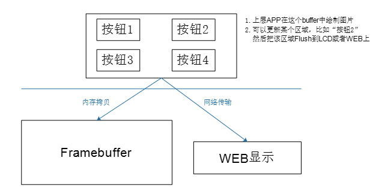
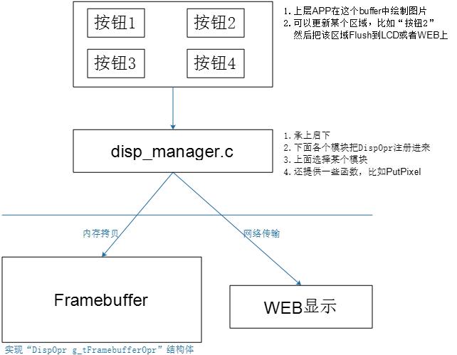

# 目錄

- [Note](#0)
- [01_顯示系統](#1)
  - [1-1_顯示系統_數據結構抽象](#1.1)
  - [1-2_顯示系統_Framebuffer編程](#1.2)


<h1 id="0">Note</h1>

以STM32MP157_Pro開發板作為教材

[[第6篇]項目實戰之七步從零編寫帶GUI的應用](https://www.bilibili.com/video/BV1it4y1Q75z/)

<h1 id="1">01_顯示系統</h1>

<h2 id="1.1">1-1_顯示系統_數據結構抽象</h2>

使用場景



顯示部分：數據結構抽象

```C
#ifndef _DISP_MANAGER_H
#define _DISP_MANAGER_H

typedef struct Region {
    int iLeftUpX;
    int iLeftUpY;
    int iWidth;
    int iHeigh;
}Region, *PRegion;

typedef struct DispOpr {
    char *name;
    char *GetBuffer(int *pXres, int *pYres, int *pBpp);
    int FlushRegion(PRegion ptRegion, char *buffer);
    struct DispOpr *ptNext;
};

#endif
```

<h2 id="1.2">1-2_顯示系統_Framebuffer編程</h2>

[disp_manager.h](./[第6篇]_項目實戰/source/02_framebuffer/disp_manager.h)

[framebuffer.c](./[第6篇]_項目實戰/source/02_framebuffer/framebuffer.c)

<h2 id="1.3">1-3_顯示系統_顯示管理</h2>

實現"顯示管理"



[disp_manager.h](./[第6篇]_項目實戰/source/03_disp_manager/disp_manager.h)

[disp_manager.C](./[第6篇]_項目實戰/source/03_disp_manager/disp_manager.c)

[framebuffer.c](./[第6篇]_項目實戰/source/03_disp_manager/framebuffer.c)
