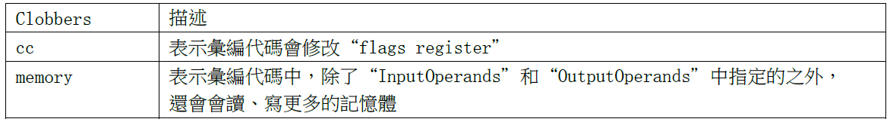

# 目錄

- [Note](#0)
- [01_同步與互斥](#1)
  - [1-1_內聯彙編](#1.1)
  - [1-2_同步與互斥的失敗例子](#1.2)
  - [1-3_原子操作的實現原理與使用](#1.3)
  - [1-4_Linux鎖的介紹與使用](#1.4)


<h1 id="0">Note</h1>

以STM32MP157_Pro開發板作為教材

韋東山老師資料

```git
git clone https://e.coding.net/weidongshan/linux/doc_and_source_for_drivers.git
```

<h1 id="1">01_同步與互斥</h1>

<h2 id="1.1">1-1_內聯彙編</h2>

[1-1_內聯彙編.pdf](./[第7篇]_驅動大全/doc/1-1_內聯彙編.pdf)

### 內聯彙編語法

在 ATPCS 規則之下編寫代碼，這樣 C 函數就可以直接調用彙編函數
但是，需要新建彙編檔，有點麻煩。
使用內聯彙編，可以在C 代碼中內嵌彙編代碼。


① asm

- 也可以寫作 `__asm__` ，表示這是一段內聯彙編。

② asm-qualifiers

- 有3個取值：volatile、inline、goto

- volatile的意思是易變的、不穩定的，用來告訴編譯器不要隨便優化這段代碼，否則可能出問題

③ AssemblerTemplate

- 彙編指令，用 **雙引號** 包含起來，每條指令用 `\n` 分開

    ```Assembly
    "mov  %0, %1\n"
    "add  %0, %1, %2\n"
    ```

④ OutputOperands

- 輸出操作數，內聯彙編執行時，輸出的結果保存在哪裡

- 格式如下，當有多個變數時，用逗號隔開：

    `[ [asmSymbolicName] ] constraint (cvariablename)`

  - asmSymbolicName是符號名，隨便取，也可以不寫

  - constraint表示約束，有如下常用取值：

    

  - cvariablename： C 語言的變數名

- 示例1如下： `[result] "=r" (sum)`

  - 它的意思是彙編代碼中會通過某個寄存器把結果寫入sum變數。在彙編代碼中可以使用 "%[result]" 來引用它。

- 示例2如下： `"=r" (sum)`

  - 在彙編代碼中可以使用 "%0"、"%1" 等來引用它，這些數值怎麼確定後面再說。

⑤ InputOperands

- 輸入運算元，內聯彙編執行前，輸入的資料保存在哪裡

- 格式如下，當有多個變數時，用逗號隔開：

    `[ [asmSymbolicName] ] constraint (cexpression)`

  - asmSymbolicName是符號名，隨便取，也可以不寫
  - constraint表示約束，參考上一小節，跟OutputOperands類似
  - cexpression：C語言的運算式

- 示例1如下： `[a_val]"r"(a), [b_val]"r"(b)`

  - 它的意思變數a、b的值會放入某些寄存器。在彙編代碼中可以使用 %[a_val]、%[b_val] 使用它們

- 示例2如下： `"r"(a), "r"(b)`

  - 它的意思變數a、b的值會放入某些寄存器。在彙編代碼中可以使用 %0、%1 等使用它們，這些數值後面再說。

⑥ Clobbers

- 在彙編代碼中，對於 "OutputOperands" 所涉及的寄存器、記憶體，肯定是做了修改。但是彙編代碼中，也許要修改的寄存器、記憶體會更多。比如在計算過程中可能要用到r3保存臨時結果，我們必須在 "Clobbers" 中聲明r3會被修改。

- 下面是一個例子：

    `: "r0", "r1", "r2", "r3", "r4", "r5", "memory"`

- 我們常用的是有 "cc"、"memory"，意義如下：

    

### 編寫內聯彙編實現加法

把第1、2 個運算元相加，存入第0 個運算元。也就是把a、b 相加，存入sum。


也可以用符號名來撰寫


### earlyclobber 的例子

OutputOperands 的約束中經常可以看到“=&r”，其中的“&”表示earlyclobber，它是最難理解的。
有一些輸出操作數在彙編代碼中早早就被寫入了新值A，在這之後，彙編代碼才去讀取某個輸入運算元，這個輸出操作數就被稱為earlyclobber(早早就被改了)。

這可能會有問題：假設早早寫入的新值A，寫到了r0 寄存器；後面讀輸入運算元時得到數值B，也可能寫入r0 寄存器，這新值A 就被破壞了。

如果彙編代碼中某個輸出操作數是earlyclobber 的，它的constraint 就要加上 `&`，這就是告訴編譯器：給我分配一個單獨的寄存器，別為了省事跟輸入運算元用同一個寄存器。


<h2 id="1.2">1-2_同步與互斥的失敗例子</h2>

一句話理解**同步與互斥**：我等你用完廁所，我再用廁所。

- 什麼叫同步？就是條件不允許，我要等等。
- 什麼是互斥？你我早起都要用廁所，誰先搶到誰先用，中途不被打擾。

同步與互斥經常放在一起講，是因為它們之的關係很大，"互斥" 操作可以使用 "同步" 來實現。我 "等" 你用完廁所，我再用廁所。這不就是用 "同步" 來實現 "互斥" 嗎？

```C
void  搶廁所(void)
{
    if (有人在用) 
        我眯一會;
    用廁所;
    喂，醒醒，有人要用廁所嗎;
}
```

在這個過程中，A、B是互斥地訪問 "廁所"，"廁所" 被稱之為臨界資源。我們使用了 "休眠-喚醒" 的同步機制實現了 "臨界資源" 的 "互斥訪問"。

### 失敗例子1

驅動程式

```C
01 static int valid = 1;
02
03 static ssize_t gpio_key_drv_open (struct inode *node, struct file *file)
04 {
05      if (!valid)
06      {
07              return -EBUSY;
08      }
09      else
10      {
11              valid = 0;
12      }
13
14      return 0; //成功
15 }
16
17 static int gpio_key_drv_close (struct inode *node, struct file *file)
18 {
19      valid = 1;
20      return 0;
21 }
```

程式A在調用驅動程式的中途被程式B搶佔了CPU資源

- 程式A執行到第11行之前，被程式B搶佔了，這時valid尚未被改成0；
- 程式B調用gpio_key_drv_open時，發現valid等於1，所以成功返回0；
- 當程式A繼續從第11行執行時，它最終也成功返回0；
- 這樣程式A、B都成功打開了驅動程式。

在內核態，程式A不是主動去休眠、主動放棄CPU資源；而是被優先順序更高的程式B搶佔了，這種行為被稱為 **"preempt"(搶佔)**。

### 失敗例子2

驅動程式

```C
01 static int valid = 1;
02
03 static ssize_t gpio_key_drv_open (struct inode *node, struct file *file)
04 {
05      if (--valid)
06      {
07              valid++;
08              return -EBUSY;
09      }
10      return 0;
11 }
12
13 static int gpio_key_drv_close (struct inode *node, struct file *file)
14 {
15      valid = 1;
16      return 0;
17 }
```

第5行先減1再判斷，這樣可以更大概率地避免問題，但是還是不能確保萬無一失。對資料的修改分為3步：讀出來、修改、寫進去。


- 進程A在讀出valid時發現它是1，減1後為0，這時if不成立；但是修改後的值尚未寫回記憶體；
- 假設這時被程式B搶佔，程式B讀出valid仍為1，減1後為0，這時if不成立，最後成功返回；
- 輪到A繼續執行，它把0值寫到valid變數，最後也成功返回。
- 這樣程式A、B都成功打開了驅動程式。

### 失敗例子3

驅動程式

```C
01 static int valid = 1;
02
03 static ssize_t gpio_key_drv_open (struct inode *node, struct file *file)
04 {
05       unsigned long flags;
06       raw_local_irq_save(flags); // 關中斷
07      if (--valid)
08      {
09              valid++;
10              raw_local_irq_restore(flags);  // 恢復之前的狀態
11              return -EBUSY;
12      }
13       raw_local_irq_restore(flags);          // 恢復之前的狀態
14      return 0;
15 }
16
17 static int gpio_key_drv_close (struct inode *node, struct file *file)
18 {
19      valid = 1;
20      return 0;
21 }

```

第06行直接關中斷，這樣別的執行緒、中斷都不能來打擾本執行緒了，在它讀取、修改valid變數的過程中無人打擾。

對於單CPU核的系統上述代碼是沒問題的；但是對於SMP系統，你只能關閉當前CPU核的中斷，別的CPU核還可以運行程式，它們也可以來執行這個函數，同樣導致問題

SMP就是Symmetric Multi-Processors，對稱多處理器
UP即Uni-Processor，系統只有一個單核CPU

<h2 id="1.3">1-3_原子操作的實現原理與使用</h2>

[1-3_原子操作的實現原理與使用.pdf](./[第7篇]_驅動大全/doc/1-3_原子操作的實現原理與使用.pdf)

### 原子變數的內核操作函數

可以使用原子操作來避免valid變數的修改被打斷，所謂 "原子操作" 就是這個操作不會被打斷。

Linux有2種原子操作：**原子變數**、**原子位元**。

原子變數類型如下，實際上就是一個結構體(內核檔`include/linux/types.h`)：

```C
typedef struct{
    int counter;
} atomic_t
```

原子變數的操作函數在Linux內核檔`arch\arm\include\asm\atomic.h`中


### 原子位介紹

原子位元的操作函數在Linux 內核檔 `arch\arm\include\asm\bitops.h` 中，下表中 p 是一個 unsigned long 指標


<h2 id="1.4">1-4_Linux鎖的介紹與使用</h2>

[1-4_Linux鎖的介紹與使用.pdf](./[第7篇]_驅動大全/doc/1-4_Linux鎖的介紹與使用.pdf)

參考資訊

- https://www.kernel.org/doc/html/latest/locking/index.html
- https://mirrors.edge.kernel.org/pub/linux/kernel/people/rusty/kernel-locking/

### 鎖的類型

① 自旋鎖(spinning lock)

簡單地說就是無法獲得鎖時，不會休眠，會一直迴圈等待


② 睡眠鎖(sleeping lock)

簡單地說就是無法獲得鎖時，當前執行緒就會休眠


### 鎖的內核函數

自旋鎖spinlock

- `include\linux\spinlock.h`

    

信號量semaphore

- `include\linux\semaphore.h`

    

互斥量mutex

- `include\linux\mutex.h`

    

semaphore 和 mutex 的區別

- semaphore 中可以指定 count 為任意值，比如有 10 個廁所，所以 10 個人都可以使用廁所
- mutex 的值只能設置為 1 或 0，只有一個廁所

- mutex 中有一項成員 "struct task_struct *owner"，指向某個進程。一個mutex只能在進程上下文中使用：誰給mutex加鎖，就只能由誰來解鎖

- semaphore並沒有這些限制，它可以用來解決 "讀者-寫者" 問題：程式A在等待資料──想獲得鎖，程式B產生資料後釋放鎖，這會喚醒A來讀取資料。semaphore的鎖定與釋放，並不限定為同一個進程

    

### 何時用何種鎖

本節參考：https://wenku.baidu.com/view/26adb3f5f61fb7360b4c656e.html
英文原文：https://mirrors.edge.kernel.org/pub/linux/kernel/people/rusty/kernel-locking/


### 內核搶佔(preempt)等額外的概念

早期的的 Linux 內核是 "不可搶佔" 的，假設有 A、B 兩個程式在運行，當前是程式A 在運行，什麼時候輪到程式B 運行呢？

① 程式A 主動放棄CPU
② 程式A 調用系統函數進入內核態，從內核態返回用戶態的前夕
③ 程式A 正在使用者態運行，發生了中斷

對於 "不可搶佔" 的內核，當程式A 運行內核態代碼時進程是無法切換的

① 優先順序反轉，更高優先順序的程式也無法運行
② 在內核態發生的中斷不會導致進程切換

為了讓系統的即時性更佳，Linux 內核引入了 "搶佔"(preempt)的功能：進程運行于內核態時，進程調度也是可以發生的。

對於可搶佔的內核，在驅動程式中要考慮對臨界資源加鎖

### 使用場景

**1. 只在用戶上下文加鎖**

假設只有程式A、程式B 會搶佔資源，這 2 個程式都是可以休眠的，所以可以使用信號量

```C
static DEFINE_SPINLOCK(clock_lock); // 或 struct semaphore sem; sema_init(&sem, 1);

if (down_interruptible(&sem)) // if (down_trylock(&sem))
{
/* 獲得了信號量 */
}

/* 釋放信號量 */
up(&sem);
```

對於 down_interruptible 函數，如果信號量暫時無法獲得，此函數會令程式進入休眠；別的程式調用 up()函數釋放信號量時會喚醒它。另一個函數down，在它休眠過程中會忽略任何信號

也可以使用mutex

```C
static DEFINE_MUTEX(mutex); //或 static struct mutex mutex; mutex_init(&mutex);

mutex_lock(&mutex);
/* 臨界區 */
mutex_unlock(&mutex);
```

一般來說在同一個函數裡調用 mutex_lock 或 mutex_unlock，不會長期持有它

如果你使用mutex 來實現驅動程式只能由一個進程打開，在 drv_open 中調用 mutex_lock，在 drv_close 中調用 mutex_unlock，這也完全沒問題。

**2. 在 用戶上下文 與 Softirqs 之間加鎖**

程式A 運行到內核態時，正在訪問一個臨界資源；這時發生了某個硬體中斷，在硬體中斷處理完後會處理Softirq，而某個Softirq 也會訪問這個臨界資源

可以使用spin_lock_bh 函數，它會先禁止本地CPU 的中斷下半部即Softirq，這樣本地Softirq 就不會跟它競爭了；假設別的CPU 也想獲得這個資源，它也會調用spin_lock_bh 禁止它自己的Softirq。這2個CPU 都禁止自己的Softirq，然後競爭spinlock，誰搶到誰就先執行。

釋放鎖的函數是spin_unlock_bh

"_bh"，表示 "Bottom Halves"，中斷下半部，這是軟體插斷的老名字。
spin_lock_bh 會禁止Softirq，而不僅僅是禁止 "中斷下半部"(timer、tasklet 裡等都是Softirq，中斷下半部只是Softirq 的一種)。

```C
static DEFINE_SPINLOCK(lock); // static spinlock_t lock; spin_lock_init(&lock);

spin_lock_bh(&lock);
/* 臨界區 */
spin_unlock_bh(&lock);
```

**3. 在用戶上下文與 Tasklet 之間加鎖**

Tasklet 也是 Softirq 的一種，所以跟前面是 "在用戶上下文與Softirqs之間加鎖" 完全一樣

**4. 在用戶上下文與 Timer 之間加鎖**

Timer 也是 Softirq 的一種，所以跟前面是 "在用戶上下文與Softirqs之間加鎖" 完全一樣

**5. 在 Tasklet 與 Timer 之間加鎖**

假設在Tasklet中訪問臨界資源，另一個CPU會不會同時運行這個Tasklet？不會的，所以如果只是在某個Tasklet中訪問臨界資源，無需上鎖。

假設在Timer中訪問臨界資源，另一個CPU會不會同時運行這個timer？不會的，所以如果只是在某個Timer中訪問臨界資源，無需上鎖。

如果在有2個不同的Tasklet或Timer都會用到一個臨界資源，那麼可以使用spin_lock()、spin_unlock()來保護臨界資源。不需要用spin_lock_bh()，因為一旦當前CPU已經處於Tasklet或Timer中，同一個CPU不會同時再執行其他Tasklet或Timer。

**6. 在 Softirq 之間加鎖**

這裡講的softirq不含tasklet、timer

同一個Softirq是有可能在不同CPU上同時運行的，所以可以使用spin_lock()、spin_unlock()來訪問臨界區

總結起來，在Softirq之間(含timer、tasklet、相同的Softirq、不同的Softirq)，都可以使用spin_lock()、spin_unlock()來訪問臨界區。

```C
static DEFINE_SPINLOCK(lock); // static spinlock_t lock; spin_lock_init(&lock);

spin_lock(&lock);
/* 臨界區 */
spin_unlock(&lock);
```

**7. 硬中斷上下文**

假設一個硬體插斷服務常式與一個Softirq共用資料，需要考慮2點：

① Softirq執行的過程中，可能會被硬體中斷打斷；
② 臨界區可能會被另一個CPU上的硬體中斷進入。

因此在 Softirq 獲得鎖之前，禁止當前CPU的中斷。

在硬體插斷服務常式中不需要使用spin_lock_irq()，因為當它在執行的時間Softirq是不可能執行的；它可以使用spin_lock()用來防止別的CPU搶佔。

如果硬體中斷A、硬體中斷B都要訪問臨界資源，怎麼辦？

- 使用spin_lock()就足夠了。因為Linux不支持中斷嵌套，即當前CPU正在處理中斷A時，中斷B不可能在當前CPU上被處理，不需要再次去禁止中斷；當前CPU正在處理中斷A時，假如有另一個CPU正在處理中斷B，它們使用spin_lock()實現互斥訪問臨界資源就可以了。

spin_lock_irq()/spin_unlock_irq()會禁止/使能中斷

```C
static DEFINE_SPINLOCK(lock); // static spinlock_t lock; spin_lock_init(&lock);

spin_lock_irq(&lock);
/* 臨界區 */
spin_unlock_irq(&lock);
```

spin_lock_irqsave()/spin_unlock_irqrestore()，spin_lock_irqsave()會先保存當前中斷狀態(使能還是禁止)，再禁止中斷；spin_unlock_irqrestore()會恢復之前的中斷狀態(不一定是使能中斷，而是恢復成之前的狀態)。

```C
unsigned long flags;
static DEFINE_SPINLOCK(lock); // static spinlock_t lock; spin_lock_init(&lock);

spin_lock_irqsave(&lock, flags);
/* 臨界區 */
spin_unlock_irqrestore(&lock, flags);
```

