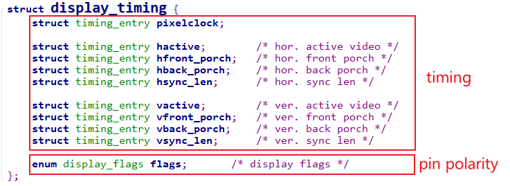

# 目錄

- [Note](#0)
- [01_同步與互斥](#1)
  - [1-1_內聯彙編](#1.1)
  - [1-2_同步與互斥的失敗例子](#1.2)
  - [1-3_原子操作的實現原理與使用](#1.3)
  - [1-4_Linux鎖的介紹與使用](#1.4)
  - [1-5_自旋鎖spinlock的實現](#1.5)
  - [1-6_信號量semaphore的實現](#1.6)
  - [1-7_互斥量mutex的實現](#1.7)
- [02_LCD](#2)
  - [2-1_LCD 驅動的簡單框架](#2.1)
  - [2-2_APP範例](#2.2)
  - [2-3_使用設備樹編寫LCD驅動程序框架](#2.3)
  - [2-4_引脚配置](#2.4)
  - [2-5_配置LCD控制器之獲得LCD參數](#2.5)
  - [2-6_使用參數配置LCD控制器](#2.6)
  - [2-7_單Buffer的缺點與改進方法](#2.7)
- [03_I2C](#3)
  - [3-1_I2C介紹](#3.1)
  - [3-2_I2C協議](#3.2)
  - [3-3_SMBus協議](#3.3)
  - [3-4_I2C系統的重要結構體](#3.4)
  - [3-5_無需編寫驅動直接訪問設備_I2C-Tools介紹](#3.5)
  - [3-6_編寫APP直接訪問EEPROM](#3.6)
  - [3-7_通用驅動i2c-dev分析](#3.7)
  - [3-8_I2C系統驅動程序模型](#3.8)
  - [3-9_編寫設備驅動之i2c_driver](#3.9)
  - [3-10_編寫設備驅動之i2c_client](#3.10)
  - [3-11_I2C_Adapter驅動框架講解與編寫](#3.11)
  - [3-12_完善虛擬的I2C_Adapter驅動並模擬EEPROM](#3.12)
  - [3-13_使用GPIO模擬I2C的驅動程序分析](#3.13)
  - [3-14_使用GPIO操作I2C设备_基于STM32MP157](#3.14)
  - [3-15_具體芯片的I2C_Adapter驅動分析_基于STM32MP157](#3.15)
- [04_Input](#4)
  - [4-1_DRV_01_Input子系統框架詳解](#4.1)
  - [4-2_DRV_02_編寫input_dev驅動框架](#4.2)


<h1 id="0">Note</h1>

以STM32MP157_Pro開發板作為教材

韋東山老師資料

```git
git clone https://e.coding.net/weidongshan/linux/doc_and_source_for_drivers.git
```

<h1 id="1">01_同步與互斥</h1>

<h2 id="1.1">1-1_內聯彙編</h2>

[1-1_內聯彙編.pdf](./[第7篇]_驅動大全/doc/1-1_內聯彙編.pdf)

### 內聯彙編語法

在 ATPCS 規則之下編寫代碼，這樣 C 函數就可以直接調用彙編函數
但是，需要新建彙編檔，有點麻煩。
使用內聯彙編，可以在C 代碼中內嵌彙編代碼。


① asm

- 也可以寫作 `__asm__` ，表示這是一段內聯彙編。

② asm-qualifiers

- 有3個取值：volatile、inline、goto

- volatile的意思是易變的、不穩定的，用來告訴編譯器不要隨便優化這段代碼，否則可能出問題

③ AssemblerTemplate

- 彙編指令，用 **雙引號** 包含起來，每條指令用 `\n` 分開

    ```Assembly
    "mov  %0, %1\n"
    "add  %0, %1, %2\n"
    ```

④ OutputOperands

- 輸出操作數，內聯彙編執行時，輸出的結果保存在哪裡

- 格式如下，當有多個變數時，用逗號隔開：

    `[ [asmSymbolicName] ] constraint (cvariablename)`

  - asmSymbolicName是符號名，隨便取，也可以不寫

  - constraint表示約束，有如下常用取值：

    

  - cvariablename： C 語言的變數名

- 示例1如下： `[result] "=r" (sum)`

  - 它的意思是彙編代碼中會通過某個寄存器把結果寫入sum變數。在彙編代碼中可以使用 "%[result]" 來引用它。

- 示例2如下： `"=r" (sum)`

  - 在彙編代碼中可以使用 "%0"、"%1" 等來引用它，這些數值怎麼確定後面再說。

⑤ InputOperands

- 輸入運算元，內聯彙編執行前，輸入的資料保存在哪裡

- 格式如下，當有多個變數時，用逗號隔開：

    `[ [asmSymbolicName] ] constraint (cexpression)`

  - asmSymbolicName是符號名，隨便取，也可以不寫
  - constraint表示約束，參考上一小節，跟OutputOperands類似
  - cexpression：C語言的運算式

- 示例1如下： `[a_val]"r"(a), [b_val]"r"(b)`

  - 它的意思變數a、b的值會放入某些寄存器。在彙編代碼中可以使用 %[a_val]、%[b_val] 使用它們

- 示例2如下： `"r"(a), "r"(b)`

  - 它的意思變數a、b的值會放入某些寄存器。在彙編代碼中可以使用 %0、%1 等使用它們，這些數值後面再說。

⑥ Clobbers

- 在彙編代碼中，對於 "OutputOperands" 所涉及的寄存器、記憶體，肯定是做了修改。但是彙編代碼中，也許要修改的寄存器、記憶體會更多。比如在計算過程中可能要用到r3保存臨時結果，我們必須在 "Clobbers" 中聲明r3會被修改。

- 下面是一個例子：

    `: "r0", "r1", "r2", "r3", "r4", "r5", "memory"`

- 我們常用的是有 "cc"、"memory"，意義如下：

    

### 編寫內聯彙編實現加法

把第1、2 個運算元相加，存入第0 個運算元。也就是把a、b 相加，存入sum。


也可以用符號名來撰寫


### earlyclobber 的例子

OutputOperands 的約束中經常可以看到“=&r”，其中的“&”表示earlyclobber，它是最難理解的。
有一些輸出操作數在彙編代碼中早早就被寫入了新值A，在這之後，彙編代碼才去讀取某個輸入運算元，這個輸出操作數就被稱為earlyclobber(早早就被改了)。

這可能會有問題：假設早早寫入的新值A，寫到了r0 寄存器；後面讀輸入運算元時得到數值B，也可能寫入r0 寄存器，這新值A 就被破壞了。

如果彙編代碼中某個輸出操作數是earlyclobber 的，它的constraint 就要加上 `&`，這就是告訴編譯器：給我分配一個單獨的寄存器，別為了省事跟輸入運算元用同一個寄存器。


<h2 id="1.2">1-2_同步與互斥的失敗例子</h2>

一句話理解**同步與互斥**：我等你用完廁所，我再用廁所。

- 什麼叫同步？就是條件不允許，我要等等。
- 什麼是互斥？你我早起都要用廁所，誰先搶到誰先用，中途不被打擾。

同步與互斥經常放在一起講，是因為它們之的關係很大，"互斥" 操作可以使用 "同步" 來實現。我 "等" 你用完廁所，我再用廁所。這不就是用 "同步" 來實現 "互斥" 嗎？

```C
void  搶廁所(void)
{
    if (有人在用) 
        我眯一會;
    用廁所;
    喂，醒醒，有人要用廁所嗎;
}
```

在這個過程中，A、B是互斥地訪問 "廁所"，"廁所" 被稱之為臨界資源。我們使用了 "休眠-喚醒" 的同步機制實現了 "臨界資源" 的 "互斥訪問"。

### 失敗例子1

驅動程式

```C
01 static int valid = 1;
02
03 static ssize_t gpio_key_drv_open (struct inode *node, struct file *file)
04 {
05      if (!valid)
06      {
07              return -EBUSY;
08      }
09      else
10      {
11              valid = 0;
12      }
13
14      return 0; //成功
15 }
16
17 static int gpio_key_drv_close (struct inode *node, struct file *file)
18 {
19      valid = 1;
20      return 0;
21 }
```

程式A在調用驅動程式的中途被程式B搶佔了CPU資源

- 程式A執行到第11行之前，被程式B搶佔了，這時valid尚未被改成0；
- 程式B調用gpio_key_drv_open時，發現valid等於1，所以成功返回0；
- 當程式A繼續從第11行執行時，它最終也成功返回0；
- 這樣程式A、B都成功打開了驅動程式。

在內核態，程式A不是主動去休眠、主動放棄CPU資源；而是被優先順序更高的程式B搶佔了，這種行為被稱為 **"preempt"(搶佔)**。

### 失敗例子2

驅動程式

```C
01 static int valid = 1;
02
03 static ssize_t gpio_key_drv_open (struct inode *node, struct file *file)
04 {
05      if (--valid)
06      {
07              valid++;
08              return -EBUSY;
09      }
10      return 0;
11 }
12
13 static int gpio_key_drv_close (struct inode *node, struct file *file)
14 {
15      valid = 1;
16      return 0;
17 }
```

第5行先減1再判斷，這樣可以更大概率地避免問題，但是還是不能確保萬無一失。對資料的修改分為3步：讀出來、修改、寫進去。


- 進程A在讀出valid時發現它是1，減1後為0，這時if不成立；但是修改後的值尚未寫回記憶體；
- 假設這時被程式B搶佔，程式B讀出valid仍為1，減1後為0，這時if不成立，最後成功返回；
- 輪到A繼續執行，它把0值寫到valid變數，最後也成功返回。
- 這樣程式A、B都成功打開了驅動程式。

### 失敗例子3

驅動程式

```C
01 static int valid = 1;
02
03 static ssize_t gpio_key_drv_open (struct inode *node, struct file *file)
04 {
05       unsigned long flags;
06       raw_local_irq_save(flags); // 關中斷
07      if (--valid)
08      {
09              valid++;
10              raw_local_irq_restore(flags);  // 恢復之前的狀態
11              return -EBUSY;
12      }
13       raw_local_irq_restore(flags);          // 恢復之前的狀態
14      return 0;
15 }
16
17 static int gpio_key_drv_close (struct inode *node, struct file *file)
18 {
19      valid = 1;
20      return 0;
21 }

```

第06行直接關中斷，這樣別的執行緒、中斷都不能來打擾本執行緒了，在它讀取、修改valid變數的過程中無人打擾。

對於單CPU核的系統上述代碼是沒問題的；但是對於SMP系統，你只能關閉當前CPU核的中斷，別的CPU核還可以運行程式，它們也可以來執行這個函數，同樣導致問題

SMP就是Symmetric Multi-Processors，對稱多處理器
UP即Uni-Processor，系統只有一個單核CPU

<h2 id="1.3">1-3_原子操作的實現原理與使用</h2>

[1-3_原子操作的實現原理與使用.pdf](./[第7篇]_驅動大全/doc/1-3_原子操作的實現原理與使用.pdf)

### 原子變數的內核操作函數

可以使用原子操作來避免valid變數的修改被打斷，所謂 "原子操作" 就是這個操作不會被打斷。

Linux有2種原子操作：**原子變數**、**原子位元**。

原子變數類型如下，實際上就是一個結構體(內核檔`include/linux/types.h`)：

```C
typedef struct{
    int counter;
} atomic_t
```

原子變數的操作函數在Linux內核檔`arch\arm\include\asm\atomic.h`中


### 原子位介紹

原子位元的操作函數在Linux 內核檔 `arch\arm\include\asm\bitops.h` 中，下表中 p 是一個 unsigned long 指標


<h2 id="1.4">1-4_Linux鎖的介紹與使用</h2>

[1-4_Linux鎖的介紹與使用.pdf](./[第7篇]_驅動大全/doc/1-4_Linux鎖的介紹與使用.pdf)

參考資訊

- https://www.kernel.org/doc/html/latest/locking/index.html
- https://mirrors.edge.kernel.org/pub/linux/kernel/people/rusty/kernel-locking/

### 鎖的類型

① 自旋鎖(spinning lock)

簡單地說就是無法獲得鎖時，不會休眠，會一直迴圈等待


② 睡眠鎖(sleeping lock)

簡單地說就是無法獲得鎖時，當前執行緒就會休眠


### 鎖的內核函數

自旋鎖spinlock

- `include\linux\spinlock.h`

    

信號量semaphore

- `include\linux\semaphore.h`

    

互斥量mutex

- `include\linux\mutex.h`

    

semaphore 和 mutex 的區別

- semaphore 中可以指定 count 為任意值，比如有 10 個廁所，所以 10 個人都可以使用廁所
- mutex 的值只能設置為 1 或 0，只有一個廁所

- mutex 中有一項成員 "struct task_struct *owner"，指向某個進程。一個mutex只能在進程上下文中使用：誰給mutex加鎖，就只能由誰來解鎖

- semaphore並沒有這些限制，它可以用來解決 "讀者-寫者" 問題：程式A在等待資料──想獲得鎖，程式B產生資料後釋放鎖，這會喚醒A來讀取資料。semaphore的鎖定與釋放，並不限定為同一個進程

    

### 何時用何種鎖

本節參考：https://wenku.baidu.com/view/26adb3f5f61fb7360b4c656e.html
英文原文：https://mirrors.edge.kernel.org/pub/linux/kernel/people/rusty/kernel-locking/


### 內核搶佔(preempt)等額外的概念

早期的的 Linux 內核是 "不可搶佔" 的，假設有 A、B 兩個程式在運行，當前是程式A 在運行，什麼時候輪到程式B 運行呢？

① 程式A 主動放棄CPU
② 程式A 調用系統函數進入內核態，從內核態返回用戶態的前夕
③ 程式A 正在使用者態運行，發生了中斷

對於 "不可搶佔" 的內核，當程式A 運行內核態代碼時進程是無法切換的

① 優先順序反轉，更高優先順序的程式也無法運行
② 在內核態發生的中斷不會導致進程切換

為了讓系統的即時性更佳，Linux 內核引入了 "搶佔"(preempt)的功能：進程運行于內核態時，進程調度也是可以發生的。

對於可搶佔的內核，在驅動程式中要考慮對臨界資源加鎖

### 使用場景

**1. 只在用戶上下文加鎖**

假設只有程式A、程式B 會搶佔資源，這 2 個程式都是可以休眠的，所以可以使用信號量

```C
static DEFINE_SPINLOCK(clock_lock); // 或 struct semaphore sem; sema_init(&sem, 1);

if (down_interruptible(&sem)) // if (down_trylock(&sem))
{
/* 獲得了信號量 */
}

/* 釋放信號量 */
up(&sem);
```

對於 down_interruptible 函數，如果信號量暫時無法獲得，此函數會令程式進入休眠；別的程式調用 up()函數釋放信號量時會喚醒它。另一個函數down，在它休眠過程中會忽略任何信號

也可以使用mutex

```C
static DEFINE_MUTEX(mutex); //或 static struct mutex mutex; mutex_init(&mutex);

mutex_lock(&mutex);
/* 臨界區 */
mutex_unlock(&mutex);
```

一般來說在同一個函數裡調用 mutex_lock 或 mutex_unlock，不會長期持有它

如果你使用mutex 來實現驅動程式只能由一個進程打開，在 drv_open 中調用 mutex_lock，在 drv_close 中調用 mutex_unlock，這也完全沒問題。

**2. 在 用戶上下文 與 Softirqs 之間加鎖**

程式A 運行到內核態時，正在訪問一個臨界資源；這時發生了某個硬體中斷，在硬體中斷處理完後會處理Softirq，而某個Softirq 也會訪問這個臨界資源

可以使用spin_lock_bh 函數，它會先禁止本地CPU 的中斷下半部即Softirq，這樣本地Softirq 就不會跟它競爭了；假設別的CPU 也想獲得這個資源，它也會調用spin_lock_bh 禁止它自己的Softirq。這2個CPU 都禁止自己的Softirq，然後競爭spinlock，誰搶到誰就先執行。

釋放鎖的函數是spin_unlock_bh

"_bh"，表示 "Bottom Halves"，中斷下半部，這是軟體插斷的老名字。
spin_lock_bh 會禁止Softirq，而不僅僅是禁止 "中斷下半部"(timer、tasklet 裡等都是Softirq，中斷下半部只是Softirq 的一種)。

```C
static DEFINE_SPINLOCK(lock); // static spinlock_t lock; spin_lock_init(&lock);

spin_lock_bh(&lock);
/* 臨界區 */
spin_unlock_bh(&lock);
```

**3. 在用戶上下文與 Tasklet 之間加鎖**

Tasklet 也是 Softirq 的一種，所以跟前面是 "在用戶上下文與Softirqs之間加鎖" 完全一樣

**4. 在用戶上下文與 Timer 之間加鎖**

Timer 也是 Softirq 的一種，所以跟前面是 "在用戶上下文與Softirqs之間加鎖" 完全一樣

**5. 在 Tasklet 與 Timer 之間加鎖**

假設在Tasklet中訪問臨界資源，另一個CPU會不會同時運行這個Tasklet？不會的，所以如果只是在某個Tasklet中訪問臨界資源，無需上鎖。

假設在Timer中訪問臨界資源，另一個CPU會不會同時運行這個timer？不會的，所以如果只是在某個Timer中訪問臨界資源，無需上鎖。

如果在有2個不同的Tasklet或Timer都會用到一個臨界資源，那麼可以使用spin_lock()、spin_unlock()來保護臨界資源。不需要用spin_lock_bh()，因為一旦當前CPU已經處於Tasklet或Timer中，同一個CPU不會同時再執行其他Tasklet或Timer。

**6. 在 Softirq 之間加鎖**

這裡講的softirq不含tasklet、timer

同一個Softirq是有可能在不同CPU上同時運行的，所以可以使用spin_lock()、spin_unlock()來訪問臨界區

總結起來，在Softirq之間(含timer、tasklet、相同的Softirq、不同的Softirq)，都可以使用spin_lock()、spin_unlock()來訪問臨界區。

```C
static DEFINE_SPINLOCK(lock); // static spinlock_t lock; spin_lock_init(&lock);

spin_lock(&lock);
/* 臨界區 */
spin_unlock(&lock);
```

**7. 硬中斷上下文**

假設一個硬體插斷服務常式與一個Softirq共用資料，需要考慮2點：

① Softirq執行的過程中，可能會被硬體中斷打斷；
② 臨界區可能會被另一個CPU上的硬體中斷進入。

因此在 Softirq 獲得鎖之前，禁止當前CPU的中斷。

在硬體插斷服務常式中不需要使用spin_lock_irq()，因為當它在執行的時間Softirq是不可能執行的；它可以使用spin_lock()用來防止別的CPU搶佔。

如果硬體中斷A、硬體中斷B都要訪問臨界資源，怎麼辦？

- 使用spin_lock()就足夠了。因為Linux不支持中斷嵌套，即當前CPU正在處理中斷A時，中斷B不可能在當前CPU上被處理，不需要再次去禁止中斷；當前CPU正在處理中斷A時，假如有另一個CPU正在處理中斷B，它們使用spin_lock()實現互斥訪問臨界資源就可以了。

spin_lock_irq()/spin_unlock_irq()會禁止/使能中斷

```C
static DEFINE_SPINLOCK(lock); // static spinlock_t lock; spin_lock_init(&lock);

spin_lock_irq(&lock);
/* 臨界區 */
spin_unlock_irq(&lock);
```

spin_lock_irqsave()/spin_unlock_irqrestore()，spin_lock_irqsave()會先保存當前中斷狀態(使能還是禁止)，再禁止中斷；spin_unlock_irqrestore()會恢復之前的中斷狀態(不一定是使能中斷，而是恢復成之前的狀態)。

```C
unsigned long flags;
static DEFINE_SPINLOCK(lock); // static spinlock_t lock; spin_lock_init(&lock);

spin_lock_irqsave(&lock, flags);
/* 臨界區 */
spin_unlock_irqrestore(&lock, flags);
```

<h2 id="1.5">1-5_自旋鎖spinlock的實現</h2>

[1-5_自旋鎖spinlock的實現.pdf](./[第7篇]_驅動大全/doc/1-5_自旋鎖spinlock的實現.pdf)

自旋鎖，顧名思義：自己在原地打轉，等待資源可用，一旦可用就上鎖霸佔它。

① 原地打轉的是CPU x，以後CPU y會解鎖：這涉及多個CPU，適用於SMP系統；
② 對於單CPU系統，自旋鎖的“自旋”功能就去掉了：只剩下禁止搶佔、禁止中斷

要理解spinlock，要通過2個情景來分析：

① 一開始，怎麼爭搶資源？不能2個程式都搶到。

- 這挺好解決，使用原子變數就可以實現。

② 某個程式已經獲得資源，怎麼防止別人來同時使用這個資源。

- 這是使用spinlock時要注意的地方，對應會有不同的衍生函數(_bh/_irq/_irqsave/_restore)。

### spinlock在SMP系統中的實現

Linux內核同步機制之（四）：spin lock
http://www.wowotech.net/kernel_synchronization/spinlock.html

我借用這篇文章的例子講解，餐廳裡只有一個座位，去吃飯的人都得先取號、等叫號。注意，有2個動作：顧客從取號機取號，電子叫號牌叫號。

```
① 一開始取號機待取號碼為0
② 顧客A從取號機得到號碼0，電子叫號牌顯示0，顧客A上座；
  取號機顯示下一個待取號碼為1。
③ 顧客B從取號機得到號碼1，電子叫號牌還顯示為0，顧客B等待；
  取號機顯示下一個待取號碼為2。
④ 顧客C從取號機得到號碼2，電子叫號牌還顯示為0，顧客C等待；
  取號機顯示下一個待取號碼為3。
⑤ 顧客A吃完離座，電子叫號牌顯示為1，顧客B的號碼等於1，他上座；
⑥ 顧客B吃完離座，電子叫號牌顯示為2，顧客C的號碼等於2，他上座；
```

- 取號機顯示的“下一個號碼”，顧客取號後它會自動加1；
- 電子叫號牌顯示“當前號碼”，顧客離座後它會自動加1
- 某個客戶手上拿到的號碼等於電子叫號牌的號碼時，該客戶上座。
在這個過程中，即使顧客B、C同時到店，只要保證他們從取號機上得到的號碼不同，他們就不會打架。
- 關鍵點在於：取號機的號碼發放，必須互斥，保證客戶的號碼互不相同。而電子叫號牌上號碼的變動不需要保護，只有顧客離開後它才會變化，沒人爭搶它。


- owner 就相當於電子叫號牌，現在誰在吃飯。 next 就當于於取號機，下一個號碼是什麼。

每一個 CPU 從取號機上取到的號碼保存在 spin_lock 函數中的區域變數裡。


<h2 id="1.6">1-6_信號量semaphore的實現</h2>

### semaphore的內核結構體

這是信號量，不是信號。在前面學習非同步通知時，驅動程式給應用程式發信號。現在我們講的信號量是一種同步、互斥機制。

Linux內核檔 `include\linux\semaphore.h` 中定義


初始化semaphore之後，就可以使用down函數或其他衍生版本來獲取信號量，使用up函數釋放信號量

### down函數的實現

如果semaphore中的count大於0，那麼down函數就可以獲得信號量；否則就休眠。

在讀取、修改count時，要使用spinlock來實現互斥。

休眠時，要把當前進程放在semaphore的wait_list鏈表中，別的進程釋放信號量時去wait_list中把進程取出、喚醒。


### up函數的實現

如果有其他進程在等待信號量，則 count 值無需調整，直接取出第 1 個等待信號量的進程，把信號量給它，共把它喚醒

如果沒有其他進程在等待信號量，則調整count

整個過程需要使用spinlock來保護


<h2 id="1.7">1-7_互斥量mutex的實現</h2>

[1-7_互斥量mutex的實現.pdf](./[第7篇]_驅動大全/doc/1-7_互斥量mutex的實現.pdf)

Linux內核檔`include\linux\mutex.h`


- 初始化mutex之後，就可以使用mutex_lock函數或其他衍生版本來獲取信號量，使用mutex_unlock函數釋放信號量。

我們使用mutex的目的一般是用來保護一小段代碼，這段代碼運行的時間很快。這意味著一個獲得mutex的進程，可能很快就會釋放掉mutex

針對這點可以進行優化，特別是當前獲得mutex的進程是在別的CPU上運行、並且"我"是唯一等待這個mutex的進程。在這種情況下，那"我"就原地spin等待吧：懶得去休眠了，休眠又喚醒就太慢了。

所以，mutex是做了特殊的優化，比semaphore效率更高。但是在代碼上，並沒有要求"誰獲得mutex，就必須由誰釋放mutex"，只是在使用慣例上是"誰獲得mutex，就必須由誰釋放mutex"。

### mutex_lock函數的實現

首先要知道mutex的操作函數中有fastpath、slowpath兩條路徑(快速、慢速)：如果fastpath成功，就不必使用slowpath

mutex中的count值再擴展一下，之前說它只有1、0兩個取值，1表示unlocked，0表示locked，還有一類值"負數"表示"locked，並且可能有其他程式在等待"


`arch/arm/include/asm/mutex.h`

```C
#if __LINUX_ARM_ARCH__ < 6
#include <asm-generic/mutex-xchg.h>
#else
#include <asm-generic/mutex-dec.h>
#endif
```

大部分情況下，mutex當前值都是1，所以通過fastpath函數可以非常快速地獲得mutex


如果mutex當前值是0或負數，則需要調用__mutex_lock_slowpath慢慢處理：可能會休眠等待


### mutex_unlock函數的實現

mutex_unlock函數中也有fastpath、slowpath兩條路徑(快速、慢速)：如果fastpath成功，就不必使用slowpath


大部分情況下，加1後mutex的值都是1，表示無人等待mutex，所以通過fastpath函數直接增加mutex的count值為1就可以了

如果mutex的值加1後還是小於等於0，就表示有人在等待mutex，需要去wait_list把它取出喚醒，這需要用到slowpath的函數：__mutex_unlock_slowpath


如果mutex當前值是0或負數，則需要調用__mutex_unlock_slowpath慢慢處理：需要喚醒其他進程，主要工作就是從wait_list中取出並喚醒第1個進程


<h1 id="2">02_LCD</h1>

[可參考資料目錄](./[第7篇]_驅動大全/doc/02_LCD/)

<h2 id="2.1">2-1_LCD 驅動的簡單框架</h2>

1. 分配fb_info

2. 設置fb_info

   - 要設置哪些內容？根據APP的需求來。

3. 註冊fb_info

[lcd_drv.c](./[第7篇]_驅動大全/source/02_LCD/01_fb_info/lcd_drv.c)

<h2 id="2.2">2-2_APP範例</h2>

共用函數

- [common.h](./[第7篇]_驅動大全/source/02_LCD/04_fb_test/common.h)

- [common.c](./[第7篇]_驅動大全/source/02_LCD/04_fb_test/common.c)

8x8 font lib

- [font_8x8.c](./[第7篇]_驅動大全/source/02_LCD/04_fb_test/font_8x8.c)

範例

- [fb-test.c](./[第7篇]_驅動大全/source/02_LCD/04_fb_test/fb-test.c)

- [fb-string.c](./[第7篇]_驅動大全/source/02_LCD/04_fb_test/fb-string.c)

<h2 id="2.3">2-3_使用設備樹編寫LCD驅動程序框架</h2>

[lcd_drv.c](./[第7篇]_驅動大全/source/02_LCD/06_lcd_drv_framework_use_devicetree/lcd_drv.c)

### 1. 說明

Linux驅動程序 = 驅動程序框架 + 硬件編程。
在前面已經基於QEMU編寫了LCD驅動程序，對LCD驅動程序的框架已經分析清楚。
核心就是：

* 分配fb_info
* 設置fb_info
* 註冊fb_info
* 硬件相關的設置

本節課程我們基於設備樹來編寫驅動程序。

### 2. 入口函數註冊platform_driver

### 3. 設備樹有對應節點

```C
framebuffer-mylcd {
        compatible = "100ask,lcd_drv";
};
```

### 4. 編寫probe函數

* 分配fb_info
* 設置fb_info
* 註冊fb_info
* 硬件相關的設置
  * 引腳設置
  * 時鐘設置
  * LCD控制器設置

<h2 id="2.4">2-4_引脚配置</h2>

內核自帶的STM32MP157 LCD驅動程序
* 驅動源碼：
  * LCD相關：`Linux-5.4\drivers\gpu\drm\panel\panel-myir070tft.c`
  * LCD控制器相關：`Linux-5.4\drivers\gpu\drm\stm\ltdc.c`
  * GPU相關：`Linux-5.4\drivers\gpu\drm\stm\drv.c`

* 設備樹：
  * `Linux-5.4/arch/arm/boot/dts/stm32mp157c-100ask-512d-lcd-v1.dts`
  * `Linux-5.4/arch/arm/boot/dts/stm32mp151.dtsi`
  * `Linux-5.4/arch/arm/boot/dts/stm32mp15-pinctrl.dtsi`

[lcd_drv.c](./[第7篇]_驅動大全/source/02_LCD/07_lcd_drv_pin_config_use_devicetree/lcd_drv.c)

主要使用pinctrl子系統把引腳配置為LCD功能，對於背光引腳等使用GPIO子系統的函數控制它的輸出電平。

- 使用pinctrl配置LCD引腳

- 使用GPIO子系統控制背光

    ```C
    /* get gpio from device tree */
    bl_gpio = gpiod_get(&pdev->dev, "backlight", 0);

    /* config bl_gpio as output */
    gpiod_direction_output(bl_gpio, 1);

    /* set val: gpiod_set_value(bl_gpio, status); */
    /* enable backlight */
    gpiod_set_value(bl_gpio, 1);
    ```

    ```dts
    framebuffer-mylcd {
        compatible = "100ask,lcd_drv";
        pinctrl-names = "default";
        pinctrl-0 = <&ltdc_pins_a>;
        backlight-gpios = <&gpioe 11 GPIO_ACTIVE_HIGH>;
    };
    ```

    ```dtsi
    ltdc_pins_a: ltdc-a-0 {
        pins {
            pinmux = <STM32_PINMUX('G',  7, AF14)>, /* LCD_CLK */
                    <STM32_PINMUX('I', 10, AF14)>, /* LCD_HSYNC */
                    <STM32_PINMUX('I',  9, AF14)>, /* LCD_VSYNC */
                    <STM32_PINMUX('F', 10, AF14)>, /* LCD_DE */
                    <STM32_PINMUX('H',  2, AF14)>, /* LCD_R0 */
                    <STM32_PINMUX('H',  3, AF14)>, /* LCD_R1 */
                    <STM32_PINMUX('H',  8, AF14)>, /* LCD_R2 */
                    <STM32_PINMUX('H',  9, AF14)>, /* LCD_R3 */
                    <STM32_PINMUX('H', 10, AF14)>, /* LCD_R4 */
                    <STM32_PINMUX('C',  0, AF14)>, /* LCD_R5 */
                    <STM32_PINMUX('H', 12, AF14)>, /* LCD_R6 */
                    <STM32_PINMUX('E', 15, AF14)>, /* LCD_R7 */
                    <STM32_PINMUX('E',  5, AF14)>, /* LCD_G0 */
                    <STM32_PINMUX('E',  6, AF14)>, /* LCD_G1 */
                    <STM32_PINMUX('H', 13, AF14)>, /* LCD_G2 */
                    <STM32_PINMUX('H', 14, AF14)>, /* LCD_G3 */
                    <STM32_PINMUX('H', 15, AF14)>, /* LCD_G4 */
                    <STM32_PINMUX('I',  0, AF14)>, /* LCD_G5 */
                    <STM32_PINMUX('I',  1, AF14)>, /* LCD_G6 */
                    <STM32_PINMUX('I',  2, AF14)>, /* LCD_G7 */
                    <STM32_PINMUX('D',  9, AF14)>, /* LCD_B0 */
                    <STM32_PINMUX('G', 12, AF14)>, /* LCD_B1 */
                    <STM32_PINMUX('G', 10, AF14)>, /* LCD_B2 */
                    <STM32_PINMUX('D', 10, AF14)>, /* LCD_B3 */
                    <STM32_PINMUX('I',  4, AF14)>, /* LCD_B4 */
                    <STM32_PINMUX('A',  3, AF14)>, /* LCD_B5 */
                    <STM32_PINMUX('B',  8, AF14)>, /* LCD_B6 */
                    <STM32_PINMUX('D',  8, AF14)>; /* LCD_B7 */
            bias-disable;
            drive-push-pull;
            slew-rate = <1>;
        };
    };
    ```

<h2 id="2.4">2-4_配置時鐘</h2>

**芯片手冊**


**設備樹dtsi**

參考：`arch/arm/boot/dts/stm32mp151.dtsi`

```shell
ltdc: display-controller@5a001000 {
    compatible = "st,stm32-ltdc";
    reg = <0x5a001000 0x400>;
    interrupts = <GIC_SPI 88 IRQ_TYPE_LEVEL_HIGH>,
                 <GIC_SPI 89 IRQ_TYPE_LEVEL_HIGH>;
    clocks = <&rcc LTDC_PX>;
    clock-names = "lcd";
    resets = <&rcc LTDC_R>;
    status = "disabled";
};
```

裡面只定義了1個時鐘：

* LTDC_PX：Pixel clock，用於LCD接口，設置為LCD手冊上的參數
* axi：AXI clock，不用設置？
* apb：APB clock，不用設置？

**代碼**

內核代碼：`drivers/gpu/drm/stm/ltdc.c`

* 獲得時鐘

    ```c
    ldev->pixel_clk = devm_clk_get(dev, "lcd");
    if (IS_ERR(ldev->pixel_clk)) {
        if (PTR_ERR(ldev->pixel_clk) != -EPROBE_DEFER)
            DRM_ERROR("Unable to get lcd clock\n");
        return PTR_ERR(ldev->pixel_clk);
    }
    ```
  
* 設置頻率

    ```c
    if (clk_set_rate(ldev->pixel_clk, rate) < 0) {
        DRM_ERROR("Cannot set rate (%dHz) for pixel clk\n", rate);
        return false;
    }
    ```

* 使能時鐘

    ```c
    if (clk_prepare_enable(ldev->pixel_clk)) {
        DRM_ERROR("Unable to prepare pixel clock\n");
        return -ENODEV;
    }
    ```
  
**自己寫代碼**

設備樹dts

```shell
framebuffer-mylcd {
    compatible = "100ask,lcd_drv";
    pinctrl-names = "default";
    pinctrl-0 = <&ltdc_pins_a>;
    backlight-gpios = <&gpioe 11 GPIO_ACTIVE_HIGH>;
    clocks = <&rcc LTDC_PX>;
    clock-names = "lcd";
};
```

驅動程式 [lcd_drv.c](./[第7篇]_驅動大全/source/02_LCD/08_lcd_drv_clk_config_use_devicetree/lcd_drv.c)

```C
/* get clk from device tree */
pixel_clk = devm_clk_get(&pdev->dev, "lcd");

/* set rate */
clk_set_rate(pixel_clk, 50000000);

/* enable clk */
clk_prepare_enable(pixel_clk);
```

<h2 id="2.5">2-5_配置LCD控制器之獲得LCD參數</h2>

**在設備樹裡指定LCD參數**

```shell
framebuffer-mylcd {
    compatible = "100ask,lcd_drv";
    pinctrl-names = "default";
    pinctrl-0 = <&ltdc_pins_a>;
    backlight-gpios = <&gpioe 11 GPIO_ACTIVE_HIGH>;
    clocks = <&rcc LTDC_PX>;
    clock-names = "lcd";

    display = <&display0>;

    display0: display {
        bits-per-pixel = <24>;
        bus-width = <24>;

        display-timings {
            native-mode = <&timing0>;
            timing0: timing0_1024x768 {
                clock-frequency = <50000000>;
                hactive = <1024>;
                vactive = <600>;
                hfront-porch = <160>;
                hback-porch = <140>;
                hsync-len = <20>;
                vback-porch = <20>;
                vfront-porch = <12>;
                vsync-len = <3>;

                hsync-active = <0>;
                vsync-active = <0>;
                de-active = <1>;
                pixelclk-active = <0>;
            };
        };
    };
};
```

**驅動程式從設備樹獲得參數**

參考內核文件： `drivers\video\of_videomode.c`

時序參數、引腳極性等信息，都被保存在一個display_timing結構體裡：



驅動程式 [lcd_drv.c](./[第7篇]_驅動大全/source/02_LCD/09_lcd_drv_lcdcontroller_config_use_devicetree/lcd_drv.c)

```C
int width;
int bits_per_pixel;
struct display_timings *timings = NULL;

display_np = of_parse_phandle(pdev->dev.of_node, "display", 0);

/* get common info */
ret = of_property_read_u32(display_np, "bus-width", &width);
ret = of_property_read_u32(display_np, "bits-per-pixel", &bits_per_pixel);

/* get timming */
timings = of_get_display_timings(display_np);
```

<h2 id="2.6">2-6_使用參數配置LCD控制器</h2>

根據芯片手冊，一個一個設置寄存器：

* Framebuffer地址設置
* Framebuffer中數據格式設置
* LCD時序參數設置
* LCD引腳極性設置

驅動程式 [lcd_drv.c](./[第7篇]_驅動大全/source/02_LCD/10_lcd_drv_lcdcontroller_reg_config_use_devicetre/lcd_drv.c)

```C
struct stm32mp157_lcdif {
    volatile unsigned int LTDC_IDR;
    volatile unsigned int LTDC_LCR; 
    volatile unsigned int LTDC_SSCR;
    volatile unsigned int LTDC_BPCR;
    volatile unsigned int LTDC_AWCR;
    volatile unsigned int LTDC_TWCR;
    volatile unsigned int LTDC_GCR;  
    volatile unsigned int LTDC_GC1R;   
    volatile unsigned int LTDC_GC2R;
    volatile unsigned int LTDC_SRCR;
    unsigned char RESERVED_0[4];
    volatile unsigned int LTDC_BCCR;
    unsigned char RESERVED_1[4];
    volatile unsigned int LTDC_IER;
    volatile unsigned int LTDC_ISR;   
    volatile unsigned int LTDC_ICR;
    volatile unsigned int LTDC_LIPCR;
    volatile unsigned int LTDC_CPSR;
    volatile unsigned int LTDC_CDSR; 
    unsigned char RESERVED_2[56];
    volatile unsigned int LTDC_L1CR;  
    volatile unsigned int LTDC_L1WHPCR;
    volatile unsigned int LTDC_L1WVPCR; 
    volatile unsigned int LTDC_L1CKCR;
    volatile unsigned int LTDC_L1PFCR;
    volatile unsigned int LTDC_L1CACR;
    volatile unsigned int LTDC_L1DCCR;
    volatile unsigned int LTDC_L1BFCR;
    unsigned char RESERVED_3[8];
    volatile unsigned int LTDC_L1CFBAR;
    volatile unsigned int LTDC_L1CFBLR;
    volatile unsigned int LTDC_L1CFBLNR;
    unsigned char RESERVED_4[12];
    volatile unsigned int LTDC_L1CLUTWR; 
    unsigned char RESERVED_5[60];
    volatile unsigned int LTDC_L2CR;
    volatile unsigned int LTDC_L2WHPCR;
    volatile unsigned int LTDC_L2WVPCR;
    volatile unsigned int LTDC_L2CKCR;
    volatile unsigned int LTDC_L2PFCR;
    volatile unsigned int LTDC_L2CACR;
    volatile unsigned int LTDC_L2DCCR;
    volatile unsigned int LTDC_L2BFCR;
    unsigned char RESERVED_6[8];
    volatile unsigned int LTDC_L2CFBAR;
    volatile unsigned int LTDC_L2CFBLR;
    volatile  unsigned int LTDC_L2CFBLNR;
    unsigned char RESERVED_7[12];
    volatile unsigned int LTDC_L2CLUTWR;
};

struct stm32mp157_lcdif *lcdif;

static void Stm32mp157_lcd_controller_enable(struct stm32mp157_lcdif *lcdif)
{
    lcdif->LTDC_SRCR |= 1;         /*加載LAYER的參數*/
    lcdif->LTDC_GCR  |= 1<<0;      /* 使能STM32MP157的LCD控制器 */
}

static int lcd_controller_init(struct stm32mp157_lcdif *lcdif, struct display_timing *dt, int lcd_bpp, int fb_bpp, unsigned int fb_phy)
{
    int bpp_mode;
    int pol_vclk = 0;
    int pol_vsync = 0;
    int pol_hsync = 0;
    int pol_de = 0;

    lcd_bpp = lcd_bpp;

    /*[11:0]垂直同步信號寬度tvp，[27:16]水平同步信號寬度thp*/
    lcdif->LTDC_SSCR = (dt->vsync_len.typ << 0) | (dt->hsync_len.typ << 16);

    /*清空LTDC_BPCR寄存器*/
    lcdif->LTDC_BPCR = 0 ;
    /*[11:0] VSYNC寬度tvp + 上黑框tvb - 1*/
    lcdif->LTDC_BPCR |= (dt->vsync_len.typ +  dt->vback_porch.typ - 1) << 0 ;
    /*[27:16]HSYNC寬度thp + 左黑框thb - 1*/
    lcdif->LTDC_BPCR |=	(dt->hsync_len.typ + dt->hback_porch.typ - 1) << 16;

    /*清空LTDC_AWCR寄存器*/
    lcdif->LTDC_AWCR = 0 ;
    /*[11:0]  VSYNC寬度tvp + 上黑框tvb + 垂直有效高度yres - 1*/
    lcdif->LTDC_AWCR |= (dt->vsync_len.typ + dt->vback_porch.typ + dt->vactive.typ - 1) << 0;
    /*[27:16] HSYNC寬度thp + 左黑框thb +  水平有效高度xres - 1*/ 
    lcdif->LTDC_AWCR |= (dt->hsync_len.typ + dt->hback_porch.typ + dt->hactive.typ - 1) << 16;

    /*清空LTDC_TWCR寄存器*/
    lcdif->LTDC_TWCR = 0;
    /*[11:0]  VSYNC寬度tvp + 上黑框tvb + 垂直有效高度yres + 下黑框tvf - 1 ， 即垂直方向上的總週期*/
    lcdif->LTDC_TWCR |= (dt->vsync_len.typ + dt->vback_porch.typ + dt->vactive.typ + dt->vfront_porch.typ - 1) << 0;
    /*[27:16] HSYNC寬度thp + 左黑框thb + 垂直有效高度xres + 右黑框thf - 1 ， 即水平方向上的總週期*/
    lcdif->LTDC_TWCR |= (dt->hsync_len.typ + dt->hback_porch.typ + dt->hactive.typ + dt->hfront_porch.typ - 1) << 16;

    if (dt->flags & DISPLAY_FLAGS_PIXDATA_POSEDGE)
        pol_vclk = 1;
    if (dt->flags & DISPLAY_FLAGS_DE_HIGH)
        pol_de = 1;
    if (dt->flags & DISPLAY_FLAGS_VSYNC_HIGH)
        pol_vsync = 1;
    if (dt->flags & DISPLAY_FLAGS_HSYNC_HIGH)
        pol_hsync = 1;
        
    /*清空LTDC_GCR寄存器*/
    lcdif->LTDC_GCR &= ~(0xF << 28);
    /*  1 : DOTCLK下降沿有效 ，根據屏幕配置文件將其設置為1    */
    lcdif->LTDC_GCR |= pol_vclk  << 28;
    /*  1 : ENABLE信號高電平有效，根據屏幕配置文件將其設置為1 */
    lcdif->LTDC_GCR |= pol_de    << 29;
    /*  0 : VSYNC低電平有效  ,根據屏幕配置文件將其設置為0     */
    lcdif->LTDC_GCR |= pol_vsync << 30 ;
    /*  0 : HSYNC低電平有效 , 根據屏幕配置文件將其設置為0     */
    lcdif->LTDC_GCR |= pol_hsync << 31 ;

    /*layer 1的相關設置如下*/
    lcdif->LTDC_L1WHPCR |= (dt->hsync_len.typ + dt->hback_porch.typ + dt->hactive.typ - 1) << 16 | (dt->hsync_len.typ + dt->hback_porch.typ ) ;

    lcdif->LTDC_L1WVPCR |= (dt->vsync_len.typ + dt->vback_porch.typ + dt->vactive.typ - 1) << 16 | (dt->vsync_len.typ + dt->vback_porch.typ ) ;

    lcdif->LTDC_L1CFBLR = (dt->hactive.typ * (fb_bpp>>3) + 7) | (dt->hactive.typ * (fb_bpp>>3))<< 16;
        
    lcdif->LTDC_L1CFBLNR = dt->vactive.typ;/*顯存總共的行數*/

    /*透明度填充值，當選的bpp格式是ARGB8888，ARGB1555等會使用到，如選的是RGB565,RBG888等者不設置也可以*/
    lcdif->LTDC_L1CACR = 0xff;

    /*
        *BC = BF1 x C + BF2 x Cs 
        *BF1為LTDC_L1BFCR設置的[10:8]值,設置為100：constant alpha即LTDC_L1CACR設置的值0xff，表示完全不透明
        *BF2為LTDC_L1BFCR設置的[2:0]值，設置為101：constant alpha即LTDC_L1CACR設置的值0xff，表示完全不透明
        *C為當前層的顏色,
        *Cs為背景色，不設置，默認值為0，即黑色
        *LTDC_L1BFCR寄存器也是針對有透明度的像素格式而設置，如用RGB565等也可不設置
        */
    lcdif->LTDC_L1BFCR = (4<<8) | (5<<0);

        /*當bpp為16時，數據格式為RGB565 , 當bpp為32時，數據格式為ARGB8888*/
        switch(fb_bpp)
    {
        case 16:{
            bpp_mode = 0x2;break;}
        case 32:{
            bpp_mode = 0x0;break;}
        default:{
            bpp_mode = 0x0;break;}
    }
        
        lcdif->LTDC_L1PFCR  =       0 ;
        lcdif->LTDC_L1PFCR |= bpp_mode; /*設置像素格式*/
        
        lcdif->LTDC_L1CFBAR = fb_phy; /*設置顯存地址*/
        
        lcdif->LTDC_L1CR |= 0x1;/*1 layer 使能*/
}

struct resource *res;

/* 1.4 硬件操作 */
res = platform_get_resource(pdev, IORESOURCE_MEM, 0);
lcdif = devm_ioremap_resource(&pdev->dev, res);
//lcdif = ioremap(0x5a001000, sizeof(struct stm32mp157_lcdif));
lcd_controller_init(lcdif, timing, width, bits_per_pixel, phy_addr);

/* enable lcd controller */
Stm32mp157_lcd_controller_enable(lcdif);
```

<h2 id="2.7">2-7_單Buffer的缺點與改進方法</h2>

[17_單Buffer的缺點與改進方法.md](./[第7篇]_驅動大全/doc/02_LCD/17_單Buffer的缺點與改進方法.md)


<h1 id="3">03_I2C</h1>

<h2 id="3.1">3-1_I2C介紹</h2>

[01_I2C介紹.md](./[第7篇]_驅動大全/doc/03_I2C/01_I2C介紹.md)

<h2 id="3.2">3-2_I2C協議</h2>

[02_I2C協議.md](./[第7篇]_驅動大全/doc/03_I2C/02_I2C協議.md)

<h2 id="3.3">3-3_SMBus協議</h2>

[03_SMBus協議.md](./[第7篇]_驅動大全/doc/03_I2C/03_SMBus協議.md)

<h2 id="3.4">3-4_I2C系統的重要結構體</h2>

[04_I2C系統的重要結構體.md](./[第7篇]_驅動大全/doc/03_I2C/04_I2C系統的重要結構體.md)

使用一句話概括I2C傳輸：APP通過I2C Controller與I2C Device傳輸數據。

<h2 id="3.5">3-5_無需編寫驅動直接訪問設備_I2C-Tools介紹</h2>

[05_無需編寫驅動直接訪問設備_I2C-Tools介紹.md](./[第7篇]_驅動大全/doc/03_I2C/05_無需編寫驅動直接訪問設備_I2C-Tools介紹.md)

<h2 id="3.6">3-6_編寫APP直接訪問EEPROM</h2>

[06_編寫APP直接訪問EEPROM.md](./[第7篇]_驅動大全/doc/03_I2C/06_編寫APP直接訪問EEPROM.md)

使用I2C-Tools的源碼

- [i2cbusses.h](./[第7篇]_驅動大全/source/03_I2C/01_at24c02_test/i2cbusses.h)
- [i2cbusses.c](./[第7篇]_驅動大全/source/03_I2C/01_at24c02_test/i2cbusses.c)
- [/include/](./[第7篇]_驅動大全/source/03_I2C/01_at24c02_test/include/)

SMBUS

- [smbus.c](./[第7篇]_驅動大全/source/03_I2C/01_at24c02_test/smbus.c)

at24c02 EEPROM 應用程式範例 with smbus

[at24c02_test.c](./[第7篇]_驅動大全/source/03_I2C/01_at24c02_test/at24c02_test.c)

<h2 id="3.7">3-7_通用驅動i2c-dev分析</h2>

[07_通用驅動i2c-dev分析.md](./[第7篇]_驅動大全/doc/03_I2C/07_通用驅動i2c-dev分析.md)

<h2 id="3.8">3-8_I2C系統驅動程序模型</h2>

[08_I2C系統驅動程序模型.md](./[第7篇]_驅動大全/doc/03_I2C/08_I2C系統驅動程序模型.md)

<h2 id="3.9">3-9_編寫設備驅動之i2c_driver</h2>

[09_編寫設備驅動之i2c_driver.md](./[第7篇]_驅動大全/doc/03_I2C/09_編寫設備驅動之i2c_driver.md)

i2c_driver 框架

- [i2c_driver_example.c](./[第7篇]_驅動大全/source/03_I2C/02_i2c_driver_example/i2c_driver_example.c)

實際AP3216C驅動

- [a3216c_drv.c](./[第7篇]_驅動大全/source/03_I2C/03_ap3216c/a3216c_drv.c)

<h2 id="3.10">3-10_編寫設備驅動之i2c_client</h2>

[10_編寫設備驅動之i2c_client.md](./[第7篇]_驅動大全/doc/03_I2C/10_編寫設備驅動之i2c_client.md)

**使用設備樹生成**

在某個I2C控制器的節點下，添加如下代碼：

```shell
ap3216c@1e {
    compatible = "lite-on,ap3216c";
    reg = <0x1e>;
};
```

<h2 id="3.11">3-11_I2C_Adapter驅動框架講解與編寫</h2>

[11_I2C_Adapter驅動框架講解與編寫.md](./[第7篇]_驅動大全/doc/03_I2C/11_I2C_Adapter驅動框架講解與編寫.md)

dts

```shell
/ {
    i2c-bus-virtual {
        compatible = "100ask,i2c-bus-virtual";
    };
};
```

[i2c_adapter_drv.c](./[第7篇]_驅動大全/source/03_I2C/05_i2c_adapter_framework/i2c_adapter_drv.c)

<h2 id="3.12">3-12_完善虛擬的I2C_Adapter驅動並模擬EEPROM</h2>

[12_完善虛擬的I2C_Adapter驅動並模擬EEPROM.md](./[第7篇]_驅動大全/doc/03_I2C/12_完善虛擬的I2C_Adapter驅動並模擬EEPROM.md)

[i2c_adapter_drv.c](./[第7篇]_驅動大全/source/03_I2C/06_i2c_adapter_virtual_ok/i2c_adapter_drv.c)

```C
static unsigned char eeprom_buffer[512];
static int eeprom_cur_addr = 0;
static void eeprom_emulate_xfer(struct i2c_adapter *i2c_adap, struct i2c_msg *msg)
{
    int i;
    if (msg->flags & I2C_M_RD)
    {
        for (i = 0; i < msg->len; i++)
        {
            msg->buf[i] = eeprom_buffer[eeprom_cur_addr++];
            if (eeprom_cur_addr == 512)
                eeprom_cur_addr = 0;
        }
    }
    else
    {
        if (msg->len >= 1)
        {
            eeprom_cur_addr = msg->buf[0];
            for (i = 1; i < msg->len; i++)
            {
                eeprom_buffer[eeprom_cur_addr++] = msg->buf[i];
                if (eeprom_cur_addr == 512)
                    eeprom_cur_addr = 0;
            }
        }
    }
}

static int i2c_bus_virtual_master_xfer(struct i2c_adapter *i2c_adap,
		    struct i2c_msg msgs[], int num)
{
    int i;

    // emulate eeprom , addr = 0x50
    for (i = 0; i < num; i++)
    {
        if (msgs[i].addr == 0x50)
        {
            eeprom_emulate_xfer(i2c_adap, &msgs[i]);
        }
        else
        {
            i = -EIO;
            break;
        }
    }

    return i;
}
```

<h2 id="3.13">3-13_使用GPIO模擬I2C的驅動程序分析</h2>

[13_使用GPIO模擬I2C的驅動程序分析.md](./[第7篇]_驅動大全/doc/03_I2C/13_使用GPIO模擬I2C的驅動程序分析.md)

對於GPIO引腳的定義，有兩種方法：

* 老方法：gpios
* 新方法：sda-gpios、scl-gpios


**怎麼使用I2C-GPIO**

設置設備數，在裡面添加一個節點即可，示例代碼看上面：

* compatible = "i2c-gpio";

* 使用pinctrl把 SDA、SCL所涉及引腳配置為GPIO、開極

  * 可選

* 指定SDA、SCL所用的GPIO

* 指定頻率(2種方法)：
  * i2c-gpio,delay-us = <5>;	/* ~100 kHz */
  * clock-frequency = <400000>;
  
* #address-cells = <1>;

* #size-cells = <0>;

* i2c-gpio,sda-open-drain：

  * 它表示其他驅動、其他系統已經把SDA設置為open drain了
  * 在驅動裡不需要在設置為open drain
  * 如果需要驅動代碼自己去設置SDA為open drain，就不要提供這個屬性

* i2c-gpio,scl-open-drain：

  * 它表示其他驅動、其他系統已經把SCL設置為open drain了
  * 在驅動裡不需要在設置為open drain
  * 如果需要驅動代碼自己去設置SCL為open drain，就不要提供這個屬性

<h2 id="3.14">3-14_使用GPIO操作I2C设备_基于STM32MP157</h2>

[14_使用GPIO操作I2C设备_基于STM32MP157.md](./[第7篇]_驅動大全/doc/03_I2C/14_使用GPIO操作I2C设备_基于STM32MP157.md)

**編寫設備樹**

```SHELL
i2c_gpio_100ask {
    compatible = "i2c-gpio";
    gpios = <&gpioa 13 0 /* sda */
            &gpiod 8 0 /* scl */
            >;
    i2c-gpio,delay-us = <5>;	/* ~100 kHz */
    #address-cells = <1>;
    #size-cells = <0>;
};
```

**確認內核已經配置了I2C-GPIO**

查看內核目錄下的`.config`，如果未設置`CONFIG_I2C_GPIO`，上機實驗時需要配置內核、編譯**I2C-GPIO驅動**。

<h2 id="3.15">3-15_具體芯片的I2C_Adapter驅動分析_基于STM32MP157</h2>

[15_具體芯片的I2C_Adapter驅動分析.md](./[第7篇]_驅動大全/doc/03_I2C/15_具體芯片的I2C_Adapter驅動分析.md)


<h1 id="4">04_Input</h1>

<h2 id="4.1">4-1_DRV_01_Input子系統框架詳解</h2>

[DRV_01_Input子系統框架詳解.md](./[第7篇]_驅動大全/doc/04_Input/DRV_01_Input子系統框架詳解.md)

<h2 id="4.2">4-2_DRV_02_編寫input_dev驅動框架</h2>

[DRV_02_編寫input_dev驅動框架.md](./[第7篇]_驅動大全/doc/04_Input/DRV_02_編寫input_dev驅動框架.md)

dts

```Shell
/ {
    input_dev_demo {
        compatible = "100ask,input_dev_demo";
        interrupts = <...>;
    };
};
```

[input_dev.c](./[第7篇]_驅動大全/source/04_Input/02_input_dev_framework/input_dev.c)

```C
static struct input_dev *g_input_dev;
static int g_irq;
static irqreturn_t input_dev_demo_isr(int irq, void *dev_id)
{
    /* read data */

    /* report data */
    input_event(g_input_dev, EV_KEY, XX, 0);
    input_sync(g_input_dev);

    return IRQ_HANDLED;
}

/* alloc/set/register platform_driver */
static int input_dev_demo_probe(struct platform_device *pdev)
{
    /*.......................*/

    /* set 1: which type event ? */	
    __set_bit(EV_KEY, g_input_dev->evbit);
    __set_bit(EV_ABS, g_input_dev->evbit);

    /* set 2: which event ? */	
    __set_bit(BTN_TOUCH, g_input_dev->keybit);
    __set_bit(ABS_MT_SLOT, g_input_dev->absbit);
    __set_bit(ABS_MT_POSITION_X, g_input_dev->absbit);
    __set_bit(ABS_MT_POSITION_Y, g_input_dev->absbit);

    /* set 3: event params ? */	
    input_set_abs_params(g_input_dev, ABS_MT_POSITION_X, 0, 0xffff, 0, 0);
    input_set_abs_params(g_input_dev, ABS_MT_POSITION_Y, 0, 0xffff, 0, 0);

    error = input_register_device(g_input_dev);

    /* hardware opration */
    irq = platform_get_resource(pdev, IORESOURCE_IRQ, 0);
    g_irq = irq->start;
    request_irq(irq->start, input_dev_demo_isr, IRQF_TRIGGER_RISING, "input_dev_demo_irq", NULL);

    return 0;
}

static int input_dev_demo_remove(struct platform_device *pdev)
{
    free_irq(g_irq, NULL);
    input_unregister_device(g_input_dev);
    return 0;
}
```


<h1 id="5">05_Pinctrl</h1>

<h2 id="5.1">5-1_DRV_01_Input子系統框架詳解</h2>


